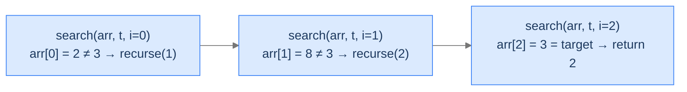

# Search Element

Linear search done recursively. The accumulator is the index we're currently inspecting — start at 0, advance by 1 each call, return the index on a match or `-1` at the end.

---

## The Problem

Given an array `arr` and a `target`, return the index of the first occurrence of `target`, or `-1` if it's not present. You **must** solve this recursively.

---

## Examples

**Example 1**
```
Input:  arr = [2, 8, 3, 6, 4], target = 3
Output: 2
Explanation: arr[2] = 3, which is the first occurrence of target.
```

**Example 2**
```
Input:  arr = [2, 8, 1, 9, 4], target = 10
Output: -1
Explanation: 10 does not appear in the array.
```

```quiz
{
  "prompt": "If arr = [3, 1, 3, 5] and target = 3, what does the recursive search return?",
  "options": ["0", "2", "-1", "3"],
  "answer": "0"
}
```

## Constraints

- `0 ≤ arr.length ≤ 10⁴`
- `-10⁹ ≤ arr[i], target ≤ 10⁹`
- Must be solved recursively.

```python run viz=array
import ast

class Solution:
    def search_element(self, arr, target: int) -> int:
        # Your code goes here
        return -1

arr = ast.literal_eval(input())
target = int(input())
print(Solution().search_element(arr, target))
```

```java run viz=array
import java.util.*;

public class Main {
    static int[] parseIntArray(String line) {
        String s = line.replaceAll("[\\[\\]\\s]", "");
        if (s.isEmpty()) return new int[0];
        String[] parts = s.split(",");
        int[] out = new int[parts.length];
        for (int i = 0; i < parts.length; i++) out[i] = Integer.parseInt(parts[i].trim());
        return out;
    }

    static class Solution {
        public int searchElement(int[] arr, int target) {
            // Your code goes here
            return -1;
        }
    }

    public static void main(String[] args) {
        Scanner sc = new Scanner(System.in);
        int[] arr = parseIntArray(sc.nextLine().trim());
        int target = Integer.parseInt(sc.nextLine().trim());
        System.out.println(new Solution().searchElement(arr, target));
    }
}
```

```testcases
{
  "args": [
    { "id": "arr", "label": "arr", "type": "int[]", "placeholder": "[2, 8, 3, 6, 4]" },
    { "id": "target", "label": "target", "type": "int", "placeholder": "3" }
  ],
  "cases": [
    { "args": { "arr": "[2, 8, 3, 6, 4]", "target": "3" }, "expected": "2" },
    { "args": { "arr": "[1, 2, 3, 4, 5]", "target": "5" }, "expected": "4" },
    { "args": { "arr": "[2, 8, 1, 9, 4]", "target": "10" }, "expected": "-1" },
    { "args": { "arr": "[]", "target": "5" }, "expected": "-1" },
    { "args": { "arr": "[7]", "target": "7" }, "expected": "0" },
    { "args": { "arr": "[7]", "target": "1" }, "expected": "-1" },
    { "args": { "arr": "[1, 2, 3]", "target": "1" }, "expected": "0" }
  ]
}
```

<details>
<summary><h2>Why Tail Recursion Fits Here</h2></summary>


The "answer being built" is the *current index*. We start at 0 and advance until either we find the target or we run off the end of the array. At each step we check the current element, return immediately on match, or recurse with the next index.



<p align="center"><strong>Each call checks one element and either returns or tail-calls with <code>i + 1</code>.</strong></p>

</details>
<details>
<summary><h2>Applying the Diagnostic Questions</h2></summary>


| # | Check | Answer |
|---|---|---|
| **Q1** | Build down without look-back? | **Yes** — index advances forward; we never revisit. |
| **Q2** | Single accumulator? | **Yes** — the index itself. |
| **Q3** | Recursive call last? | **Yes** — return on match, or tail-call on no-match. |

### Q1 — Why "advance, don't look back"?

Linear search is left-to-right by definition. Once we've moved past index `i`, we never need to come back. The recursion's natural direction matches the algorithm's natural direction. ✓

### Q2 — Why "the index is the accumulator"?

The only state we need is "where am I in the array?" That's a single integer; perfect tail-recursion accumulator. ✓

### Q3 — Why "the call is in tail position"?

The function either returns `index` (match found), `-1` (off the end), or `helper(arr, target, index + 1)`. Each branch is a direct return — no wrapping work. ✓

</details>
<details>
<summary><h2>The Linear-Scan-with-Index Strategy (Visualised)</h2></summary>


<div class="d2-slides" data-caption="The index advances; the array is read-only. The accumulator IS the answer.">

```d2
state: "Step 0 — i = 0" {
  arr: "arr = [2, 8, 3, 6, 4],  target = 3" {style.fill: "#dbeafe"; style.stroke: "#3b82f6"}
  check: "arr[0] = 2 ≠ 3 → recurse(1)"
}
```

```d2
state: "Step 1 — i = 1" {
  arr: "arr = [2, 8, 3, 6, 4]"
  check: "arr[1] = 8 ≠ 3 → recurse(2)" {style.fill: "#fde68a"; style.stroke: "#d97706"}
}
```

```d2
state: "Step 2 — i = 2 — MATCH" {
  arr: "arr = [2, 8, 3, 6, 4]"
  check: "arr[2] = 3 = target → return 2" {style.fill: "#bbf7d0"; style.stroke: "#16a34a"}
}
```

</div>

</details>
<details>
<summary><h2>Solution &amp; Analysis</h2></summary>

### The Solution

```python solution time=O(n) space=O(n)
import ast
from typing import List

class Solution:
    def _helper(self, arr: List[int], target: int, index: int) -> int:

        # Base case: If index reaches the size of the array,
        # the target is not found
        if index == len(arr):
            return -1

        # If the current element matches the target, return the index
        if arr[index] == target:
            return index

        # Recursive call to check the next element in the array
        return self._helper(arr, target, index + 1)

    def search_element(self, arr: List[int], target: int) -> int:
        return self._helper(arr, target, 0)


arr = ast.literal_eval(input())
target = int(input())
print(Solution().search_element(arr, target))
```

```java solution
import java.util.*;

public class Main {
    static int[] parseIntArray(String line) {
        String s = line.replaceAll("[\\[\\]\\s]", "");
        if (s.isEmpty()) return new int[0];
        String[] parts = s.split(",");
        int[] out = new int[parts.length];
        for (int i = 0; i < parts.length; i++) out[i] = Integer.parseInt(parts[i].trim());
        return out;
    }

    static class Solution {
        private int helper(int[] arr, int target, int index) {

            // Base case: If index reaches the size of the array,
            // the target is not found
            if (index == arr.length) {
                return -1;
            }

            // If the current element matches the target, return the index
            if (arr[index] == target) {
                return index;
            }

            // Recursive call to check the next element in the array
            return helper(arr, target, index + 1);
        }

        public int searchElement(int[] arr, int target) {
            return helper(arr, target, 0);
        }
    }

    public static void main(String[] args) {
        Scanner sc = new Scanner(System.in);
        int[] arr = parseIntArray(sc.nextLine().trim());
        int target = Integer.parseInt(sc.nextLine().trim());
        System.out.println(new Solution().searchElement(arr, target));
    }
}
```


<details>
<summary><strong>Trace — arr = [2, 8, 3, 6, 4], target = 3</strong></summary>

```
Step 1 │ index=0, arr[0]=2  │ 2 ≠ 3      │ recurse(1)
Step 2 │ index=1, arr[1]=8  │ 8 ≠ 3      │ recurse(2)
Step 3 │ index=2, arr[2]=3  │ 3 = target │ return 2

Result: 2  (early termination on match — no further recursion)
```

When the match is found, every paused frame returns the same `index` value directly — no combining. With TCO, even the paused frames don't exist; without TCO, they unwind passing the answer up unchanged.

</details>

### Complexity Analysis

| Resource | Cost | Why |
|---|---|---|
| **Time** | `O(n)` worst case | We may scan the entire array. |
| **Space (stack)** | `O(n)` without TCO, `O(1)` with TCO | Recursion depth = scan length. |

### Edge Cases

| Case | Example | Expected | Reasoning |
|---|---|---|---|
| Empty array | `arr = []` | `-1` | Base case 1 fires immediately. |
| Match at start | `arr = [3, ...]` | `0` | Base case 2 fires on first call. |
| Match at end | `arr = [..., 3]` | `n - 1` | Last call before "off the end" finds it. |
| No match | `arr = [..., target absent]` | `-1` | Recurses through all `n` elements. |
| Duplicates | `arr = [3, 1, 3, 5]` | `0` | Returns the first match — the index of the leftmost occurrence. |

</details>
<details>
<summary><h2>Key Takeaway</h2></summary>


Search Element shows tail recursion in its simplest "scanner" form: an index accumulator advances until a condition fires. Same template you'll use for "find first negative number," "find first repeated character," and dozens of single-pass tests. The next problem also uses the index-advance template, but with two indices that converge from opposite ends.

</details>
