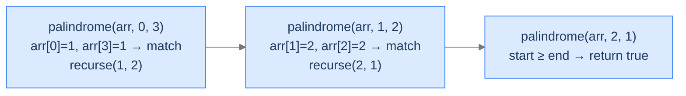

# Is Palindrome

Two-pointer recursion. Start at both ends, walk inward, fail fast on mismatch.

---

## The Problem

Given an array `arr`, return `true` if it reads the same forwards and backwards, else `false`. You **must** solve this recursively.

---

## Examples

**Example 1**
```
Input:  arr = [1, 2, 2, 1]
Output: true
Explanation: arr[0]=1 matches arr[3]=1, arr[1]=2 matches arr[2]=2, pointers cross → palindrome.
```

**Example 2**
```
Input:  arr = [1, 3, 2, 1]
Output: false
Explanation: arr[0]=1 matches arr[3]=1, but arr[1]=3 ≠ arr[2]=2 → not a palindrome.
```

```quiz
{
  "prompt": "What does is_palindrome([]) return?",
  "options": ["true", "false", "error", "-1"],
  "answer": "true"
}
```

## Constraints

- `0 ≤ arr.length ≤ 10⁴`
- `-10⁹ ≤ arr[i] ≤ 10⁹`
- Must be solved recursively.

```python run viz=array
import ast

class Solution:
    def helper(self, arr, start: int, end: int) -> bool:
        # Your code goes here
        return True

    def is_palindrome(self, arr) -> bool:
        return self.helper(arr, 0, len(arr) - 1)

arr = ast.literal_eval(input())
print("true" if Solution().is_palindrome(arr) else "false")
```

```java run viz=array
import java.util.*;

public class Main {
    static int[] parseIntArray(String line) {
        String s = line.replaceAll("[\\[\\]\\s]", "");
        if (s.isEmpty()) return new int[0];
        String[] parts = s.split(",");
        int[] out = new int[parts.length];
        for (int i = 0; i < parts.length; i++) out[i] = Integer.parseInt(parts[i].trim());
        return out;
    }

    static class Solution {
        private boolean helper(int[] arr, int start, int end) {
            // Your code goes here
            return true;
        }

        public boolean isPalindrome(int[] arr) {
            return helper(arr, 0, arr.length - 1);
        }
    }

    public static void main(String[] args) {
        int[] arr = parseIntArray(new Scanner(System.in).nextLine().trim());
        System.out.println(new Solution().isPalindrome(arr) ? "true" : "false");
    }
}
```

```testcases
{
  "args": [
    { "id": "arr", "label": "arr", "type": "int[]", "placeholder": "[1, 2, 2, 1]" }
  ],
  "cases": [
    { "args": { "arr": "[1, 2, 2, 1]" }, "expected": "true" },
    { "args": { "arr": "[1, 3, 2, 1]" }, "expected": "false" },
    { "args": { "arr": "[]" }, "expected": "true" },
    { "args": { "arr": "[5]" }, "expected": "true" },
    { "args": { "arr": "[1, 2, 1]" }, "expected": "true" },
    { "args": { "arr": "[1, 2, 3]" }, "expected": "false" },
    { "args": { "arr": "[1, 1, 1, 1]" }, "expected": "true" }
  ]
}
```

<details>
<summary><h2>Why Tail Recursion Fits Here</h2></summary>


Two pointers — `start` and `end` — converge from the array's edges toward the middle. Each call compares `arr[start]` and `arr[end]`. If they differ, return `false`. If they match, recurse with `start + 1` and `end - 1`. When `start >= end`, every pair has been checked.



<p align="center"><strong>Two pointers march toward each other; mismatch is an early-return false; meeting-or-crossing is a true return.</strong></p>

</details>
<details>
<summary><h2>Applying the Diagnostic Questions</h2></summary>


| # | Check | Answer |
|---|---|---|
| **Q1** | Build down without look-back? | **Yes** — pointers move monotonically toward the centre. |
| **Q2** | Single accumulator? | **Yes** — the pointer pair `(start, end)` is a degenerate accumulator (we don't really build anything; we just track positions). |
| **Q3** | Recursive call last? | **Yes** — early-return on mismatch, otherwise tail-call. |

### Q1 — Why "monotonic convergence"?

Each call narrows the unchecked range by 2 (one on each side). The window strictly shrinks; we never expand. Eventually `start >= end` and we're done. ✓

### Q2 — Why "the pointers are the accumulator"?

There's nothing to *build* — the answer is "no mismatch found, keep going" or "mismatch found, false." The pointers carry the position state forward; no value accumulation is needed. ✓

### Q3 — Why "the call is in tail position"?

Three branches: `return true` (done), `return false` (mismatch), `return helper(arr, start + 1, end - 1)` (tail call). All three are direct returns. ✓

</details>
<details>
<summary><h2>The Two-Pointer Convergence Strategy (Visualised)</h2></summary>


<div class="d2-slides" data-caption="Each call compares one pair and either returns false or recurses with both pointers moved inward.">

```d2
state: "arr = [1, 2, 2, 1]   start=0, end=3" {
  pair: "arr[0]=1 vs arr[3]=1 → match" {style.fill: "#bbf7d0"; style.stroke: "#16a34a"}
}
```

```d2
state: "arr = [1, 2, 2, 1]   start=1, end=2" {
  pair: "arr[1]=2 vs arr[2]=2 → match" {style.fill: "#bbf7d0"; style.stroke: "#16a34a"}
}
```

```d2
state: "start=2, end=1   start ≥ end" {
  result: "All pairs matched → return true" {style.fill: "#dbeafe"; style.stroke: "#3b82f6"}
}
```

</div>

</details>
<details>
<summary><h2>Solution &amp; Analysis</h2></summary>

### The Solution

```python solution time=O(n) space=O(n)
import ast
from typing import List

class Solution:
    def helper(self, arr: List[int], start: int, end: int) -> bool:

        # Base case: If start index crosses end index,
        # we have checked all elements
        if start >= end:
            return True

        # Check if the elements at the current indices are equal
        if arr[start] != arr[end]:
            return False

        # Recursive call moving towards the center of the list
        return self.helper(arr, start + 1, end - 1)

    def is_palindrome(self, arr: List[int]) -> bool:
        return self.helper(arr, 0, len(arr) - 1)


arr = ast.literal_eval(input())
print("true" if Solution().is_palindrome(arr) else "false")
```

```java solution
import java.util.*;

public class Main {
    static int[] parseIntArray(String line) {
        String s = line.replaceAll("[\\[\\]\\s]", "");
        if (s.isEmpty()) return new int[0];
        String[] parts = s.split(",");
        int[] out = new int[parts.length];
        for (int i = 0; i < parts.length; i++) out[i] = Integer.parseInt(parts[i].trim());
        return out;
    }

    static class Solution {
        private boolean helper(int[] arr, int start, int end) {

            // Base case: If start index crosses end index,
            // we have checked all elements
            if (start >= end) {
                return true;
            }

            // Check if the elements at the current indices are equal
            if (arr[start] != arr[end]) {
                return false;
            }

            // Recursive call moving towards the center of the list
            return helper(arr, start + 1, end - 1);
        }

        public boolean isPalindrome(int[] arr) {
            return helper(arr, 0, arr.length - 1);
        }
    }

    public static void main(String[] args) {
        int[] arr = parseIntArray(new Scanner(System.in).nextLine().trim());
        System.out.println(new Solution().isPalindrome(arr) ? "true" : "false");
    }
}
```


<details>
<summary><strong>Trace — arr = [1, 3, 2, 1]</strong></summary>

```
Step 1 │ start=0, end=3 │ arr[0]=1, arr[3]=1 │ match     │ recurse(1, 2)
Step 2 │ start=1, end=2 │ arr[1]=3, arr[2]=2 │ MISMATCH  │ return false

Result: false  (mismatch caught at step 2; no further recursion)
```

The early-return on mismatch is the algorithm's strength: we stop the moment we know the answer.

</details>

### Complexity Analysis

| Resource | Cost | Why |
|---|---|---|
| **Time** | `O(n)` worst case | At most `n / 2` comparisons. |
| **Space (stack)** | `O(n)` without TCO, `O(1)` with TCO | Depth = `n / 2`. |

### Edge Cases

| Case | Example | Expected | Reasoning |
|---|---|---|---|
| Empty | `arr = []` | `true` | `start = 0 >= end = -1` immediately. |
| Single element | `arr = [5]` | `true` | `start = 0, end = 0` → base case. |
| Two same | `arr = [3, 3]` | `true` | Match, recurse to `start = 1, end = 0` → base. |
| Two different | `arr = [3, 4]` | `false` | Mismatch on first call. |
| Odd length | `arr = [1, 2, 1]` | `true` | Middle element never compared (correctly). |

</details>
<details>
<summary><h2>Key Takeaway</h2></summary>


Is-Palindrome is tail recursion with two converging pointers. The accumulator is positional state, not value-building. Once you see this two-pointer convergence pattern, you'll see it again in "find pair summing to target," in "trim a list from both sides," in any problem where the operation is symmetric across the middle. The next problem combines tail-recursion's downward work with a *destructive* operation: rewriting linked-list pointers.

</details>
