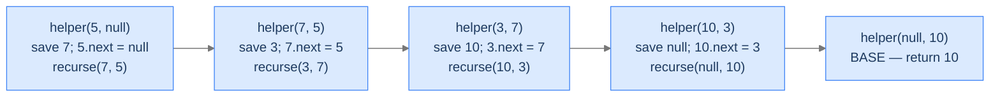

# Reverse a List

The classic interview question. Reverse a singly linked list using only `O(1)` auxiliary memory (with TCO, anyway). The recursive solution is three lines and arguably clearer than the iterative one.

---

## The Problem

Given the head of a singly linked list, reverse it in place and return the new head. You **must** solve this recursively.

```
Input:  head → 5 → 7 → 3 → 10 → null
Output: head → 10 → 3 → 7 → 5 → null
```

---

## Examples

**Example 1**
```
Input:  head = [5, 7, 3, 10]
Output: [10, 3, 7, 5]
Explanation: The list is reversed in place; each node's next pointer is rewired.
```

**Example 2**
```
Input:  head = [1, 2]
Output: [2, 1]
Explanation: Two nodes swapped: 2.next = 1, 1.next = null.
```

## Constraints

- `0 ≤ list length ≤ 10⁴`
- `-10⁵ ≤ Node.val ≤ 10⁵`
- Must be solved recursively (or the equivalent iterative/while-loop form for languages without TCO).

```python run
import ast

class ListNode:
    def __init__(self, val, next=None):
        self.val = val
        self.next = next

def build_list(values):              # [1, 2, 3] → 1 → 2 → 3 → null
    head = None
    for v in reversed(values):
        head = ListNode(v, head)
    return head

def print_list(head):                # 1 → 2 → 3 → [1, 2, 3]
    out = []
    while head:
        out.append(head.val)
        head = head.next
    print(out)

class Solution:
    def reverse_a_list(self, head):
        # Your code goes here
        return head

head = build_list(ast.literal_eval(input()))
print_list(Solution().reverse_a_list(head))
```

```java run
import java.util.*;

public class Main {
    static class ListNode {
        int val; ListNode next;
        ListNode(int val) { this.val = val; }
        ListNode(int val, ListNode next) { this.val = val; this.next = next; }
    }

    static int[] parseIntArray(String line) {
        String s = line.replaceAll("[\\[\\]\\s]", "");
        if (s.isEmpty()) return new int[0];
        String[] parts = s.split(",");
        int[] out = new int[parts.length];
        for (int i = 0; i < parts.length; i++) out[i] = Integer.parseInt(parts[i].trim());
        return out;
    }

    static ListNode buildList(int[] values) {      // {1, 2, 3} → 1 → 2 → 3 → null
        ListNode head = null;
        for (int i = values.length - 1; i >= 0; i--) head = new ListNode(values[i], head);
        return head;
    }

    static void printList(ListNode head) {         // 1 → 2 → 3 → [1, 2, 3]
        List<Integer> out = new ArrayList<>();
        for (ListNode n = head; n != null; n = n.next) out.add(n.val);
        System.out.println(out);
    }

    static class Solution {
        public ListNode reverseAList(ListNode head) {
            // Your code goes here
            return head;
        }
    }

    public static void main(String[] args) {
        int[] vals = parseIntArray(new Scanner(System.in).nextLine().trim());
        ListNode head = buildList(vals);
        printList(new Solution().reverseAList(head));
    }
}
```

```testcases
{
  "args": [
    { "id": "head", "label": "head", "type": "int[]", "placeholder": "[5, 7, 3, 10]" }
  ],
  "cases": [
    { "args": { "head": "[5, 7, 3, 10]" }, "expected": "[10, 3, 7, 5]" },
    { "args": { "head": "[]" }, "expected": "[]" },
    { "args": { "head": "[42]" }, "expected": "[42]" },
    { "args": { "head": "[1, 2]" }, "expected": "[2, 1]" },
    { "args": { "head": "[1, 2, 3]" }, "expected": "[3, 2, 1]" },
    { "args": { "head": "[1, 1, 1]" }, "expected": "[1, 1, 1]" }
  ]
}
```

<details>
<summary><h2>Why Tail Recursion Fits Here</h2></summary>


Reversing a linked list is a perfect tail-recursion candidate because we can carry both **the current node** and **the previous node** forward as accumulator parameters. Each step rewires `current.next = previous`, then advances both pointers by one. Because Python (and Java) have no TCO, the canonical implementation below collapses the tail recursion into its equivalent `while` loop — the logic and the per-step work are identical; only the frame mechanics change.



<p align="center"><strong>The conceptual tail-recursive shape: each frame saves <code>current.next</code> in a local, rewires <code>current.next = previous</code>, then tail-calls with <code>(saved_next, current)</code>. The base case returns the last <code>previous</code> — the new head. The implementation below is the equivalent <code>while</code> loop — same per-step work, one reused frame.</strong></p>

</details>
<details>
<summary><h2>Applying the Diagnostic Questions</h2></summary>


| # | Check | Answer |
|---|---|---|
| **Q1** | Build down without look-back? | **Yes** — we walk forward through the list once, rewiring as we go. |
| **Q2** | Single accumulator? | **Yes** — the `previous` pointer is the running answer. |
| **Q3** | Recursive call last? | **Yes** — the tail-recursive shape `return helper(next, current)` would be the last action; here we collapse that shape into a `while` loop because Python/Java have no TCO. |

### Q1 — Why "single forward pass, no look-back"?

We never revisit a node. Each node is touched exactly once: we save its `.next`, rewire it, and move on. The walk is monotonically forward. ✓

### Q2 — Why "previous is the accumulator"?

The "answer being built" is the head of the reversed list — which, at any moment, is the most-recently-rewired node. That's exactly `previous`. ✓

### Q3 — Why "the call would be in tail position"?

After rewiring, a tail-recursive version would end with `return helper(next, current)` — nothing following the call. Because the languages here don't optimise tail calls, the canonical implementation hoists that same logic into a `while` loop: the loop body is the would-be tail-call body, and the `current is None` check is the would-be base case. Logic identical; frames flat. ✓

</details>
<details>
<summary><h2>The Pointer-Rewire Strategy (Visualised)</h2></summary>


<div class="d2-slides" data-caption="Each frame rewires one pointer and advances. The accumulator (`previous`) becomes the new head when we run off the end.">

```d2
state: "Initial — current=5, previous=null" {
  list: "5 → 7 → 3 → 10 → null" {style.fill: "#dbeafe"; style.stroke: "#3b82f6"}
  ptrs: "previous=null  current=5  next=7"
}
```

```d2
state: "After step 1 — current=7, previous=5" {
  list: "5 → null   then   7 → 3 → 10 → null"
  ptrs: "previous=5  current=7  next=3" {style.fill: "#fde68a"; style.stroke: "#d97706"}
}
```

```d2
state: "After step 2 — current=3, previous=7" {
  list: "7 → 5 → null   then   3 → 10 → null"
  ptrs: "previous=7  current=3  next=10"
}
```

```d2
state: "After step 3 — current=10, previous=3" {
  list: "3 → 7 → 5 → null   then   10 → null"
  ptrs: "previous=3  current=10  next=null"
}
```

```d2
state: "After step 4 — current=null, previous=10" {
  list: "10 → 3 → 7 → 5 → null" {style.fill: "#bbf7d0"; style.stroke: "#16a34a"}
  ptrs: "BASE — return previous=10 (new head)"
}
```

</div>

</details>
<details>
<summary><h2>Solution &amp; Analysis</h2></summary>

### The Solution

```python solution time=O(n) space=O(1)
import ast

class ListNode:
    def __init__(self, val, next=None):
        self.val = val
        self.next = next

def build_list(values):              # [1, 2, 3] → 1 → 2 → 3 → null
    head = None
    for v in reversed(values):
        head = ListNode(v, head)
    return head

def print_list(head):                # 1 → 2 → 3 → [1, 2, 3]
    out = []
    while head:
        out.append(head.val)
        head = head.next
    print(out)

class Solution:
    def reverse_a_list(self, head):

        # Initialize pointers current and previous
        current = head
        previous = None

        while current is not None:

            # Save the address of next node
            next_node = current.next

            # Update the next of current node
            current.next = previous

            # Move previous to hold current node
            previous = current

            # Move current ahead
            current = next_node

        return previous


head = build_list(ast.literal_eval(input()))
print_list(Solution().reverse_a_list(head))
```

```java solution
import java.util.*;

public class Main {
    static class ListNode {
        int val; ListNode next;
        ListNode(int val) { this.val = val; }
        ListNode(int val, ListNode next) { this.val = val; this.next = next; }
    }

    static int[] parseIntArray(String line) {
        String s = line.replaceAll("[\\[\\]\\s]", "");
        if (s.isEmpty()) return new int[0];
        String[] parts = s.split(",");
        int[] out = new int[parts.length];
        for (int i = 0; i < parts.length; i++) out[i] = Integer.parseInt(parts[i].trim());
        return out;
    }

    static ListNode buildList(int[] values) {      // {1, 2, 3} → 1 → 2 → 3 → null
        ListNode head = null;
        for (int i = values.length - 1; i >= 0; i--) head = new ListNode(values[i], head);
        return head;
    }

    static void printList(ListNode head) {         // 1 → 2 → 3 → [1, 2, 3]
        List<Integer> out = new ArrayList<>();
        for (ListNode n = head; n != null; n = n.next) out.add(n.val);
        System.out.println(out);
    }

    static class Solution {
        public ListNode reverseAList(ListNode head) {

            // Initialize pointers current and previous
            ListNode current = head;
            ListNode previous = null;

            while (current != null) {

                // Save the address of next node
                ListNode next = current.next;

                // Update the next of current node
                current.next = previous;

                // Move previous to hold current node
                previous = current;

                // Move current ahead
                current = next;
            }

            return previous;
        }
    }

    public static void main(String[] args) {
        int[] vals = parseIntArray(new Scanner(System.in).nextLine().trim());
        ListNode head = buildList(vals);
        printList(new Solution().reverseAList(head));
    }
}
```


<details>
<summary><strong>Trace — head = 5 → 7 → 3 → 10 → null</strong></summary>

```
Initial: previous=null   current=5

Step 1 │ save next=7  │ 5.next = null     │ recurse(7, 5)
        new state: 5 → null  ;  7 → 3 → 10 → null  (two pieces)

Step 2 │ save next=3  │ 7.next = 5        │ recurse(3, 7)
        new state: 7 → 5 → null  ;  3 → 10 → null

Step 3 │ save next=10 │ 3.next = 7        │ recurse(10, 3)
        new state: 3 → 7 → 5 → null  ;  10 → null

Step 4 │ save next=null │ 10.next = 3     │ recurse(null, 10)
        new state: 10 → 3 → 7 → 5 → null

Step 5 │ current=null │ BASE — return previous=10

Final answer: head → 10 → 3 → 7 → 5 → null  ✓
```

The trace above tracks the conceptual tail-recursive form; the implementation hoists those same steps into a `while` loop, so each "recurse(...)" line corresponds to one loop iteration's advance of the `(previous, current)` pair, and "BASE" corresponds to the `current is None` loop exit. The list is reversed in place. In a language with TCO (Scala `@tailrec`, Kotlin `tailrec`), the recursive form runs in `O(1)` stack space; in Python/Java/JS/Go the loop form gets you the same `O(1)` stack directly.

</details>

### Complexity Analysis

| Resource | Cost | Why |
|---|---|---|
| **Time** | `O(n)` | Each node touched once. |
| **Space (stack)** | `O(1)` for the loop form here; `O(n)` for a recursive form without TCO, `O(1)` with TCO | The loop reuses one frame; the recursive form would push one frame per node unless the compiler optimises tail calls. |
| **Space (auxiliary)** | `O(1)` | Only a few pointers held at a time. |

### Edge Cases

| Case | Example | Expected | Reasoning |
|---|---|---|---|
| Empty list | `head = []` | `[]` | `current is None` on entry; the loop body never runs; `previous = null` is returned. |
| Single node | `head = [5]` | `[5]` | One iteration: rewire `5.next = null`, advance to `current = null`, exit loop. |
| Two nodes | `[5, 7]` | `[7, 5]` | Two iterations before the loop exits. |
| Already reversed | `[10, 3, 7, 5]` | `[5, 7, 3, 10]` | Reversal is its own inverse. |

</details>
<details>
<summary><h2>Key Takeaway</h2></summary>


Reverse-a-List is the canonical "two-pointer rewire" recursion: walk the list, save `next` before each rewire, advance both pointers in the tail call. The pattern shows up in linked-list rotation, in cycle detection (with care), in nth-from-end problems, and in any structural transformation of a linked list. The accumulator is the partially-reversed list; the recursion ends when we run off the end.

You came in with the timing flip — work first, ask later — as a fragile concept. You're leaving with four worked problems, three diagnostic questions, an understanding of TCO across languages, and a feel for when an accumulator-driven recursion beats the head-recursion alternative. The next lesson lifts the restriction "exactly one recursive call per frame": what happens when a function makes *two* recursive calls? The tree branches, the call count explodes, and we meet our first exponential-time recursion.

**Transfer challenge — try before the Multiple Recursion lesson:** Write a tail-recursive function that computes the **GCD of two non-negative integers** using Euclid's algorithm: `gcd(a, b) = gcd(b, a mod b)`, base case `gcd(a, 0) = a`. Use either language above. Three lines including the base case.

<details>
<summary><strong>Answer — open after you've written it</strong></summary>

```python run viz=array
class Solution:
    def gcd(self, a: int, b: int) -> int:
        if b == 0:
            return a            # Base case
        return self.gcd(b, a % b)   # Tail call — pure Euclidean step


print(Solution().gcd(48, 18))   # 6
```

The recursive relation `gcd(a, b) = gcd(b, a % b)` is Euclid's algorithm in pure tail-recursion form. The accumulator-style of "carry the running pair forward" is in plain sight. Depth is `O(log min(a, b))` (a beautiful number-theoretic fact). With Scala's `@tailrec` or Kotlin's `tailrec` this is genuinely a loop. Even without TCO, the depth is so shallow you'll never overflow.

**You just wrote one of the most efficient algorithms in human history in three lines.** That's tail recursion's gift: a clean accumulator-driven walk that mirrors the underlying mathematics exactly.

</details>

</details>
