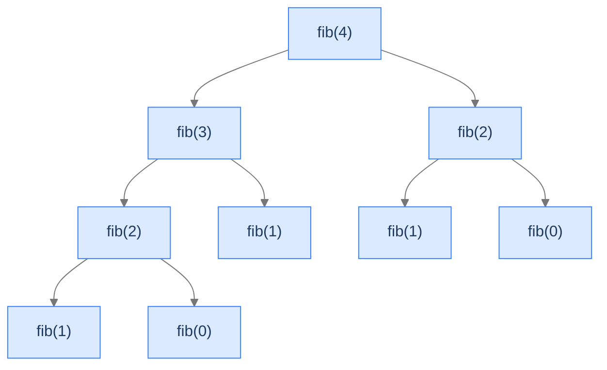

## Why It Exists

A function is **multiply recursive** when its body makes **two or more recursive calls**. The call graph stops being a thin line and fans into a *tree* — and that branching is where exponential cost is born. The textbook example is Fibonacci:

```text
fib(n) = fib(n-1) + fib(n-2)
```

That one `+` between two recursive calls turns linear recursion into exponential recursion. Each call spawns two children, each of those spawns two more — and, fatally, the *same* subproblems get recomputed from scratch in different branches. Recognising this pattern on sight tells you two things at once: the problem has a clean recursive definition, *and* the naive version will be catastrophically slow until you cache the overlaps (the bridge to dynamic programming).



<p align="center"><strong>Each non-base node spawns two children. <code>fib(2)</code> appears twice (and for larger <code>n</code>, small subproblems appear thousands of times) — that duplication is the engine of the blow-up.</strong></p>

## See It Work

Naive Fibonacci, instrumented with a call counter so the explosion is visible. Two base cases (`fib(0)=0`, `fib(1)=1`), two recursive calls.

```python run viz=array
calls = 0
def fib(n):
    global calls; calls += 1
    if n < 2:                               # base cases: fib(0)=0, fib(1)=1
        return n
    return fib(n - 1) + fib(n - 2)          # TWO recursive calls → branching tree

n = int(input())
result = fib(n)
print(f"fib({n}): {result} in {calls} calls")
```

```java run viz=array
import java.util.*;

public class Main {
    static int calls = 0;
    static int fib(int n) {
        calls++;
        if (n < 2) return n;                    // base cases
        return fib(n - 1) + fib(n - 2);         // two recursive calls
    }
    public static void main(String[] args) {
        int n = Integer.parseInt(new Scanner(System.in).nextLine().trim());
        int result = fib(n);
        System.out.println("fib(" + n + "): " + result + " in " + calls + " calls");
    }
}
```

```testcases
{
  "args": [
    { "id": "n", "label": "n", "type": "int", "placeholder": "10" }
  ],
  "cases": [
    { "args": { "n": "10" }, "expected": "fib(10): 55 in 177 calls" },
    { "args": { "n": "5" },  "expected": "fib(5): 5 in 15 calls" },
    { "args": { "n": "0" },  "expected": "fib(0): 0 in 1 calls" },
    { "args": { "n": "1" },  "expected": "fib(1): 1 in 1 calls" }
  ]
}
```

Both print `fib(10): 55 in 177 calls`. Fifty-five is the answer; **177 calls** to produce it — already 16× the input. That gap is the whole story of the pattern.

## How It Works

Strip the problem away and multiple recursion is `f(n) = g(f(h₁(n)), …, f(h_k(n)), n)` — make `k` recursive calls, then fold their answers with `g`. It's literally [head recursion](/cortex/data-structures-and-algorithms/algorithms-by-strategy-recursion-pattern-head-recursion) with `k ≥ 2` calls; for Fibonacci `k = 2` and `g(a, b) = a + b`.

The blow-up comes from **no caching**: each call's subtrees are computed independently, so overlapping subproblems are redone every time. The cost is startling:

```d2
direction: down

n: "Naive fib(n) — number of calls"

table: "Calls vs n" {
  grid-rows: 6
  grid-columns: 2
  grid-gap: 0
  h1: "n"     {style.fill: "#dbeafe"; style.stroke: "#3b82f6"}
  h2: "calls" {style.fill: "#dbeafe"; style.stroke: "#3b82f6"}
  r1: "10" ; v1: "177"
  r2: "20" ; v2: "21,891"
  r3: "30" ; v3: "2,692,537"
  r4: "40" ; v4: "331,160,281" {style.fill: "#fde68a"; style.stroke: "#d97706"}
  r5: "50" ; v5: "≈ 2 × 10¹⁰" {style.fill: "#fecaca"; style.stroke: "#dc2626"}
}

note: "~123× more calls for every +10 to n. Memoisation collapses it to O(n)."
```

<p align="center"><strong>Naive Fibonacci's call count explodes; memoising the overlapping subproblems collapses it to <code>O(n)</code>.</strong></p>

The complexity is the pattern's most counterintuitive fact: **time is exponential but stack space is only linear.** A binary tree of `≈ 2ⁿ` nodes takes `O(2ⁿ)` time, but at any instant only *one* root-to-leaf path is on the stack — the sibling subtrees run sequentially, not together — so space is `O(n)` (the depth, not the breadth).

Three diagnostics decide if multiple recursion fits: **Q1** — does `f(n)` need *two or more* smaller answers? (Fibonacci needs both `f(n-1)` and `f(n-2)`.) **Q2** — does a *fold* combine them into one value (sum, product, max)? **Q3** — are there *enough* base cases to terminate every branch? (Fibonacci needs two — with only `fib(0)`, `fib(1)` would recurse into `fib(-1)` forever.)

> **Key takeaway.** Multiple recursion = head recursion with `k ≥ 2` calls → a branching call tree. Time blows up to `O(kⁿ)` because overlapping subproblems are recomputed; stack space stays `O(n)` (only one root-to-leaf path is live). The cure — caching repeated subproblems (memoisation) — collapses time to `O(n)` and is the gateway to dynamic programming.

## Trace It

The `fib(10)` run already cost 177 calls. The growth isn't linear or even polynomial — it's exponential, and adding a cache changes it by *orders of magnitude*.

**Predict before you run:** how many calls does naive `fib(30)` make — about 30, a few hundred, or millions? And how many does a *memoised* `fib(30)` make?

```python run viz=array
def count_naive(n):
    c = [0]
    def f(n):
        c[0] += 1
        if n < 2: return n
        return f(n - 1) + f(n - 2)
    return f(n), c[0]

def count_memo(n):
    c = [0]; memo = {}
    def f(n):
        c[0] += 1
        if n < 2: return n
        if n in memo: return memo[n]            # cache hit → no recompute
        memo[n] = f(n - 1) + f(n - 2)
        return memo[n]
    return f(n), c[0]

v1, n1 = count_naive(30)
v2, n2 = count_memo(30)
print(f"naive    fib(30) = {v1} in {n1} calls")
print(f"memoised fib(30) = {v2} in {n2} calls")
```

<details>
<summary><strong>Reveal</strong></summary>

Naive `fib(30)` makes **2,692,537** calls; memoised `fib(30)` makes **59**. Same answer (832,040), a ~45,000× difference in work. The naive tree recomputes `fib(28)` twice, `fib(27)` three times, `fib(26)` five times — the repeat counts are themselves Fibonacci numbers, which is why the total is exponential. Memoisation stores each subproblem's answer the first time and returns it on every later request, so each of the `n` distinct subproblems is computed exactly once: the `O(2ⁿ)` tree collapses to an `O(n)` line. That single idea — *cache the overlaps* — is the entire leap from naive multiple recursion to **dynamic programming**.

</details>

## Your Turn

**Climbing Stairs:** you can take 1 or 2 steps; how many distinct ways to climb `n`? From the bottom your first move is 1 step or 2, leaving the same problem on a smaller staircase: `climb(n) = climb(n-1) + climb(n-2)` — Fibonacci in disguise. Base cases: `climb(0) = 1` (one way: stand still), `climb(n<0) = 0` (overshot).

```python run viz=array
def climb(n):
    if n < 0: return 0                      # overshot the top
    if n == 0: return 1                     # one way: do nothing
    # Your code goes here
    return 0

n = int(input())
print(climb(n))
```

```java run viz=array
import java.util.*;

public class Main {
    static int climb(int n) {
        if (n < 0) return 0;                    // overshot
        if (n == 0) return 1;                   // one way: do nothing
        // Your code goes here
        return 0;
    }
    public static void main(String[] args) {
        int n = Integer.parseInt(new Scanner(System.in).nextLine().trim());
        System.out.println(climb(n));
    }
}
```

```testcases
{
  "args": [
    { "id": "n", "label": "n", "type": "int", "placeholder": "4" }
  ],
  "cases": [
    { "args": { "n": "4" }, "expected": "5" },
    { "args": { "n": "5" }, "expected": "8" },
    { "args": { "n": "0" }, "expected": "1" },
    { "args": { "n": "1" }, "expected": "1" },
    { "args": { "n": "2" }, "expected": "2" },
    { "args": { "n": "3" }, "expected": "3" }
  ]
}
```

<details>
<summary>Editorial</summary>

```python solution
def climb(n):
    if n < 0: return 0                      # overshot the top
    if n == 0: return 1                     # one way: do nothing
    return climb(n - 1) + climb(n - 2)      # first move: 1 step or 2

n = int(input())
print(climb(n))
```

```java solution
import java.util.*;

public class Main {
    static int climb(int n) {
        if (n < 0) return 0;                    // overshot
        if (n == 0) return 1;                   // one way: do nothing
        return climb(n - 1) + climb(n - 2);     // 1 step or 2
    }
    public static void main(String[] args) {
        int n = Integer.parseInt(new Scanner(System.in).nextLine().trim());
        System.out.println(climb(n));
    }
}
```

</details>

Both print `5` then `8` — the Fibonacci sequence, shifted. (The five ways to climb 4: `1111`, `112`, `121`, `211`, `22`.) Like naive Fibonacci, this recomputes overlaps and is exponential without a cache. The four problems in this section's **Problems** folder — Fibonacci, zigzag, climbing stairs, Catalan number — are all branching recurrences of exactly this shape.

## Reflect & Connect

- **It's head recursion that branches.** All `k` calls happen first, then a fold combines them — same "work on the ascent" structure, just `k ≥ 2` children. Single-call problems are [head](/cortex/data-structures-and-algorithms/algorithms-by-strategy-recursion-pattern-head-recursion)/[tail](/cortex/data-structures-and-algorithms/algorithms-by-strategy-recursion-pattern-tail-recursion) recursion; reach for multiple recursion only when the definition genuinely needs several smaller answers.
- **Exponential time, linear space — the surprise.** The tree is huge in *breadth* but only one root-to-leaf path is on the stack at a time, so space is `O(n)`. Don't confuse the time cost (number of nodes) with the space cost (tree height).
- **Overlapping subproblems → memoisation → dynamic programming.** When the same subproblem recurs across branches, cache it. That single move is the seam between this lesson and the entire DP chapter — DP *is* multiple recursion plus a cache (or its bottom-up equivalent).
- **Branch-and-build is backtracking, not folding.** Multiple recursion folds sub-answers into *one value*. When you instead need to build a *structure* (all permutations, all partitions), you branch but accumulate partial solutions with an undo step — that's backtracking, a later lesson.

## Recall

<details>
<summary><strong>Q:</strong> What defines multiple recursion?</summary>

**A:** Two or more recursive calls per frame, producing a branching call tree. It's head recursion with `k ≥ 2` calls, folded by a combine step `g`.

</details>
<details>
<summary><strong>Q:</strong> Why is naive Fibonacci exponential?</summary>

**A:** Each call spawns two children and there's no caching, so overlapping subproblems (e.g. `fib(2)`) are recomputed in every branch — `≈ 2ⁿ` total calls.

</details>
<details>
<summary><strong>Q:</strong> Time vs. space for binary multiple recursion?</summary>

**A:** Time `O(2ⁿ)` (number of tree nodes); stack space only `O(n)` (the tree's height — one root-to-leaf path is live at a time, siblings run sequentially).

</details>
<details>
<summary><strong>Q:</strong> How does memoisation help, and what does it lead to?</summary>

**A:** Caching each subproblem's answer means each of the `n` distinct subproblems is computed once — `O(2ⁿ)` time collapses to `O(n)`. That "cache the overlaps" idea is the entry point to dynamic programming.

</details>
<details>
<summary><strong>Q:</strong> Why does Fibonacci need two base cases?</summary>

**A:** With two recursive calls (`fib(n-1)`, `fib(n-2)`), a single base case leaves a path uncovered — `fib(2)` would reach `fib(-1)` and never terminate. Every branch must hit a base.

</details>

## Sources & Verify

- **Abelson & Sussman**, *Structure and Interpretation of Computer Programs*, §1.2.2 — "tree recursion": the Fibonacci call tree, why it's exponential, and the redundant-computation argument.
- **CLRS** (Cormen, Leiserson, Rivest, Stein), *Introduction to Algorithms*, 3rd ed., §15.1 / §15.3 — overlapping subproblems and the naive-recursion-to-memoisation transition into dynamic programming.
- **Sedgewick & Wayne**, *Algorithms*, 4th ed., §1.1 — recursion and the cost of recomputation in tree-recursive functions.
- The `177`-call `fib(10)`, the `2,692,537`-vs-`59` `fib(30)` comparison, and `climb(4)=5` / `climb(5)=8` above come from the runnable blocks — re-run to verify.
