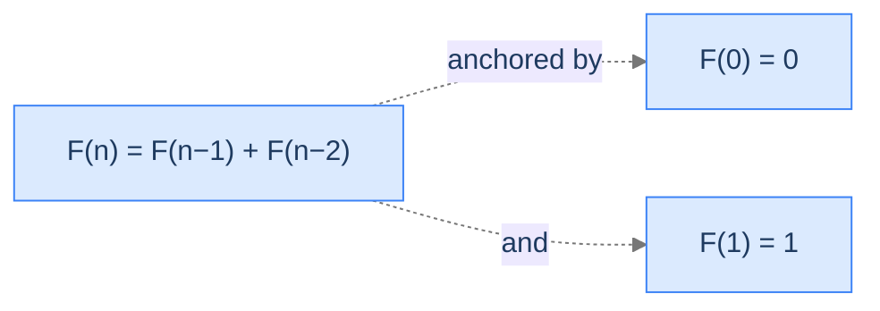
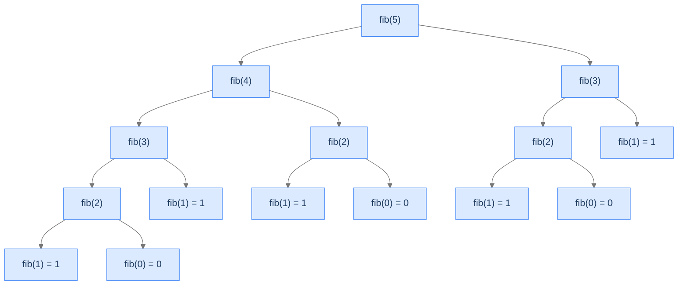

# Fibonacci Number

The reference problem of multiple recursion. The recurrence is one line; the naive implementation crashes on `n = 50`.

---

## The Problem

Given a non-negative integer `n`, return the `n`-th Fibonacci number, where:

- `F(0) = 0`
- `F(1) = 1`
- `F(n) = F(n-1) + F(n-2)` for `n ≥ 2`

You **must** solve this recursively (we'll fix the exponential cost in the dynamic-programming chapter later).

---

## Examples

**Example 1**
```
Input:  n = 3
Output: 2
Explanation: F(3) = F(2) + F(1) = 1 + 1 = 2
```

**Example 2**
```
Input:  n = 2
Output: 1
Explanation: F(2) = F(1) + F(0) = 1 + 0 = 1
```

```quiz
{
  "prompt": "How many recursive calls does naive fib(5) make in total?",
  "options": ["5", "9", "15", "25"],
  "answer": "15"
}
```

## Constraints

- `0 ≤ n ≤ 30` (naive recursion; larger values are infeasible without memoisation)
- Must be solved recursively.

```python run viz=array
class Solution:
    def fibonacci(self, n: int) -> int:
        # Your code goes here
        return 0

n = int(input())
print(Solution().fibonacci(n))
```

```java run viz=array
import java.util.*;

public class Main {
    static class Solution {
        public int fibonacci(int n) {
            // Your code goes here
            return 0;
        }
    }

    public static void main(String[] args) {
        int n = Integer.parseInt(new Scanner(System.in).nextLine().trim());
        System.out.println(new Solution().fibonacci(n));
    }
}
```

```testcases
{
  "args": [
    { "id": "n", "label": "n", "type": "int", "placeholder": "3" }
  ],
  "cases": [
    { "args": { "n": "3" },  "expected": "2" },
    { "args": { "n": "2" },  "expected": "1" },
    { "args": { "n": "0" },  "expected": "0" },
    { "args": { "n": "1" },  "expected": "1" },
    { "args": { "n": "5" },  "expected": "5" },
    { "args": { "n": "7" },  "expected": "13" },
    { "args": { "n": "10" }, "expected": "55" }
  ]
}
```

<details>
<summary><h2>What Does the Fibonacci Recurrence Mean?</h2></summary>


The recurrence `F(n) = F(n-1) + F(n-2)` says: each Fibonacci number is the sum of the two preceding ones. The base cases anchor the recursion at `F(0) = 0` and `F(1) = 1` — without both, the recursion can't terminate.



<p align="center"><strong>The Fibonacci recurrence with its two base cases. Both bases are required — drop either one and the recursion runs forever for some inputs.</strong></p>

</details>
<details>
<summary><h2>Applying the Diagnostic Questions</h2></summary>


| # | Check | Answer |
|---|---|---|
| **Q1** | Multiple smaller subproblems? | **Yes** — `F(n-1)` *and* `F(n-2)`. |
| **Q2** | Fold-style combine? | **Yes** — addition. |
| **Q3** | Enough base cases? | **Yes** — `F(0) = 0` and `F(1) = 1` cover both reduction paths. |

### Q1 — Why "F(n-1) AND F(n-2)"?

The definition of Fibonacci is *literally* the sum of the two preceding terms. You can't compute `F(n)` from `F(n-1)` alone — you need both predecessors. That's the requirement that makes this multiple recursion. ✓

### Q2 — Why "addition is the combine"?

The combine `g(a, b) = a + b` is the canonical fold. Both sub-answers are integers; we add them; the result is the answer for `n`. ✓

### Q3 — Why two base cases are required?

`F(2)` calls `F(1)` and `F(0)`. If we only had `F(0) = 0`, then `F(1) = F(0) + F(-1)` and we'd recurse forever on negative inputs. **Both bases are non-negotiable.** This is why multiple recursion's diagnostic Q3 is stricter than head recursion's. ✓

</details>
<details>
<summary><h2>The Branching Tree (Visualised)</h2></summary>


The recursion tree for `fib(5)` shows the explosion in slow motion. Notice how `fib(2)` and `fib(3)` appear multiple times — that's the redundant work memoisation eliminates.



<p align="center"><strong>Recursion tree for <code>fib(5)</code>. <code>fib(3)</code> appears 2×, <code>fib(2)</code> appears 3×, <code>fib(1)</code> appears 5×, <code>fib(0)</code> appears 3×. Every duplicate is wasted work.</strong></p>

</details>
<details>
<summary><h2>Solution &amp; Analysis</h2></summary>

### The Solution

```python solution time=O(φ^n) space=O(n)
class Solution:
    def fibonacci(self, n: int) -> int:

        # Base case: If n is 0, return 0
        if n == 0:
            return 0

        # Base case: If n is 1, return 1
        if n == 1:
            return 1

        # To find the nth Fibonacci number, we recursively
        # sum the (n-1)th and (n-2)th Fibonacci numbers since Fibonacci
        # series is defined as F(n) = F(n-1) + F(n-2).
        return self.fibonacci(n - 1) + self.fibonacci(n - 2)


n = int(input())
print(Solution().fibonacci(n))
```

```java solution
import java.util.*;

public class Main {
    static class Solution {
        public int fibonacci(int N) {

            // Base case: If N is 0, return 0
            if (N == 0) {
                return 0;
            }

            // Base case: If N is 1, return 1
            if (N == 1) {
                return 1;
            }

            // To find the Nth Fibonacci number, we recursively
            // sum the (N-1)th and (N-2)th Fibonacci numbers since Fibonacci
            // series is defined as F(N) = F(N-1) + F(N-2).
            return (fibonacci(N - 1) + fibonacci(N - 2));
        }
    }

    public static void main(String[] args) {
        int n = Integer.parseInt(new Scanner(System.in).nextLine().trim());
        System.out.println(new Solution().fibonacci(n));
    }
}
```


<details>
<summary><strong>Trace — n = 5 (counting calls)</strong></summary>

```
fib(5) needs fib(4) and fib(3)
  fib(4) needs fib(3) and fib(2)
    fib(3) needs fib(2) and fib(1)
      fib(2) needs fib(1) and fib(0)        — first computation of fib(2)
        fib(1) = 1
        fib(0) = 0
        returns 1
      fib(1) = 1
      returns 2
    fib(2) needs fib(1) and fib(0)          — second computation of fib(2) ← redundant!
      fib(1) = 1
      fib(0) = 0
      returns 1
    returns 3
  fib(3) needs fib(2) and fib(1)            — third computation of fib(2) ← also redundant!
    fib(2) needs fib(1) and fib(0)
      ...
    fib(1) = 1
    returns 2
  returns 5

Total calls: 15 (counting fib(5), all sub-fib calls, and base case hits).
```

The phrase "redundant" is the engine of memoisation. Every duplicate sub-call is a candidate for caching.

</details>

### Complexity Analysis

| Resource | Cost | Why |
|---|---|---|
| **Time** | `O(φ^n)` ≈ `O(1.618^n)` | Each call spawns 2 children; the tree's leaf count grows by golden ratio. |
| **Space (stack)** | `O(n)` | Linear depth — the leftmost path is `n` deep. |

The exact count `T(n) = T(n-1) + T(n-2) + 1` grows at the same exponential rate as Fibonacci itself — it *is* Fibonacci, with an extra `+1`. The closed form is roughly `φ^n` where `φ = (1 + √5) / 2 ≈ 1.618`.

**With memoisation:** time collapses to `O(n)` because each `fib(k)` is computed once and reused. Space is `O(n)` for the cache plus `O(n)` for the stack.

### Edge Cases

| Case | Example | Expected | Reasoning |
|---|---|---|---|
| Zero | `n = 0` | `0` | Base case 1. |
| One | `n = 1` | `1` | Base case 2. |
| Small | `n = 5` | `5` | Tree is `fib(5)`-shaped — see trace. |
| Medium | `n = 30` | `832040` | Already millions of calls; runs in seconds. |
| Large | `n = 50` | `12586269025` | Effectively infeasible naively — billions of calls. |

</details>
<details>
<summary><h2>Key Takeaway</h2></summary>


Naive Fibonacci is the textbook trap of multiple recursion: a one-line definition that runs in exponential time. Memoisation collapses it to linear; you'll meet the technique formally in the dynamic-programming chapter. The next problem widens the recurrence — *three* recursive calls instead of two.

</details>
