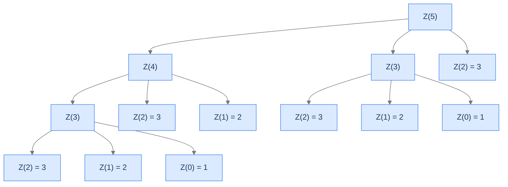

# Zigzag Sequence

A three-call recurrence with alternating signs. The combine step does subtraction *and* addition, in a fixed pattern.

---

## The Problem

Given a non-negative integer `n`, return the `n`-th number in the zigzag sequence defined by:

- `Z(0) = 1`
- `Z(1) = 2`
- `Z(2) = 3`
- `Z(n) = Z(n-1) - Z(n-2) + Z(n-3)` for `n ≥ 3`

You **must** solve this recursively.

```
Input:  n = 7
Output: 2
Explanation: Z(7) = Z(6) - Z(5) + Z(4) = 3 - 2 + 1 = 2

Input:  n = 5
Output: 2
Explanation: Z(5) = Z(4) - Z(3) + Z(2) = 1 - 2 + 3 = 2

Input:  n = 0
Output: 1
```

---

<details>
<summary><h2>What's Special About the Zigzag Recurrence?</h2></summary>


Two things:
1. The recurrence has **three** recursive calls, not two — making the call tree fan out wider than Fibonacci's.
2. The combine has alternating signs (`+`, `-`, `+`), not just additions.

The "zigzag" name comes from the sequence's alternating-direction pattern: each new term swings up and down relative to its neighbours. The recurrence's mixed signs are what produces the swings.

</details>
<details>
<summary><h2>Applying the Diagnostic Questions</h2></summary>


| # | Check | Answer |
|---|---|---|
| **Q1** | Multiple smaller subproblems? | **Yes** — three: `Z(n-1)`, `Z(n-2)`, `Z(n-3)`. |
| **Q2** | Fold-style combine? | **Yes** — `a - b + c`. |
| **Q3** | Enough base cases? | **Yes** — three bases (`Z(0), Z(1), Z(2)`) for three reduction paths. |

### Q1 — Why "three subproblems"?

The recurrence references `Z(n-1)`, `Z(n-2)`, and `Z(n-3)`. All three values are needed to compute `Z(n)`. ✓

### Q2 — Why "subtraction is still a fold"?

`a - b + c` is `(a + (-b)) + c` — a sum of three terms (some with negative sign). It's a fold over three values into one. The combine isn't purely additive but it still reduces three values to one. ✓

### Q3 — Why three base cases?

The recursion descends by 1, 2, or 3 each step. `Z(2)` calls `Z(1), Z(0), Z(-1)` if the base wasn't there for `n = 2`. We need bases for **every** recursion-depth that could be reached by the deepest call: `Z(0), Z(1), Z(2)`. Miss any one and some inputs recurse forever. ✓

</details>
<details>
<summary><h2>The Three-Branch Tree (Visualised)</h2></summary>




<p align="center"><strong>Recursion tree for <code>Z(5)</code>. Each call spawns three children. The tree fans out faster than Fibonacci's by a factor of ~1.5× per level.</strong></p>

</details>
<details>
<summary><h2>Solution &amp; Analysis</h2></summary>

### The Solution

```python run viz=array
class Solution:
    def zig_zag_sequence(self, n: int) -> int:

        # Base case: If n is 0, we return 1 as the first
        # number in the ZigZag sequence
        if n == 0:
            return 1

        # Base case: If n is 1, we return 2 as the second
        # number in the ZigZag sequence
        if n == 1:
            return 2

        # Base case: If n is 2, we return 3 as the third
        # number in the ZigZag sequence
        if n == 2:
            return 3

        # Recursive case: For n greater than 2, we calculate
        # the nth number in the ZigZag sequence using the
        # recurrence relation
        return (
            self.zig_zag_sequence(n - 1)
            - self.zig_zag_sequence(n - 2)
            + self.zig_zag_sequence(n - 3)
        )


# Examples from the problem statement
print(Solution().zig_zag_sequence(7))   # 2
print(Solution().zig_zag_sequence(5))   # 2
print(Solution().zig_zag_sequence(0))   # 1

# Edge cases
print(Solution().zig_zag_sequence(1))   # 2
print(Solution().zig_zag_sequence(2))   # 3
print(Solution().zig_zag_sequence(3))   # 2
print(Solution().zig_zag_sequence(4))   # 1
```

```java run viz=array
public class Main {
    static class Solution {
        public int zigZagSequence(int N) {

            // Base case: If N is 0, we return 1 as the first
            // number in the ZigZag sequence
            if (N == 0) {
                return 1;
            }

            // Base case: If N is 1, we return 2 as the second
            // number in the ZigZag sequence
            if (N == 1) {
                return 2;
            }

            // Base case: If N is 2, we return 3 as the third
            // number in the ZigZag sequence
            if (N == 2) {
                return 3;
            }

            // Recursive case: For N greater than 2, we calculate
            // the Nth number in the ZigZag sequence using the
            // recurrence relation
            return (
                zigZagSequence(N - 1) -
                zigZagSequence(N - 2) +
                zigZagSequence(N - 3)
            );
        }
    }

    public static void main(String[] args) {
        // Examples from the problem statement
        System.out.println(new Solution().zigZagSequence(7));   // 2
        System.out.println(new Solution().zigZagSequence(5));   // 2
        System.out.println(new Solution().zigZagSequence(0));   // 1

        // Edge cases
        System.out.println(new Solution().zigZagSequence(1));   // 2
        System.out.println(new Solution().zigZagSequence(2));   // 3
        System.out.println(new Solution().zigZagSequence(3));   // 2
        System.out.println(new Solution().zigZagSequence(4));   // 1
    }
}
```


<details>
<summary><strong>Trace — n = 5</strong></summary>

```
Z(5) = Z(4) - Z(3) + Z(2)
     = ?    -  ?   +  3

Z(4) = Z(3) - Z(2) + Z(1) = ? - 3 + 2
Z(3) = Z(2) - Z(1) + Z(0) = 3 - 2 + 1 = 2

Z(4) = 2 - 3 + 2 = 1
Z(5) = 1 - 2 + 3 = 2

Result: 2 ✓
```

</details>

### Complexity Analysis

| Resource | Cost | Why |
|---|---|---|
| **Time** | `O(3^n)` worst case | Each frame spawns 3 children. |
| **Space (stack)** | `O(n)` | Linear depth — leftmost path. |

Same exponential blow-up family as Fibonacci, just with `k = 3` instead of `k = 2`. Memoisation reduces both to `O(n)`.

### Edge Cases

| Case | Example | Expected | Reasoning |
|---|---|---|---|
| Base case 0 | `n = 0` | `1` | Direct return. |
| Base case 1 | `n = 1` | `2` | Direct return. |
| Base case 2 | `n = 2` | `3` | Direct return. |
| Negative input | `n = -1` | undefined | Should be guarded; recursion would crash if it reaches negative. |
| Mid-range | `n = 10` | computable | Tree is `3^10 = 59,049` calls — slow but tractable. |
| Large | `n = 30+` | infeasible naively | Use memoisation. |

</details>
<details>
<summary><h2>Key Takeaway</h2></summary>


Zigzag is multiple recursion with a wider branching factor than Fibonacci. The combine still folds `k` smaller answers into one, but the signs alternate. The next problem generalises this further — instead of fixed `k`, the number of recursive calls depends on the input.

</details>
