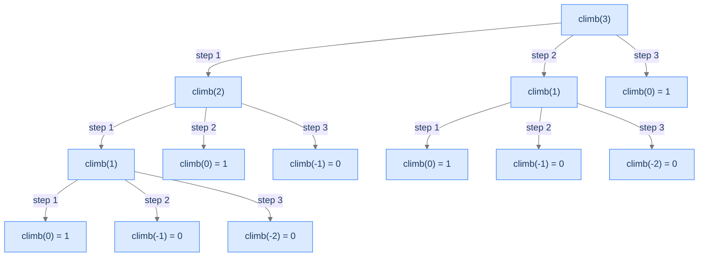

# Climb Stairs

The branching factor varies. Each frame makes one recursive call per allowed step size — so a 5-element step set produces a 5-way recursion.

---

## The Problem

Given a non-negative integer `n` and an array `steps` (each entry less than `n`), return the number of distinct ways to climb `n` stairs using only the step sizes in `steps`. You **must** solve this recursively.

```
Input:  n = 3, steps = [1, 2, 3]
Output: 4
Explanation: ways = (1,1,1), (1,2), (2,1), (3) — four total

Input:  n = 2, steps = [2, 5, 6, 8]
Output: 1
Explanation: only (2)

Input:  n = 2, steps = [8, 3, 6, 5]
Output: 0
Explanation: no allowed step size ≤ 2
```

---

<details>
<summary><h2>Why Multiple Recursion?</h2></summary>


From the bottom of the staircase, your first move can be any of the allowed step sizes. After taking step `s`, you face the same problem on a staircase of `n - s` stairs. Sum across all choices:

```
climb(n) = climb(n - s₁) + climb(n - s₂) + ... + climb(n - s_k)
```

Each call's branching factor equals the size of `steps`. With Fibonacci-shaped `steps = [1, 2]`, the recurrence is `climb(n) = climb(n-1) + climb(n-2)` — *exactly Fibonacci*. With more steps, the tree branches wider.

</details>
<details>
<summary><h2>Applying the Diagnostic Questions</h2></summary>


| # | Check | Answer |
|---|---|---|
| **Q1** | Multiple smaller subproblems? | **Yes** — one per step size in `steps`. |
| **Q2** | Fold-style combine? | **Yes** — sum. |
| **Q3** | Enough base cases? | **Yes** — `n = 0` returns 1; `n < 0` returns 0. |

### Q1 — Why "one subproblem per step"?

Each step size produces an independent sub-staircase. To count *all* the ways, we must consider *every* step option from the current position. That's exactly what multiple recursion does. ✓

### Q2 — Why "sum"?

Different first-step choices produce disjoint sets of climbing sequences (they differ in their first step). Counting "all ways" means summing the count of each disjoint set — sum is the natural fold. ✓

### Q3 — Why two base cases (n = 0 and n < 0)?

`climb(0) = 1`: there's exactly one "way" to be at the top — do nothing. (This convention is what makes the sum work out.) `climb(n < 0) = 0`: overshot, this branch is invalid. Both are essential — without `n < 0` the recursion goes into negative numbers and never terminates.

</details>
<details>
<summary><h2>The Variable-Branching Tree (Visualised)</h2></summary>


For `n = 3, steps = [1, 2, 3]`, the recursion tree:



<p align="center"><strong>Tree for <code>climb(3, [1, 2, 3])</code>. Branching factor = 3 (one per step). Leaves are <code>climb(0) = 1</code> (valid path) or <code>climb(negative) = 0</code> (overshot path). Sum of leaves = 4 ✓.</strong></p>

</details>
<details>
<summary><h2>Solution &amp; Analysis</h2></summary>

### The Solution

```python run viz=array
from typing import List

class Solution:
    def climb_stairs(self, n: int, steps: List[int]) -> int:

        # Base case: If n is negative, there are no ways to
        # reach the ground
        if n < 0:
            return 0

        # Base case: If n is 0, there is one way to stay
        # at the ground
        if n == 0:
            return 1

        # Variable to store the total number of ways to reach
        # the ground
        total_ways = 0

        # Iterate through each possible step
        for step in steps:

            # Recursive call to climb_stairs with reduced n
            # Subtract the current step from n and add the
            # result to total_ways
            total_ways += self.climb_stairs(n - step, steps)

        # Return the total number of ways to reach the ground
        return total_ways


# Examples from the problem statement
print(Solution().climb_stairs(3, [1, 2, 3]))      # 4
print(Solution().climb_stairs(2, [2, 5, 6, 8]))   # 1
print(Solution().climb_stairs(2, [8, 3, 6, 5]))   # 0

# Edge cases
print(Solution().climb_stairs(0, [1, 2]))          # 1
print(Solution().climb_stairs(1, [1]))             # 1
print(Solution().climb_stairs(4, [1, 2]))          # 5
print(Solution().climb_stairs(5, [1, 2, 3]))       # 13
```

```java run viz=array
import java.util.*;

public class Main {
    static class Solution {
        public int climbStairs(int N, List<Integer> steps) {

            // Base case: If N is negative, there are no ways to
            // reach the ground
            if (N < 0) {
                return 0;
            }

            // Base case: If N is 0, there is one way to stay
            // at the ground
            if (N == 0) {
                return 1;
            }

            // Variable to store the total number of ways to reach
            // the ground
            int totalWays = 0;

            // Iterate through each possible step
            for (int step : steps) {

                // Recursive call to climbStairs with reduced N
                // Subtract the current step from N and add the
                // result to totalWays
                totalWays += climbStairs(N - step, steps);
            }

            // Return the total number of ways to reach the ground
            return totalWays;
        }
    }

    public static void main(String[] args) {
        // Examples from the problem statement
        System.out.println(new Solution().climbStairs(3, Arrays.asList(1, 2, 3)));      // 4
        System.out.println(new Solution().climbStairs(2, Arrays.asList(2, 5, 6, 8)));   // 1
        System.out.println(new Solution().climbStairs(2, Arrays.asList(8, 3, 6, 5)));   // 0

        // Edge cases
        System.out.println(new Solution().climbStairs(0, Arrays.asList(1, 2)));          // 1
        System.out.println(new Solution().climbStairs(1, Arrays.asList(1)));             // 1
        System.out.println(new Solution().climbStairs(4, Arrays.asList(1, 2)));          // 5
        System.out.println(new Solution().climbStairs(5, Arrays.asList(1, 2, 3)));       // 13
    }
}
```


<details>
<summary><strong>Trace — n = 3, steps = [1, 2, 3]</strong></summary>

```
climb(3) = climb(2) + climb(1) + climb(0)
  climb(2) = climb(1) + climb(0) + climb(-1)
    climb(1) = climb(0) + climb(-1) + climb(-2) = 1 + 0 + 0 = 1
    climb(0) = 1
    climb(-1) = 0
    sum = 1 + 1 + 0 = 2
  climb(1) = 1   (already shown)
  climb(0) = 1
  sum = 2 + 1 + 1 = 4

Result: 4 ✓
```

</details>

### Complexity Analysis

| Resource | Cost | Why |
|---|---|---|
| **Time** | `O(k^n)` worst case | `k = len(steps)`; each call spawns `k` children. |
| **Space (stack)** | `O(n)` | Linear depth. |

For `steps = [1, 2]` (the simplest case), this collapses to Fibonacci's `O(2^n)`.

### Edge Cases

| Case | Example | Expected | Reasoning |
|---|---|---|---|
| `n = 0` | `n = 0, steps = [...]` | `1` | One way: do nothing. |
| Empty steps | `n = 3, steps = []` | `0` | No moves; loop body never runs; total stays 0. |
| All steps too large | `n = 2, steps = [3, 4]` | `0` | All recursion arms hit `n < 0` and return 0. |
| Single step `[1]` | `n = 5, steps = [1]` | `1` | Only one way: (1,1,1,1,1). |
| Step ≥ n | `n = 3, steps = [1, 2, 3]` | `4` | Includes the (3) one-shot path. |

</details>
<details>
<summary><h2>Key Takeaway</h2></summary>


Climb-stairs is multiple recursion with input-dependent branching factor. The pattern naturally extends Fibonacci to arbitrary step sets. Memoisation makes it `O(n × k)` instead of `O(k^n)` — another preview of dynamic programming. The next problem widens the recurrence further: every call to `C(n)` spawns *n* recursive calls, and the combine multiplies pairs.

</details>
