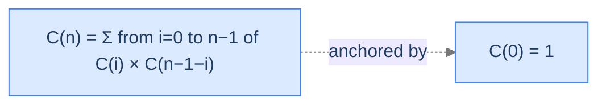
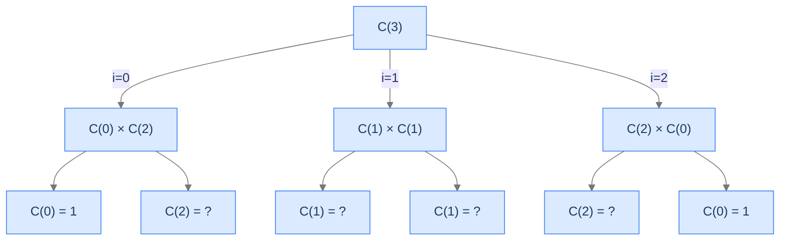

# Catalan Number

The hardest of the four. The branching factor is `n` itself — the recurrence sums over `i = 0..n-1` of `C(i) * C(n-1-i)`. The combine multiplies and sums.

---

## The Problem

Given a non-negative integer `n`, return the `n`-th Catalan number, where:

- `C(0) = 1`
- `C(n) = sum from i = 0 to n-1 of C(i) * C(n-1-i)` for `n ≥ 1`

You **must** solve this recursively.

```
Input:  n = 7
Output: 429
Explanation: C(7) = C(0)*C(6) + C(1)*C(5) + C(2)*C(4) + C(3)*C(3) + C(4)*C(2) + C(5)*C(1) + C(6)*C(0) = 429

Input:  n = 5
Output: 42

Input:  n = 0
Output: 1
```

---

<details>
<summary><h2>What Are Catalan Numbers?</h2></summary>


Catalan numbers count combinatorial structures: balanced parentheses, binary trees with `n` nodes, ways to triangulate a convex polygon, monotonic lattice paths. The recurrence reflects the structure of these objects: a binary tree with `n` nodes has a root, then partitions the remaining `n - 1` nodes between left and right subtrees in all possible ways. For each split `(i, n - 1 - i)`, multiply the counts and sum across all splits.



<p align="center"><strong>Catalan recurrence: each frame fans out to <code>n</code> recursive-call pairs, multiplied together and summed. Branching factor = <code>n</code> — the widest of the four problems.</strong></p>

</details>
<details>
<summary><h2>Applying the Diagnostic Questions</h2></summary>


| # | Check | Answer |
|---|---|---|
| **Q1** | Multiple smaller subproblems? | **Yes** — `2n` calls per frame: `C(0), C(n-1), C(1), C(n-2), ...`. |
| **Q2** | Fold-style combine? | **Yes** — multiply pairs, then sum the products. |
| **Q3** | Enough base cases? | **Yes** — `C(0) = 1` covers all reduction paths. |

### Q1 — Why "2n calls per frame"?

The recurrence sums `i = 0..n-1`, and each summand contains *two* recursive calls: `C(i)` and `C(n-1-i)`. So for `C(n)`, there are `n` summands × 2 calls each = `2n` recursive calls in this frame. The tree's branching factor grows linearly with `n` — vastly larger than Fibonacci's fixed branching factor of 2. ✓

### Q2 — Why "multiply-then-sum"?

Each summand is `C(i) * C(n-1-i)` — a product of two sub-answers. The full combine is sum-of-products. This double fold (multiply within a pair, sum across pairs) is the same shape as polynomial convolution, matrix multiplication, and many other structural recurrences. ✓

### Q3 — Why one base case is enough?

Every reduction in the loop produces `C(i)` for some `i` in `[0, n-1]`. By induction, every smaller subproblem eventually bottoms out at `C(0)`. The recurrence is "convolutional" — it doesn't need separate bases for `C(1), C(2), ...` because they're derived from `C(0)`. ✓

</details>
<details>
<summary><h2>The Quadratic-Branching Tree (Visualised)</h2></summary>


The tree fans out enormously. For `C(4)`, there are 4 splits, each with 2 calls = 8 children, and so on at every level.



<p align="center"><strong>Recursion tree for <code>C(3)</code>. Three splits, each with two calls. Lots of <code>C(2)</code> recomputation — the redundancy gets worse as <code>n</code> grows.</strong></p>

</details>
<details>
<summary><h2>Solution &amp; Analysis</h2></summary>

### The Solution

```python run viz=array
class Solution:
    def catalan(self, n: int) -> int:

        # Base case: The 0th Catalan number is 1
        if n == 0:
            return 1

        result = 0

        # Sum over all partitions
        for i in range(n):

            # Recursive call to calculate the Catalan numbers
            # for the left and right subtrees
            result += self.catalan(i) * self.catalan(n - 1 - i)

        # Return the Nth Catalan number
        return result


# Examples from the problem statement
print(Solution().catalan(7))   # 429
print(Solution().catalan(5))   # 42
print(Solution().catalan(0))   # 1

# Edge cases
print(Solution().catalan(1))   # 1
print(Solution().catalan(2))   # 2
print(Solution().catalan(3))   # 5
print(Solution().catalan(4))   # 14
```

```java run viz=array
public class Main {
    static class Solution {
        public int catalan(int N) {

            // Base case: The 0th Catalan number is 1
            if (N == 0) {
                return 1;
            }

            int result = 0;

            // Sum over all partitions
            for (int i = 0; i < N; i++) {

                // Recursive call to calculate the Catalan numbers
                // for the left and right subtrees
                result += catalan(i) * catalan(N - 1 - i);
            }

            // Return the Nth Catalan number
            return result;
        }
    }

    public static void main(String[] args) {
        // Examples from the problem statement
        System.out.println(new Solution().catalan(7));   // 429
        System.out.println(new Solution().catalan(5));   // 42
        System.out.println(new Solution().catalan(0));   // 1

        // Edge cases
        System.out.println(new Solution().catalan(1));   // 1
        System.out.println(new Solution().catalan(2));   // 2
        System.out.println(new Solution().catalan(3));   // 5
        System.out.println(new Solution().catalan(4));   // 14
    }
}
```


<details>
<summary><strong>Trace — n = 3</strong></summary>

```
C(3) = C(0)*C(2) + C(1)*C(1) + C(2)*C(0)
     = ?       + ?         + ?

C(0) = 1
C(1) = C(0)*C(0) = 1
C(2) = C(0)*C(1) + C(1)*C(0) = 1 + 1 = 2

C(3) = 1*2 + 1*1 + 2*1 = 2 + 1 + 2 = 5

Result: 5 ✓ (canonical Catalan value)
```

</details>

### Complexity Analysis

| Resource | Cost | Why |
|---|---|---|
| **Time** | `O(4^n / n^1.5)` (the closed form for Catalan call counts) | Effectively exponential; tree fanned out at branching factor that grows with `n`. |
| **Space (stack)** | `O(n)` | Linear depth — leftmost path. |

This is the most expensive of the four. Without memoisation, even moderate `n` (say 20) is painful. With memoisation, it collapses to `O(n²)` time and `O(n)` space.

### Edge Cases

| Case | Example | Expected | Reasoning |
|---|---|---|---|
| Base case | `n = 0` | `1` | Direct return. |
| Smallest computational | `n = 1` | `1` | One iteration: `C(0)*C(0) = 1`. |
| Mid-range | `n = 7` | `429` | Already millions of recursive calls without memoisation. |
| Large | `n = 30+` | infeasible naively | Use memoisation. |
| Overflow | `n = 33` | exceeds 64-bit | Catalan grows ~4^n; switch to big-int for large `n`. |

</details>
<details>
<summary><h2>Key Takeaway</h2></summary>


Catalan is multiple recursion at its widest: each frame spawns `2n` calls, the combine multiplies pairs and sums products, the call count grows roughly as `4^n`. It's the canonical "dynamic programming candidate" — the recurrence is mathematically elegant, the naive recursion is catastrophically slow, and memoisation collapses both observations into a textbook algorithm.

You came in with the suspicion that "two recursive calls is just twice the cost of one." You're leaving with the truth that two recursive calls is `2^n` times the cost of one — and that all four worked problems share that property. The fix (memoisation) is one of the most important ideas in algorithms and it owes its existence entirely to multiple recursion's exponential behaviour.

The next lesson lifts another constraint: what happens when the input has *more than one parameter*, and the recurrence reduces along multiple axes? Welcome to multidimensional recursion — the bridge into the 2D dynamic-programming problems that fill the rest of the algorithms section.

**Transfer challenge — try before the Multidimensional Recursion lesson:** Trace the recursion tree for `fib(8)` by hand. Count the number of times `fib(2)` is computed. Don't worry about the exact total call count; just count the duplicate `fib(2)` evaluations. The answer reveals exactly how much work memoisation would save.

<details>
<summary><strong>Answer — open after you've sketched it</strong></summary>

`fib(2)` is computed **13 times** in the call tree for `fib(8)`. The general fact: the number of times `fib(k)` is called inside `fib(n)`'s tree is `fib(n - k + 1)`. So:

- `fib(7)` called once
- `fib(6)` called 2 times
- `fib(5)` called 3 times
- `fib(4)` called 5 times
- `fib(3)` called 8 times
- `fib(2)` called 13 times
- `fib(1)` called 21 times
- `fib(0)` called 13 times

Each of those 13 evaluations of `fib(2)` does identical work — computing `fib(1) + fib(0) = 1`. **Memoisation eliminates 12 of those 13.** Multiply this saving across every duplicate sub-call and you have the algorithm we'll meet in the dynamic-programming section. **You just rediscovered why memoisation is the single most important idea for taming multiple recursion.**

</details>

</details>
