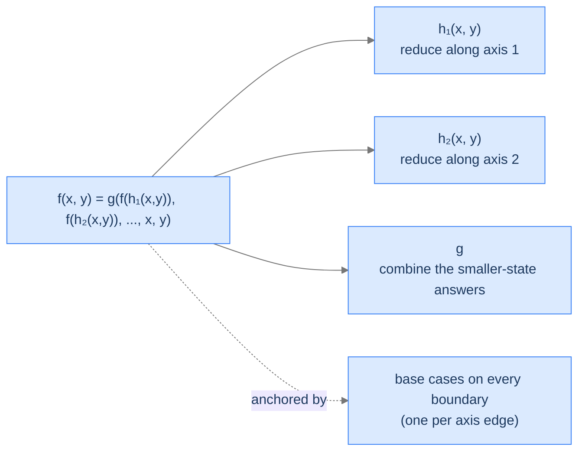

## Why It Exists

A recursion is **multidimensional** when its state is described by **two or more parameters**, each reducible on its own. The recursive call doesn't shrink a single number — it shrinks one axis, the other, or both. The classic is the binomial coefficient:

```text
C(n, k) = C(n-1, k-1) + C(n-1, k)
```

Two calls; both reduce `n`, one also reduces `k`. The state being navigated is the *pair* `(n, k)` — a **2D grid** of subproblems, not a 1D line. That changes the key question from "how *deep* does the recursion go?" to "how many *cells* can it visit?" — and the answer (the grid's area) is exactly why multidimensional recursion is the launchpad for 2D dynamic programming.

```d2
direction: down

table: "Subproblem space for C(n, k)" {
  grid-rows: 5
  grid-columns: 5
  grid-gap: 0
  h0:  ""        ; h1:  "k=0"  ; h2:  "k=1"  ; h3:  "k=2"  ; h4:  "k=3"
  r0n: "n=0"     ; c00: "1"    ; c01: "—"    ; c02: "—"    ; c03: "—"
  r1n: "n=1"     ; c10: "1"    ; c11: "1"    ; c12: "—"    ; c13: "—"
  r2n: "n=2"     ; c20: "1"    ; c21: "2"    ; c22: "1"    ; c23: "—"
  r3n: "n=3"     ; c30: "1"    ; c31: "3"    ; c32: "3"    ; c33: "1"
}
```

<p align="center"><strong>Each cell <code>C(n, k)</code> depends on two cells in the row above. The recursion navigates this grid, not a line — and the distinct subproblems are the cells, not the depth.</strong></p>

## See It Work

Binomial coefficient, straight from the recurrence. Two base cases — on the `k = 0` edge and the `k = n` diagonal — anchor both boundaries of the grid.

```python run viz=array
def binom(n, k):
    if k == 0 or k == n:                     # base cases on TWO boundaries
        return 1
    return binom(n - 1, k - 1) + binom(n - 1, k)   # reduce along two axes

n = int(input())
k = int(input())
print(binom(n, k))
```

```java run viz=array
import java.util.*;

public class Main {
    static int binom(int n, int k) {
        if (k == 0 || k == n) return 1;                  // two boundary base cases
        return binom(n - 1, k - 1) + binom(n - 1, k);    // reduce along two axes
    }

    public static void main(String[] args) {
        Scanner sc = new Scanner(System.in);
        int n = Integer.parseInt(sc.nextLine().trim());
        int k = Integer.parseInt(sc.nextLine().trim());
        System.out.println(binom(n, k));
    }
}
```

```testcases
{
  "args": [
    { "id": "n", "label": "n", "type": "int", "placeholder": "5" },
    { "id": "k", "label": "k", "type": "int", "placeholder": "2" }
  ],
  "cases": [
    { "args": { "n": "5", "k": "2" }, "expected": "10" },
    { "args": { "n": "4", "k": "2" }, "expected": "6" },
    { "args": { "n": "0", "k": "0" }, "expected": "1" },
    { "args": { "n": "6", "k": "3" }, "expected": "20" }
  ]
}
```

Both print `10` (the `C(5,2)` cell of Pascal's triangle). One recursive call reduces *both* `n` and `k`; the other reduces only `n` — the two calls explore the grid two-dimensionally.

## How It Works

The general form is `f(x, y) = g(f(h₁(x, y)), f(h₂(x, y)), …, x, y)` — make recursive calls that reduce *different axes*, then fold their answers.



<p align="center"><strong>It's <a href="/cortex/data-structures-and-algorithms/algorithms-by-strategy-recursion-pattern-multiple-recursion">multiple recursion</a> with a multi-axis state: same fan-out, different geometry — a grid instead of a line.</strong></p>

The trickiest part is the **base cases: they live on the grid's *boundaries*** — the `k = 0` edge *and* the `k = n` diagonal for binomial; the top row *and* left column for a path grid. Each axis can independently hit its smallest value, so each edge needs its own base case. Miss one and the paths travelling along that edge never terminate.

Complexity mirrors multiple recursion, scaled to the grid:

| | Without memoisation | With memoisation |
|---|---|---|
| **Time** | `O(2^(x+y))` — the tree branches twice per frame | `O(x · y)` — each cell computed once |
| **Stack space** | `O(x + y)` — deepest path reduces both axes to 0 | `O(x + y)` |
| **Memo space** | — | `O(x · y)` — one entry per cell |

Three diagnostics: **Q1** — does the input have *two or more* parameters that each shrink? **Q2** — do *different calls* reduce *different axes* (not always both together — else it collapses to 1D)? **Q3** — are there base cases on *every* boundary?

> **Key takeaway.** Multidimensional recursion = multiple recursion over a multi-axis state space; the subproblems form a grid, and base cases must cover *every* boundary edge. Naive cost is exponential (`O(2^(x+y))`) because grid cells overlap and get recomputed; memoising on the `(x, y)` tuple collapses it to `O(x·y)` — that's exactly 2D dynamic programming.

## Trace It

Because each axis terminates on its own edge, a 2D recursion needs a base case for *each* boundary — not just one. Here's lattice-path counting (`paths(r,c) = paths(r-1,c) + paths(r,c-1)`) with only the *row* boundary base case, missing the column one:

**Predict before you run:** does `paths(2, 2)` return `6`, or something else?

```python run viz=array
import sys
sys.setrecursionlimit(2000)

def paths_buggy(r, c):
    if r == 0:                               # ONLY the row edge — the c == 0 edge is missing
        return 1
    return paths_buggy(r - 1, c) + paths_buggy(r, c - 1)

try:
    print(paths_buggy(2, 2))
except RecursionError:
    print("RecursionError: the column edge never terminates")
```

<details>
<summary><strong>Reveal</strong></summary>

It raises `RecursionError`. Follow the column edge: `paths(1, 0)` isn't a base case (`r = 1 ≠ 0`), so it recurses to `paths(1, -1)`, then `paths(1, -2)`, and `c` slides toward negative infinity — `r` stays at 1 and never reaches the only base case. With both bases (`r == 0 or c == 0`) it returns 6. This is *the* multidimensional-recursion bug: each axis reaches its smallest value independently, so each edge of the grid needs its own base case. Miss one and inputs that travel along that edge recurse forever — while inputs that happen to dodge it work fine, which is what makes the bug intermittent and nasty. Drawing the grid and marking every boundary cell is the fastest way to catch it.

</details>

## Your Turn

**Lattice paths:** how many ways from the top-left to the bottom-right of a grid, moving only right or down? Your first move is right (→ a `(r, c-1)` subgrid) or down (→ a `(r-1, c)` subgrid); sum the two. Bases on *both* edges: a single row or column has exactly one path.

```python run viz=array
def paths(r, c):
    # Your code goes here — base cases on BOTH boundaries (r == 0 or c == 0 returns 1);
    # recursive case: paths(r-1, c) + paths(r, c-1)
    return 0

r = int(input())
c = int(input())
print(paths(r, c))
```

```java run viz=array
import java.util.*;

public class Main {
    static int paths(int r, int c) {
        // Your code goes here — base cases on BOTH boundaries;
        // recursive case: paths(r-1, c) + paths(r, c-1)
        return 0;
    }

    public static void main(String[] args) {
        Scanner sc = new Scanner(System.in);
        int r = Integer.parseInt(sc.nextLine().trim());
        int c = Integer.parseInt(sc.nextLine().trim());
        System.out.println(paths(r, c));
    }
}
```

```testcases
{
  "args": [
    { "id": "r", "label": "rows", "type": "int", "placeholder": "2" },
    { "id": "c", "label": "cols", "type": "int", "placeholder": "2" }
  ],
  "cases": [
    { "args": { "r": "2", "c": "2" }, "expected": "6" },
    { "args": { "r": "3", "c": "3" }, "expected": "20" },
    { "args": { "r": "0", "c": "0" }, "expected": "1" },
    { "args": { "r": "1", "c": "5" }, "expected": "6" },
    { "args": { "r": "4", "c": "2" }, "expected": "15" }
  ]
}
```

<details>
<summary>Editorial</summary>

```python solution time=O(2^(r+c)) space=O(r+c)
def paths(r, c):
    if r == 0 or c == 0:                     # base cases on BOTH boundaries
        return 1
    return paths(r - 1, c) + paths(r, c - 1) # move down or right

r = int(input())
c = int(input())
print(paths(r, c))
```

```java solution
import java.util.*;

public class Main {
    static int paths(int r, int c) {
        if (r == 0 || c == 0) return 1;              // both boundaries
        return paths(r - 1, c) + paths(r, c - 1);    // down or right
    }

    public static void main(String[] args) {
        Scanner sc = new Scanner(System.in);
        int r = Integer.parseInt(sc.nextLine().trim());
        int c = Integer.parseInt(sc.nextLine().trim());
        System.out.println(paths(r, c));
    }
}
```

</details>

Both print `6` then `20` — these are central binomial coefficients (`paths(r,c) = C(r+c, r)`), the same Pascal grid as the See-It. The four problems in this section's **Problems** folder — binomial coefficient, lattice paths, Ackermann, egg dropping — all navigate a multi-axis state space.

## Reflect & Connect

- **It's multiple recursion on a grid.** Same fan-out and fold as [multiple recursion](/cortex/data-structures-and-algorithms/algorithms-by-strategy-recursion-pattern-multiple-recursion); the only change is that the state has ≥2 reducible axes, so the subproblems tile a grid instead of a line.
- **Base cases on *every* boundary.** The signature bug is forgetting one edge — the recursion runs forever along it. Mark all boundary cells before you code.
- **Overlapping cells → memoise on the tuple → 2D DP.** Just like Fibonacci's overlaps, grid cells recur across branches; caching keyed on `(x, y)` turns `O(2^(x+y))` into `O(x·y)`. Edit distance, longest common subsequence, knapsack, and grid-path DP are all this pattern plus a 2D cache.
- **Subproblem count = grid area, not depth.** That reframing — "how many cells?" rather than "how deep?" — is the mental shift that makes dynamic programming click; the table you fill in bottom-up *is* this grid.

## Recall

<details>
<summary><strong>Q:</strong> What makes a recursion multidimensional?</summary>

**A:** Its state has two or more parameters that each shrink independently, so the subproblems form a grid (or higher-dimensional space) rather than a 1D line.

</details>
<details>
<summary><strong>Q:</strong> Where do the base cases live, and why is that the common bug?</summary>

**A:** On every boundary edge of the state space (e.g. `k=0` *and* `k=n`; top row *and* left column). Each axis reaches its minimum independently; miss one edge and paths along it recurse forever — an intermittent, input-dependent crash.

</details>
<details>
<summary><strong>Q:</strong> Naive vs. memoised complexity for a 2D recursion?</summary>

**A:** Naive `O(2^(x+y))` time (overlapping cells recomputed) with `O(x+y)` stack; memoised `O(x·y)` time with `O(x·y)` cache — each grid cell computed once.

</details>
<details>
<summary><strong>Q:</strong> How does multidimensional recursion differ from multiple recursion?</summary>

**A:** Same fan-out (≥2 calls, fold the results), but the state is multi-axis — the calls navigate a grid, not a line. Multiple recursion is the 1D case.

</details>
<details>
<summary><strong>Q:</strong> Why is this the launchpad for dynamic programming?</summary>

**A:** The distinct subproblems are grid cells (`O(x·y)`), and they overlap heavily; memoising on the `(x, y)` tuple — or filling the grid bottom-up — is exactly 2D DP.

</details>

## Sources & Verify

- **CLRS** (Cormen, Leiserson, Rivest, Stein), *Introduction to Algorithms*, 3rd ed., §15 — dynamic programming over 2D state (LCS in §15.4), the memoised-recursion-to-table progression this pattern sets up.
- **Abelson & Sussman**, *Structure and Interpretation of Computer Programs*, §1.2.2 — tree recursion and Pascal's-triangle binomial coefficients as a worked example.
- **Sedgewick & Wayne**, *Algorithms*, 4th ed., §2.3 / §6 — recursion over multi-parameter state and the cost of recomputation without memoisation.
- The `C(5,2)=10`, the missing-boundary `RecursionError`, and `paths(2,2)=6` / `paths(3,3)=20` above come from the runnable blocks — re-run to verify.
