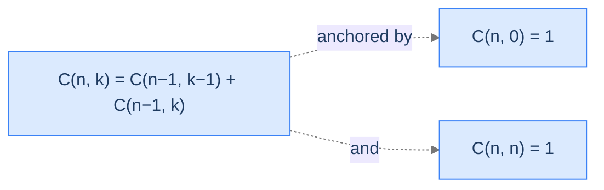

# Binomial Coefficient

Pascal's triangle, recursion-style. The recurrence `C(n, k) = C(n-1, k-1) + C(n-1, k)` is one of the cleanest 2D recurrences in mathematics.

---

## The Problem

Given non-negative integers `n` and `k` with `0 ≤ k ≤ n`, return the binomial coefficient `C(n, k)` — the number of ways to choose `k` elements from a set of `n`.

---

## Examples

**Example 1**
```
Input:  n = 5, k = 3
Output: 10
Explanation: C(5, 3) = 5! / (3! × 2!) = 10
```

**Example 2**
```
Input:  n = 10, k = 4
Output: 210
Explanation: C(10, 4) = 10! / (4! × 6!) = 210
```

```quiz
{
  "prompt": "What are the two boundary base cases for the binomial recurrence C(n, k)?",
  "options": ["k = 0 and k = n", "n = 0 and k = 0", "n = 1 and k = 1", "k = 0 and n = 1"],
  "answer": "k = 0 and k = n"
}
```

## Constraints

- `0 ≤ k ≤ n ≤ 20`
- Must be solved recursively (no direct factorial formula).

```python run viz=array
class Solution:
    def binomial_coefficient(self, n: int, k: int) -> int:
        # Your code goes here — base cases: n == k or k == 0 returns 1;
        # recursive step: C(n-1, k-1) + C(n-1, k)
        return 0

n = int(input())
k = int(input())
print(Solution().binomial_coefficient(n, k))
```

```java run viz=array
import java.util.*;

public class Main {
    static class Solution {
        public int binomialCoefficient(int n, int k) {
            // Your code goes here — base cases: n == k or k == 0 returns 1;
            // recursive step: C(n-1, k-1) + C(n-1, k)
            return 0;
        }
    }

    public static void main(String[] args) {
        Scanner sc = new Scanner(System.in);
        int n = Integer.parseInt(sc.nextLine().trim());
        int k = Integer.parseInt(sc.nextLine().trim());
        System.out.println(new Solution().binomialCoefficient(n, k));
    }
}
```

```testcases
{
  "args": [
    { "id": "n", "label": "n", "type": "int", "placeholder": "5" },
    { "id": "k", "label": "k", "type": "int", "placeholder": "3" }
  ],
  "cases": [
    { "args": { "n": "5", "k": "3" }, "expected": "10" },
    { "args": { "n": "10", "k": "4" }, "expected": "210" },
    { "args": { "n": "0", "k": "0" }, "expected": "1" },
    { "args": { "n": "5", "k": "0" }, "expected": "1" },
    { "args": { "n": "5", "k": "5" }, "expected": "1" },
    { "args": { "n": "6", "k": "2" }, "expected": "15" },
    { "args": { "n": "7", "k": "3" }, "expected": "35" }
  ]
}
```

<details>
<summary><h2>What Does the Recurrence Mean?</h2></summary>


Pick any one element of the set of `n`. Either you include it in your subset of `k`, or you don't:
- **Include it.** You now need `k - 1` more elements from the remaining `n - 1`. That's `C(n-1, k-1)`.
- **Exclude it.** You still need `k` elements from the remaining `n - 1`. That's `C(n-1, k)`.

These two cases are disjoint and cover every subset, so:

```
C(n, k) = C(n-1, k-1) + C(n-1, k)
```

The base cases:
- `C(n, 0) = 1` — exactly one way to choose 0 elements (the empty subset).
- `C(n, n) = 1` — exactly one way to choose all `n` elements.



<p align="center"><strong>Pascal's triangle's recurrence with both boundary base cases. Drop either boundary and some inputs run forever.</strong></p>

</details>
<details>
<summary><h2>Applying the Diagnostic Questions</h2></summary>


| # | Check | Answer |
|---|---|---|
| **Q1** | Two shrinkable parameters? | **Yes** — `n` and `k` both shrink. |
| **Q2** | Axis-aware reductions? | **Yes** — first call reduces both, second reduces only `n`. |
| **Q3** | Base cases on multiple boundaries? | **Yes** — left edge `k = 0` and diagonal `k = n`. |

### Q1 — Why "n and k both shrink"?

The recurrence `C(n, k) = C(n-1, k-1) + C(n-1, k)` reduces `n` by 1 in both calls and reduces `k` by 1 in the first call. Both parameters move toward their respective boundaries. ✓

### Q2 — Why "axis-aware"?

The first recursive call reduces both `n` and `k` (descending the diagonal). The second reduces only `n` (descending vertically). The recursion explores the grid two-dimensionally. ✓

### Q3 — Why two boundary base cases?

`C(n, 0) = 1` catches the left edge. `C(n, n) = 1` catches the diagonal. Together they cover every reduction path: any descent eventually hits either the left edge (when `k` reaches 0) or the diagonal (when `k = n`). Drop either and some calls recurse into negative `k` and never terminate. ✓

</details>
<details>
<summary><h2>The 2D State Space (Visualised)</h2></summary>


The recursion descends the grid one row at a time, reducing `n` per call. The two children of `C(n, k)` are the cell directly above (`C(n-1, k)`) and the cell diagonally above-left (`C(n-1, k-1)`).

```d2
direction: down

table: "C(n, k) recursion grid (Pascal's triangle)" {
  grid-rows: 5
  grid-columns: 5
  grid-gap: 0
  h0:  ""        ; h1:  "k=0"  ; h2:  "k=1"  ; h3:  "k=2"  ; h4:  "k=3"
  r0n: "n=0"     ; c00: "1" {style.fill: "#fde68a"; style.stroke: "#d97706"}; c01: "—"; c02: "—"; c03: "—"
  r1n: "n=1"     ; c10: "1" {style.fill: "#fde68a"; style.stroke: "#d97706"}; c11: "1" {style.fill: "#fde68a"; style.stroke: "#d97706"}; c12: "—"; c13: "—"
  r2n: "n=2"     ; c20: "1" {style.fill: "#fde68a"; style.stroke: "#d97706"}; c21: "2"; c22: "1" {style.fill: "#fde68a"; style.stroke: "#d97706"}; c23: "—"
  r3n: "n=3"     ; c30: "1" {style.fill: "#fde68a"; style.stroke: "#d97706"}; c31: "3"; c32: "3"; c33: "1" {style.fill: "#fde68a"; style.stroke: "#d97706"}
}
```

<p align="center"><strong>The 2D state space for binomial coefficient. Yellow = base cases on the boundaries. Each interior cell is the sum of the cell directly above and diagonally above-left.</strong></p>

</details>
<details>
<summary><h2>Solution &amp; Analysis</h2></summary>

### The Solution

```python solution time=O(2^n) space=O(n)
class Solution:
    def binomial_coefficient(self, n: int, k: int) -> int:

        # Base cases: If n equals k or k is 0, then C(n, k) is 1.
        if n == k or k == 0:
            return 1

        # Recursive step:
        # C(n, k) = C(n - 1, k - 1) + C(n - 1, k)
        # Recursively calculate C(n - 1, k - 1) for choosing k elements
        # from n-1 elements, and C(n - 1, k) for choosing k elements from
        # n-1 elements.
        return self.binomial_coefficient(
            n - 1, k - 1
        ) + self.binomial_coefficient(n - 1, k)


n = int(input())
k = int(input())
print(Solution().binomial_coefficient(n, k))
```

```java solution
import java.util.*;

public class Main {
    static class Solution {
        public int binomialCoefficient(int N, int K) {

            // Base cases: If N equals K or K is 0, then C(N, K) is 1.
            if (N == K || K == 0) {
                return 1;
            }

            // Recursive step:
            // C(N, K) = C(N - 1, K - 1) + C(N - 1, K)
            // Recursively calculate C(N - 1, K - 1) for choosing K elements
            // from N-1 elements, and C(N - 1, K) for choosing K elements
            // from N-1 elements.
            return (
                binomialCoefficient(N - 1, K - 1) +
                binomialCoefficient(N - 1, K)
            );
        }
    }

    public static void main(String[] args) {
        Scanner sc = new Scanner(System.in);
        int n = Integer.parseInt(sc.nextLine().trim());
        int k = Integer.parseInt(sc.nextLine().trim());
        System.out.println(new Solution().binomialCoefficient(n, k));
    }
}
```


<details>
<summary><strong>Trace — n = 4, k = 2</strong></summary>

```
C(4, 2) = C(3, 1) + C(3, 2)

C(3, 1) = C(2, 0) + C(2, 1)
        = 1 + (C(1, 0) + C(1, 1))
        = 1 + (1 + 1)
        = 3

C(3, 2) = C(2, 1) + C(2, 2)
        = (C(1, 0) + C(1, 1)) + 1
        = (1 + 1) + 1
        = 3

C(4, 2) = 3 + 3 = 6 ✓
```

</details>

### Complexity Analysis

| Resource | Cost | Why |
|---|---|---|
| **Time** | `O(2^n)` worst case | Without memoisation, each cell is recomputed many times. |
| **Space (stack)** | `O(n)` | Deepest descent reduces `n` to 0. |
| **Space (with memo)** | `O(n · k)` | Cache one entry per `(n, k)` cell. |
| **Time (with memo)** | `O(n · k)` | Each cell computed once. |

### Edge Cases

| Case | Example | Expected | Reasoning |
|---|---|---|---|
| `k = 0` | `C(n, 0)` | `1` | Boundary base — empty subset. |
| `k = n` | `C(n, n)` | `1` | Diagonal base — full subset. |
| `n = 0, k = 0` | `C(0, 0)` | `1` | Both bases trigger; identical answer. |
| `k > n` | `C(3, 5)` | undefined | Caller should guard; recursion would overshoot. |
| Symmetry | `C(10, 4)` vs `C(10, 6)` | both `210` | `C(n, k) = C(n, n-k)` (mathematical property). |
| Large | `C(50, 25)` | `1.26 × 10¹⁴` | Naive recursion infeasible without memoisation. |

</details>
<details>
<summary><h2>Key Takeaway</h2></summary>


Binomial coefficient is the canonical 2D recurrence — clean, symmetric, with two boundary base cases. The recursion navigates Pascal's triangle one cell at a time, branching into two cells per level. Memoisation collapses the exponential blow-up; the next problem has the same shape but a different physical interpretation.

</details>
