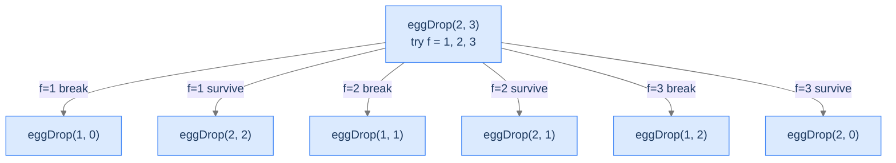

# Egg Dropping

The classic interview problem. Two parameters (eggs, floors), a recursive optimisation, multiple base cases, and a recursion structure that screams "memoise me."

---

## The Problem

You have `eggs` identical eggs and a building with `floors` floors. You want to find the **highest floor from which an egg can be dropped without breaking** (the "threshold floor"). An egg either breaks on impact or survives unscathed (and can be reused).

You want a strategy that minimises the **worst-case number of drops** across all possible threshold floors. Return the minimum number of drops needed in the worst case.

```
Input:  eggs = 4, floors = 2
Output: 2

Input:  eggs = 2, floors = 1
Output: 1

Input:  eggs = 1, floors = 1
Output: 1
```

---

<details>
<summary><h2>What Does the Recurrence Mean?</h2></summary>


Imagine you have `eggs` eggs and `floors` floors. You decide to drop an egg from some floor `f`. Two things can happen:

1. **The egg breaks.** You now have `eggs - 1` eggs and need to test the `f - 1` floors *below* `f` (the threshold is somewhere in `[1, f - 1]`).
2. **The egg survives.** You still have `eggs` eggs and need to test the `floors - f` floors *above* `f` (the threshold is somewhere in `[f + 1, floors]`).

In the worst case, you take whichever branch is more expensive. To find the optimal strategy, **try every floor `f` from 1 to `floors`** and pick the one that minimises the worst-case cost:

```
eggDrop(eggs, floors) = 1 + min over f in [1, floors] of
                            max(eggDrop(eggs - 1, f - 1),
                                eggDrop(eggs,     floors - f))
```

The `+1` counts the current drop; the `max` is the worst case for this drop choice; the `min` over `f` picks the best drop choice.

Base cases:
- `eggDrop(_, 0) = 0` — no floors, no drops.
- `eggDrop(_, 1) = 1` — one floor, one drop tells you everything.
- `eggDrop(1, floors) = floors` — with one egg, you must scan linearly from floor 1 (any other strategy risks breaking your only egg too high).

</details>
<details>
<summary><h2>Applying the Diagnostic Questions</h2></summary>


| # | Check | Answer |
|---|---|---|
| **Q1** | Two shrinkable parameters? | **Yes** — `eggs` and `floors`. |
| **Q2** | Axis-aware reductions? | **Yes** — break-case reduces both; survive-case reduces only `floors`. |
| **Q3** | Base cases on multiple boundaries? | **Yes** — three: `floors = 0`, `floors = 1`, `eggs = 1`. |

### Q1 — Why "two shrinkable parameters"?

`eggs` shrinks when the egg breaks. `floors` shrinks always (we test fewer floors after each drop). Both axes participate. ✓

### Q2 — Why "axis-aware"?

The break-case `eggDrop(eggs - 1, f - 1)` reduces both axes. The survive-case `eggDrop(eggs, floors - f)` reduces only `floors`. The recursion explores the grid two-dimensionally with branching choices. ✓

### Q3 — Why three base cases?

- `floors = 0`: trivial — no floors to test.
- `floors = 1`: trivial — one drop decides.
- `eggs = 1`: forced linear scan — special case to avoid wasting your only egg.

Drop any one and the recursion either runs forever or gives wrong answers for some inputs. ✓

</details>
<details>
<summary><h2>The Optimisation Tree (Visualised)</h2></summary>


For each cell `(e, f)`, the recursion tries every floor `1..f` and picks the minimum worst-case. That's an `O(f)` inner loop, plus two recursive calls per inner-loop iteration. Without memoisation, the work is enormous.



<p align="center"><strong>For <code>eggDrop(2, 3)</code> the recursion tries each of three floors. Each floor yields two sub-calls (break, survive). The minimum-of-maxima search is what makes this an *optimisation* recursion, not just a counting one.</strong></p>

</details>
<details>
<summary><h2>Solution &amp; Analysis</h2></summary>

### The Solution

```python run viz=array
import sys

class Solution:
    def egg_drop(self, eggs: int, floors: int) -> int:

        # Base case: If there are no floors, no trials are needed.
        if floors == 0:
            return 0

        # Base case: If there is one floor, one trial is needed.
        if floors == 1:
            return 1

        # Base case: If there is only one egg, we have to do a linear
        # search
        if eggs == 1:
            return floors

        # Initialize minimum number of drops to a large value
        min_drops = sys.maxsize

        # Try dropping from each floor
        for floor in range(1, floors + 1):

            # if the egg breaks
            egg_breaks = self.egg_drop(eggs - 1, floor - 1)

            # if the egg survives
            egg_survives = self.egg_drop(eggs, floors - floor)

            # The worst-case scenario is the maximum of the two cases
            worst_case = max(egg_breaks, egg_survives)

            # Update the minimum number of drops needed
            min_drops = min(min_drops, worst_case + 1)

        return min_drops


# Examples from the problem statement
print(Solution().egg_drop(4, 2))   # 2
print(Solution().egg_drop(2, 1))   # 1
print(Solution().egg_drop(1, 1))   # 1

# Edge cases
print(Solution().egg_drop(2, 0))   # 0
print(Solution().egg_drop(1, 5))   # 5
print(Solution().egg_drop(2, 6))   # 3
print(Solution().egg_drop(3, 5))   # 3
```

```java run viz=array
public class Main {
    static class Solution {
        public int eggDrop(int eggs, int floors) {

            // Base case: If there are no floors, no trials are needed.
            if (floors == 0) {
                return 0;
            }

            // Base case: If there is one floor, one trial is needed.
            if (floors == 1) {
                return 1;
            }

            // Base case: If there is only one egg, we have to do a linear
            // search
            if (eggs == 1) {
                return floors;
            }

            // Initialize minimum number of drops to a large value
            int minDrops = Integer.MAX_VALUE;

            // Try dropping from each floor
            for (int floor = 1; floor <= floors; floor++) {

                // if the egg breaks
                int eggBreaks = eggDrop(eggs - 1, floor - 1);

                // if the egg survives
                int eggSurvives = eggDrop(eggs, floors - floor);

                // The worst-case scenario is the maximum of the two cases
                int worstCase = Math.max(eggBreaks, eggSurvives);

                // Update the minimum number of drops needed
                minDrops = Math.min(minDrops, worstCase + 1);
            }

            return minDrops;
        }
    }

    public static void main(String[] args) {
        // Examples from the problem statement
        System.out.println(new Solution().eggDrop(4, 2));   // 2
        System.out.println(new Solution().eggDrop(2, 1));   // 1
        System.out.println(new Solution().eggDrop(1, 1));   // 1

        // Edge cases
        System.out.println(new Solution().eggDrop(2, 0));   // 0
        System.out.println(new Solution().eggDrop(1, 5));   // 5
        System.out.println(new Solution().eggDrop(2, 6));   // 3
        System.out.println(new Solution().eggDrop(3, 5));   // 3
    }
}
```


<details>
<summary><strong>Trace — eggs = 2, floors = 3</strong></summary>

```
eggDrop(2, 3) tries f = 1, 2, 3:

f = 1:
  broke    = eggDrop(1, 0) = 0
  survived = eggDrop(2, 2) = ?
    eggDrop(2, 2) tries f = 1, 2:
      f=1: max(eggDrop(1, 0), eggDrop(2, 1)) + 1 = max(0, 1) + 1 = 2
      f=2: max(eggDrop(1, 1), eggDrop(2, 0)) + 1 = max(1, 0) + 1 = 2
      eggDrop(2, 2) = min(2, 2) = 2
  worst = max(0, 2) = 2
  drops = 2 + 1 = 3

f = 2:
  broke    = eggDrop(1, 1) = 1
  survived = eggDrop(2, 1) = 1
  worst = max(1, 1) = 1
  drops = 1 + 1 = 2

f = 3:
  broke    = eggDrop(1, 2) = 2
  survived = eggDrop(2, 0) = 0
  worst = max(2, 0) = 2
  drops = 2 + 1 = 3

eggDrop(2, 3) = min(3, 2, 3) = 2 ✓
```

The optimal strategy is to drop from floor 2 first.

</details>

### Complexity Analysis

| Resource | Cost (no memo) | Cost (with memo) | Why |
|---|---|---|---|
| **Time** | exponential, at least `O(2^floors)` | `O(eggs · floors²)` | Naive recursion is catastrophic; memoising over `(eggs, floors)` is `O(eggs · floors)` cells × `O(floors)` inner loop. |
| **Space (stack)** | `O(floors)` | `O(floors)` | Linear depth. |
| **Space (memo)** | n/a | `O(eggs · floors)` | Cache one entry per `(e, f)`. |

**With binary-search optimisation on the `f` loop**, time drops further to `O(eggs · floors · log floors)`. Both improvements are part of the dynamic programming chapter.

### Edge Cases

| Case | Example | Expected | Reasoning |
|---|---|---|---|
| `floors = 0` | `eggDrop(_, 0)` | `0` | Trivial. |
| `floors = 1` | `eggDrop(_, 1)` | `1` | One drop suffices. |
| `eggs = 1` | `eggDrop(1, n)` | `n` | Forced linear scan. |
| Two eggs, 100 floors | `eggDrop(2, 100)` | `14` | Famous classroom answer. |
| Many eggs | `eggDrop(100, 100)` | `7` | With ≥ `log₂(floors)` eggs, you can effectively binary-search. |

</details>
<details>
<summary><h2>Key Takeaway</h2></summary>


Egg dropping is multidimensional recursion's textbook optimisation problem. Two axes (`eggs`, `floors`), three base cases, an inner loop choosing the optimal floor, and an exponential blow-up that screams for memoisation. **This is the canonical "this is why DP exists" lesson** — a problem where the recurrence is intuitive and correct, but only memoisation makes it tractable.

You came in with the suspicion that "more parameters means more recursion." You're leaving with a feel for *2D state space* navigation, the discipline of finding all the boundary base cases, and a recurrence (egg drop) that perfectly sets up the dynamic-programming chapter. Every problem in that chapter — knapsack, edit distance, longest common subsequence, matrix chain multiplication — is multidimensional recursion plus memoisation. You've now seen the recursion half. The memoisation half is just one step away.

**Transfer challenge — close out the recursion section:** You have **3 eggs and 100 floors**. Without solving the full optimisation, just *sketch* the 2D recurrence on paper. What are the parameters? What are the base cases? Which axes do the recursive calls reduce? Don't compute — just identify the structure.

<details>
<summary><strong>Answer — open after you've sketched it</strong></summary>

- **Parameters:** `eggs` (3 → 0), `floors` (100 → 0). Two-dimensional state space.
- **Base cases:** `floors = 0` → 0 drops. `floors = 1` → 1 drop. `eggs = 1` → linear scan, returns `floors`.
- **Recursion:** for each candidate first-drop floor `f`:
  - Break case: `eggDrop(eggs - 1, f - 1)` — both axes reduced.
  - Survive case: `eggDrop(eggs, floors - f)` — only `floors` reduced.
  - Worst case = `max` of the two.
- **Combine:** `min over f of max(...)` plus 1 for the current drop.

The exact answer for `(eggs=3, floors=100)` is **9 drops** in the worst case. With memoisation, the algorithm computes this in milliseconds. Without it, you're waiting for hours. **You've now seen all the components of dynamic programming except the cache itself.**

That cache is the entire content of the dynamic-programming chapter coming up next. Every DP problem you'll meet — knapsack, edit distance, palindrome partitioning, matrix chain multiplication — is a multidimensional recursion you've already learned to recognise, with a memo table added.

You came into this section thinking recursion was a niche trick. You're leaving with a complete map of the four patterns (head, tail, multiple, multidimensional), seven lessons of internalised material, four files of worked problems, the diagnostic questions to recognise each pattern on sight, and the keys to the dynamic programming chapter that comes next. **Recursion is no longer dark magic. It's a tool you reach for.**

</details>

</details>
