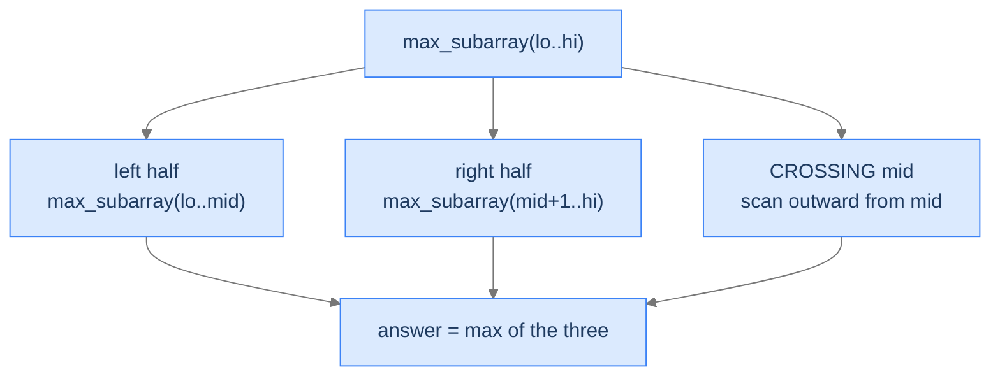

## Why It Exists

Multiply two 1024-digit numbers and the schoolbook algorithm does `n²` digit multiplications — about a million. In 1960 Anatoly Karatsuba noticed you can do it with **three** half-size multiplications instead of four, recursively: the recurrence `T(n) = 3T(n/2) + n` gives `Θ(n^1.585)` instead of `Θ(n²)`. For 10,000-digit numbers that's ~50× faster.

That one move — **split the input, recurse on the pieces, recombine** — is **divide and conquer**, and it powers merge sort, quicksort, binary search, the FFT, Strassen's matrix multiply, and most algorithms that turn an `O(n²)` problem into `O(n log n)`. Learn the three-step shape once and you can both *recognise* D&C and *derive* its complexity (via the [master theorem](/cortex/data-structures-and-algorithms/foundations-recurrence-relations-and-master-theorem)) on sight.

## See It Work

**Maximum subarray** — the largest-sum contiguous slice. Its D&C version is the canonical "you can't *just* recurse on halves" example: the best slice might straddle the midpoint, so a third case scans outward from `mid`.

```python run viz=array
def max_crossing(A, lo, mid, hi):           # best slice that MUST include mid and mid+1
    left = float('-inf'); s = 0
    for i in range(mid, lo - 1, -1):
        s += A[i]; left = max(left, s)
    right = float('-inf'); s = 0
    for j in range(mid + 1, hi + 1):
        s += A[j]; right = max(right, s)
    return left + right

def max_subarray(A, lo, hi):
    if lo == hi: return A[lo]               # base case: one element
    mid = (lo + hi) // 2
    return max(max_subarray(A, lo, mid),    # entirely in the left half
               max_subarray(A, mid + 1, hi),# entirely in the right half
               max_crossing(A, lo, mid, hi))# crossing the midpoint

A = [-2, 1, -3, 4, -1, 2, 1, -5, 4]
print("max subarray sum =", max_subarray(A, 0, len(A) - 1))   # 6, from [4, -1, 2, 1]
```

```java run viz=array
public class Main {
    static int maxCrossing(int[] A, int lo, int mid, int hi) {
        int left = Integer.MIN_VALUE, s = 0;
        for (int i = mid; i >= lo; i--) { s += A[i]; left = Math.max(left, s); }
        int right = Integer.MIN_VALUE; s = 0;
        for (int j = mid + 1; j <= hi; j++) { s += A[j]; right = Math.max(right, s); }
        return left + right;
    }
    static int maxSubarray(int[] A, int lo, int hi) {
        if (lo == hi) return A[lo];
        int mid = (lo + hi) / 2;
        return Math.max(Math.max(maxSubarray(A, lo, mid), maxSubarray(A, mid + 1, hi)),
                        maxCrossing(A, lo, mid, hi));
    }
    public static void main(String[] args) {
        int[] A = {-2, 1, -3, 4, -1, 2, 1, -5, 4};
        System.out.println("max subarray sum = " + maxSubarray(A, 0, A.length - 1));   // 6
    }
}
```

Both print `6`. The recurrence is `T(n) = 2T(n/2) + n → Θ(n log n)`: two half-size recursions plus an `O(n)` cross-midpoint scan.

## How It Works

Three steps, every time:

1. **Divide** — split into smaller subproblems of the same kind.
2. **Conquer** — solve each recursively (or directly, at the base case).
3. **Combine** — stitch the sub-answers into the original answer.

Merge sort: divide = split in half, conquer = sort each half, combine = merge in `O(n)`. Binary search: divide = compare to the middle, conquer = recurse into the one relevant half, combine = nothing. The shape is identical; only `a` (number of subproblems), `b` (size reduction), and `f(n)` (combine cost) change — and the **master theorem** reads the closed-form complexity straight off `T(n) = a·T(n/b) + f(n)`.



<p align="center"><strong>The maximum subarray is one of three things — entirely left, entirely right, or crossing the midpoint. Forgetting the third case is the canonical D&C bug.</strong></p>

Some recurrences and their verdicts: merge sort `2T(n/2)+n → Θ(n log n)`; binary search `T(n/2)+1 → Θ(log n)`; Karatsuba `3T(n/2)+n → Θ(n^1.585)`; Strassen `7T(n/2)+n² → Θ(n^2.807)`. D&C wins when it throws away repeated work or when the combine is cheap; it does **not** help when subproblems *overlap* (Fibonacci, edit distance) — that's [dynamic programming](/cortex/data-structures-and-algorithms/algorithms-by-strategy-recursion-pattern-multidimensional-recursion)'s territory, where you memoise instead.

> **Key takeaway.** Divide-and-conquer = divide into *independent* subproblems → conquer recursively → combine. The combine step is where the thought (and the bugs) live; the master theorem turns `T(n) = a·T(n/b) + f(n)` into a closed-form complexity. Overlapping subproblems → use DP, not D&C.

## Trace It

The cross-midpoint case feels like an optional extra — surely recursing on both halves covers everything? It does not, because *any* slice of length ≥ 2 straddles a midpoint at some level of the recursion.

**Predict before you run:** delete the crossing case (keep only the left and right recursions). On `[-2, 1, -3, 4, -1, 2, 1, -5, 4]` (true answer 6, from `[4, -1, 2, 1]`), what does it return?

```python run viz=array
def max_subarray_nocross(A, lo, hi):
    if lo == hi: return A[lo]
    mid = (lo + hi) // 2
    return max(max_subarray_nocross(A, lo, mid),      # left half
               max_subarray_nocross(A, mid + 1, hi))  # right half  — NO crossing case

A = [-2, 1, -3, 4, -1, 2, 1, -5, 4]
print("no-cross result:", max_subarray_nocross(A, 0, len(A) - 1))
```

<details>
<summary><strong>Reveal</strong></summary>

It returns `4`, not `6` — and worse, `4` is just the largest *single element*. Without the crossing case, every subarray of length ≥ 2 eventually gets split across a midpoint and is never considered as a whole; the recursion keeps halving until it bottoms out at single elements, so the "answer" is merely `max(A)`. The true best, `[4, -1, 2, 1] = 6`, straddles the array's midpoint and is invisible to left-only and right-only recursion. This is the defining D&C discipline: after dividing, **ask what answers live on the seam between the pieces** and handle them in the combine step. Merge sort's merge, closest-pair's median strip, and inversion-counting's cross-count are all the same "handle the boundary" idea.

</details>

## Your Turn

D&C does more than sort. **Count inversions** — pairs `(i, j)` with `i < j` but `A[i] > A[j]` — by piggy-backing on merge sort: when the merge step takes an element from the *right* half, every element still waiting in the *left* half forms an inversion with it.

```python run viz=array
def count_inversions(A):
    def sort_count(a):
        if len(a) <= 1: return a, 0
        m = len(a) // 2
        left, cl = sort_count(a[:m]); right, cr = sort_count(a[m:])
        merged, i, j, inv = [], 0, 0, 0
        while i < len(left) and j < len(right):
            if left[i] <= right[j]:
                merged.append(left[i]); i += 1
            else:
                merged.append(right[j]); j += 1
                inv += len(left) - i                 # left[i:] all exceed right[j]
        merged += left[i:]; merged += right[j:]
        return merged, cl + cr + inv
    return sort_count(A)[1]

print("inversions [2,4,1,3,5]:", count_inversions([2, 4, 1, 3, 5]))   # 3
print("inversions [5,4,3,2,1]:", count_inversions([5, 4, 3, 2, 1]))   # 10
```

```java run viz=array
import java.util.*;
public class Main {
    static long sortCount(int[] a, int lo, int hi) {
        if (hi - lo <= 1) return 0;
        int mid = (lo + hi) / 2;
        long inv = sortCount(a, lo, mid) + sortCount(a, mid, hi);
        int[] merged = new int[hi - lo]; int i = lo, j = mid, k = 0;
        while (i < mid && j < hi) {
            if (a[i] <= a[j]) merged[k++] = a[i++];
            else { merged[k++] = a[j++]; inv += mid - i; }   // a[i:mid] all exceed a[j]
        }
        while (i < mid) merged[k++] = a[i++];
        while (j < hi) merged[k++] = a[j++];
        System.arraycopy(merged, 0, a, lo, merged.length);
        return inv;
    }
    static long countInversions(int[] A) { int[] c = A.clone(); return sortCount(c, 0, c.length); }
    public static void main(String[] args) {
        System.out.println("inversions [2,4,1,3,5]: " + countInversions(new int[]{2,4,1,3,5}));   // 3
        System.out.println("inversions [5,4,3,2,1]: " + countInversions(new int[]{5,4,3,2,1}));   // 10
    }
}
```

Both print `3` then `10` (a fully reversed array of 5 has `5·4/2 = 10` inversions). The merge — D&C's combine step — counts cross-half inversions *for free* in the `O(n)` pass, giving `O(n log n)` total versus the naive `O(n²)` double loop.

## Reflect & Connect

- **The combine step is the whole game.** The recursion is mechanical; "merge two sorted halves," "count cross-half inversions," "handle the cross-midpoint slice" is where the algorithm — and the bugs — live. Always ask what lives on the seam between the pieces.
- **D&C vs. DP.** D&C needs *independent* subproblems. When they *overlap* (Fibonacci, edit distance, LCS), pure D&C redoes exponential work — switch to [dynamic programming](/cortex/data-structures-and-algorithms/algorithms-by-strategy-recursion-pattern-multidimensional-recursion) and memoise.
- **Master theorem closes the analysis.** Put the recurrence in `a·T(n/b) + f(n)` form and the complexity is one lookup away — no hand-waving about "I think it's `O(n log n)`."
- **Parallelism is free.** Independent halves run on separate cores — Java's `ForkJoinPool`/`Arrays.parallelSort`, Rust's Rayon, and parallel FFTs all lean on D&C's independence. Watch the midpoint-overflow pitfall (`lo + (hi - lo) / 2`) and recursion depth on linked structures.

## Recall

<details>
<summary><strong>Q:</strong> The three steps of divide and conquer?</summary>

**A:** Divide into smaller subproblems of the same kind; conquer each recursively (or directly at the base case); combine the sub-answers into the original answer.

</details>
<details>
<summary><strong>Q:</strong> What does the master theorem need, and what does it give?</summary>

**A:** From `T(n) = a·T(n/b) + f(n)` — `a` subproblems, size-reduction `b`, combine cost `f(n)` — it returns the closed-form complexity (e.g. merge sort's `2T(n/2)+n → Θ(n log n)`).

</details>
<details>
<summary><strong>Q:</strong> The canonical trap in maximum-subarray D&C?</summary>

**A:** Forgetting the cross-midpoint case. Recursing on both halves alone misses any slice spanning the boundary; you must scan outward from `mid` and take the max of left / right / crossing.

</details>
<details>
<summary><strong>Q:</strong> When is D&C the wrong choice?</summary>

**A:** When subproblems overlap (use DP/memoisation), when every element must be examined anyway (a linear scan is simpler), or when the combine cost is so heavy it dominates the recurrence.

</details>
<details>
<summary><strong>Q:</strong> How does inversion counting reach `O(n log n)`?</summary>

**A:** It rides merge sort: when the merge takes an element from the right half, all remaining left-half elements are larger, so they're inversions — counted in the same `O(n)` merge pass, `O(n log n)` total.

</details>

## Sources & Verify

- **CLRS** (Cormen, Leiserson, Rivest, Stein), *Introduction to Algorithms*, 3rd ed., Ch. 4 — the divide-and-conquer method, the maximum-subarray example, and the master theorem; §2.3.1 for merge sort.
- **Karatsuba & Ofman** (1962), "Multiplication of multidigit numbers on automata" — the original sub-quadratic integer multiply; **Strassen** (1969), "Gaussian elimination is not optimal" — the sub-cubic matrix multiply.
- **Sedgewick & Wayne**, *Algorithms*, 4th ed., §2.2 — merge sort and the divide-and-conquer recurrence, with the inversion-counting application.
- The `6`, the no-cross `4`, and the `3` / `10` inversion counts above come from the runnable blocks — re-run to verify.
