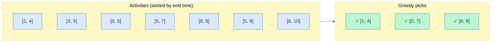

## Why It Exists

Making change for $1.83 from US coins, you reach for the largest coin that fits at each step — quarters, then a nickel, then pennies — eight coins, and it happens to be optimal. That instinct, *always grab the locally-best option and never look back*, is a **greedy algorithm**: the simplest possible strategy, usually a sort plus a single scan.

The catch is that it's only sometimes *correct*. Change `14` from denominations `{1, 7, 10}`: greedy grabs `10`, then four `1`s — five coins — while the optimum is `7 + 7` = two coins. One locally-best choice (`10`) locked out the better future. That's the whole tension of greedy: when the problem has the **greedy-choice property** the code is a 10-liner, but when it doesn't you get a confidently-wrong answer. This lesson teaches the canonical successes, the proof technique that certifies them, and the warning signs that say "use DP instead."

## See It Work

**Activity selection** — pick the most non-overlapping activities. The greedy rule: **sort by *end* time, then take each activity that starts after the last one taken ended.**

```python run viz=array
import ast

def activity_selection(acts):
    acts = sorted(acts, key=lambda a: a[1])     # sort by END time (not start!)
    selected, last_end = [], float('-inf')
    for s, e in acts:
        if s >= last_end:                       # compatible with the last pick?
            selected.append((s, e)); last_end = e
    return selected

acts = ast.literal_eval(input())
result = activity_selection(acts)
print(" ".join(f"({s},{e})" for s, e in result))
```

```java run viz=array
import java.util.*;

public class Main {
    static List<int[]> activitySelection(int[][] acts) {
        Arrays.sort(acts, (a, b) -> a[1] - b[1]);       // sort by END time
        List<int[]> sel = new ArrayList<>(); int lastEnd = Integer.MIN_VALUE;
        for (int[] a : acts) if (a[0] >= lastEnd) { sel.add(a); lastEnd = a[1]; }
        return sel;
    }

    static int[][] parseIntMatrix(String line) {
        line = line.trim();
        if (line.equals("[]")) return new int[0][];
        line = line.substring(1, line.length() - 1).trim();
        List<int[]> rows = new ArrayList<>();
        int depth = 0, start = 0;
        for (int i = 0; i < line.length(); i++) {
            char c = line.charAt(i);
            if (c == '[') { if (depth == 0) start = i; depth++; }
            else if (c == ']') {
                depth--;
                if (depth == 0) {
                    String row = line.substring(start + 1, i).replaceAll("\\s", "");
                    String[] parts = row.split(",");
                    int[] r = new int[parts.length];
                    for (int j = 0; j < parts.length; j++) r[j] = Integer.parseInt(parts[j]);
                    rows.add(r);
                }
            }
        }
        return rows.toArray(new int[0][]);
    }

    public static void main(String[] args) {
        Scanner sc = new Scanner(System.in);
        int[][] acts = parseIntMatrix(sc.nextLine());
        List<int[]> result = activitySelection(acts);
        StringBuilder sb = new StringBuilder();
        for (int[] a : result) {
            if (sb.length() > 0) sb.append(" ");
            sb.append("(").append(a[0]).append(",").append(a[1]).append(")");
        }
        System.out.println(sb.toString());
    }
}
```

```testcases
{
  "args": [
    { "id": "acts", "label": "acts", "type": "int[][]", "placeholder": "[[1,4],[3,5],[0,6],[5,7],[8,9],[5,9],[6,10]]" }
  ],
  "cases": [
    { "args": { "acts": "[[1,4],[3,5],[0,6],[5,7],[8,9],[5,9],[6,10]]" }, "expected": "(1,4) (5,7) (8,9)" },
    { "args": { "acts": "[[1,2],[3,4],[5,6]]" }, "expected": "(1,2) (3,4) (5,6)" },
    { "args": { "acts": "[[1,10],[2,3],[4,5]]" }, "expected": "(2,3) (4,5)" }
  ]
}
```

Both pick `(1,4)`, `(5,7)`, `(8,9)` — three activities, the maximum possible. `O(n log n)`, dominated by the sort.

## How It Works

Greedy is correct **iff** the problem has the **greedy-choice property**: a global optimum can always be reached by making the locally-best first choice. Two clues it holds — there's a natural sort key (end times, weights, ratios) and the task is "pick a subset / schedule / match." Two clues it doesn't — the optimum balances competing goals, or a wrong early choice can't be recovered.



<p align="center"><strong>Pick the activity ending soonest, skip everything overlapping it, repeat — the earliest-ending choice is never wrong.</strong></p>

The proof is the **exchange argument**: take any optimum `OPT`; if it doesn't already contain the greedy first pick `g` (the earliest-ending activity), swap `OPT`'s earliest activity `o` for `g`. Since `g.end ≤ o.end`, everything else in `OPT` is still compatible, so the swapped schedule is just as large — and now contains `g`. Recurse. Any optimum can be transformed into the greedy solution without loss, so greedy *was* optimal. (Variants: "greedy stays ahead" vs "exchange without loss".) The same argument certifies Huffman coding, Kruskal/Prim MST, and Dijkstra — all greedy.

> **Key takeaway.** Greedy = locally-best choice at each step, no backtracking. It's correct only when the **greedy-choice property** holds, proven by an **exchange argument**. The code is short (`O(n log n)` sort + scan); the difficulty is the proof. No proof in sight → suspect greedy is wrong and reach for DP.

## Trace It

Greedy *feels* safe because each step is locally optimal. The coin-change problem shows how a single greedy grab can be globally wrong. Denominations `{1, 7, 10}`, make `14`:

**Predict before you run:** greedy takes the biggest coin ≤ remaining at each step. How many coins does it use, versus the true minimum?

```python run viz=array
def greedy_coins(amount, coins):
    coins = sorted(coins, reverse=True); n, rem = 0, amount
    for c in coins:
        while rem >= c: rem -= c; n += 1        # grab as many of the biggest as fit
    return n

def dp_min_coins(amount, coins):                # true optimum
    INF = float('inf'); dp = [0] + [INF] * amount
    for a in range(1, amount + 1):
        for c in coins:
            if c <= a: dp[a] = min(dp[a], dp[a - c] + 1)
    return dp[amount]

print("greedy  {1,7,10} for 14:", greedy_coins(14, [1, 7, 10]))
print("optimal {1,7,10} for 14:", dp_min_coins(14, [1, 7, 10]))
```

<details>
<summary><strong>Reveal</strong></summary>

Greedy uses **5** coins (`10 + 1 + 1 + 1 + 1`); the optimum is **2** (`7 + 7`). Grabbing the `10` first felt best — it's the biggest single dent in `14` — but it stranded the remaining `4` into four pennies, whereas *avoiding* the `10` entirely opens the `7 + 7` path. Greedy can't see that, because it never reconsiders a choice. US coins happen to be a *canonical* system where greedy is provably optimal; arbitrary denominations are not, and the only fix is dynamic programming, which considers `dp[a-c]` for *every* coin and so explores the `7 + 7` route. The lesson: greedy plausibility is not greedy correctness — construct the exchange-argument proof, or find the counterexample.

</details>

## Your Turn

A greedy that genuinely works: **Minimum Number of Arrows to Burst Balloons** ([LeetCode 452](https://leetcode.com/problems/minimum-number-of-arrows-to-burst-balloons/)). Balloons are intervals; one arrow at position `x` bursts every interval covering `x`. Minimise arrows. Same shape as activity selection — sort by end, fire at each end you can't skip.

```python run viz=array
import ast

def min_arrows(points):
    # Your code goes here — sort by END; fire an arrow whenever the current
    # balloon isn't already burst (start > last arrow position).
    return 0

points = ast.literal_eval(input())
print(min_arrows(points))
```

```java run viz=array
import java.util.*;

public class Main {
    static int minArrows(int[][] pts) {
        // Your code goes here — sort by END; count a new arrow whenever
        // the balloon isn't already burst.
        return 0;
    }

    static int[][] parseIntMatrix(String line) {
        line = line.trim();
        if (line.equals("[]")) return new int[0][];
        line = line.substring(1, line.length() - 1).trim();
        List<int[]> rows = new ArrayList<>();
        int depth = 0, start = 0;
        for (int i = 0; i < line.length(); i++) {
            char c = line.charAt(i);
            if (c == '[') { if (depth == 0) start = i; depth++; }
            else if (c == ']') {
                depth--;
                if (depth == 0) {
                    String row = line.substring(start + 1, i).replaceAll("\\s", "");
                    String[] parts = row.split(",");
                    int[] r = new int[parts.length];
                    for (int j = 0; j < parts.length; j++) r[j] = Integer.parseInt(parts[j]);
                    rows.add(r);
                }
            }
        }
        return rows.toArray(new int[0][]);
    }

    public static void main(String[] args) {
        Scanner sc = new Scanner(System.in);
        int[][] pts = parseIntMatrix(sc.nextLine());
        System.out.println(minArrows(pts));
    }
}
```

```testcases
{
  "args": [
    { "id": "points", "label": "points", "type": "int[][]", "placeholder": "[[10,16],[2,8],[1,6],[7,12]]" }
  ],
  "cases": [
    { "args": { "points": "[[10,16],[2,8],[1,6],[7,12]]" }, "expected": "2" },
    { "args": { "points": "[[1,2],[3,4],[5,6],[7,8]]" }, "expected": "4" },
    { "args": { "points": "[[1,2],[2,3],[3,4],[4,5]]" }, "expected": "2" },
    { "args": { "points": "[[1,10]]" }, "expected": "1" }
  ]
}
```

<details>
<summary>Editorial</summary>

Both print `2` then `4`: two arrows cover the four overlapping balloons; four disjoint balloons need four arrows. The exchange argument is the same as activity selection's — firing at the earliest end is never wrong.

```python solution time=O(n log n) space=O(1)
import ast

def min_arrows(points):
    points.sort(key=lambda p: p[1])             # sort by END
    arrows, last = 0, float('-inf')
    for s, e in points:
        if s > last:                            # this balloon isn't burst yet
            arrows += 1; last = e               # fire at its end
    return arrows

points = ast.literal_eval(input())
print(min_arrows(points))
```

```java solution
import java.util.*;

public class Main {
    static int minArrows(int[][] pts) {
        Arrays.sort(pts, (a, b) -> Integer.compare(a[1], b[1]));   // sort by END
        int arrows = 0; long last = Long.MIN_VALUE;
        for (int[] p : pts) if (p[0] > last) { arrows++; last = p[1]; }
        return arrows;
    }

    static int[][] parseIntMatrix(String line) {
        line = line.trim();
        if (line.equals("[]")) return new int[0][];
        line = line.substring(1, line.length() - 1).trim();
        List<int[]> rows = new ArrayList<>();
        int depth = 0, start = 0;
        for (int i = 0; i < line.length(); i++) {
            char c = line.charAt(i);
            if (c == '[') { if (depth == 0) start = i; depth++; }
            else if (c == ']') {
                depth--;
                if (depth == 0) {
                    String row = line.substring(start + 1, i).replaceAll("\\s", "");
                    String[] parts = row.split(",");
                    int[] r = new int[parts.length];
                    for (int j = 0; j < parts.length; j++) r[j] = Integer.parseInt(parts[j]);
                    rows.add(r);
                }
            }
        }
        return rows.toArray(new int[0][]);
    }

    public static void main(String[] args) {
        Scanner sc = new Scanner(System.in);
        int[][] pts = parseIntMatrix(sc.nextLine());
        System.out.println(minArrows(pts));
    }
}
```

</details>

## Reflect & Connect

- **Greedy is fragile — demand the proof.** A greedy algorithm without a stated exchange argument (or a citation to a known one) is a code smell. Either prove "greedy stays ahead" / "exchange without loss," or find the counterexample.
- **0/1 knapsack is the classic failure.** Greedy by value-per-weight strands capacity; the fix is [dynamic programming](/cortex/data-structures-and-algorithms/algorithms-by-strategy-recursion-pattern-multidimensional-recursion). The *fractional* knapsack (items splittable) *is* greedy-amenable — a small change in the problem flips the verdict.
- **Greedy lives all over graphs.** [Dijkstra](/cortex/data-structures-and-algorithms/graphs/single-source-shortest-path) (closest unvisited vertex) and [Kruskal/Prim MST](/cortex/data-structures-and-algorithms/graphs/minimum-spanning-trees) (cheapest safe edge) are greedy — each proven by an exchange/cut argument.
- **In production:** gzip/JPEG/MP3 entropy-code with Huffman; OS schedulers use Earliest-Deadline-First and Shortest-Job-First; caches greedily evict LRU/LFU; register allocators greedily colour. Greedy is also the go-to *approximation* for NP-hard problems (set cover's greedy gives the best possible `O(log n)` ratio).

## Recall

<details>
<summary><strong>Q:</strong> What is a greedy algorithm, and when is it correct?</summary>

**A:** It makes the locally-best choice at each step with no backtracking. It's correct iff the problem has the greedy-choice property (a global optimum is reachable via locally-best choices) plus optimal substructure.

</details>
<details>
<summary><strong>Q:</strong> The sort key for activity selection — and the common wrong one?</summary>

**A:** Sort by *end* time (earliest-ending compatible activity is always in some optimum). Sorting by start time is the classic wrong answer.

</details>
<details>
<summary><strong>Q:</strong> What is the exchange argument?</summary>

**A:** Take any optimum, swap one of its choices for the corresponding greedy choice, show the result is no worse, and repeat until the optimum becomes the greedy solution — proving greedy was optimal.

</details>
<details>
<summary><strong>Q:</strong> Why does greedy coin-change fail on {1, 7, 10} for 14?</summary>

**A:** Greedy grabs `10` then four `1`s (5 coins); the optimum is `7 + 7` (2). The big first coin strands the remainder. Greedy never reconsiders — DP does, so it finds the `7 + 7` route.

</details>
<details>
<summary><strong>Q:</strong> One famous greedy success and one failure?</summary>

**A:** Success: Huffman coding / MST / Dijkstra (all exchange-argument-proven). Failure: 0/1 knapsack and arbitrary-denomination coin change — use DP. (Fractional knapsack *is* greedy.)

</details>

## Sources & Verify

- **CLRS** (Cormen, Leiserson, Rivest, Stein), *Introduction to Algorithms*, 3rd ed., Ch. 16 — greedy algorithms, the activity-selection proof, the greedy-choice property, and Huffman coding.
- **Kleinberg & Tardos**, *Algorithm Design*, Ch. 4 — interval scheduling, the "greedy stays ahead" and "exchange argument" proof patterns, and MST.
- **Sedgewick & Wayne**, *Algorithms*, 4th ed., §5.5 (Huffman / data compression) and §4.3 (MST as greedy).
- The `[(1,4),(5,7),(8,9)]` selection, the greedy-`5`-vs-optimal-`2` coin change, and the `2`/`4` arrow counts above come from the runnable blocks — re-run to verify.
