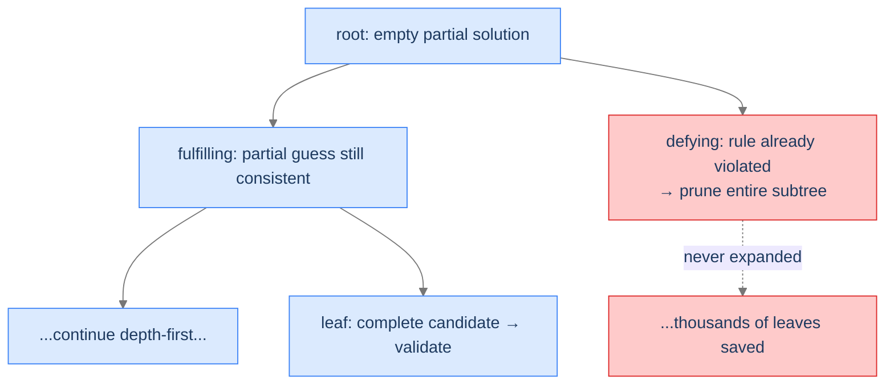

## Why It Exists

You're locked out of your phone and the only way in is to try PINs until one works. With a 4-digit binary PIN that's `2⁴ = 16` candidates — annoying but finite. Now make the "slots" the 64 squares of a chessboard and the goal "place 8 queens so none attack each other": `~281 trillion` placements. You can't list them, but you *can* search them — **systematically, never twice, abandoning whole branches the moment they're proven dead.**

That algorithm is **backtracking**: brute force reshaped as a depth-first walk over a tree of partial decisions, pruning doomed subtrees instead of enumerating a flat list. It applies whenever a problem has three traits — **finite** outcomes, a **validation** check, and **incremental** construction (build a candidate one choice at a time). The payoff: "step back and try the next option" is a *single line of code*, because the recursion's own call stack is the undo buffer.

## See It Work

Generate all permutations of `[1, 2, 3]`. The skeleton is **make a choice → recurse → undo the choice** — the undo (`used[i] = False; path.pop()`) is what frees that element for sibling branches.

```python run viz=array
def permutations(nums):
    res, path, used = [], [], [False] * len(nums)
    def backtrack():
        if len(path) == len(nums):              # leaf: a complete candidate
            res.append(path[:]); return
        for i in range(len(nums)):
            if used[i]: continue                # skip choices already on this path
            used[i] = True; path.append(nums[i])    # MAKE a choice
            backtrack()                              # RECURSE
            used[i] = False; path.pop()              # UNDO (backtrack)
    backtrack()
    return res

perms = permutations([1, 2, 3])
print(perms)
print("count:", len(perms))
```

```java run viz=array
import java.util.*;
public class Main {
    static void backtrack(int[] nums, List<Integer> path, boolean[] used, List<List<Integer>> res) {
        if (path.size() == nums.length) { res.add(new ArrayList<>(path)); return; }  // leaf
        for (int i = 0; i < nums.length; i++) {
            if (used[i]) continue;
            used[i] = true; path.add(nums[i]);            // MAKE a choice
            backtrack(nums, path, used, res);              // RECURSE
            used[i] = false; path.remove(path.size() - 1); // UNDO
        }
    }
    public static void main(String[] args) {
        List<List<Integer>> res = new ArrayList<>();
        backtrack(new int[]{1,2,3}, new ArrayList<>(), new boolean[3], res);
        System.out.println(res);
        System.out.println("count: " + res.size());
    }
}
```

Both produce the 6 permutations and `count: 6`. The search descends to a leaf, records it, then *unwinds* — each returning frame's loop tries its next unused choice.

## How It Works

Every backtracking problem has the same **three components**:

1. **Finite outcomes** — the candidate space is bounded (`n!` permutations, `2ⁿ` subsets, `k^n` PINs), never infinite.
2. **A validation function** — you can check a candidate (or a partial candidate) for validity.
3. **A recursive structure** — make a choice (a function call), remember it (the call stack), step back (return).

Together they trace a **state-space tree**: the root is the empty partial solution, internal nodes are partial guesses, leaves are complete candidates. Backtracking walks it depth-first. The crucial move is **pruning**: if a partial guess already violates the rules ("two queens attack"), the whole subtree below it is dead and is skipped without ever being expanded.



<p align="center"><strong>The state-space tree. Internal nodes are partial guesses; a "defying" node lets the algorithm skip its whole subtree — the pruning that makes backtracking practical.</strong></p>

The "undo" never appears as explicit code in the recursive form — it's the implicit *return*: when a recursive call comes back, the caller's local state is exactly as it was, and its loop moves to the next choice. Cost is bounded by the tree: `O(k^n)` time (number of nodes visited) and `O(n)` stack space (the tree's height). Backtracking doesn't make the search *fast* — it makes it *disciplined*; pruning is what makes it *practical*.

> **Key takeaway.** Backtracking = depth-first walk of a state-space tree with the skeleton **choose → recurse → undo**. Three components gate it: finite outcomes, a validation check, a recursive structure. The call stack is the automatic undo buffer; pruning defying subtrees is where the exponential savings come from.

## Trace It

The undo line looks like cleanup you could skip — the recursion already returns, after all. But the `used`/`path` state is *shared across sibling branches*, so failing to reset it poisons every later choice.

**Predict before you run:** delete the undo (`used[i] = False; path.pop()`) from the permutation generator. How many of the 6 permutations come back?

```python run viz=array
def permutations_noundo(nums):
    res, path, used = [], [], [False] * len(nums)
    def backtrack():
        if len(path) == len(nums):
            res.append(path[:]); return
        for i in range(len(nums)):
            if used[i]: continue
            used[i] = True; path.append(nums[i])    # make a choice
            backtrack()                              # recurse
            # BUG: no undo — used[] and path are never restored
    backtrack()
    return res

perms = permutations_noundo([1, 2, 3])
print(perms)
print("count:", len(perms))
```

<details>
<summary><strong>Reveal</strong></summary>

It returns just **one** permutation, `[[1, 2, 3]]`. The first descent marks `used = [T, T, T]` and builds `path = [1, 2, 3]`, records it, and returns — but nothing is ever un-marked. Every paused parent loop now finds *all* elements `used`, so it can't try a single alternative; `path` also still holds `[1, 2, 3]`, so even reaching a leaf again would record garbage. The undo is the entire point of *back*-tracking: it restores the shared state so a sibling branch starts from a clean slate. (This is the same lesson as the [DFS pattern](/cortex/data-structures-and-algorithms/graphs-pattern-depth-first-search)'s on-path set — backtracking generalises it from "visited nodes" to "the whole partial solution.")

</details>

## Your Turn

**All subsets** of `[1, 2, 3]` — the other canonical enumeration. The choice at each element is binary: *exclude* it or *include* it (then undo the include). `2³ = 8` leaves.

```python run viz=array
def subsets(nums):
    res, path = [], []
    def backtrack(i):
        if i == len(nums):
            res.append(path[:]); return
        backtrack(i + 1)                            # EXCLUDE nums[i]
        path.append(nums[i])                        # INCLUDE nums[i]
        backtrack(i + 1)
        path.pop()                                  # UNDO the include
    backtrack(0)
    return res

s = subsets([1, 2, 3])
print(s)
print("count:", len(s))
```

```java run viz=array
import java.util.*;
public class Main {
    static void sub(int[] nums, int i, List<Integer> path, List<List<Integer>> res) {
        if (i == nums.length) { res.add(new ArrayList<>(path)); return; }
        sub(nums, i + 1, path, res);                       // EXCLUDE
        path.add(nums[i]); sub(nums, i + 1, path, res); path.remove(path.size() - 1);  // INCLUDE + UNDO
    }
    public static void main(String[] args) {
        List<List<Integer>> res = new ArrayList<>();
        sub(new int[]{1,2,3}, 0, new ArrayList<>(), res);
        System.out.println(res);
        System.out.println("count: " + res.size());
    }
}
```

Both list all `8` subsets (from `[]` to `[1,2,3]`) and `count: 8`. Each level is one element's include/exclude decision; the `path.pop()` after the include branch is the same undo discipline as the permutation generator.

## Reflect & Connect

- **Backtracking is the DFS pattern, generalised.** The [DFS pattern](/cortex/data-structures-and-algorithms/graphs-pattern-depth-first-search) tracked an on-path set and undid it on exit; backtracking builds an entire *partial solution* and undoes it the same way. Same call-stack-as-undo-buffer mechanic, richer state.
- **Three sub-patterns ahead, by how aggressively they prune.** *Unconditional enumeration* (subsets, permutations — validate only at leaves, no pruning); *conditional enumeration* (generate-parentheses, valid IPs — prune partial guesses that already break a rule); *backtracking search* (N-Queens, sudoku, mazes — mutate a board during descent, undo on failure). The 8-queens hook lives in the last one, and pruning is what shrinks its `281 trillion` to something solvable in milliseconds.
- **Exponential by nature.** The state-space tree is usually `O(k^n)`; backtracking only beats brute force by *pruning*, not by changing the asymptotic worst case. When subproblems *overlap* (not just branch), add memoisation and you've crossed into [dynamic programming](/cortex/data-structures-and-algorithms/algorithms-by-strategy-recursion-pattern-multidimensional-recursion).
- **Draw the tree first.** Tree size = work done; pruned subtrees = work avoided. Sketching the state-space tree (its height, branching factor, where rules fail) settles the design before you write a line.

## Recall

<details>
<summary><strong>Q:</strong> What three traits must a problem have for backtracking to apply?</summary>

**A:** Finite outcomes (bounded candidate space), a validation function (check a candidate or partial candidate), and incremental construction (build a candidate one choice at a time, extendable or abandonable).

</details>
<details>
<summary><strong>Q:</strong> What is the backtracking skeleton?</summary>

**A:** Make a choice → recurse → undo the choice. The undo restores shared state so sibling branches start clean; in the recursive form it's the implicit return plus an explicit reset (`pop`, un-mark).

</details>
<details>
<summary><strong>Q:</strong> Why does dropping the undo break the permutation generator?</summary>

**A:** `used`/`path` are shared across branches. Without resetting them, every paused parent loop sees all choices consumed and can't try alternatives — so only the first full path is produced.

</details>
<details>
<summary><strong>Q:</strong> What is the state-space tree, and what is pruning?</summary>

**A:** A tree whose root is the empty partial solution, internal nodes are partial guesses, leaves are complete candidates. Pruning skips the entire subtree below a "defying" node (one that already violates the rules) — the source of backtracking's speedups.

</details>
<details>
<summary><strong>Q:</strong> Time and space cost?</summary>

**A:** `O(k^n)` time (nodes visited in the worst case) and `O(n)` stack space (tree height). Pruning lowers the practical time but not the asymptotic worst case.

</details>

## Sources & Verify

- **CLRS** (Cormen, Leiserson, Rivest, Stein), *Introduction to Algorithms*, 3rd ed. — backtracking framed via recursion and state-space search (and §34 for the NP-hard problems it attacks).
- **Skiena**, *The Algorithm Design Manual*, 3rd ed., §9.1–9.2 — backtracking, the general recursive template, pruning, and N-Queens / combinatorial search.
- **Sedgewick & Wayne**, *Algorithms*, 4th ed. — recursion and exhaustive search; the call-stack-as-undo mechanic.
- The 6-permutation list, the no-undo single result, and the 8 subsets above come from the runnable blocks — re-run to verify.
