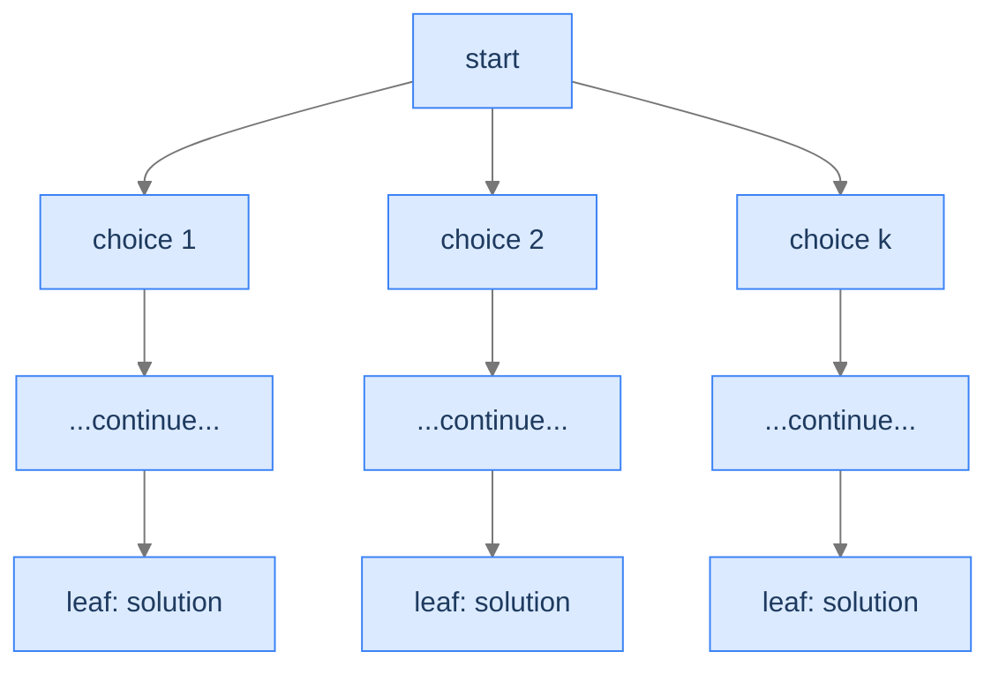

## Why It Exists

Some backtracking problems have **no bad leaves**: every complete candidate the tree can produce *is* a valid answer. List all subsets of a set, all length-`n` sequences over an alphabet, all letter combinations of a phone number — there's nothing to reject and nothing to prune. This is **unconditional enumeration**, the simplest backtracking pattern: walk the whole state-space tree and record every leaf.

It's the phone-PIN problem from the [backtracking intro](/cortex/data-structures-and-algorithms/algorithms-by-strategy/backtracking/introduction-to-backtracking), generalised. The only thing that varies between problems is the *shape of the choices* — include-or-exclude per element (subsets), a value `1..k` per slot (sequences), a letter per digit (phone). The skeleton — choose → recurse → undo, record at the leaf — never changes.



<p align="center"><strong>No pruning, no rejection — every leaf counts. The runtime is exactly the full tree size.</strong></p>

## See It Work

Generate every length-`n` sequence over the alphabet `1..k`. Leaf check records a *copy*; the loop extends, recurses, and undoes.

```python run viz=array
def enumerate_all(n, k):
    results, state = [], []
    def helper():
        if len(state) == n:                  # leaf: every complete state is a solution
            results.append(state.copy())     # COPY — the caller keeps mutating `state`
            return
        for choice in range(1, k + 1):
            state.append(choice)             # extend
            helper()                         # recurse
            state.pop()                      # undo
    helper()
    return results

n = int(input())     # the test case's n
k = int(input())     # the test case's k
print(enumerate_all(n, k))
```

```java run viz=array
import java.util.*;
public class Main {
    static void helper(int n, int k, List<Integer> state, List<List<Integer>> res) {
        if (state.size() == n) { res.add(new ArrayList<>(state)); return; }   // copy
        for (int c = 1; c <= k; c++) {
            state.add(c);                              // extend
            helper(n, k, state, res);                  // recurse
            state.remove(state.size() - 1);            // undo
        }
    }
    public static void main(String[] args) {
        Scanner sc = new Scanner(System.in);
        int n = Integer.parseInt(sc.nextLine().trim());
        int k = Integer.parseInt(sc.nextLine().trim());
        List<List<Integer>> res = new ArrayList<>();
        helper(n, k, new ArrayList<>(), res);
        System.out.println(res);
    }
}
```

```testcases
{
  "args": [
    { "id": "n", "label": "n", "type": "int", "placeholder": "2" },
    { "id": "k", "label": "k", "type": "int", "placeholder": "2" }
  ],
  "cases": [
    { "args": { "n": "2", "k": "2" }, "expected": "[[1, 1], [1, 2], [2, 1], [2, 2]]" },
    { "args": { "n": "2", "k": "3" }, "expected": "[[1, 1], [1, 2], [1, 3], [2, 1], [2, 2], [2, 3], [3, 1], [3, 2], [3, 3]]" },
    { "args": { "n": "3", "k": "2" }, "expected": "[[1, 1, 1], [1, 1, 2], [1, 2, 1], [1, 2, 2], [2, 1, 1], [2, 1, 2], [2, 2, 1], [2, 2, 2]]" },
    { "args": { "n": "1", "k": "3" }, "expected": "[[1], [2], [3]]" }
  ]
}
```

Both print `[[1, 1], [1, 2], [2, 1], [2, 2]]` — all `2² = 4` sequences. Depth 2 (one slot per level), branching factor 2 (one child per choice), 4 leaves, all recorded.

## How It Works

The recipe is three lines: leaf check, loop over choices, recurse-with-undo.

```
function enumerate(state):
    if state is complete: record(state); return   # every leaf is a solution
    for choice in available_choices(state):
        extend(state, choice); enumerate(state); undo(state)
```

The four problems in this pattern differ only in how they fill *complete*, *available_choices*, *extend*, and *undo*. For `n` slots with `k` choices each, the tree has `k^n` leaves and depth `n` — so the recursion is `O(n)` deep but the work is `O(k^n)`: deepening by one slot *multiplies* the work. The cost is unavoidable because the output *is* every leaf — the algorithm is "as fast as listing the answer can possibly be."

Three diagnostics confirm the pattern: **Q1** — is *every* complete candidate valid (no leaf filter)? **Q2** — is the candidate built one decision per slot (tree depth = number of slots)? **Q3** — is the branching factor per slot fixed or input-bounded? All "yes" → unconditional enumeration. (If *some* leaves are invalid, you need the next pattern, [conditional enumeration](/cortex/data-structures-and-algorithms/algorithms-by-strategy-backtracking-pattern-conditional-enumeration), which prunes.)

| Resource | Cost |
|---|---|
| **Time** | `O(n · k^n)` — `k^n` leaves × `O(n)` to copy each into the output |
| **Output space** | `O(n · k^n)` — the leaves themselves dominate |
| **Stack space** | `O(n)` — recursion depth = number of slots |

> **Key takeaway.** Unconditional enumeration walks the *full* state-space tree and records every leaf — no validation, no pruning. The skeleton is leaf-check → for-each-choice → extend/recurse/undo. Cost `O(n · k^n)`, bounded below by the output size. Record a **copy** of the leaf, never the live mutable state.

## Trace It

That `state.copy()` at the leaf looks like a harmless habit — surely appending `state` directly would save an allocation? But the recursion *shares one mutable `state`* across the whole walk.

**Predict before you run:** replace `results.append(state.copy())` with `results.append(state)`. What does `enumerate_all(2, 2)` return?

```python run viz=array
def enumerate_buggy(n, k):
    results, state = [], []
    def helper():
        if len(state) == n:
            results.append(state)            # BUG: append the live reference, not a copy
            return
        for choice in range(1, k + 1):
            state.append(choice); helper(); state.pop()
    helper()
    return results

print(enumerate_buggy(2, 2))
```

<details>
<summary><strong>Reveal</strong></summary>

It returns `[[], [], [], []]` — four references to the *same* list, all empty. Every leaf appended the identical `state` object, and by the time the function returns, the undos (`state.pop()`) have emptied it back to `[]`. So `results` holds four aliases of one list that now reads `[]`. The fix is to snapshot the leaf with `state.copy()` (Python) / `new ArrayList<>(state)` (Java) so each recorded answer is an independent object frozen at that moment. This is *the* classic backtracking bug: the shared mutable state that makes the choose/recurse/undo skeleton efficient is exactly what you must copy out of when you record a result. (By-value styles dodge it — each frame owns its copy — at the cost of `O(n)` per call.)

</details>

## Your Turn

**Letter Combinations of a Phone Number** ([LeetCode 17](https://leetcode.com/problems/letter-combinations-of-a-phone-number/)) — each digit maps to a set of letters (2→abc, 3→def, …); enumerate every combination. One slot per digit, a different choice set per slot (Q3's varying-but-bounded branching).

```python run viz=array
def letter_combinations(digits):
    if not digits: return []
    pad = {'2':"abc", '3':"def", '4':"ghi", '5':"jkl", '6':"mno", '7':"pqrs", '8':"tuv", '9':"wxyz"}
    res, path = [], []
    def backtrack(i):
        if i == len(digits):
            res.append("".join(path)); return       # leaf: every combination is valid
        for ch in pad[digits[i]]:
            path.append(ch); backtrack(i + 1); path.pop()   # extend / recurse / undo
    backtrack(0)
    return res

# Your code goes here — replace the call with your own implementation
digits = input().strip()     # the test case's digits
r = letter_combinations(digits)
print("[" + ", ".join(r) + "]")
print("count:", len(r))
```

```java run viz=array
import java.util.*;
public class Main {
    static String[] pad = {"","","abc","def","ghi","jkl","mno","pqrs","tuv","wxyz"};
    static void backtrack(String digits, int i, StringBuilder path, List<String> res) {
        if (i == digits.length()) { res.add(path.toString()); return; }
        for (char ch : pad[digits.charAt(i) - '0'].toCharArray()) {
            path.append(ch); backtrack(digits, i + 1, path, res); path.deleteCharAt(path.length() - 1);
        }
    }
    static List<String> letterCombinations(String digits) {
        List<String> res = new ArrayList<>();
        if (digits.isEmpty()) return res;
        backtrack(digits, 0, new StringBuilder(), res);
        return res;
    }
    public static void main(String[] args) {
        String digits = new Scanner(System.in).nextLine().trim();
        List<String> r = letterCombinations(digits);
        System.out.println(r);
        System.out.println("count: " + r.size());
    }
}
```

```testcases
{
  "args": [
    { "id": "digits", "label": "digits", "type": "string", "placeholder": "23" }
  ],
  "cases": [
    { "args": { "digits": "23" }, "expected": "[ad, ae, af, bd, be, bf, cd, ce, cf]\ncount: 9" },
    { "args": { "digits": "2" }, "expected": "[a, b, c]\ncount: 3" },
    { "args": { "digits": "9" }, "expected": "[w, x, y, z]\ncount: 4" },
    { "args": { "digits": "46" }, "expected": "[gm, gn, go, hm, hn, ho, im, in, io]\ncount: 9" }
  ]
}
```

Both list `ad ae af bd be bf cd ce cf` and `count: 9` (3 letters × 3 letters). Every leaf is a valid combination — no filtering — so it's pure unconditional enumeration with a per-slot alphabet. The four problems in this section's **Problems** folder vary the choice shape: subsets (include/exclude), case transformations (skip-or-toggle), number sequences (1..k), phone combinations (per-digit letters).

## Reflect & Connect

- **It's the no-pruning end of the backtracking spectrum.** Here every leaf is recorded. [Conditional enumeration](/cortex/data-structures-and-algorithms/algorithms-by-strategy-backtracking-pattern-conditional-enumeration) prunes partial guesses that break a rule; backtracking search mutates a board and undoes on failure. Same skeleton, increasing discipline.
- **Copy on record — always.** The shared mutable `state` is what makes choose/recurse/undo cheap, and exactly what corrupts your output if you store the reference. Snapshot at the leaf.
- **Output bounds the runtime.** You can't enumerate `k^n` answers faster than `O(k^n)`; the pattern is optimal *for the task of listing them all*. If you only need a *count* or a single example, a formula or early-exit beats enumeration.
- **The choice shape is the only knob.** Include/exclude → subsets; `1..k` per slot → sequences; per-slot alphabet → phone combinations. Recognise "list every X built one decision at a time, all valid" and the three-line template drops in.

## Recall

<details>
<summary><strong>Q:</strong> What makes a backtracking problem "unconditional enumeration"?</summary>

**A:** Every leaf of the state-space tree is a valid solution — no leaf filter and no internal pruning. The algorithm records every candidate the tree produces.

</details>
<details>
<summary><strong>Q:</strong> The three-line skeleton?</summary>

**A:** Leaf check (record a copy, return); for-each available choice: extend the state, recurse, undo. The undo restores the shared state for the next sibling choice.

</details>
<details>
<summary><strong>Q:</strong> Why must you record a *copy* of the state at the leaf?</summary>

**A:** The recursion shares one mutable `state`; appending the live reference stores an alias that the undos later empty/mutate. Copying snapshots the answer at that moment (`state.copy()` / `new ArrayList<>(state)`).

</details>
<details>
<summary><strong>Q:</strong> Leaves and depth for `n` slots with `k` choices each?</summary>

**A:** `k^n` leaves, recursion depth `n`. Work is `O(n · k^n)` (copying each leaf); stack is `O(n)`.

</details>
<details>
<summary><strong>Q:</strong> When is this *not* the right pattern?</summary>

**A:** When some complete candidates are invalid (filter/prune → conditional enumeration), or when the search builds and mutates a structure validated during descent (→ backtracking search). And when you only need a count or one example, not the full list.

</details>

## Sources & Verify

- **Skiena**, *The Algorithm Design Manual*, 3rd ed., §9.1 — the general backtracking template and "constructing all subsets / permutations" as exhaustive enumeration.
- **CLRS** (Cormen, Leiserson, Rivest, Stein), *Introduction to Algorithms*, 3rd ed. — recursion and combinatorial generation underpinning enumeration.
- **LeetCode** 78 (Subsets) and 17 (Letter Combinations) are the canonical unconditional-enumeration drills; the `[[1,1],[1,2],[2,1],[2,2]]`, the empty-aliases bug, and the 9-combination output above come from the runnable blocks — re-run to verify.
