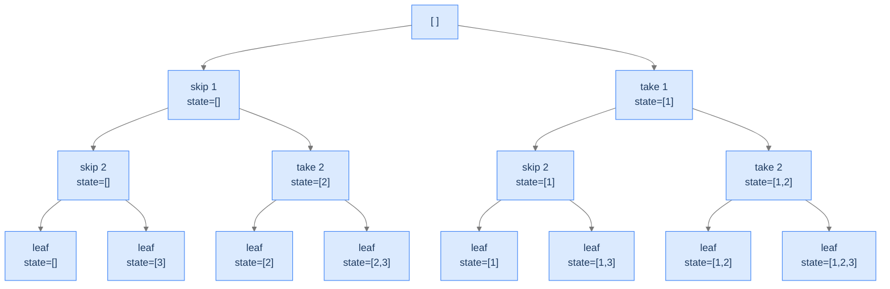

# Unique Subsets

The textbook subsets problem. Each element of the input array becomes one slot in the state space tree; each slot has exactly two choices: include or exclude.

---

## The Problem

Given an integer array `arr` containing **unique** elements, return all possible subsets (the power set). The result must not contain duplicates. Subsets can be returned in any order.

```
Input:  arr = [1, 2, 3]
Output: [[], [1], [2], [1,2], [3], [1,3], [2,3], [1,2,3]]

Input:  arr = [1]
Output: [[], [1]]

Input:  arr = []
Output: [[]]
```

---

## Examples

**Example 1**
```
Input:  arr = [1, 2, 3]
Output: [[1, 2, 3], [1, 2], [1, 3], [1], [2, 3], [2], [3], []]
Explanation: All 2³ = 8 subsets, in the order the backtracking visits them.
```

**Example 2**
```
Input:  arr = []
Output: [[]]
Explanation: The empty set has exactly one subset — itself.
```

```quiz
{
  "prompt": "How many subsets does an array of n unique elements have?",
  "options": ["n", "2n", "n²", "2ⁿ"],
  "answer": "2ⁿ"
}
```

## Constraints

- `0 ≤ arr.length ≤ 20`
- All elements are unique.
- The result is the power set; subsets may be returned in any order (these tests use the order the backtracking discovers them — include-first).

```python run viz=graph viz-root=arr
import ast
from typing import List

class Solution:
    def unique_subsets(self, arr: List[int]) -> List[List[int]]:
        # Your code goes here — backtrack over each index with two choices
        # (include arr[index] or skip it); record a copy of the current
        # subset when every element has been decided.
        return []

arr = ast.literal_eval(input())     # the test case's arr
print(Solution().unique_subsets(arr))
```

```java run viz=graph viz-root=arr
import java.util.*;

public class Main {
    static class Solution {
        public List<List<Integer>> uniqueSubsets(int[] arr) {
            // Your code goes here — backtrack over each index with two choices
            // (include arr[index] or skip it); record a copy of the current
            // subset when every element has been decided.
            return new ArrayList<>();
        }
    }

    public static void main(String[] args) {
        int[] arr = parseIntArray(new Scanner(System.in).nextLine());
        System.out.println(new Solution().uniqueSubsets(arr));
    }

    // "[1, 2, 3]" → {1, 2, 3} — reads the test case's arr
    static int[] parseIntArray(String line) {
        String inner = line.replaceAll("[\\[\\]\\s]", "");
        if (inner.isEmpty()) return new int[0];
        String[] parts = inner.split(",");
        int[] out = new int[parts.length];
        for (int i = 0; i < parts.length; i++) out[i] = Integer.parseInt(parts[i]);
        return out;
    }
}
```

```testcases
{
  "args": [
    { "id": "arr", "label": "arr", "type": "int[]", "placeholder": "[1, 2, 3]" }
  ],
  "cases": [
    { "args": { "arr": "[1, 2, 3]" }, "expected": "[[1, 2, 3], [1, 2], [1, 3], [1], [2, 3], [2], [3], []]" },
    { "args": { "arr": "[1]" }, "expected": "[[1], []]" },
    { "args": { "arr": "[]" }, "expected": "[[]]" },
    { "args": { "arr": "[5, 10]" }, "expected": "[[5, 10], [5], [10], []]" },
    { "args": { "arr": "[1, 2, 3, 4]" }, "expected": "[[1, 2, 3, 4], [1, 2, 3], [1, 2, 4], [1, 2], [1, 3, 4], [1, 3], [1, 4], [1], [2, 3, 4], [2, 3], [2, 4], [2], [3, 4], [3], [4], []]" }
  ]
}
```

<details>
<summary><h2>What Does "Power Set" Mean Recursively?</h2></summary>


For each element of `arr`, you have two choices: **include it in the current subset, or exclude it.** Make this decision once per element, and you've fully specified one subset. There are `n` decisions and `2^n` outcomes — the power set.



<p align="center"><strong>State space tree for subsets of <code>[1, 2, 3]</code>. Depth = 3, leaves = 8 = 2³, every leaf is a valid subset.</strong></p>

</details>
<details>
<summary><h2>Applying the Diagnostic Questions</h2></summary>


| # | Check | Answer |
|---|---|---|
| **Q1** | Every leaf a solution? | **Yes** — every subset (including empty) is a valid output. |
| **Q2** | One decision per slot? | **Yes** — one decision per element: include or exclude. |
| **Q3** | Fixed branching factor? | **Yes** — `k = 2` per slot. |

### Q1 — Why "every subset is valid"?

The power set is *defined* as the set of all subsets, including `{}` and the full input. There's no rule that disqualifies any one of them. ✓

### Q2 — Why "one decision per element"?

The recipe for a subset is a sequence of `n` independent yes/no decisions, one per element. The state space tree's depth equals `n`. ✓

### Q3 — Why "branching factor 2"?

Every element has exactly two choices: include or exclude. The tree is binary. ✓

</details>
<details>
<summary><h2>The Include-or-Exclude Strategy (Visualised)</h2></summary>


We process elements left-to-right. At each element, the state space splits into two branches. The current "partial subset" lives in a shared mutable list; we push when including, pop when undoing.

<div class="d2-slides" data-caption="Each frame either includes the current element (extend, recurse, then pop to undo) or skips it (just recurse).">

```d2
state: "Start at index 0, current = []" {
  arr: "arr = [1, 2, 3]"
  cur: "current = []" {style.fill: "#dbeafe"; style.stroke: "#3b82f6"}
}
```

```d2
state: "Include 1 — current = [1], recurse on index 1" {
  cur: "current = [1]" {style.fill: "#fde68a"; style.stroke: "#d97706"}
}
```

```d2
state: "Include 2 — current = [1, 2], recurse on index 2" {
  cur: "current = [1, 2]" {style.fill: "#bbf7d0"; style.stroke: "#16a34a"}
}
```

```d2
state: "Include 3 — current = [1, 2, 3] = LEAF, record and return" {
  cur: "current = [1, 2, 3]" {style.fill: "#ede9fe"; style.stroke: "#7c3aed"}
}
```

```d2
state: "Backtrack: pop 3 → current = [1, 2], skip 3, leaf [1, 2]" {
  cur: "current = [1, 2]" {style.fill: "#bbf7d0"; style.stroke: "#16a34a"}
}
```

```d2
state: "...backtrack further, eventually visit all 8 leaves" {
  result: "subsets = [[], [3], [2], [2,3], [1], [1,3], [1,2], [1,2,3]]" {style.fill: "#fde68a"; style.stroke: "#d97706"}
}
```

</div>

</details>
<details>
<summary><h2>Solution &amp; Analysis</h2></summary>

### The Solution

Both languages iterate the two choices in the **same fixed order — include first, then skip** — so the backtracking visits the leaves in an identical sequence and the raw `[[…], …]` output is byte-for-byte the same in Python and Java. No sorting is needed (and adding a per-language sort would *break* parity: Python sorts lists element-wise while Java's `toString` sort orders them differently).

```python solution time=O(n · 2^n) space=O(n)
import ast
from typing import List

class Solution:
    def generate_subsets(
        self,
        arr: List[int],
        index: int,
        current_subset: List[int],
        subsets: List[List[int]],
    ) -> None:

        # If all elements have been considered (solution state)
        if index == len(arr):

            # Every state is a valid subset -> add directly
            subsets.append(current_subset.copy())

            # Return to explore other possibilities
            return

        # Choices for each element:
        # 1. true -> Include the current element in subset
        # 2. false -> Do not include the current element in subset
        for include_current in (True, False):

            # Include the current element in the subset
            if include_current:

                # Include the current element in the subset (make a
                # choice)
                current_subset.append(arr[index])

                # Recur for the next index in the array including the current
                # element
                self.generate_subsets(
                    arr, index + 1, current_subset, subsets
                )

                # Backtrack by removing the last element (revert the
                # choice)
                current_subset.pop()

            # Do not include the current element in the subset
            else:

                # Recur for the next index in the array without including
                # the current element
                self.generate_subsets(
                    arr, index + 1, current_subset, subsets
                )

    def unique_subsets(self, arr: List[int]) -> List[List[int]]:

        # List to store the subsets
        subsets: List[List[int]] = []

        # Temporary list to store the current subset
        current_subset: List[int] = []

        # Start backtracking from index 0
        self.generate_subsets(arr, 0, current_subset, subsets)

        # Return the list containing all subsets
        return subsets


arr = ast.literal_eval(input())     # the test case's arr
print(Solution().unique_subsets(arr))
```

```java solution
import java.util.*;

public class Main {
    static class Solution {
        public void generateSubsets(
            int[] arr,
            int index,
            List<Integer> currentSubset,
            List<List<Integer>> subsets
        ) {

            // If all elements have been considered (solution state)
            if (index == arr.length) {

                // Every state is a valid subset -> add directly
                subsets.add(new ArrayList<>(currentSubset));

                // Return to explore other possibilities
                return;
            }

            // Choices for each element:
            // 1. true -> Include the current element in subset
            // 2. false -> Do not include the current element in subset
            for (boolean includeCurrent : new boolean[] { true, false }) {

                // Include the current element in the subset
                if (includeCurrent) {

                    // Include the current element in the subset (make a
                    // choice)
                    currentSubset.add(arr[index]);

                    // Recur for the next index in the array including the
                    // current element
                    generateSubsets(arr, index + 1, currentSubset, subsets);

                    // Backtrack by removing the last element (revert the
                    // choice)
                    currentSubset.remove(currentSubset.size() - 1);
                }

                // Do not include the current element in the subset
                else {

                    // Recur for the next index in the array without
                    // including the current element
                    generateSubsets(arr, index + 1, currentSubset, subsets);
                }
            }
        }

        public List<List<Integer>> uniqueSubsets(int[] arr) {

            // List to store the subsets
            List<List<Integer>> subsets = new ArrayList<>();

            // Temporary list to store the current subset
            List<Integer> currentSubset = new ArrayList<>();

            // Start backtracking from index 0
            generateSubsets(arr, 0, currentSubset, subsets);

            // Return the list containing all subsets
            return subsets;
        }
    }

    public static void main(String[] args) {
        int[] arr = parseIntArray(new Scanner(System.in).nextLine());
        System.out.println(new Solution().uniqueSubsets(arr));
    }

    static int[] parseIntArray(String line) {
        String inner = line.replaceAll("[\\[\\]\\s]", "");
        if (inner.isEmpty()) return new int[0];
        String[] parts = inner.split(",");
        int[] out = new int[parts.length];
        for (int i = 0; i < parts.length; i++) out[i] = Integer.parseInt(parts[i]);
        return out;
    }
}
```


<details>
<summary><strong>Trace — arr = [1, 2, 3]</strong></summary>

```
helper(0, [])
├─ include 1 → helper(1, [1])
│  ├─ include 2 → helper(2, [1,2])
│  │  ├─ include 3 → helper(3, [1,2,3]) → leaf → results = [[1,2,3]]
│  │  ├─ undo (pop 3)
│  │  └─ skip 3 → helper(3, [1,2]) → leaf → results = [[1,2,3], [1,2]]
│  ├─ undo (pop 2)
│  └─ skip 2 → helper(2, [1])
│     ├─ include 3 → helper(3, [1,3]) → leaf → results = [..., [1,3]]
│     ├─ undo (pop 3)
│     └─ skip 3 → helper(3, [1]) → leaf → results = [..., [1]]
├─ undo (pop 1)
└─ skip 1 → helper(1, [])
   ├─ include 2 → ... (mirror of above without the 1)
   └─ ...

Final results: [[1,2,3], [1,2], [1,3], [1], [2,3], [2], [3], []]
(8 leaves, in DFS order)
```

</details>

### Complexity Analysis

| Resource | Cost | Why |
|---|---|---|
| **Time** | `O(n · 2^n)` | `2^n` subsets × `O(n)` to copy each into the output. |
| **Space (output)** | `O(n · 2^n)` | Total size of all subsets summed. |
| **Space (stack)** | `O(n)` | Recursion depth equals input length. |

The output dominates; you can never be faster than this.

### Edge Cases

| Case | Example | Expected | Reasoning |
|---|---|---|---|
| Empty input | `arr = []` | `[[]]` | Only the empty subset; tree has just the root. |
| Single element | `arr = [5]` | `[[], [5]]` | Two leaves. |
| Duplicates in input | `arr = [1, 1]` (problem says unique, but…) | algorithm produces `[[], [1], [1], [1,1]]` — has dupes | The problem statement guarantees unique elements; if not, we'd need to dedupe (a different problem variant). |
| Larger input | `arr = [1..20]` | 2²⁰ ≈ 1M subsets | Output size is the bottleneck. |

</details>
<details>
<summary><h2>Key Takeaway</h2></summary>


Unique Subsets is the canonical 2-choice unconditional enumeration: include-or-exclude, depth equals input length, every leaf valid. The next problem applies the same shape but with a *conditional* choice: only some slots have two choices; others are forced.

</details>
