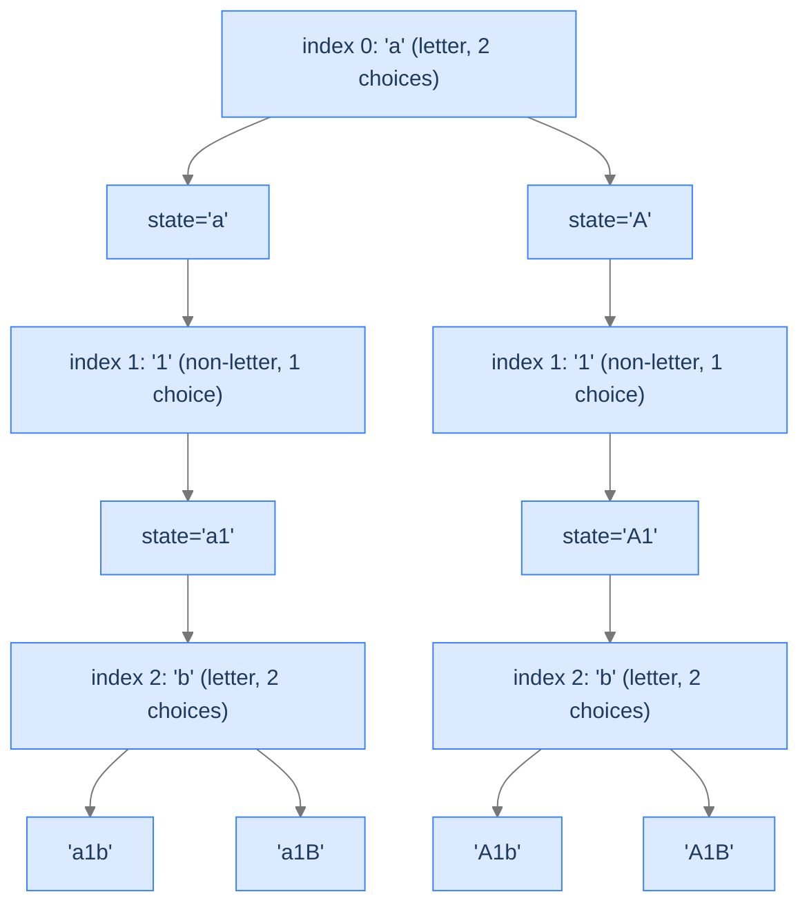

# Case Transformations

The branching factor varies per slot. Letters have 2 choices (toggle or keep); non-letters have 1 choice (keep). Same recipe; different choice generation.

---

## The Problem

Given a string `s`, return every possible string formed by transforming each *letter* (alphabetic character) to either lowercase or uppercase. Non-letters stay as-is. Output may be in any order.

```
Input:  s = "a1b2"
Output: ["a1b2", "a1B2", "A1b2", "A1B2"]

Input:  s = "3z4"
Output: ["3Z4", "3z4"]

Input:  s = "a"
Output: ["a", "A"]
```

---

## Examples

**Example 1**
```
Input:  s = "a1b2"
Output: [A1B2, A1b2, a1B2, a1b2]
Explanation: Two letters (a, b) each have 2 choices → 2² = 4 results; the digit 1 is forced.
```

**Example 2**
```
Input:  s = "3z4"
Output: [3Z4, 3z4]
Explanation: One letter (z) has 2 choices; the digits are forced → 2¹ = 2 results.
```

```quiz
{
  "prompt": "How many outputs does case_transformations produce for a string with L letters and D digits?",
  "options": ["2^(L+D)", "2^L", "2^D", "L × D"],
  "answer": "2^L"
}
```

## Constraints

- `1 ≤ s.length ≤ 12`
- `s` consists of lower-case English letters, upper-case English letters, and digits.
- No empty-string test case (avoids stdin EOF crash).

```python run viz=graph viz-root=transformations
from typing import List

class Solution:
    def case_transformations(self, s: str) -> List[str]:
        # Your code goes here — backtrack over each character:
        # if it's a letter, two choices (toggle or keep); otherwise one choice (keep).
        # Record a joined string at the leaf.
        return []

s = input().strip()     # the test case's s
r = Solution().case_transformations(s)
print("[" + ", ".join(r) + "]")
```

```java run viz=graph viz-root=transformations
import java.util.*;

public class Main {
    static class Solution {
        public List<String> caseTransformations(String s) {
            // Your code goes here — backtrack over each character:
            // if it's a letter, two choices (toggle or keep); otherwise one choice (keep).
            // Record the joined string at the leaf.
            return new ArrayList<>();
        }
    }

    public static void main(String[] args) {
        String s = new Scanner(System.in).nextLine().trim();
        System.out.println(new Solution().caseTransformations(s));
    }
}
```

```testcases
{
  "args": [
    { "id": "s", "label": "s", "type": "string", "placeholder": "a1b2" }
  ],
  "cases": [
    { "args": { "s": "a1b2" }, "expected": "[A1B2, A1b2, a1B2, a1b2]" },
    { "args": { "s": "3z4" }, "expected": "[3Z4, 3z4]" },
    { "args": { "s": "a" }, "expected": "[A, a]" },
    { "args": { "s": "1" }, "expected": "[1]" },
    { "args": { "s": "ab" }, "expected": "[AB, Ab, aB, ab]" }
  ]
}
```

<details>
<summary><h2>What's Different About This Problem?</h2></summary>


The branching factor depends on the slot. For a letter, you have two choices: leave it as-is or toggle the case. For a non-letter (digit, symbol), you have one choice: leave it as-is. The state space tree is *non-uniform* but the recipe is identical:



<p align="center"><strong>Tree for <code>s = "a1b2"</code> (showing only first 3 chars). Letter slots branch 2-way; digit slots branch 1-way. The non-uniform tree still produces a clean enumeration.</strong></p>

</details>
<details>
<summary><h2>Applying the Diagnostic Questions</h2></summary>


| # | Check | Answer |
|---|---|---|
| **Q1** | Every leaf a solution? | **Yes** — every case-toggle combination is a valid output. |
| **Q2** | One decision per slot? | **Yes** — one decision per character. |
| **Q3** | Fixed (or bounded) branching factor? | **Yes** — 1 for non-letters, 2 for letters; bounded. |

### Q1 — Why "every leaf valid"?

The output is defined as "every possible case combination" — none are excluded. ✓

### Q2 — Why "one decision per character"?

Each character is processed independently. ✓

### Q3 — Why "branching bounded"?

Per-slot branching is either 1 or 2 — bounded by 2. The tree is finite and walkable. ✓

</details>
<details>
<summary><h2>Solution &amp; Analysis</h2></summary>

### The Solution

```python solution time=O(n · 2^L) space=O(n)
from typing import List

class Solution:
    def toggle_case(self, c: str) -> str:

        # If the character is in lowercase, return the uppercase version
        if c.islower():
            return c.upper()

        # Otherwise, if the character is in uppercase, return the
        # lowercase version
        else:
            return c.lower()

    def generate_transformations(
        self,
        s: str,
        index: int,
        current_transformation: List[str],
        transformations: List[str],
    ) -> None:

        # If index reaches the end of the string, store the current
        # transformation (solution state)
        if index == len(s):

            # Add the current transformation to the result
            transformations.append("".join(current_transformation))

            # Return to continue exploring other possibilities
            return

        # Choices for each element:
        # 1. true -> Toggle the case of the current character
        # 2. false -> Do not toggle the case of the current character
        for toggle_current in (True, False):

            # Toggle the case of the current character if it is an
            # alphabet
            if toggle_current and s[index].isalpha():

                # Make choice: toggle the case and append to
                # currentTransformation
                current_transformation.append(self.toggle_case(s[index]))

                # Recur with next index
                self.generate_transformations(
                    s, index + 1, current_transformation, transformations
                )

                # Unmake choice: remove the last character
                current_transformation.pop()

            elif not toggle_current:

                # Make choice: keep original character
                current_transformation.append(s[index])

                # Recur with next index
                self.generate_transformations(
                    s, index + 1, current_transformation, transformations
                )

                # Unmake choice: remove the last character
                current_transformation.pop()

    def case_transformations(self, s: str) -> List[str]:

        # List to store the transformations
        transformations: List[str] = []

        # Working string for backtracking
        current_transformation: List[str] = []

        # Start the unconditional enumeration process from index 0
        self.generate_transformations(
            s, 0, current_transformation, transformations
        )

        # Return the list containing all transformations
        return transformations


s = input().strip()     # the test case's s
r = Solution().case_transformations(s)
print("[" + ", ".join(r) + "]")
```

```java solution
import java.util.*;

public class Main {
    static class Solution {
        private char toggleCase(char c) {

            // If the character is in lowercase, return the uppercase version
            if (Character.isLowerCase(c)) {
                return Character.toUpperCase(c);
            }

            // Otherwise, if the character is in uppercase, return the
            // lowercase version
            else {
                return Character.toLowerCase(c);
            }
        }

        private void generateTransformations(
            String s,
            int index,
            StringBuilder currentTransformation,
            List<String> transformations
        ) {

            // If index reaches the end of the string, store the current
            // transformation (solution state)
            if (index == s.length()) {

                // Add the current transformation to the result
                transformations.add(currentTransformation.toString());

                // Return to continue exploring other possibilities
                return;
            }

            // Choices for each element:
            // 1. true -> Toggle the case of the current character
            // 2. false -> Do not toggle the case of the current character
            for (boolean toggleCurrent : new boolean[] { true, false }) {

                // Toggle the case of the current character if it is an
                // alphabet
                if (toggleCurrent && Character.isLetter(s.charAt(index))) {

                    // Make choice: toggle the case and append to
                    // currentTransformation
                    currentTransformation.append(
                        toggleCase(s.charAt(index))
                    );

                    // Recur with next index
                    generateTransformations(
                        s,
                        index + 1,
                        currentTransformation,
                        transformations
                    );

                    // Unmake choice: remove the last character
                    currentTransformation.deleteCharAt(
                        currentTransformation.length() - 1
                    );
                } else if (!toggleCurrent) {

                    // Make choice: keep original character
                    currentTransformation.append(s.charAt(index));

                    // Recur with next index
                    generateTransformations(
                        s,
                        index + 1,
                        currentTransformation,
                        transformations
                    );

                    // Unmake choice: remove the last character
                    currentTransformation.deleteCharAt(
                        currentTransformation.length() - 1
                    );
                }
            }
        }

        public List<String> caseTransformations(String s) {

            // List to store the transformations
            List<String> transformations = new ArrayList<>();

            // Working string for backtracking
            StringBuilder currentTransformation = new StringBuilder();

            // Start the unconditional enumeration process from index 0
            generateTransformations(
                s,
                0,
                currentTransformation,
                transformations
            );

            // Return the list containing all transformations
            return transformations;
        }
    }

    public static void main(String[] args) {
        String s = new Scanner(System.in).nextLine().trim();
        System.out.println(new Solution().caseTransformations(s));
    }
}
```


<details>
<summary><strong>Trace — s = "a1b"</strong></summary>

```
helper(0, [])
├─ append 'a' → helper(1, ['a'])
│  ├─ append '1' → helper(2, ['a','1'])
│  │  ├─ append 'b' → helper(3, [...,'b']) → leaf → "a1b"
│  │  ├─ pop, append 'B' → helper(3, [...,'B']) → leaf → "a1B"
│  │  └─ pop
│  └─ pop '1'  (only one choice for digit, no second branch)
├─ pop 'a', append 'A' → helper(1, ['A'])
│  └─ ... (mirror)

Final: ['a1b', 'a1B', 'A1b', 'A1B']
```

</details>

### Complexity Analysis

| Resource | Cost | Why |
|---|---|---|
| **Time** | `O(n · 2^L)` where `L` = number of letters | `2^L` results × `O(n)` per copy. |
| **Space (output)** | `O(n · 2^L)` | Same reasoning. |
| **Space (stack)** | `O(n)` | Depth = input length. |

Notice: the exponent is the *letter count*, not the string length. Strings with no letters have a single output (`"123" → ["123"]`).

### Edge Cases

| Case | Example | Expected |
|---|---|---|
| All letters | `"abc"` | 8 outputs (`2³`). |
| No letters | `"123"` | 1 output (`["123"]`). |
| Mixed | `"a1b"` | 4 outputs. |
| Already mixed-case | `"aA"` | 4 outputs (each letter toggled independently). |

</details>
<details>
<summary><h2>Key Takeaway</h2></summary>


Case Transformations shows unconditional enumeration with a *variable* branching factor per slot. The recipe doesn't change; only the inner `for` loop's range adapts to the current slot. Next, we generalise the slot count and choice set with a numerical sequence problem.

</details>
