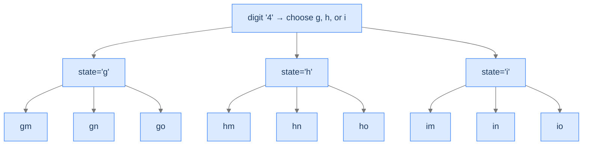

# Phone Combinations

The classic phone-keypad problem. Each digit's set of letters is different — branching factor varies per slot — but every leaf is still a valid output.

---

## The Problem

Given a string `digits` consisting of digits `2`–`9`, return all letter combinations the digits could represent on a phone keypad. Mapping:

| Digit | Letters |
|---|---|
| 2 | abc |
| 3 | def |
| 4 | ghi |
| 5 | jkl |
| 6 | mno |
| 7 | pqrs |
| 8 | tuv |
| 9 | wxyz |

```
Input:  digits = "46"
Output: ["gm", "gn", "go", "hm", "hn", "ho", "im", "in", "io"]

Input:  digits = "28"
Output: ["at", "au", "av", "bt", "bu", "bv", "ct", "cu", "cv"]

Input:  digits = "2"
Output: ["a", "b", "c"]
```

---

## Examples

**Example 1**
```
Input:  digits = "46"
Output: [gm, gn, go, hm, hn, ho, im, in, io]
Explanation: Digit 4 → ghi (3 choices), digit 6 → mno (3 choices) → 3 × 3 = 9 combinations.
```

**Example 2**
```
Input:  digits = "2"
Output: [a, b, c]
Explanation: Single digit 2 → abc (3 choices) → 3 combinations.
```

```quiz
{
  "prompt": "Why does the branching factor vary between digits 2–6 and digits 7, 9?",
  "options": ["Digits 7 and 9 map to 4 letters each (pqrs, wxyz), all others map to 3", "Digits 7 and 9 are prime", "Digits 7 and 9 map to vowels", "The branching factor is always 3"],
  "answer": "Digits 7 and 9 map to 4 letters each (pqrs, wxyz), all others map to 3"
}
```

## Constraints

- `1 ≤ digits.length ≤ 4`
- `digits[i]` is a digit in the range `['2', '9']`.
- No empty-string test case (avoids stdin EOF crash — the empty-digits case returns `[]` and is covered in the editorial edge cases).

```python run viz=graph viz-root=current_combination
from typing import List

class Solution:
    def phone_combinations(self, digits: str) -> List[str]:
        # Your code goes here — use a phone_mapping table, backtrack over
        # each digit's letters, build a string at the leaf.
        return []

digits = input().strip()     # the test case's digits
r = Solution().phone_combinations(digits)
print("[" + ", ".join(r) + "]")
```

```java run viz=graph viz-root=current_combination
import java.util.*;

public class Main {
    static class Solution {
        public List<String> phoneCombinations(String digits) {
            // Your code goes here — use a phoneMapping table, backtrack over
            // each digit's letters, build a string at the leaf.
            return new ArrayList<>();
        }
    }

    public static void main(String[] args) {
        String digits = new Scanner(System.in).nextLine().trim();
        List<String> r = new Solution().phoneCombinations(digits);
        System.out.println(r);
    }
}
```

```testcases
{
  "args": [
    { "id": "digits", "label": "digits", "type": "string", "placeholder": "46" }
  ],
  "cases": [
    { "args": { "digits": "46" }, "expected": "[gm, gn, go, hm, hn, ho, im, in, io]" },
    { "args": { "digits": "28" }, "expected": "[at, au, av, bt, bu, bv, ct, cu, cv]" },
    { "args": { "digits": "2" }, "expected": "[a, b, c]" },
    { "args": { "digits": "9" }, "expected": "[w, x, y, z]" },
    { "args": { "digits": "23" }, "expected": "[ad, ae, af, bd, be, bf, cd, ce, cf]" }
  ]
}
```

<details>
<summary><h2>State Space Tree</h2></summary>


For `digits = "46"`:



<p align="center"><strong>Tree for <code>digits = "46"</code>. Digit 4's branching factor is 3 (g/h/i); digit 6's branching factor is 3 (m/n/o). Total leaves = 9 = 3 × 3.</strong></p>

</details>
<details>
<summary><h2>Solution &amp; Analysis</h2></summary>

### The Solution

```python solution time=O(n · 4^n) space=O(n)
from typing import List

class Solution:

    # Mapping of digits to their corresponding letters (telephone button
    # mapping)
    phone_mapping: List[str] = [
        "",
        "",
        "abc",
        "def",
        "ghi",
        "jkl",
        "mno",
        "pqrs",
        "tuv",
        "wxyz",
    ]

    def generate_combinations(
        self,
        digits: str,
        index: int,
        current_combination: List[str],
        combinations: List[str],
    ) -> None:

        # If the current combination has reached the length of digits,
        # add it to combinations (solution state)
        if index == len(digits):

            # Add the complete combination to the result
            combinations.append("".join(current_combination))

            # Return to continue exploring other possibilities
            return

        # Get the current digit
        digit = digits[index]

        # Get the corresponding string of letters for the current digit
        letters = self.phone_mapping[int(digit)]

        # Try every letter corresponding to the current digit (all
        # choices)
        for letter in letters:

            # Add the letter to the current combination (make choice)
            current_combination.append(letter)

            # Recur with the next digit (reduced input -> index + 1)
            self.generate_combinations(
                digits, index + 1, current_combination, combinations
            )

            # No need to explicitly backtrack in strings
            current_combination.pop()

    def phone_combinations(self, digits: str) -> List[str]:

        # If the input digits are empty, return an empty result
        if not digits:
            return []

        # List to store the combinations
        combinations: List[str] = []

        # Temporary string to store the current combination (state)
        current_combination: List[str] = []

        # Start the unconditional enumeration process from index 0
        self.generate_combinations(
            digits, 0, current_combination, combinations
        )

        # Return the list containing all combinations
        return combinations


digits = input().strip()     # the test case's digits
r = Solution().phone_combinations(digits)
print("[" + ", ".join(r) + "]")
```

```java solution
import java.util.*;

public class Main {
    static class Solution {

        // Mapping of digits to their corresponding letters (telephone button
        // mapping)
        private final String[] phoneMapping = {
            "",
            "",
            "abc",
            "def",
            "ghi",
            "jkl",
            "mno",
            "pqrs",
            "tuv",
            "wxyz"
        };

        private void generateCombinations(
            String digits,
            int index,
            StringBuilder currentCombination,
            List<String> combinations
        ) {

            // If the current combination has reached the length of digits,
            // add it to combinations (solution state)
            if (index == digits.length()) {

                // Add the current combination to the result
                combinations.add(currentCombination.toString());

                // Return to continue exploring other possibilities
                return;
            }

            // Get the current digit
            char digit = digits.charAt(index);

            // Get the corresponding string of letters for the current digit
            String letters = phoneMapping[digit - '0'];

            // Try every letter corresponding to the current digit (all
            // choices)
            for (char letter : letters.toCharArray()) {

                // Add the letter to the current combination (make choice)
                currentCombination.append(letter);

                // Recur with the next digit (reduced input -> index + 1)
                generateCombinations(
                    digits,
                    index + 1,
                    currentCombination,
                    combinations
                );

                // Remove the last letter to backtrack (revert choice)
                currentCombination.deleteCharAt(
                    currentCombination.length() - 1
                );
            }
        }

        public List<String> phoneCombinations(String digits) {

            // If the input digits are empty, return an empty result
            if (digits.isEmpty()) {
                return new ArrayList<>();
            }

            // List to store the combinations
            List<String> combinations = new ArrayList<>();

            // Temporary string to store the current combination (state)
            StringBuilder currentCombination = new StringBuilder();

            // Start the unconditional enumeration process from index 0
            generateCombinations(
                digits,
                0,
                currentCombination,
                combinations
            );

            // Return the list containing all combinations
            return combinations;
        }
    }

    public static void main(String[] args) {
        String digits = new Scanner(System.in).nextLine().trim();
        System.out.println(new Solution().phoneCombinations(digits));
    }
}
```

### Complexity Analysis

| Resource | Cost |
|---|---|
| **Time** | `O(n · 4^n)` worst case (digits 7 and 9 have 4 letters) |
| **Space (output)** | `O(n · 4^n)` |
| **Space (stack)** | `O(n)` |

### Edge Cases

| Case | Example | Expected |
|---|---|---|
| Empty | `""` | `[]` |
| Single digit | `"3"` | `["d", "e", "f"]` |
| All max-branch | `"77"` | 16 outputs (`4²`). |
| Mixed branching | `"23"` | 9 outputs (`3 × 3`). |

</details>
<details>
<summary><h2>Key Takeaway</h2></summary>


Phone Combinations is unconditional enumeration with a *slot-specific* choice set. The recipe still applies — only the inner loop reads its choices from a per-slot table. With these four problems, you've now seen unconditional enumeration's full vocabulary: fixed branching, variable branching, parameterised branching, and table-driven branching. The next lesson lifts the central restriction: not every leaf is a solution any more, and we have to *check* on the way.

You came in suspecting backtracking was a single algorithm. You're leaving with the simplest of three patterns named, plus four worked examples that fit the same three-line template. Next we add validation — and with it, the pruning that makes backtracking practical for real-world problems.

**Transfer challenge — try before the Conditional Enumeration lesson:** Generate all permutations of `[1, 2, 3]`. Sketch the state space tree. **Hint:** unlike subsets, each level's choice set is "the elements not yet used." Is this still unconditional enumeration?

<details>
<summary><strong>Answer — open after you've sketched it</strong></summary>

The state space tree for permutations of `[1, 2, 3]` has `3! = 6` leaves. Each level represents a position in the permutation; each child is a choice of "which unused element goes here":

```
                        []                        (root)
              /          |          \
            [1]         [2]         [3]           (level 1)
           /   \       /   \       /   \
        [1,2] [1,3] [2,1] [2,3] [3,1] [3,2]       (level 2)
          |     |     |     |     |     |
       [1,2,3][1,3,2][2,1,3][2,3,1][3,1,2][3,2,1] (level 3 = leaves)
```

This *is* still unconditional enumeration — every leaf is a valid permutation. But notice the **branching factor shrinks** with depth: 3 → 2 → 1, because each used element is removed from the choice pool. The tree is non-uniform but every leaf is valid; the recipe is the same.

**You just sketched a problem that bridges into the Conditional Enumeration lesson.** Permutation-with-constraints (e.g., "permutations whose first element isn't `1`") would be conditional enumeration; constraint-free permutations are unconditional. The structural form of "remove from choice pool, recurse, restore" generalises everywhere.

</details>

</details>
