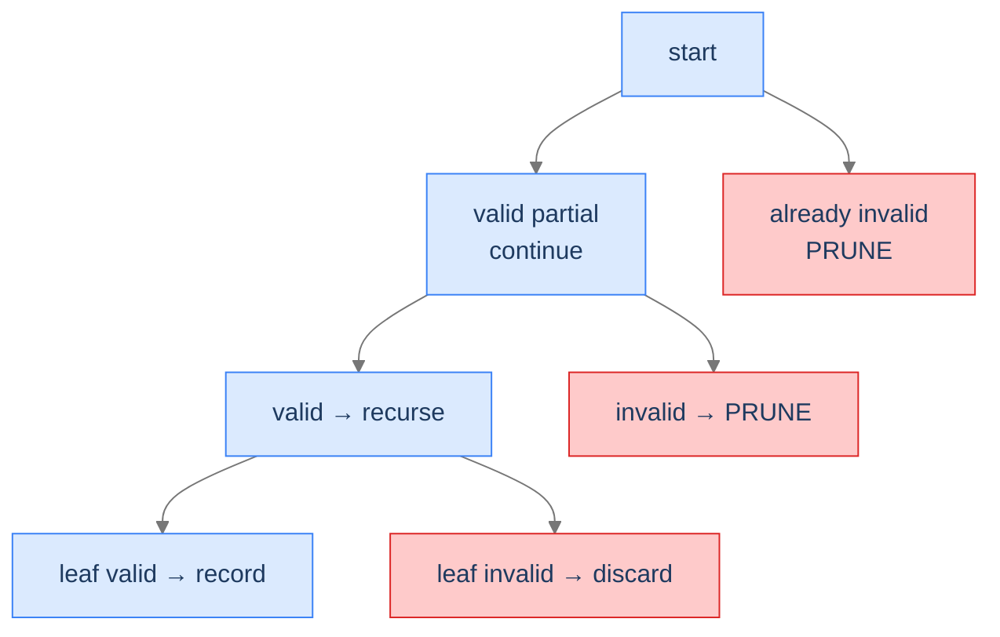

## Why It Exists

In [unconditional enumeration](/cortex/data-structures-and-algorithms/algorithms-by-strategy-backtracking-pattern-unconditional-enumeration) every leaf was a valid answer, so we recorded them all. But most real problems have *bad* leaves — generate only the *balanced* parenthesis strings, only the *valid* IP addresses, only the combinations that *hit a target sum*. **Conditional enumeration** adds the missing discipline: validate as you build, and abandon a partial guess the instant it's provably doomed.

That early abandonment — **pruning** — is the whole point. A partial string with more `)` than `(` can never become balanced, so the entire subtree below it is dead and skipped. The runtime stops being the full tree size and becomes the size of the *explored* (un-pruned) portion — often exponentially smaller. The pruning does double duty: it's the speedup *and* the guarantee that every recorded leaf is valid by construction.



<p align="center"><strong>Pruning cuts whole subtrees the moment a partial guess can't lead to a valid leaf — the source of the speedup.</strong></p>

## See It Work

**Generate all balanced parenthesis strings** with `n` pairs. Two counters ride along — `opens` and `closes` — and the choices are *pruned*: only open while `opens < n`, only close while `closes < opens`. Every leaf reached is therefore balanced by construction.

```python run viz=array
def generate_balanced(n):
    res, cur = [], []
    def helper(opens, closes):
        if len(cur) == 2 * n:                       # leaf — guaranteed balanced by the pruning
            res.append("".join(cur)); return
        if opens < n:                               # choice-bounded: can still open
            cur.append("("); helper(opens + 1, closes); cur.pop()
        if closes < opens:                          # choice-bounded: close only with a match waiting
            cur.append(")"); helper(opens, closes + 1); cur.pop()
    helper(0, 0)
    return res

s = generate_balanced(3)
print(s)
print("count:", len(s))
```

```java run viz=array
import java.util.*;
public class Main {
    static void gen(int n, int opens, int closes, StringBuilder cur, List<String> res) {
        if (cur.length() == 2 * n) { res.add(cur.toString()); return; }   // leaf — balanced
        if (opens < n)      { cur.append('('); gen(n, opens + 1, closes, cur, res); cur.deleteCharAt(cur.length() - 1); }
        if (closes < opens) { cur.append(')'); gen(n, opens, closes + 1, cur, res); cur.deleteCharAt(cur.length() - 1); }
    }
    public static void main(String[] args) {
        List<String> res = new ArrayList<>();
        gen(3, 0, 0, new StringBuilder(), res);
        System.out.println(res);
        System.out.println("count: " + res.size());
    }
}
```

Both print the 5 balanced strings — `((()))`, `(()())`, `(())()`, `()(())`, `()()()` — and `count: 5`. The unpruned tree has `2⁶ = 64` length-6 strings; pruning walks only the 5 that survive.

## How It Works

Conditional enumeration is the unconditional skeleton plus **pruning**, which comes in two flavours (most problems use both):

- **Choice-bounded** — *don't generate* a doomed choice. The `for`/`if` over choices only emits viable ones (above, `closes < opens` blocks an unmatched `)`).
- **Constraint-bounded** — at the top of the call, if the partial state already violates a constraint, return immediately.

```
function enumerate(state, aux):
    if state violates a constraint: return         # constraint-bounded prune
    if state is complete: if valid: record(state); return
    for choice in VIABLE_choices(state):           # choice-bounded prune
        extend(state, choice); enumerate(state); undo(state)
```

The pruning needs **auxiliary state** to decide viability — `(opens, closes)` for parentheses, `remaining_target` for combination sum, `(position, segment_count)` for IP addresses. That extra state is what lets you classify a partial guess as doomed. Cost for generate-parentheses: `O(n · C(n))` where `C(n)` is the `n`-th Catalan number (`≈ 4ⁿ / n^1.5`) — far below the unpruned `2^{2n}`.

Three diagnostics: **Q1** — are some complete candidates *invalid* (so a leaf filter is needed)? **Q2** — can a *partial* guess be detected as doomed before completion (so internal pruning is possible)? **Q3** — is the candidate still built by incremental decisions? All "yes" → conditional enumeration.

> **Key takeaway.** Conditional enumeration = the choose/recurse/undo skeleton + **pruning** of doomed branches, using auxiliary state to test viability. Two flavours: choice-bounded (never emit a bad choice) and constraint-bounded (return early on a violated partial). The prune is both the speedup *and* the by-construction validity guarantee.

## Trace It

The `closes < opens` guard looks like a micro-optimisation — surely we could just generate all the length-`2n` strings and keep the balanced ones? Watch what that costs, and what it lets through.

**Predict before you run:** drop the ordering guard (allow `)` whenever `closes < n`, with no leaf validity check). For `n = 3`, how many strings come out, and are they all balanced?

```python run viz=array
def generate_buggy(n):
    res, cur = [], []
    def helper(opens, closes):
        if len(cur) == 2 * n:
            res.append("".join(cur)); return        # records EVERY leaf — no validity check
        if opens < n:  cur.append("("); helper(opens + 1, closes); cur.pop()
        if closes < n: cur.append(")"); helper(opens, closes + 1); cur.pop()   # NO `closes < opens`
    helper(0, 0)
    return res

def is_balanced(s):
    bal = 0
    for c in s:
        bal += 1 if c == "(" else -1
        if bal < 0: return False
    return bal == 0

out = generate_buggy(3)
print("count:", len(out), " balanced among them:", sum(is_balanced(x) for x in out))
```

<details>
<summary><strong>Reveal</strong></summary>

It emits **20** strings, of which only **5** are balanced. Dropping the `closes < opens` prune lets the search build every arrangement of three `(` and three `)` (`C(6,3) = 20`), including invalid ones like `())(()` and `)((` -prefixed strings — and with no leaf check, all 20 get recorded as if valid. So the prune was doing *two* jobs at once: it cut the work from 20 candidates to 5 (the speedup), and it guaranteed every recorded leaf is balanced *by construction* (correctness). That's the signature of good conditional enumeration — a viability test that both shrinks the tree and removes the need for a separate leaf validator. Pruning here isn't an optimisation bolted onto a correct algorithm; it *is* the algorithm.

</details>

## Your Turn

**Combination Sum** ([LeetCode 39](https://leetcode.com/problems/combination-sum/)) — find all combinations of candidates (reusable) that sum to a target. Constraint-bounded pruning: sort the candidates, and once one exceeds the remaining target, every later one does too — `break`.

```python run viz=array
def combination_sum(candidates, target):
    candidates.sort()
    res, cur = [], []
    def backtrack(start, remaining):
        if remaining == 0:
            res.append(cur[:]); return              # valid leaf
        for i in range(start, len(candidates)):
            if candidates[i] > remaining:
                break                                # prune: sorted → all later are too big
            cur.append(candidates[i])
            backtrack(i, remaining - candidates[i])  # i, not i+1 → reuse allowed
            cur.pop()
    backtrack(0, target)
    return res

print(combination_sum([2, 3, 6, 7], 7))             # [[2, 2, 3], [7]]
print(combination_sum([2, 3, 5], 8))                # [[2, 2, 2, 2], [2, 3, 3], [3, 5]]
```

```java run viz=array
import java.util.*;
public class Main {
    static void cs(int[] c, int start, int rem, List<Integer> cur, List<List<Integer>> res) {
        if (rem == 0) { res.add(new ArrayList<>(cur)); return; }
        for (int i = start; i < c.length; i++) {
            if (c[i] > rem) break;                       // prune (sorted)
            cur.add(c[i]); cs(c, i, rem - c[i], cur, res); cur.remove(cur.size() - 1);
        }
    }
    static List<List<Integer>> combinationSum(int[] c, int t) {
        Arrays.sort(c); List<List<Integer>> res = new ArrayList<>();
        cs(c, 0, t, new ArrayList<>(), res); return res;
    }
    public static void main(String[] args) {
        System.out.println(combinationSum(new int[]{2,3,6,7}, 7));   // [[2, 2, 3], [7]]
        System.out.println(combinationSum(new int[]{2,3,5}, 8));     // [[2,2,2,2],[2,3,3],[3,5]]
    }
}
```

Both print `[[2, 2, 3], [7]]` then `[[2,2,2,2],[2,3,3],[3,5]]`. The `break` (constraint-bounded prune) plus the `start`-index trick (avoid permuted duplicates) keep the search to viable combinations only. The four problems in this section's **Problems** folder cover both flavours: generate-parentheses (choice-bounded), target-sum (constraint-bounded), IP addresses (both), and string permutations.

## Reflect & Connect

- **The middle of the backtracking spectrum.** [Unconditional](/cortex/data-structures-and-algorithms/algorithms-by-strategy-backtracking-pattern-unconditional-enumeration) records every leaf; conditional prunes doomed partials; backtracking search mutates a structure and undoes on failure. Same choose/recurse/undo skeleton, increasing discipline.
- **Pruning is correctness, not just speed.** Well-designed viability checks make every recorded leaf valid by construction — you often don't need a separate leaf validator at all. The dropped-guard experiment shows what you lose without it.
- **Auxiliary state powers the prune.** You can only classify a partial as doomed if you carry the right running summary — counts, a remaining target, a position. Designing that state *is* designing the pruning.
- **Choice-bounded vs constraint-bounded.** Don't-generate-bad-choices (cleaner, no wasted frames) vs return-early-on-violation (simpler when viability is a global property). Combine them when both apply — generate-IPs does.

## Recall

<details>
<summary><strong>Q:</strong> What distinguishes conditional from unconditional enumeration?</summary>

**A:** Some leaves are invalid and/or some partial guesses are provably doomed. Conditional enumeration prunes those branches (and validates leaves), so only valid candidates are recorded.

</details>
<details>
<summary><strong>Q:</strong> The two flavours of pruning?</summary>

**A:** Choice-bounded — never generate a choice that would violate a constraint. Constraint-bounded — at the top of the recursion, return early if the partial state already violates a constraint. Most problems use both.

</details>
<details>
<summary><strong>Q:</strong> Why does pruning do "double duty"?</summary>

**A:** It shrinks the explored tree (speed) *and* guarantees every reached leaf is valid by construction (correctness), often removing the need for a separate leaf validator.

</details>
<details>
<summary><strong>Q:</strong> What enables a viability test, and give an example?</summary>

**A:** Auxiliary state carried through the recursion: `(opens, closes)` for balanced parentheses, `remaining_target` for combination sum, `(position, segments)` for IP addresses.

</details>
<details>
<summary><strong>Q:</strong> Why is generate-parentheses `O(n·C(n))` rather than `O(2^{2n})`?</summary>

**A:** Pruning visits only well-formed prefixes; the count of balanced `n`-pair strings is the Catalan number `C(n) ≈ 4ⁿ/n^1.5`, far below the `2^{2n}` unpruned strings.

</details>

## Sources & Verify

- **Skiena**, *The Algorithm Design Manual*, 3rd ed., §9.1–9.2 — backtracking with pruning (`is_a_solution`, `construct_candidates` viability filtering) and search-space reduction.
- **CLRS** (Cormen, Leiserson, Rivest, Stein), *Introduction to Algorithms*, 3rd ed. — recursion and combinatorial search; Catalan numbers for the parenthesis count.
- **LeetCode** 22 (Generate Parentheses), 39 (Combination Sum), 93 (Restore IP Addresses) are the canonical conditional-enumeration drills; the 5-string output, the 20-vs-5 unpruned experiment, and the combination-sum results above come from the runnable blocks — re-run to verify.
