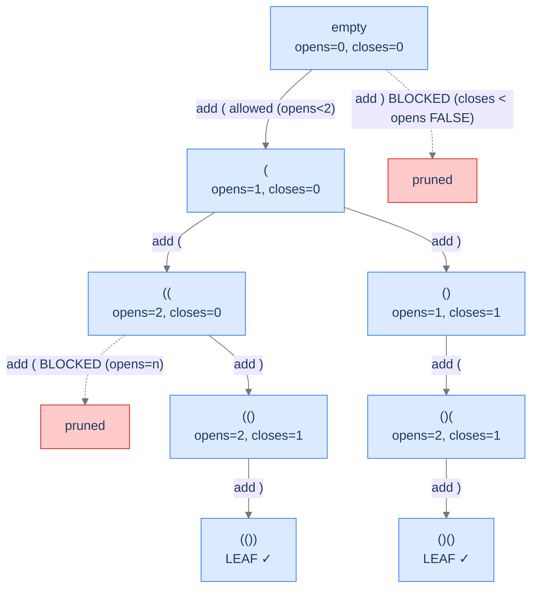

# Generate Parentheses

The canonical conditional-enumeration problem. Both flavours of pruning visible side-by-side: choice-bounded (only emit `(` if there's room; only emit `)` if there's an open to match) and the implicit constraint-bounded (no separate check needed, because the choice-bounded prune handles it).

---

## The Problem

Given a positive integer `n`, return all combinations of well-formed parentheses with exactly `n` pairs. Output may be in any order.

```
Input:  n = 2
Output: [(())), ()()] or any valid order

Input:  n = 1
Output: [()]

Input:  n = 3
Output: [((())), (()()), (())(), ()(()), ()()()]
```

---

## Examples

**Example 1**
```
Input:  n = 2
Output: [(()), ()()]
Explanation: There are C(2) = 2 balanced strings of length 4. The pruned DFS visits them in this order.
```

**Example 2**
```
Input:  n = 3
Output: [((())), (()()), (())(), ()(()), ()()()]
Explanation: There are C(3) = 5 balanced strings of length 6 — the 3rd Catalan number.
```

```quiz
{
  "prompt": "How many balanced strings exist for n = 4?",
  "options": ["5", "10", "14", "16"],
  "answer": "14"
}
```

## Constraints

- `1 ≤ n ≤ 8`
- Output may be in any order; these tests use the DFS visit order (open-first).

```python run viz=array viz-root=choices
from typing import List

class Solution:
    def generate_parentheses(self, n: int) -> List[str]:
        # Your code goes here — track opens and closes counts,
        # add '(' when opens < n, add ')' when closes < opens
        return []

n = int(input())
result = Solution().generate_parentheses(n)
print('[' + ', '.join(result) + ']')
```

```java run viz=array viz-root=choices
import java.util.*;

public class Main {
    static class Solution {
        public List<String> generateParentheses(int n) {
            // Your code goes here — track opens and closes counts,
            // add '(' when opens < n, add ')' when closes < opens
            return new ArrayList<>();
        }
    }

    public static void main(String[] args) {
        int n = Integer.parseInt(new Scanner(System.in).nextLine().trim());
        System.out.println(new Solution().generateParentheses(n));
    }
}
```

```testcases
{
  "args": [
    { "id": "n", "label": "n", "type": "int", "placeholder": "2" }
  ],
  "cases": [
    { "args": { "n": "1" }, "expected": "[()]" },
    { "args": { "n": "2" }, "expected": "[(()), ()()]" },
    { "args": { "n": "3" }, "expected": "[((())), (()()), (())(), ()(()), ()()()]" },
    { "args": { "n": "4" }, "expected": "[(((()))), ((()())), ((())()), ((()))(), (()(())), (()()()), (()())(), (())(()), (())()(), ()((())), ()(()()), ()(())(), ()()(()), ()()()()]" }
  ]
}
```

<details>
<summary><h2>What Does "Well-Formed" Mean Recursively?</h2></summary>


A balanced sequence of parentheses obeys two invariants at every prefix:
1. **`opens ≥ closes`** at every position. (You can't have more `)` than `(` so far — that would mean an unmatched `)`.)
2. **`opens == closes` and `opens == n` at the end.** (Equal counts and `n` pairs total.)

Pruning happens by enforcing invariant 1 *during* construction. Whenever we'd add a `)` that violates `closes < opens`, we don't even try.



<p align="center"><strong>State space tree for <code>n = 2</code> with pruning. Red branches are never explored. Out of <code>2⁴ = 16</code> possible length-4 strings, only 2 are balanced — and we generate exactly those 2.</strong></p>

</details>
<details>
<summary><h2>Applying the Diagnostic Questions</h2></summary>


| # | Check | Answer |
|---|---|---|
| **Q1** | Some leaves invalid? | **Yes** — most random `(`/`)` strings aren't balanced. |
| **Q2** | Doomed-partial detectable? | **Yes** — `closes > opens` partway through is already invalid. |
| **Q3** | Incremental decisions? | **Yes** — one character per decision. |

### Q1 — Why "many leaves invalid"?

For length `2n`, there are `2^(2n)` total candidates. The number of balanced ones is the `n`-th Catalan number, roughly `4^n / n^1.5` — much smaller. The vast majority are invalid. ✓

### Q2 — Why "early-detect doomed partials"?

The invariant `closes ≤ opens` must hold at *every* prefix of a balanced string. Violating it once means *no* extension can recover; every descendant of that partial state is doomed. Perfect pruning candidate. ✓

### Q3 — Why "incremental"?

We build the string one character at a time. The state at depth `d` is the prefix of length `d`. Same shape as unconditional enumeration. ✓

</details>
<details>
<summary><h2>The Pruned-DFS Strategy (Visualised)</h2></summary>


We maintain two counters — `opens` and `closes` — and decide at each step which next characters are viable:

- Adding `(` is viable iff `opens < n`.
- Adding `)` is viable iff `closes < opens`.

If neither is viable (which never happens during a properly running search but is the boundary condition), we'd return without recursing. With `n` pairs, the leaves are exactly the `2n`-length strings the search reaches; every one is balanced because we prevented imbalance at every step.

</details>
<details>
<summary><h2>Solution &amp; Analysis</h2></summary>

### The Solution

The implementation was already shown in the pattern page (where we used Generate Parentheses as the canonical example for the conditional-enumeration template). We restate the Python here to keep this section self-contained, then provide the trace.

```python solution time=O(n · C(n)) space=O(n)
from typing import List

class Solution:
    def get_choices(self, n: int, open: int, close: int) -> List[str]:
        choices: List[str] = []

        # Can add an open parenthesis if we haven't used all n
        if open < n:
            choices.append("(")

        # Can add a close parenthesis if we have more opens than closes
        if close < open:
            choices.append(")")

        return choices

    def generate_combinations(
        self,
        n: int,
        open: int,
        close: int,
        current_combination: List[str],
        combinations: List[str],
    ) -> None:

        # If the current combination has used all n pairs of parentheses
        # (solution state)
        if len(current_combination) == 2 * n:

            # Store the valid combination
            combinations.append("".join(current_combination))

            # Return to continue exploring other possibilities
            return

        # Get all valid choices for the current position
        choices = self.get_choices(n, open, close)

        # Loop through all valid choices
        for choice in choices:

            # Add the chosen bracket to the current combination (make
            # choice)
            current_combination.append(choice)

            # If the choice is an opening bracket, recur by increasing
            # open count
            if choice == "(":
                self.generate_combinations(
                    n, open + 1, close, current_combination, combinations
                )

            # Else if the choice is a closing bracket, recur by
            # increasing close count
            else:
                self.generate_combinations(
                    n, open, close + 1, current_combination, combinations
                )

            # Backtrack by removing the last added bracket (revert
            # choice)
            current_combination.pop()

    def generate_parentheses(self, n: int) -> List[str]:

        # List to store all valid combinations
        combinations: List[str] = []

        # String to build the current combination of parentheses (state)
        current_combination: List[str] = []

        # Start the unconditional enumeration process with 0 open and 0
        # close
        self.generate_combinations(
            n, 0, 0, current_combination, combinations
        )

        # Return the list of all valid parentheses combinations
        return combinations


n = int(input())
result = Solution().generate_parentheses(n)
print('[' + ', '.join(result) + ']')
```

```java solution
import java.util.*;

public class Main {
    static class Solution {
        private char[] getChoices(int n, int open, int close) {
            String choices = "";

            // Can add an open parenthesis if we haven't used all n
            if (open < n) {
                choices += '(';
            }

            // Can add a close parenthesis if we have more opens than closes
            if (close < open) {
                choices += ')';
            }

            return choices.toCharArray();
        }

        private void generateCombinations(
            int n,
            int open,
            int close,
            StringBuilder currentCombination,
            List<String> combinations
        ) {

            // If the current combination has used all n pairs of parentheses
            // (solution state)
            if (currentCombination.length() == 2 * n) {

                // Store the valid combination
                combinations.add(currentCombination.toString());

                // Return to continue exploring other possibilities
                return;
            }

            // Get all valid choices for the current position
            char[] choices = getChoices(n, open, close);

            // Loop through all valid choices
            for (char choice : choices) {

                // Add the chosen bracket to the current combination (make
                // choice)
                currentCombination.append(choice);

                // If the choice is an opening bracket, recur by increasing
                // open count
                if (choice == '(') {
                    generateCombinations(
                        n,
                        open + 1,
                        close,
                        currentCombination,
                        combinations
                    );
                }

                // Else if the choice is a closing bracket, recur by
                // increasing close count
                else {
                    generateCombinations(
                        n,
                        open,
                        close + 1,
                        currentCombination,
                        combinations
                    );
                }

                // Backtrack by removing the last added bracket (revert
                // choice)
                currentCombination.deleteCharAt(
                    currentCombination.length() - 1
                );
            }
        }

        public List<String> generateParentheses(int n) {

            // List to store all valid combinations
            List<String> combinations = new ArrayList<>();

            // String to build the current combination of parentheses (state)
            StringBuilder currentCombination = new StringBuilder();

            // Start the unconditional enumeration process with 0 open and 0
            // close
            generateCombinations(n, 0, 0, currentCombination, combinations);

            // Return the list of all valid parentheses combinations
            return combinations;
        }
    }

    public static void main(String[] args) {
        int n = Integer.parseInt(new Scanner(System.in).nextLine().trim());
        System.out.println(new Solution().generateParentheses(n));
    }
}
```

<details>
<summary><strong>Trace — n = 2</strong></summary>

```
helper("", opens=0, closes=0)
├─ '(' allowed (0 < 2)
│  helper("(", opens=1, closes=0)
│  ├─ '(' allowed (1 < 2)
│  │  helper("((", opens=2, closes=0)
│  │  ├─ '(' BLOCKED (opens not < 2)
│  │  └─ ')' allowed (0 < 2)
│  │     helper("(()", opens=2, closes=1)
│  │     ├─ '(' BLOCKED
│  │     └─ ')' allowed (1 < 2)
│  │        helper("(())", opens=2, closes=2)  → leaf, record "(())"
│  └─ ')' allowed (0 < 1)
│     helper("()", opens=1, closes=1)
│     ├─ '(' allowed (1 < 2)
│     │  helper("()(", opens=2, closes=1)
│     │  ├─ '(' BLOCKED
│     │  └─ ')' allowed
│     │     helper("()()", opens=2, closes=2) → leaf, record "()()"
│     └─ ')' BLOCKED (closes not < opens; 1 not < 1)

Result: ["(())", "()()"]  (only 2 leaves ever reached, vs 16 unpruned)
```

</details>

### Complexity Analysis

| Resource | Cost |
|---|---|
| **Time** | `O(n · C(n))` where `C(n)` is the n-th Catalan number |
| **Space (output)** | `O(n · C(n))` |
| **Space (stack)** | `O(n)` |

Catalan numbers: `C(0)=1, C(1)=1, C(2)=2, C(3)=5, C(4)=14, C(5)=42, C(6)=132, ..., C(n) ≈ 4^n / (n^1.5 √π)`.

### Edge Cases

| Case | Example | Expected |
|---|---|---|
| `n = 1` | `[()]` | Only one balanced sequence. |
| `n = 3` | `[((())), (()())), (())()), ()(())), ()()()]` | 5 sequences = `C(3)`. |

</details>
<details>
<summary><h2>Key Takeaway</h2></summary>


Generate Parentheses is the textbook example of choice-bounded pruning. Two counters in the recursion's parameters; two prune-checks before each recursive call. The next problem flips to constraint-bounded pruning: instead of checking what's *allowable* before generating, we check what's *over-budget* on entry.

</details>
