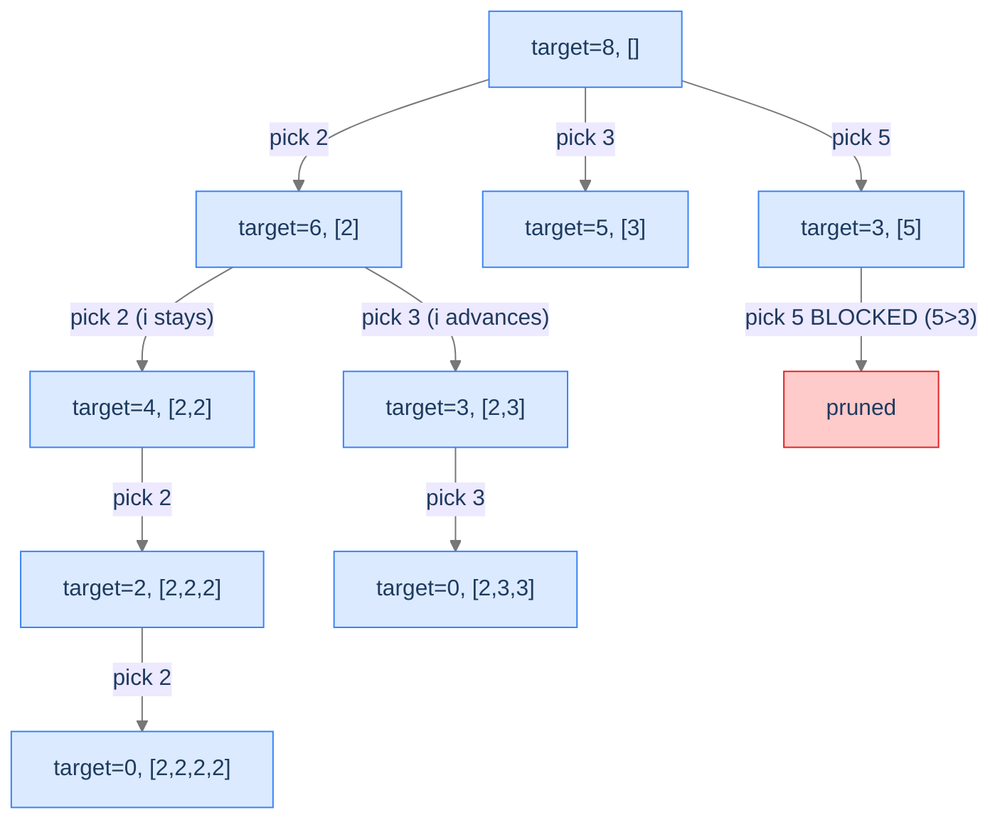

# Target Sum Combinations

Find all combinations of array elements (with repetition) that sum to a target. Constraint-bounded pruning: stop the recursion the moment the partial sum *exceeds* the target.

---

## The Problem

Given an array `arr` of distinct positive integers and a positive integer `target`, return all unique combinations whose elements sum to `target`. The same number from `arr` may be reused. Two combinations are *unique* if they differ in the multiplicities of the chosen numbers.

```
Input:  arr = [2, 3, 5], target = 8
Output: [[2,2,2,2], [2,3,3], [3,5]]

Input:  arr = [2, 3, 6, 7], target = 7
Output: [[2,2,3], [7]]

Input:  arr = [1, 2, 3], target = 4
Output: [[1,1,1,1], [1,1,2], [1,3], [2,2]]
```

---

## Examples

**Example 1**
```
Input:  arr = [2, 3, 6, 7], target = 7
Output: [[2, 2, 3], [7]]
Explanation: 2+2+3=7 and 7=7. Both combinations are unique by multiplicities.
```

**Example 2**
```
Input:  arr = [2, 3, 5], target = 8
Output: [[2, 2, 2, 2], [2, 3, 3], [3, 5]]
Explanation: All three combinations of sorted [2,3,5] elements that sum to 8.
```

```quiz
{
  "prompt": "Why does the algorithm use a `start` index rather than always looping from 0?",
  "options": [
    "To avoid revisiting elements we've already excluded",
    "To enforce non-decreasing order and prevent permuted duplicates",
    "To implement constraint-bounded pruning",
    "To limit recursion depth"
  ],
  "answer": "To enforce non-decreasing order and prevent permuted duplicates"
}
```

## Constraints

- `1 ≤ arr.length ≤ 30`
- `2 ≤ arr[i] ≤ 40`
- All elements of `arr` are distinct.
- `1 ≤ target ≤ 40`

```python run viz=array viz-root=combinations
import ast
from typing import List

class Solution:
    def target_sum_combinations(self, arr: List[int], target: int) -> List[List[int]]:
        # Your code goes here — sort arr, backtrack with start index and remaining target
        # skip arr[i] > remaining (continue); use i (not i+1) to allow reuse
        return []

arr = ast.literal_eval(input())
target = int(input())
print(Solution().target_sum_combinations(arr, target))
```

```java run viz=array viz-root=combinations
import java.util.*;

public class Main {
    static class Solution {
        public List<List<Integer>> targetSumCombinations(int[] arr, int target) {
            // Your code goes here — sort arr, backtrack with start index and remaining target
            // skip arr[i] > remaining (continue); use i (not i+1) to allow reuse
            return new ArrayList<>();
        }
    }

    static int[] parseIntArray(String line) {
        String inner = line.replaceAll("[\\[\\]\\s]", "");
        if (inner.isEmpty()) return new int[0];
        String[] parts = inner.split(",");
        int[] out = new int[parts.length];
        for (int i = 0; i < parts.length; i++) out[i] = Integer.parseInt(parts[i]);
        return out;
    }

    public static void main(String[] args) {
        Scanner sc = new Scanner(System.in);
        int[] arr = parseIntArray(sc.nextLine());
        int target = Integer.parseInt(sc.nextLine().trim());
        System.out.println(new Solution().targetSumCombinations(arr, target));
    }
}
```

```testcases
{
  "args": [
    { "id": "arr", "label": "arr", "type": "int[]", "placeholder": "[2, 3, 6, 7]" },
    { "id": "target", "label": "target", "type": "int", "placeholder": "7" }
  ],
  "cases": [
    { "args": { "arr": "[2, 3, 5]", "target": "8" }, "expected": "[[2, 2, 2, 2], [2, 3, 3], [3, 5]]" },
    { "args": { "arr": "[2, 3, 6, 7]", "target": "7" }, "expected": "[[2, 2, 3], [7]]" },
    { "args": { "arr": "[1, 2, 3]", "target": "4" }, "expected": "[[1, 1, 1, 1], [1, 1, 2], [1, 3], [2, 2]]" },
    { "args": { "arr": "[2]", "target": "3" }, "expected": "[]" },
    { "args": { "arr": "[5]", "target": "5" }, "expected": "[[5]]" },
    { "args": { "arr": "[1]", "target": "3" }, "expected": "[[1, 1, 1]]" }
  ]
}
```

<details>
<summary><h2>What Pruning Helps Here?</h2></summary>


Two prunes:
1. **Skip overshoots.** If `arr[i] > remaining_target`, choosing `arr[i]` would push the partial sum past the target. Skip.
2. **Early termination.** If `remaining_target == 0`, the partial sum exactly hits the target. Record the combination and return — no further children to explore.

A third structural trick avoids generating duplicate combinations: **only consider candidates from the current index onward.** This forces a canonical order on the chosen numbers (non-decreasing in input order) so that `[2, 3, 3]` is generated but `[3, 2, 3]` and `[3, 3, 2]` aren't.



<p align="center"><strong>Tree (partial) for <code>arr = [2, 3, 5], target = 8</code>. The "pick 5 with 3 remaining" branch is pruned — 5 overshoots. The recursion uses <code>i</code> to enforce non-decreasing order.</strong></p>

</details>
<details>
<summary><h2>Applying the Diagnostic Questions</h2></summary>


| # | Check | Answer |
|---|---|---|
| **Q1** | Some leaves invalid? | **Yes** — overshooting partial sums and the wrong target totals. |
| **Q2** | Doomed-partial detectable? | **Yes** — partial sum exceeding target is unrecoverable (positive numbers only). |
| **Q3** | Incremental decisions? | **Yes** — one element added per call. |

### Q1 — Why "many partials invalid"?

Most ways of summing array elements don't hit the target exactly. We must filter. ✓

### Q2 — Why "overshoot is doom"?

Since `arr` contains only positive integers, adding any element strictly increases the partial sum. Once the sum exceeds the target, no future addition can decrease it back. The branch is dead. ✓

### Q3 — Why "incremental"?

Each recursive call picks one element to add. ✓

</details>
<details>
<summary><h2>The Constrained-Sum Strategy (Visualised)</h2></summary>


The state at each call is `(remaining_target, current_combination, start_index)`. The `start_index` enforces non-decreasing order; the `remaining_target` shrinks per addition; the `current_combination` accumulates the picks.

The recursion's three branches:
1. `remaining_target == 0` → record `current_combination`, return.
2. `remaining_target < 0` → prune (won't happen because we skip overshooting elements before recursing).
3. Otherwise → for each `i` from `start_index` to `len(arr) - 1`, if `arr[i] ≤ remaining_target`, append `arr[i]`, recurse with `remaining_target - arr[i]` and `start_index = i` (allowing reuse), undo.

</details>
<details>
<summary><h2>Solution &amp; Analysis</h2></summary>

### The Solution

```python solution time=O(arr.length^(target/min(arr))) space=O(target/min(arr))
import ast
from typing import List

class Solution:
    def generate_combinations(
        self,
        arr: List[int],
        target: int,
        index: int,
        current_combination: List[int],
        combinations: List[List[int]],
    ) -> None:

        # If the current combination adds up to the target, store it
        # (solution state)
        if target == 0:

            # Store the current combination
            combinations.append(current_combination.copy())

            # Return to continue exploring other possibilities
            return

        # Loop through all possible choices starting from 'index' index
        for i in range(index, len(arr)):

            # Skip numbers greater than the remaining target
            if arr[i] > target:
                continue

            # Include the current number in the combination (make
            # choice)
            current_combination.append(arr[i])

            # Recurse with updated target
            # Note: 'i' is passed to allow reuse of the same number
            self.generate_combinations(
                arr,
                target - arr[i],
                i,
                current_combination,
                combinations,
            )

            # Backtrack by removing the last added number (revert
            # choice)
            current_combination.pop()

    def target_sum_combinations(
        self, arr: List[int], target: int
    ) -> List[List[int]]:

        # Sort the array to ensure combinations are generated in
        # ascending order
        arr.sort()

        # List to store all valid combinations (solution states)
        combinations: List[List[int]] = []

        # Temporary list to store the current combination (state)
        current_combination: List[int] = []

        # Start the conditional enumeration (backtracking) process from
        # index 0
        self.generate_combinations(
            arr, target, 0, current_combination, combinations
        )

        # Return the list of all valid target sum combinations
        return combinations


arr = ast.literal_eval(input())
target = int(input())
print(Solution().target_sum_combinations(arr, target))
```

```java solution
import java.util.*;

public class Main {
    static class Solution {
        private void generateCombinations(
            int[] arr,
            int target,
            int index,
            List<Integer> currentCombination,
            List<List<Integer>> combinations
        ) {

            // If the current combination adds up to the target, store it
            // (solution state)
            if (target == 0) {

                // Store the current combination
                combinations.add(new ArrayList<>(currentCombination));

                // Return to continue exploring other possibilities
                return;
            }

            // Loop through all possible choices starting from 'index' index
            for (int i = index; i < arr.length; i++) {

                // Skip numbers greater than the remaining target
                if (arr[i] > target) {
                    continue;
                }

                // Include the current number in the combination (make
                // choice)
                currentCombination.add(arr[i]);

                // Recurse with updated target
                // Note: 'i' is passed to allow reuse of the same number
                generateCombinations(
                    arr,
                    target - arr[i],
                    i,
                    currentCombination,
                    combinations
                );

                // Backtrack by removing the last added number (revert
                // choice)
                currentCombination.remove(currentCombination.size() - 1);
            }
        }

        public List<List<Integer>> targetSumCombinations(
            int[] arr,
            int target
        ) {

            // Sort the array to ensure combinations are generated in
            // ascending order
            Arrays.sort(arr);

            // List to store all valid combinations (solution states)
            List<List<Integer>> combinations = new ArrayList<>();

            // Temporary list to store the current combination (state)
            List<Integer> currentCombination = new ArrayList<>();

            // Start the conditional enumeration (backtracking) process from
            // index 0
            generateCombinations(
                arr,
                target,
                0,
                currentCombination,
                combinations
            );

            // Return the list of all valid target sum combinations
            return combinations;
        }
    }

    static int[] parseIntArray(String line) {
        String inner = line.replaceAll("[\\[\\]\\s]", "");
        if (inner.isEmpty()) return new int[0];
        String[] parts = inner.split(",");
        int[] out = new int[parts.length];
        for (int i = 0; i < parts.length; i++) out[i] = Integer.parseInt(parts[i]);
        return out;
    }

    public static void main(String[] args) {
        Scanner sc = new Scanner(System.in);
        int[] arr = parseIntArray(sc.nextLine());
        int target = Integer.parseInt(sc.nextLine().trim());
        System.out.println(new Solution().targetSumCombinations(arr, target));
    }
}
```


<details>
<summary><strong>Trace — arr = [2, 3, 5], target = 8</strong></summary>

```
helper(rem=8, start=0, current=[])
├─ i=0, pick 2 → helper(rem=6, start=0, current=[2])
│  ├─ pick 2 → helper(rem=4, start=0, current=[2,2])
│  │  ├─ pick 2 → helper(rem=2, start=0, current=[2,2,2])
│  │  │  ├─ pick 2 → helper(rem=0, ..., [2,2,2,2]) → record [2,2,2,2]
│  │  │  ├─ pick 3 → 3 > 2 → SKIP
│  │  │  ├─ pick 5 → 5 > 2 → SKIP
│  │  ├─ pick 3 → helper(rem=1, start=1, current=[2,2,3])
│  │  │  ├─ pick 3 → 3 > 1 → SKIP
│  │  │  ├─ pick 5 → 5 > 1 → SKIP
│  │  ├─ pick 5 → 5 > 4 → SKIP
│  ├─ pick 3 → helper(rem=3, start=1, current=[2,3])
│  │  ├─ pick 3 → helper(rem=0, ..., [2,3,3]) → record [2,3,3]
│  │  ├─ pick 5 → 5 > 3 → SKIP
│  ├─ pick 5 → 5 > 4 → SKIP
├─ i=1, pick 3 → helper(rem=5, start=1, current=[3])
│  ├─ pick 3 → helper(rem=2, start=1, current=[3,3])
│  │  ├─ pick 3 → 3 > 2 → SKIP
│  │  ├─ pick 5 → 5 > 2 → SKIP
│  ├─ pick 5 → helper(rem=0, ..., [3,5]) → record [3,5]
├─ i=2, pick 5 → helper(rem=3, start=2, current=[5])
│  ├─ pick 5 → 5 > 3 → SKIP

Result: [[2,2,2,2], [2,3,3], [3,5]] ✓
```

</details>

### Complexity Analysis

| Resource | Cost | Why |
|---|---|---|
| **Time** | `O(arr.length^(target/min(arr)))` worst case | Hard to bound tightly; depends on how aggressively pruning fires. |
| **Space (output)** | `O(combinations × avg_combination_length)` | Total size of all valid combos. |
| **Space (stack)** | `O(target / min(arr))` | Deepest recursion = longest combination = target divided by smallest element. |

The two-pronged pruning (sort + `continue` on overshoot) typically reduces the search by orders of magnitude vs unpruned brute force. Sorting first means once an element overshoots, every remaining element will too — even with `continue` rather than `break`, the wasted comparisons are cheap.

### Edge Cases

| Case | Example | Expected |
|---|---|---|
| `target = 0` | any input | `[[]]` (one empty combination). |
| All elements > target | `[5, 6], target = 3` | `[]`. |
| One-element solution | `[7, 2], target = 7` | `[[2, 2, 2], [7]]` (after sorting). |
| Large target | `[1], target = 100` | `[[1] * 100]`. |

</details>
<details>
<summary><h2>Key Takeaway</h2></summary>


Target Sum Combinations introduces constraint-bounded pruning at its cleanest: a `break` in the loop the moment future iterations would also overshoot. Combined with the index-based de-duplication trick, this is the canonical "find all sums" pattern. The next problem combines several constraints — leading-zero rejection, value-range checks, segment count — for a multi-pronged validation.

</details>
