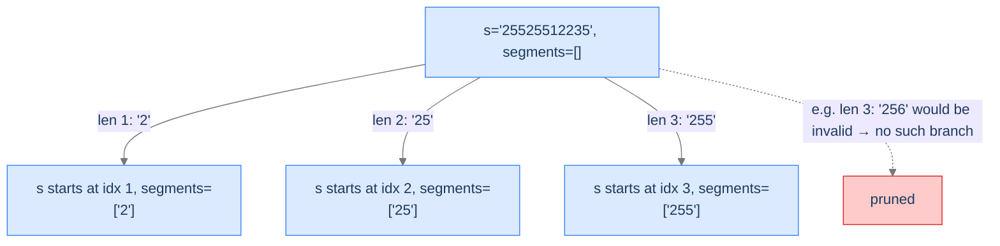

# Generate IP Addresses

A digit string can split into an IPv4 address in many ways, but most splits produce invalid octets. Validation per segment + segment-count constraint = several pruning rules combined.

---

## The Problem

Given a digit string `s`, return all valid IPv4 addresses formed by inserting three dots. An address has exactly 4 segments, each in `[0, 255]`, with no leading zeros (so `0.0.0.0` is fine but `01.0.0.0` is not).

```
Input:  s = "25525512235"
Output: ["255.255.12.235", "255.255.122.35"]

Input:  s = "025511135"
Output: ["0.255.11.135", "0.255.111.35"]

Input:  s = "789"
Output: []
```

---

## Examples

**Example 1**
```
Input:  s = "25525512235"
Output: [255.255.12.235, 255.255.122.35]
Explanation: Two ways to split 11 digits into 4 valid octets.
```

**Example 2**
```
Input:  s = "0000"
Output: [0.0.0.0]
Explanation: Each digit is its own segment "0" — the only valid split.
```

```quiz
{
  "prompt": "Why is '01.0.0.0' an invalid IPv4 address?",
  "options": [
    "01 is greater than 255",
    "Leading zeros are forbidden except for the literal string '0'",
    "There must be exactly 4 digits per segment",
    "IPv4 only allows single-digit segments"
  ],
  "answer": "Leading zeros are forbidden except for the literal string '0'"
}
```

## Constraints

- `1 ≤ s.length ≤ 20`
- `s` consists of digits only.

```python run viz=array viz-root=segments
from typing import List

class Solution:
    def generate_ip_addresses(self, s: str) -> List[str]:
        # Your code goes here — for each position, try segment lengths 1, 2, 3;
        # validate each segment (no leading zeros, value in [0,255]);
        # record when exactly 4 segments have consumed all of s
        return []

s = input()
result = Solution().generate_ip_addresses(s)
print('[' + ', '.join(result) + ']')
```

```java run viz=array viz-root=segments
import java.util.*;

public class Main {
    static class Solution {
        public List<String> generateIPAddresses(String s) {
            // Your code goes here — for each position, try segment lengths 1, 2, 3;
            // validate each segment (no leading zeros, value in [0,255]);
            // record when exactly 4 segments have consumed all of s
            return new ArrayList<>();
        }
    }

    public static void main(String[] args) {
        String s = new Scanner(System.in).nextLine();
        System.out.println(new Solution().generateIPAddresses(s));
    }
}
```

```testcases
{
  "args": [
    { "id": "s", "label": "s", "type": "string", "placeholder": "25525512235" }
  ],
  "cases": [
    { "args": { "s": "25525512235" }, "expected": "[255.255.12.235, 255.255.122.35]" },
    { "args": { "s": "025511135" }, "expected": "[0.255.11.135, 0.255.111.35]" },
    { "args": { "s": "789" }, "expected": "[]" },
    { "args": { "s": "0000" }, "expected": "[0.0.0.0]" },
    { "args": { "s": "1111" }, "expected": "[1.1.1.1]" },
    { "args": { "s": "255255255255" }, "expected": "[255.255.255.255]" },
    { "args": { "s": "010010" }, "expected": "[0.10.0.10, 0.100.1.0]" }
  ]
}
```

<details>
<summary><h2>What's the Recursion Doing?</h2></summary>


We're choosing where to place the three dots inside the string. Equivalently, we're picking the *length* of each segment (1, 2, or 3 characters), one at a time, until we've consumed all 4 segments.

Three pruning rules:
1. **Segment length bounded.** Segment length must be 1, 2, or 3.
2. **Leading zeros forbidden** (except a literal `"0"`).
3. **Numeric value bounded.** Segment value must be in `[0, 255]`.

Plus the structural constraint: **exactly 4 segments must consume exactly all of `s`** — neither too few nor too many.



<p align="center"><strong>At each level, three potential segment lengths (1, 2, or 3 chars). Each is validated before recursing — invalid segments produce no branch.</strong></p>

</details>
<details>
<summary><h2>Applying the Diagnostic Questions</h2></summary>


| # | Check | Answer |
|---|---|---|
| **Q1** | Some leaves invalid? | **Yes** — most splits don't produce valid IPv4 addresses. |
| **Q2** | Doomed-partial detectable? | **Yes** — invalid segment, leading-zero, or wrong segment count caught early. |
| **Q3** | Incremental decisions? | **Yes** — one segment per recursion level. |

### Q1 — Why "many leaves invalid"?

Most random splits produce segments outside `[0, 255]` or with leading zeros. ✓

### Q2 — Why "early detection"?

We can validate each segment as we extract it. Invalid → don't recurse. The other prune is segment-count: if we've placed 4 segments but haven't consumed all of `s`, that path is dead — return without recording. ✓

### Q3 — Why "incremental"?

Each recursion picks one more segment. ✓

</details>
<details>
<summary><h2>Solution &amp; Analysis</h2></summary>

### The Solution

```python solution time=O(81 · n) space=O(1)
from typing import List

class Solution:

    # Check if a part of the IP address is valid
    def is_valid_part(self, part: str) -> bool:

        # Leading zeros are invalid unless the part is exactly "0"
        if len(part) > 1 and part[0] == "0":
            return False

        # Convert part to integer and check range
        value = int(part)

        # Valid if in the range 0-255
        return 0 <= value <= 255

    # Get all valid segments starting from index
    def get_segments(self, s: str, index: int) -> List[str]:
        segments: List[str] = []

        # Loop through possible substring lengths (1 to 3)
        for length in range(1, 4):

            # Ensure we do not exceed the bounds of the string
            if index + length > len(s):
                break

            # Extract the substring for the current segment
            part = s[index: index + length]

            # Only include valid segments
            if self.is_valid_part(part):
                segments.append(part)

        return segments

    def generate_combinations(
        self,
        s: str,
        index: int,
        current_segments: List[str],
        ip_addresses: List[str],
    ):

        # If the current state has 4 segments, check for solution
        if len(current_segments) == 4:

            # If all characters in the string are used, store the
            # solution
            if index == len(s):
                ip_addresses.append(".".join(current_segments))

            # Return to continue exploring other possibilities
            return

        # Get all valid segments (choices) starting at this index
        segments = self.get_segments(s, index)

        # Loop through all valid choices
        for segment in segments:

            # Include the current part in the state (make choice)
            current_segments.append(segment)

            # Recurse with updated control (next starting index)
            self.generate_combinations(
                s, index + len(segment), current_segments, ip_addresses
            )

            # Backtrack by removing the last added part (revert choice)
            current_segments.pop()

    def generate_ip_addresses(self, s: str) -> List[str]:

        # List to store all valid IP addresses (solution states)
        ip_addresses: List[str] = []

        # Temporary list to store the current IP segments (state)
        current_segments: List[str] = []

        # Start the unconditional enumeration (backtracking) process from
        # index 0
        self.generate_combinations(s, 0, current_segments, ip_addresses)

        # Return the list of all valid IP addresses
        return ip_addresses


s = input()
result = Solution().generate_ip_addresses(s)
print('[' + ', '.join(result) + ']')
```

```java solution
import java.util.*;

public class Main {
    static class Solution {

        // Check if a part of the IP address is valid
        private boolean isValidPart(String part) {

            // Leading zeros are invalid unless the part is exactly "0"
            if (part.length() > 1 && part.charAt(0) == '0') {
                return false;
            }

            // Convert part to integer and check range
            int value = Integer.parseInt(part);

            // Valid if in the range 0-255
            return value >= 0 && value <= 255;
        }

        // Get all valid segments starting from index
        private List<String> getSegments(String s, int index) {
            List<String> segments = new ArrayList<>();

            // Loop through possible substring lengths (1 to 3)
            for (int len = 1; len <= 3; ++len) {

                // Ensure we do not exceed the bounds of the string
                if (index + len > s.length()) {
                    break;
                }

                // Extract the substring for the current segment
                String part = s.substring(index, index + len);

                // Only include valid segments
                if (isValidPart(part)) {
                    segments.add(part);
                }
            }

            return segments;
        }

        public void generateCombinations(
            String s,
            int index,
            List<String> currentSegments,
            List<String> ipAddresses
        ) {

            // If the current state has 4 segments, check for solution
            if (currentSegments.size() == 4) {

                // If all characters in the string are used, store the
                // solution
                if (index == s.length()) {
                    ipAddresses.add(String.join(".", currentSegments));
                }

                // Return to continue exploring other possibilities
                return;
            }

            // Get all valid segments (choices) starting at this index
            List<String> segments = getSegments(s, index);

            // Loop through all valid choices
            for (String segment : segments) {

                // Include the current part in the state (make choice)
                currentSegments.add(segment);

                // Recurse with updated control (next starting index)
                generateCombinations(
                    s,
                    index + segment.length(),
                    currentSegments,
                    ipAddresses
                );

                // Backtrack by removing the last added part (revert choice)
                currentSegments.remove(currentSegments.size() - 1);
            }
        }

        public List<String> generateIPAddresses(String s) {

            // List to store all valid IP addresses (solution states)
            List<String> ipAddresses = new ArrayList<>();

            // Temporary list to store the current IP segments (state)
            List<String> currentSegments = new ArrayList<>();

            // Start the unconditional enumeration (backtracking) process
            // from index 0
            generateCombinations(s, 0, currentSegments, ipAddresses);

            // Return the list of all valid IP addresses
            return ipAddresses;
        }
    }

    public static void main(String[] args) {
        String s = new Scanner(System.in).nextLine();
        System.out.println(new Solution().generateIPAddresses(s));
    }
}
```


<details>
<summary><strong>Trace — s = "25525512235"</strong></summary>

```
helper(idx=0, segs=[])
├─ try '2'   → valid → recurse(idx=1, ['2'])      ... eventually fails (too many chars left)
├─ try '25'  → valid → recurse(idx=2, ['25'])     ... eventually fails
├─ try '255' → valid → recurse(idx=3, ['255'])
│  ├─ try '2'   → valid → recurse(idx=4, ['255','2'])     ... eventually fails
│  ├─ try '25'  → valid → recurse(idx=5, ['255','25'])    ... eventually fails
│  ├─ try '255' → valid → recurse(idx=6, ['255','255'])
│  │  ├─ try '1'   → valid → recurse(idx=7, ['255','255','1'])
│  │  │  ├─ try '2'    → recurse(8, [...,'2'])      ... fails (too many chars)
│  │  │  ├─ try '22'   → recurse(9, [...,'22'])     ... fails (too many)
│  │  │  ├─ try '223'  → recurse(10, [...,'223'])   ... fails (too many)
│  │  ├─ try '12'  → valid → recurse(idx=8, ['255','255','12'])
│  │  │  ├─ try '2'    → recurse(9, [...,'2'])     leaf, idx=9 ≠ 11 → discard
│  │  │  ├─ try '23'   → recurse(10, [...,'23'])   leaf, idx=10 ≠ 11 → discard
│  │  │  ├─ try '235'  → recurse(11, [...,'235'])  leaf, idx=11=11 → RECORD "255.255.12.235"
│  │  ├─ try '122' → valid → recurse(idx=9, ['255','255','122'])
│  │  │  ├─ try '3'    → recurse(10, [...,'3'])    leaf, idx=10 ≠ 11 → discard
│  │  │  ├─ try '35'   → recurse(11, [...,'35'])   leaf, idx=11=11 → RECORD "255.255.122.35"

Result: ["255.255.12.235", "255.255.122.35"]
```

</details>

### Complexity Analysis

| Resource | Cost | Why |
|---|---|---|
| **Time** | `O(81 · n)` = `O(n)` | At most `3⁴ = 81` ways to split into 4 segments; each takes `O(n)` to validate and join. |
| **Space (output)** | `O(n × num_results)` | Up to 81 results × ~16 chars each. |
| **Space (stack)** | `O(1)` (depth ≤ 4) | Constant — IP addresses always have 4 segments. |

The constant depth is unusual; most backtracking has linear depth. The bound here is the *fixed* number of segments.

### Edge Cases

| Case | Example | Expected |
|---|---|---|
| Too short | `"12"` | `[]` (can't split into 4 segments). |
| Too long | `"123456789012345"` | `[]` (every split has at least one over-3-char segment). |
| All zeros | `"0000"` | `["0.0.0.0"]`. |
| Leading zeros | `"010010"` | `["0.10.0.10", "0.100.1.0"]` (others have leading zeros). |
| Boundary 255 | `"255255255255"` | `["255.255.255.255"]`. |

</details>
<details>
<summary><h2>Key Takeaway</h2></summary>


Generate IPs combines several pruning rules: per-segment validation, segment-count constraint, total-length constraint. The recipe still fits the conditional-enumeration template — only the validation function gets richer. The next problem swaps the *style* of recursion: instead of "build an output one piece at a time," we *swap* characters in place to generate permutations.

</details>
