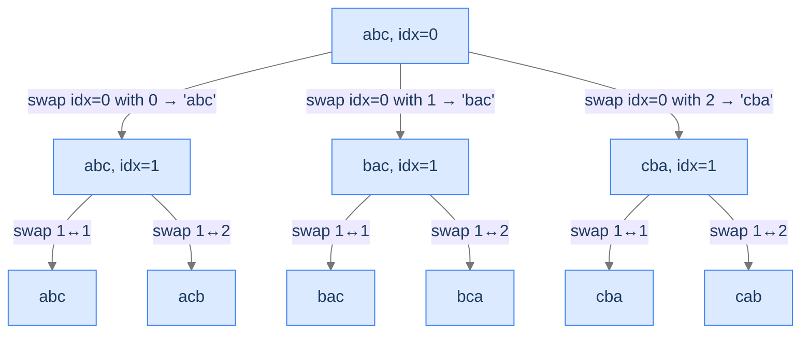

# String Permutations

The swap-and-undo recipe. Different shape from the previous three problems — we mutate the input string directly to produce each permutation, then swap back to undo.

---

## The Problem

Given a string `s`, return all permutations. Order doesn't matter. The input length is bounded (e.g., ≤ 5 characters).

```
Input:  s = "abc"
Output: [abc, acb, bac, bca, cba, cab]
```

---

## Examples

**Example 1**
```
Input:  s = "abc"
Output: [abc, acb, bac, bca, cba, cab]
Explanation: 3! = 6 permutations. Swap-and-undo visits them in DFS order — not lexicographic.
```

**Example 2**
```
Input:  s = "ab"
Output: [ab, ba]
Explanation: 2! = 2 permutations.
```

```quiz
{
  "prompt": "Why does swap(0,2) on 'abc' produce 'cba' and not 'abc'?",
  "options": [
    "It swaps the first and last characters",
    "It reverses the string",
    "It swaps characters at positions 0 and 2 — 'a' and 'c'",
    "It's a no-op when the indices match"
  ],
  "answer": "It swaps characters at positions 0 and 2 — 'a' and 'c'"
}
```

## Constraints

- `1 ≤ s.length ≤ 6`
- `s` consists of lowercase English letters.
- Output in any order; these tests use the swap-and-undo DFS visit order.

```python run viz=array viz-root=result
from typing import List

class Solution:
    def string_permutations(self, s: str) -> List[str]:
        # Your code goes here — convert s to a list, backtrack from index 0;
        # at each level swap state[index] with state[i] for i in [index, len-1],
        # recurse, then swap back
        return []

s = input()
result = Solution().string_permutations(s)
print('[' + ', '.join(result) + ']')
```

```java run viz=array viz-root=result
import java.util.*;

public class Main {
    static class Solution {
        public List<String> stringPermutations(String s) {
            // Your code goes here — convert s to StringBuilder, backtrack from index 0;
            // at each level swap state[index] with state[i] for i in [index, len-1],
            // recurse, then swap back
            return new ArrayList<>();
        }
    }

    public static void main(String[] args) {
        String s = new Scanner(System.in).nextLine();
        System.out.println(new Solution().stringPermutations(s));
    }
}
```

```testcases
{
  "args": [
    { "id": "s", "label": "s", "type": "string", "placeholder": "abc" }
  ],
  "cases": [
    { "args": { "s": "abc" }, "expected": "[abc, acb, bac, bca, cba, cab]" },
    { "args": { "s": "ab" }, "expected": "[ab, ba]" },
    { "args": { "s": "a" }, "expected": "[a]" },
    { "args": { "s": "xyz" }, "expected": "[xyz, xzy, yxz, yzx, zyx, zxy]" },
    { "args": { "s": "ba" }, "expected": "[ba, ab]" }
  ]
}
```

<details>
<summary><h2>What's the Recursion Doing?</h2></summary>


We process positions left-to-right. At position `index`, we try each "remaining unused character" by swapping it into position `index`. After recursing, we swap it back. The implicit choice-pool is "everything not yet placed in positions `0..index-1`."



<p align="center"><strong>Permutation tree via swap-and-undo. At each level, we swap the current position with each remaining position. The leaves are all <code>n!</code> permutations.</strong></p>

This is technically *unconditional* — every leaf is a valid permutation. We include it in the conditional-enumeration chapter because the *style* (swap during descent, swap-back to undo) is a different recipe from the earlier append/pop pattern, and you'll see it in many real conditional-enumeration problems where permutation-generation is a sub-step.

</details>
<details>
<summary><h2>Solution &amp; Analysis</h2></summary>

### The Solution

```python solution time=O(n · n!) space=O(n)
from typing import List

class Solution:
    def generate_permutations(
        self, state: List[str], index: int, result: List[str]
    ) -> None:

        # If index reaches the end of the string, we have found a
        # permutation (solution state)
        if index == len(state):

            # Add the current permutation (string) to the result list
            result.append("".join(state))

            # Return to continue exploring other possibilities
            return

        # Loop through the characters starting from the current index
        # to generate permutations (dynamic choices)
        for i in range(index, len(state)):

            # Swap the characters at the current index and i to create a new
            # permutation (make choice)
            state[index], state[i] = state[i], state[index]

            # Recursively call generate for the remaining characters
            # (reduced input -> index + 1)
            self.generate_permutations(state, index + 1, result)

            # Swap back the characters to revert to the original string
            # (revert choice)
            state[index], state[i] = state[i], state[index]

    def string_permutations(self, s: str) -> List[str]:

        # List to store the permutations
        result: List[str] = []

        # Convert string to list of characters
        state = list(s)

        # Start the conditional enumeration process from index 0
        self.generate_permutations(state, 0, result)

        # Return the list containing all permutations
        return result


s = input()
result = Solution().string_permutations(s)
print('[' + ', '.join(result) + ']')
```

```java solution
import java.util.*;

public class Main {
    static class Solution {
        private void swap(StringBuilder str, int left, int right) {

            // Storing the left and right character of string
            char leftChar = str.charAt(left), rightChar = str.charAt(right);
            str.setCharAt(left, rightChar);
            str.setCharAt(right, leftChar);
        }

        private void generatePermutations(
            StringBuilder state,
            int index,
            List<String> result
        ) {

            // If index reaches the end of the string, we have found a
            // permutation (solution state)
            if (index == state.length()) {

                // Add the current permutation (string) to the result list
                result.add(state.toString());

                // Return to continue exploring other possibilities
                return;
            }

            // Loop through the characters starting from the current index
            // to generate permutations (dynamic choices)
            for (int i = index; i < state.length(); i++) {

                // Swap the characters at the current index and i to create a
                // new permutation (make choice)
                swap(state, index, i);

                // Recursively call generate for the remaining characters
                // (reduced input -> index + 1)
                generatePermutations(state, index + 1, result);

                // Swap back the characters to revert to the original string
                // (revert choice)
                swap(state, index, i);
            }
        }

        public List<String> stringPermutations(String s) {

            // List to store the permutations
            List<String> result = new ArrayList<>();

            // Convert string to StringBuilder for easy swapping
            StringBuilder state = new StringBuilder(s);

            // Start the conditional enumeration process from index 0
            generatePermutations(state, 0, result);

            // Return the list containing all permutations
            return result;
        }
    }

    public static void main(String[] args) {
        String s = new Scanner(System.in).nextLine();
        System.out.println(new Solution().stringPermutations(s));
    }
}
```


<details>
<summary><strong>Trace — s = "abc"</strong></summary>

```
helper("abc", index=0)
├─ swap 0,0 → "abc" → helper("abc", index=1)
│  ├─ swap 1,1 → "abc" → helper("abc", index=2) → leaf "abc" → swap back
│  ├─ swap 1,2 → "acb" → helper("acb", index=2) → leaf "acb" → swap back → "abc"
│  swap back
├─ swap 0,1 → "bac" → helper("bac", index=1)
│  ├─ swap 1,1 → "bac" → leaf
│  ├─ swap 1,2 → "bca" → leaf → swap back → "bac"
│  swap back → "abc"
├─ swap 0,2 → "cba" → helper("cba", index=1)
│  ├─ swap 1,1 → "cba" → leaf
│  ├─ swap 1,2 → "cab" → leaf → swap back → "cba"
│  swap back → "abc"

Result: ["abc","acb","bac","bca","cba","cab"]
```

</details>

### Complexity Analysis

| Resource | Cost |
|---|---|
| **Time** | `O(n · n!)` |
| **Space (output)** | `O(n · n!)` |
| **Space (stack)** | `O(n)` |

`n!` permutations × `O(n)` to copy each into the result.

### Edge Cases

| Case | Example | Expected |
|---|---|---|
| Empty | `""` | `[""]` (one empty permutation). |
| Single | `"a"` | `["a"]`. |
| Duplicates | `"aa"` | swap-style produces `["aa", "aa"]` — two identical entries. (To dedupe: skip i if chars[i] equals chars[index], a separate variant.) |
| Five chars | `"abcde"` | 120 permutations. |

</details>
<details>
<summary><h2>Key Takeaway</h2></summary>


String Permutations is the swap-and-undo recipe. The state mutation is happening *inside* the input itself, and the undo restores it for the parent. This shape is also used in N-Queens (the Backtracking Search lesson) where we mutate a board representation directly. With these four problems, you've now covered conditional enumeration's full vocabulary: choice-bounded pruning (parentheses), constraint-bounded pruning (target sum), multi-pronged validation (IP addresses), and swap-and-undo state mutation (permutations).

You came in with the discipline of unconditional enumeration. You're leaving with two new tools — pruning rules and constraint checking — that turn brute-force backtracking into something practical for problems with billions of candidates. The next lesson lifts the focus from *enumeration* to *search*: instead of finding *all* solutions, we want *one* — and the algorithm can stop as soon as it succeeds.

**Transfer challenge — try before the Backtracking Search lesson:** Modify the Generate Parentheses solution to count the number of valid combinations *without storing them all*. What changes? What's the time complexity? (Hint: the recursion's structure stays the same; only the leaf action changes.)

<details>
<summary><strong>Answer — open after you've thought about it</strong></summary>

```python run viz=array
class Solution:
    def count_balanced(self, n: int) -> int:
        return self._helper(n, 0, 0, 0)

    def _helper(self, n: int, length: int, opens: int, closes: int) -> int:
        if length == 2 * n:
            return 1                         # one valid leaf
        count = 0
        if opens < n:
            count += self._helper(n, length + 1, opens + 1, closes)
        if closes < opens:
            count += self._helper(n, length + 1, opens, closes + 1)
        return count


print(Solution().count_balanced(3))   # 5 (the 3rd Catalan number)
```

The change: instead of recording leaves into a list, return `1` from each leaf and *sum* the returns. The recursion shape and pruning are identical; the leaf action is different. Time and space stay `O(n · C(n))` and `O(n)` respectively — same tree, less output.

This pattern (count instead of enumerate) is a tiny step toward dynamic programming. Memoising the call by `(opens, closes, length)` would collapse the repeated subtrees and turn this into `O(n²)` time. **You're one cache away from the next major topic.**

</details>

</details>
