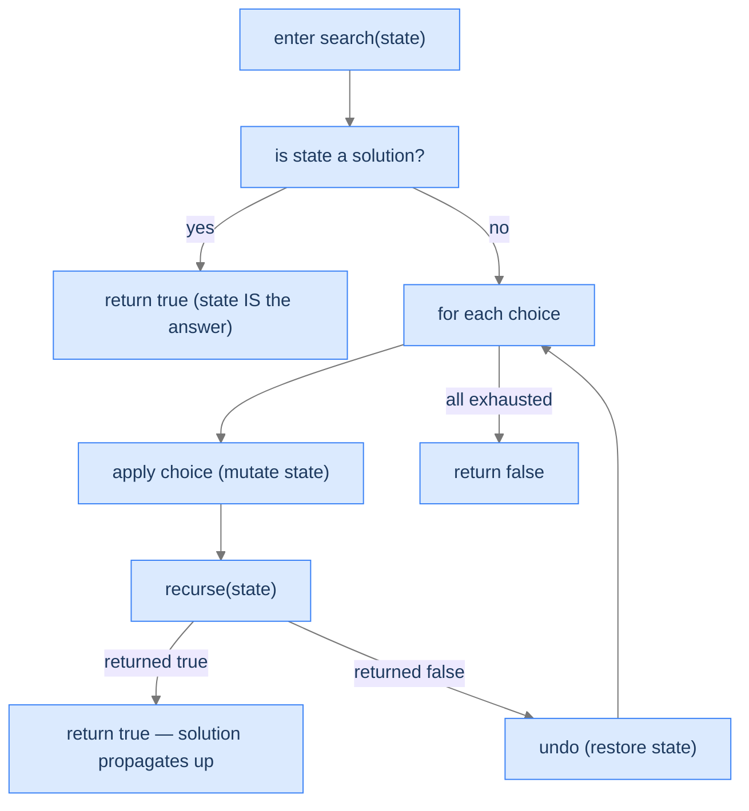

## Why It Exists

The enumeration patterns built an *output* — a list, a string — separate from the input. **Backtracking search** is different: the **state itself is the candidate solution**. A maze, a chessboard, a sudoku grid — the algorithm *mutates the world* as it walks, and when the world reaches a goal state, the answer is wherever the world ended up. This is the 8-queens hook from the [backtracking intro](/cortex/data-structures-and-algorithms/algorithms-by-strategy-backtracking-introduction-to-backtracking) made concrete.

Each frame **applies** a choice (place a queen, mark a cell visited, write a digit), **recurses**, and on failure **undoes** the mutation so the next sibling starts in a clean world. The undo was implicit in enumeration (`pop` the last element); here it's explicit and structural — the *same* board square gets a queen placed and removed, the *same* cell toggled. The world is shared, so it must be restored *exactly* before the parent's loop tries the next option. Get the undo wrong and every later branch sees a polluted world.



<p align="center"><strong>The search recipe: apply, recurse, and either propagate <code>true</code> upward or undo and try the next choice. The world is mutated and restored throughout.</strong></p>

## See It Work

**N-Queens** — count placements of `n` non-attacking queens. One queen per row; `cols`/`diag`/`anti` sets track threats. Apply (add to the sets), recurse to the next row, **undo** (discard from the sets).

```python run viz=array
def n_queens(n):
    cols, diag, anti = set(), set(), set()
    count = [0]
    def place(row):
        if row == n:                                     # goal: all rows filled
            count[0] += 1; return
        for c in range(n):
            if c in cols or (row - c) in diag or (row + c) in anti:
                continue                                 # square attacked — skip
            cols.add(c); diag.add(row - c); anti.add(row + c)             # apply
            place(row + 1)                                               # recurse
            cols.discard(c); diag.discard(row - c); anti.discard(row + c)  # UNDO
    place(0)
    return count[0]

print("n=4:", n_queens(4))
print("n=8:", n_queens(8))
```

```java run viz=array
import java.util.*;
public class Main {
    static int count;
    static Set<Integer> cols, diag, anti;
    static void place(int row, int n) {
        if (row == n) { count++; return; }
        for (int c = 0; c < n; c++) {
            if (cols.contains(c) || diag.contains(row-c) || anti.contains(row+c)) continue;
            cols.add(c); diag.add(row-c); anti.add(row+c);              // apply
            place(row + 1, n);                                          // recurse
            cols.remove(c); diag.remove(row-c); anti.remove(row+c);     // UNDO
        }
    }
    static int nQueens(int n) {
        count = 0; cols = new HashSet<>(); diag = new HashSet<>(); anti = new HashSet<>();
        place(0, n); return count;
    }
    public static void main(String[] args) {
        System.out.println("n=4: " + nQueens(4));
        System.out.println("n=8: " + nQueens(8));
    }
}
```

Both print `n=4: 2` and `n=8: 92` — the classic queen counts. The `diag` (row − col) and `anti` (row + col) sets give `O(1)` threat checks, and the discard-after-recurse restores them for the next column.

## How It Works

The skeleton is conditional enumeration's, but with two structural shifts — the state *is* the answer, and the recursion returns a **boolean** that propagates success:

```
function search(state):
    if state is a solution: return true        # state already holds the answer
    for each viable choice:
        apply(state, choice)                    # mutate the world
        if search(state): return true           # success bubbles straight up
        undo(state, choice)                     # explicit undo on failure
    return false                                # all choices exhausted
```

| | Enumeration | Search (this pattern) |
|---|---|---|
| Candidate | a list/string being built | the world's current state |
| Stored by | append to `current` | mutate the world directly |
| Returns | `void` (record at leaves) | `bool` (did this branch succeed?) |
| Success | record leaf, continue siblings | return `true`, stop (for "find one") |
| Undo restores | the `current` list (`pop`) | the world (un-place, erase, unmark) |

Because the world is *mutated, not cloned*, search avoids `O(state)` copies per call — auxiliary space drops to `O(1)`, with `O(depth)` stack. "Find one" returns `true` and stops; "find all" replaces that with *record-and-continue*. Three diagnostics: **Q1** — is the *state itself* the answer (no separate output)? **Q2** — does success propagate as a boolean (or stop the search)? **Q3** — is an *explicit undo* needed to restore the shared world? All "yes" → backtracking search.

> **Key takeaway.** Backtracking search = **apply → recurse → undo** on a *shared, mutated world* that *is* the answer, with a boolean propagating success. Mutate-not-clone keeps it `O(1)` auxiliary; the explicit undo is what keeps it *correct* — skip it and later branches inherit a polluted world.

## Trace It

The discard-after-recurse looks like tidy housekeeping. But the `cols`/`diag`/`anti` sets are the shared world, and they gate *every* future placement.

**Predict before you run:** delete the undo (the three `discard` calls). How many solutions does `n_queens(4)` report — still 2, or something else?

```python run viz=array
def n_queens_noundo(n):
    cols, diag, anti = set(), set(), set()
    count = [0]
    def place(row):
        if row == n: count[0] += 1; return
        for c in range(n):
            if c in cols or (row - c) in diag or (row + c) in anti: continue
            cols.add(c); diag.add(row - c); anti.add(row + c)   # apply
            place(row + 1)
            # BUG: no undo — threats from abandoned branches are never cleared
    place(0)
    return count[0]

print("no-undo n=4:", n_queens_noundo(4))
print("no-undo n=8:", n_queens_noundo(8))
```

<details>
<summary><strong>Reveal</strong></summary>

It reports **0** solutions for both — total failure. Without the undo, every queen ever *tentatively* placed leaves its column and diagonals marked as threatened forever. After the search explores and abandons a few partial placements, the `cols`/`diag`/`anti` sets are so polluted that *no* square anywhere looks safe, so the recursion can never fill all `n` rows and never reaches the `row == n` goal. The shared world that makes search efficient (no cloning) is exactly what corrupts the answer when you forget to restore it. And note the failure mode: not a crash, just a silently wrong `0` — the hardest kind of bug to spot. The explicit undo isn't optional cleanup; it's the invariant that each sibling branch explores from the same clean world the parent saw.

</details>

## Your Turn

**Rat in a Maze** — find *any* path from the top-left to the bottom-right through `0` cells (1 = wall). Mark a cell visited (`-1`) on the way in, recurse over the four neighbours, and undo (`0`) on failure. Success returns `true` and bubbles up.

```python run viz=array
def find_path(maze):
    if not maze or not maze[0]: return False
    R, C = len(maze), len(maze[0])
    def search(r, c):
        if not (0 <= r < R and 0 <= c < C) or maze[r][c] != 0:
            return False                                  # out of bounds / wall / visited
        if r == R - 1 and c == C - 1:
            return True                                   # goal reached
        maze[r][c] = -1                                   # apply: mark visited
        for dr, dc in ((1,0), (0,1), (-1,0), (0,-1)):
            if search(r + dr, c + dc):
                maze[r][c] = 0; return True               # path found — bubble up
        maze[r][c] = 0                                    # undo on failure
        return False
    return search(0, 0)

print(find_path([[0,1,0], [0,0,0], [1,0,0]]))   # True
print(find_path([[0,1], [1,0]]))                # False — diagonal blocked
```

```java run viz=array
public class Main {
    static boolean search(int[][] m, int r, int c) {
        int R = m.length, C = m[0].length;
        if (r < 0 || r >= R || c < 0 || c >= C || m[r][c] != 0) return false;
        if (r == R - 1 && c == C - 1) return true;
        m[r][c] = -1;                                     // apply
        int[][] dirs = {{1,0}, {0,1}, {-1,0}, {0,-1}};
        for (int[] d : dirs) if (search(m, r + d[0], c + d[1])) { m[r][c] = 0; return true; }
        m[r][c] = 0;                                       // undo
        return false;
    }
    static boolean findPath(int[][] m) { return m.length > 0 && m[0].length > 0 && search(m, 0, 0); }
    public static void main(String[] args) {
        System.out.println(findPath(new int[][]{{0,1,0},{0,0,0},{1,0,0}}));   // true
        System.out.println(findPath(new int[][]{{0,1},{1,0}}));              // false
    }
}
```

Both print `True` then `False`. The maze cell toggles `0 → -1 → 0` exactly as the queen toggles in/out of the threat sets — same apply/recurse/undo, different world. The four problems in this section's **Problems** folder run the gamut: rat-in-a-maze (find one path), word-search (find one word), N-Queens (find all configurations), and sudoku (fill the whole grid).

## Reflect & Connect

- **Search is enumeration's mirror.** Enumeration appends to an output and records at leaves; search mutates the world and propagates a boolean. Same choose/recurse/undo skeleton — the difference is *where the answer lives* (a separate list vs. the world itself).
- **The explicit undo is correctness, not cleanup.** Because the world is shared and mutated, every abandoned choice must be reversed or later branches see ghosts. The bug manifests as silently wrong answers, not crashes — the worst kind.
- **Find-one vs find-all is one line.** "Find one" returns `true` and stops (early termination, often a huge saving); "find all" records the goal state and *continues* exploring siblings. The undo machinery is identical.
- **Mutate-not-clone is the efficiency.** Sharing one world and restoring it costs `O(1)` auxiliary, versus `O(state)` per call if you cloned. It completes the backtracking spectrum: [unconditional](/cortex/data-structures-and-algorithms/algorithms-by-strategy-backtracking-pattern-unconditional-enumeration) (no prune) → [conditional](/cortex/data-structures-and-algorithms/algorithms-by-strategy-backtracking-pattern-conditional-enumeration) (prune partials) → search (mutate a world + undo).

## Recall

<details>
<summary><strong>Q:</strong> What distinguishes backtracking search from enumeration?</summary>

**A:** The state itself is the candidate solution — the algorithm mutates a shared world (grid/board) rather than appending to a separate output, and the recursion returns a boolean that propagates success.

</details>
<details>
<summary><strong>Q:</strong> The search skeleton?</summary>

**A:** Goal check (return true); for each viable choice: apply (mutate the world), recurse, `if success return true`, else undo and try the next; return false when exhausted.

</details>
<details>
<summary><strong>Q:</strong> Why does forgetting the undo give silently wrong answers?</summary>

**A:** The world is shared; an un-restored mutation from an abandoned branch pollutes every sibling and ancestor's view (e.g. N-Queens reports 0 because phantom threats block all squares). No crash — just wrong results.

</details>
<details>
<summary><strong>Q:</strong> Find-one vs find-all — what changes?</summary>

**A:** Find-one returns `true` on the goal and stops (early termination). Find-all records the goal state and continues exploring siblings. The apply/recurse/undo machinery is the same.

</details>
<details>
<summary><strong>Q:</strong> Why mutate the world instead of cloning per call?</summary>

**A:** Mutating + undoing keeps auxiliary space `O(1)` (plus `O(depth)` stack); cloning the whole state at each call would be `O(state)` per frame. The trade is having to write the undo correctly.

</details>

## Sources & Verify

- **Skiena**, *The Algorithm Design Manual*, 3rd ed., §9.2–9.3 — backtracking search, N-Queens, and sudoku as the canonical "mutate and undo" problems.
- **CLRS** (Cormen, Leiserson, Rivest, Stein), *Introduction to Algorithms*, 3rd ed. — recursion and exhaustive search underpinning constraint-satisfaction search.
- **LeetCode** 51/52 (N-Queens), 37 (Sudoku Solver), 79 (Word Search), and the classic Rat-in-a-Maze are the canonical backtracking-search drills; the `2`/`92` queen counts, the no-undo `0`, and the maze `True`/`False` above come from the runnable blocks — re-run to verify.
