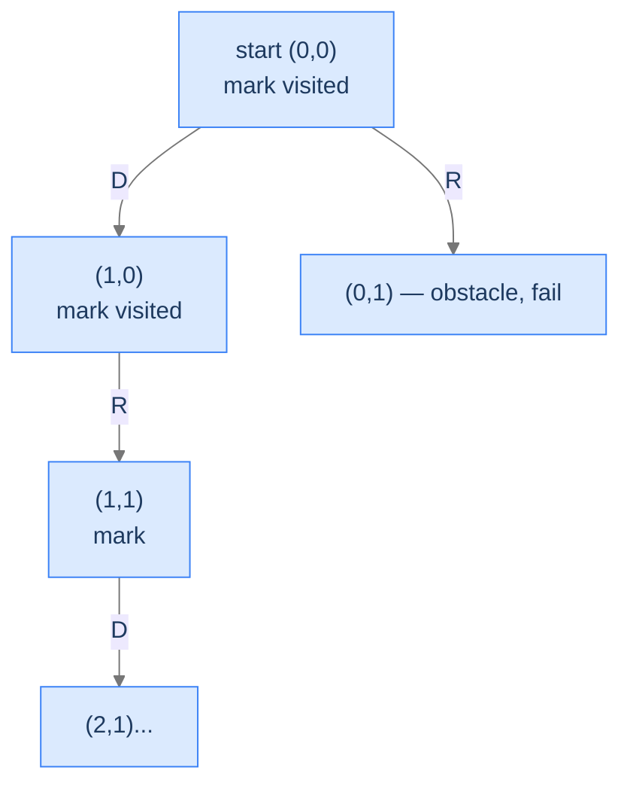

# Rat in a Maze

The canonical backtracking-search problem. Walk a 2D grid; pick directions; mark visited cells to prevent cycles; reach the goal or fail.

---

## The Problem

Given an `N × M` maze where `0` is walkable and `1` is an obstacle, the rat starts at `(0, 0)` and must reach `(N-1, M-1)`. Return the path as a string of moves: `U` (up), `D` (down), `L` (left), `R` (right). If no path exists, return an empty string.

```
Input:  maze = [[0,1,1,1],
                [0,0,1,0],
                [0,0,1,1],
                [1,0,0,0]]
Output: "DDRDRR"   (or "DRDDRR" — any valid path)
```

---

## Examples

**Example 1**
```
Input:  maze = [[0,1,1,1],[0,0,1,0],[0,0,1,1],[1,0,0,0]]
Output: DDRDRR
Explanation: D→(1,0), D→(2,0), R→(2,1), D→(3,1), R→(3,2), R→(3,3) — the first valid path the DFS finds.
```

**Example 2**
```
Input:  maze = [[0,1],[1,0]]
Output: (empty string)
Explanation: The two 0-cells are diagonal — no orthogonal path exists.
```

## Constraints

- `1 ≤ N, M ≤ 20`
- `maze[i][j] ∈ {0, 1}` — 0 = walkable, 1 = obstacle.
- Returns the first valid path found in D→R→U→L order, or empty string if none.
- If start `(0,0)` or end `(N-1,M-1)` is blocked, return `""` immediately.

```python run viz=grid viz-root=maze
import ast

class Solution:
    def rat_in_a_maze(self, maze):
        # Your code goes here
        # Mark visited cells with -1, undo on failure
        return ""

maze = ast.literal_eval(input())
print(Solution().rat_in_a_maze(maze))
```

```java run viz=grid viz-root=maze
import java.util.*;

public class Main {
    static class Solution {
        public String ratInAMaze(int[][] maze) {
            // Your code goes here
            // Mark visited cells with -1, undo on failure
            return "";
        }
    }

    static int[][] parseIntMatrix(String line) {
        String trimmed = line.trim();
        if (trimmed.equals("[]") || trimmed.equals("[[]]")) return new int[0][];
        String inner = trimmed.substring(1, trimmed.length() - 1).trim();
        String[] rows = inner.split("\\],\\s*\\[");
        int[][] mat = new int[rows.length][];
        for (int r = 0; r < rows.length; r++) {
            String row = rows[r].replaceAll("[\\[\\]\\s]", "");
            if (row.isEmpty()) { mat[r] = new int[0]; continue; }
            String[] parts = row.split(",");
            mat[r] = new int[parts.length];
            for (int c = 0; c < parts.length; c++) mat[r][c] = Integer.parseInt(parts[c].trim());
        }
        return mat;
    }

    public static void main(String[] args) {
        Scanner sc = new Scanner(System.in);
        int[][] maze = parseIntMatrix(sc.nextLine());
        System.out.println(new Solution().ratInAMaze(maze));
    }
}
```

```testcases
{
  "args": [
    { "id": "maze", "label": "maze", "type": "int[][]", "placeholder": "[[0,1,1,1],[0,0,1,0],[0,0,1,1],[1,0,0,0]]" }
  ],
  "cases": [
    { "args": { "maze": "[[0,1,1,1],[0,0,1,0],[0,0,1,1],[1,0,0,0]]" }, "expected": "DDRDRR" },
    { "args": { "maze": "[[0,0],[0,0]]" }, "expected": "DR" },
    { "args": { "maze": "[[0]]" }, "expected": "" },
    { "args": { "maze": "[[1,0],[0,0]]" }, "expected": "" },
    { "args": { "maze": "[[0,0],[0,1]]" }, "expected": "" },
    { "args": { "maze": "[[0,0,0,0]]" }, "expected": "RRR" },
    { "args": { "maze": "[[0,0,1],[1,0,1],[1,0,0]]" }, "expected": "RDDR" }
  ]
}
```

<details>
<summary><h2>What Makes This a Search Problem?</h2></summary>


Three signs:
1. The world (the maze grid) is the state we're navigating.
2. We need *one* path, not all of them — early termination is a win.
3. We must mark cells as visited during the descent to avoid cycling, and unmark on backtrack to allow other paths to use them.



<p align="center"><strong>Search descends through the grid, marking visited cells. On a dead end, the recursion returns false, the cell is unmarked, and the parent tries another direction.</strong></p>

</details>
<details>
<summary><h2>Applying the Diagnostic Questions</h2></summary>


| # | Check | Answer |
|---|---|---|
| **Q1** | State IS the answer? | **Yes** — the path string + the visited grid is the search state. |
| **Q2** | Boolean propagation? | **Yes** — `search(row, col)` returns `true` if a path exists from here. |
| **Q3** | Explicit undo? | **Yes** — unmark the cell on failure to allow other paths to traverse it. |

### Q1 — Why "state IS the answer"?

The path string we're building and the maze's visited markings together form the candidate. When we reach the goal, the path string is the answer. The state is the candidate. ✓

### Q2 — Why "boolean propagation"?

Each recursion asks "from this cell, can I reach the goal?" The answer is yes or no — a boolean. When yes propagates up, the caller knows it doesn't need to try other directions. ✓

### Q3 — Why "explicit undo"?

If we don't unmark a cell after a failed exploration from it, subsequent sibling branches can't traverse that cell — even though they could legitimately. The unmark restores the maze for siblings. ✓

</details>
<details>
<summary><h2>The Visit-Mark-Recurse-Unmark Strategy (Visualised)</h2></summary>


<div class="d2-slides" data-caption="The maze gets mutated as we descend; on failure, mutations are undone before sibling branches run.">

```d2
state: "Start at (0,0)" {
  grid: "maze\n[0,1,1,1]\n[0,0,1,0]\n[0,0,1,1]\n[1,0,0,0]" {style.fill: "#dbeafe"; style.stroke: "#3b82f6"}
}
```

```d2
state: "Marked (0,0) = -1, descending Down to (1,0)" {
  grid: "maze\n[-1,1,1,1]\n[0,0,1,0]\n[0,0,1,1]\n[1,0,0,0]\npath = 'D'" {style.fill: "#fde68a"; style.stroke: "#d97706"}
}
```

```d2
state: "(1,0) marked, descend to (2,0) = D" {
  grid: "maze\n[-1,1,1,1]\n[-1,0,1,0]\n[0,0,1,1]\n[1,0,0,0]\npath = 'DD'" {style.fill: "#fde68a"; style.stroke: "#d97706"}
}
```

```d2
state: "(2,0) marked, R to (2,1)" {
  grid: "path = 'DDR'" {style.fill: "#bbf7d0"; style.stroke: "#16a34a"}
}
```

```d2
state: "Continue exploring; eventual success → 'DDRDRR'" {
  grid: "path = 'DDRDRR' — goal reached!" {style.fill: "#ede9fe"; style.stroke: "#7c3aed"}
}
```

</div>

</details>
<details>
<summary><h2>Solution &amp; Analysis</h2></summary>

### The Solution

```python solution time=O(4^(R·C)) space=O(R·C)
import ast
from typing import List, Tuple

class Solution:

    # Choices: (direction char, row change, col change)
    choices: List[Tuple[str, int, int]] = [
        ("D", 1, 0),
        ("R", 0, 1),
        ("U", -1, 0),
        ("L", 0, -1),
    ]

    # Check if a cell is valid for movement
    def is_valid(
        self, maze: List[List[int]], row: int, col: int
    ) -> bool:
        return (
            0 <= row < len(maze)
            and 0 <= col < len(maze[0])
            and maze[row][col] == 0
        )

    def search(
        self, maze: List[List[int]], row: int, col: int, path: List[str]
    ) -> bool:

        # If we reached the destination (bottom-right corner of the
        # maze),
        if row == len(maze) - 1 and col == len(maze[0]) - 1:

            # Valid path is now already stored in path
            return True

        # Store the value of the current cell to mark it as visited
        cell_value = maze[row][col]

        # Mark the current cell as visited to avoid revisiting it
        maze[row][col] = -1

        # Loop through all possible choices (directions)
        for dir, dx, dy in self.choices:
            new_row = row + dx
            new_col = col + dy

            # Check if the new position can be visited
            if self.is_valid(maze, new_row, new_col):

                # Make choice: append direction to current path
                path.append(dir)

                # Recurse to explore further from the new cell
                if self.search(maze, new_row, new_col, path):

                    # Unmake choice: mark the current cell as unvisited
                    maze[row][col] = cell_value

                    # If a valid path is found, return true
                    return True

                # Unmake choice: remove the last added direction
                path.pop()

        # Unmake choice: mark the current cell as unvisited
        maze[row][col] = cell_value

        # No path found from this cell, return false
        return False

    def rat_in_a_maze(self, maze: List[List[int]]) -> str:
        if not maze or not maze[0] or maze[0][0] != 0:
            return ""

        # Current path (state)
        path: List[str] = []

        # Start backtracking from the top-left corner (0,0)
        self.search(maze, 0, 0, path)

        # Return the found path
        return "".join(path)


maze = ast.literal_eval(input())
print(Solution().rat_in_a_maze(maze))
```

```java solution
import java.util.*;

public class Main {
    static class Solution {

        // Direction list: (direction char, row change, col change)
        private final char[] dirs = { 'D', 'R', 'U', 'L' };
        private final int[] dx = { 1, 0, -1, 0 };
        private final int[] dy = { 0, 1, 0, -1 };

        // Check if a cell is valid for movement
        private boolean isValid(
            int[][] maze,
            int rows,
            int cols,
            int row,
            int col
        ) {
            return (
                row >= 0 &&
                row < rows &&
                col >= 0 &&
                col < cols &&
                maze[row][col] == 0
            );
        }

        private boolean search(
            int[][] maze,
            int rows,
            int cols,
            int row,
            int col,
            StringBuilder path
        ) {

            // If we reached the destination (bottom-right corner of the
            // maze),
            if (row == rows - 1 && col == cols - 1) {

                // Valid path is now already stored in path
                return true;
            }

            // Store the value of the current cell to mark it as visited
            int cellValue = maze[row][col];

            // Mark the current cell as visited to avoid revisiting it
            maze[row][col] = -1;

            // Loop through all possible choices (directions)
            for (int i = 0; i < 4; i++) {
                int newRow = row + dx[i];
                int newCol = col + dy[i];

                // Check if the new position can be visited
                if (isValid(maze, rows, cols, newRow, newCol)) {

                    // Make choice: append direction to current path
                    path.append(dirs[i]);

                    // Recurse to explore further from the new cell
                    if (search(maze, rows, cols, newRow, newCol, path)) {

                        // Unmake choice: mark the current cell as unvisited
                        maze[row][col] = cellValue;

                        // If a valid path is found, return true
                        return true;
                    }

                    // Unmake choice: remove the last added direction
                    path.deleteCharAt(path.length() - 1);
                }
            }

            // Unmake choice: mark the current cell as unvisited
            maze[row][col] = cellValue;

            // No path found from this cell, return false
            return false;
        }

        public String ratInAMaze(int[][] maze) {
            if (
                maze == null ||
                maze.length == 0 ||
                maze[0].length == 0 ||
                maze[0][0] != 0
            ) {
                return "";
            }

            int rows = maze.length;
            int cols = maze[0].length;

            // Current path (state)
            StringBuilder path = new StringBuilder();

            // Start backtracking from the top-left corner (0,0)
            search(maze, rows, cols, 0, 0, path);

            // Return the found path
            return path.toString();
        }
    }

    static int[][] parseIntMatrix(String line) {
        String trimmed = line.trim();
        if (trimmed.equals("[]") || trimmed.equals("[[]]")) return new int[0][];
        String inner = trimmed.substring(1, trimmed.length() - 1).trim();
        String[] rows = inner.split("\\],\\s*\\[");
        int[][] mat = new int[rows.length][];
        for (int r = 0; r < rows.length; r++) {
            String row = rows[r].replaceAll("[\\[\\]\\s]", "");
            if (row.isEmpty()) { mat[r] = new int[0]; continue; }
            String[] parts = row.split(",");
            mat[r] = new int[parts.length];
            for (int c = 0; c < parts.length; c++) mat[r][c] = Integer.parseInt(parts[c].trim());
        }
        return mat;
    }

    public static void main(String[] args) {
        Scanner sc = new Scanner(System.in);
        int[][] maze = parseIntMatrix(sc.nextLine());
        System.out.println(new Solution().ratInAMaze(maze));
    }
}
```

### Complexity Analysis

| Resource | Cost | Why |
|---|---|---|
| **Time** | `O(4^(R·C))` worst case | Each cell can branch into up to 4 directions; total cells `R·C`. |
| **Space (stack)** | `O(R·C)` | Recursion depth = path length ≤ total cells. |

In practice, the visited-mark prevents revisiting cells, so the search is much faster than the naive `4^(R·C)` bound — closer to `O(R·C)` for typical mazes.

### Edge Cases

| Case | Example | Expected |
|---|---|---|
| Start blocked | `maze[0][0] = 1` | `""` (rat can't even start). |
| Goal blocked | `maze[N-1][M-1] = 1` | `""`. |
| 1×1 walkable | `[[0]]` | `""` (start = goal, path is empty string by convention). |
| All open | `[[0,0],[0,0]]` | `"DR"` or `"RD"`. |
| Disconnected | obstacles isolate the goal | `""`. |

</details>
<details>
<summary><h2>Key Takeaway</h2></summary>


Rat in a Maze is the canonical "find one path" search problem. Mark visited, recurse, propagate true on success, undo on failure. Same recipe applies to flood-fill, island-counting (when finding any cell of an island), and many graph reachability problems. The next problem keeps the 2D-grid setting but flips the goal: instead of reaching a destination, we're matching a sequence of characters.

</details>
