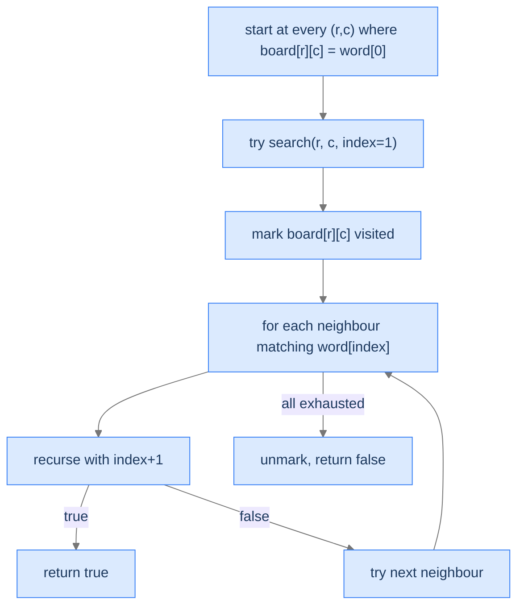

# Word Quest

A 2D character grid; we want to know whether a given word appears as a chain of orthogonally-adjacent cells (with no cell reused). Same search recipe as the maze, with character-matching instead of obstacle-checking.

---

## The Problem

Given a 2D grid `board` of single-character strings and a target string `word`, return `true` if `word` can be spelled by a chain of orthogonally adjacent cells (up, down, left, right) without reusing any cell. Else `false`.

```
Input:  board = [['A','B','C','E'],
                 ['S','F','C','S'],
                 ['A','D','E','E']],
        word = "ABCCED"
Output: true
```

---

## Examples

**Example 1**
```
Input:  board = ["ABCE","SFCS","ADEE"],  word = "ABCCED"
Output: true
Explanation: A(0,0)→B(0,1)→C(0,2)→C(1,2)→E(2,2)→D(2,1) — each cell adjacent and not reused.
```

**Example 2**
```
Input:  board = ["AB","CD"],  word = "ABBA"
Output: false
Explanation: After tracing A→B, "B" is already visited — can't reuse it for the second B.
```

## Constraints

- `1 ≤ rows, cols ≤ 6`
- `1 ≤ word.length ≤ 15`
- `board` and `word` consist of uppercase English letters.
- Board is passed as a list of row strings (e.g. `["ABCE","SFCS","ADEE"]`).

```python run viz=grid viz-root=board
import json

class Solution:
    def word_quest(self, board, word):
        # Your code goes here
        # Mark visited cells with '#', undo on failure
        return False

board_rows = json.loads(input())
board = [list(r) for r in board_rows]
word = input()
result = Solution().word_quest(board, word)
print("true" if result else "false")
```

```java run viz=grid viz-root=board
import java.util.*;

public class Main {
    static class Solution {
        public boolean wordQuest(char[][] board, String word) {
            // Your code goes here
            // Mark visited cells with '#', undo on failure
            return false;
        }
    }

    static char[][] parseBoardRows(String line) {
        String inner = line.trim().substring(1, line.trim().length() - 1).trim();
        String[] parts = inner.split(",\\s*\"");
        char[][] board = new char[parts.length][];
        for (int i = 0; i < parts.length; i++) {
            String row = parts[i].replace("\"", "").replace("[", "").replace("]", "").trim();
            board[i] = row.toCharArray();
        }
        return board;
    }

    public static void main(String[] args) {
        Scanner sc = new Scanner(System.in);
        char[][] board = parseBoardRows(sc.nextLine());
        String word = sc.nextLine().trim();
        System.out.println(new Solution().wordQuest(board, word));
    }
}
```

```testcases
{
  "args": [
    { "id": "board", "label": "board", "type": "string[]", "placeholder": "[\"ABCE\",\"SFCS\",\"ADEE\"]" },
    { "id": "word", "label": "word", "type": "string", "placeholder": "ABCCED" }
  ],
  "cases": [
    { "args": { "board": "[\"ABCE\",\"SFCS\",\"ADEE\"]", "word": "ABCCED" }, "expected": "true" },
    { "args": { "board": "[\"ABCE\",\"SFCS\",\"ADEE\"]", "word": "SEE" }, "expected": "true" },
    { "args": { "board": "[\"ABCE\",\"SFCS\",\"ADEE\"]", "word": "ABCB" }, "expected": "false" },
    { "args": { "board": "[\"A\"]", "word": "A" }, "expected": "true" },
    { "args": { "board": "[\"A\"]", "word": "B" }, "expected": "false" },
    { "args": { "board": "[\"AB\",\"CD\"]", "word": "ABBA" }, "expected": "false" },
    { "args": { "board": "[\"AB\",\"CD\"]", "word": "ABDC" }, "expected": "true" },
    { "args": { "board": "[\"C\",\"B\",\"A\"]", "word": "ABC" }, "expected": "true" }
  ]
}
```

<details>
<summary><h2>What's the Recursion Doing?</h2></summary>


Try starting from every cell that matches `word[0]`. From each starting cell, recurse into the four neighbours; at each step, the next cell must match `word[index]`. Use the visited-mark trick to prevent reusing cells. When `index` reaches `len(word)`, the chain is complete — return `true`.



<p align="center"><strong>Backtracking search for word matching. The mark-visit-recurse-unmark dance is identical to the maze; only the validation differs (character match instead of cell type).</strong></p>

</details>
<details>
<summary><h2>Applying the Diagnostic Questions</h2></summary>


| # | Check | Answer |
|---|---|---|
| **Q1** | State IS the answer? | **Yes** — the visited grid + current index in word is the search state. |
| **Q2** | Boolean propagation? | **Yes** — `true` if word can be completed from this cell, `false` otherwise. |
| **Q3** | Explicit undo? | **Yes** — must unmark cells so other start positions can use them. |

### Q1 — Why "state IS"?

The "candidate" is "the chain of cells we've matched so far," tracked by the visited markers and the current `index`. ✓

### Q2 — Why "boolean propagation"?

We want a yes/no answer. If any starting cell can spell the word, return `true`; otherwise `false`. ✓

### Q3 — Why "explicit undo"?

Different starting cells should each get a clean view of the board. If we forget to unmark, one starting cell's pollution prevents another from working. ✓

</details>
<details>
<summary><h2>Solution &amp; Analysis</h2></summary>

### The Solution

```python solution time=O(rows·cols·4^len(word)) space=O(len(word))
import json
from typing import List, Tuple

class Solution:

    # Directions list: (row change, col change)
    choices: List[Tuple[int, int]] = [
        (1, 0),   # Down
        (-1, 0),  # Up
        (0, 1),   # Right
        (0, -1)   # Left
    ]

    # Check if moving to (row,col) is valid for the current character
    def is_valid_move(
        self, board: List[List[str]], row: int, col: int, target: str
    ) -> bool:

        # Check boundaries
        if (
            row < 0
            or col < 0
            or row >= len(board)
            or col >= len(board[0])
        ):
            return False

        # Check if the cell matches the target character
        return board[row][col] == target

    # Recursive backtracking function
    def search_word(
        self,
        board: List[List[str]],
        word: str,
        index: int,
        row: int,
        col: int,
    ) -> bool:

        # Base case: entire word matched (solution state)
        if index == len(word):
            return True

        # Make choice: mark current cell as visited
        original_char = board[row][col]
        board[row][col] = "#"

        # Explore all possible choices
        for dx, dy in self.choices:
            new_row = row + dx
            new_col = col + dy

            # Only recurse if this move is valid
            if self.is_valid_move(board, new_row, new_col, word[index]):

                # Recurse to next character in word
                if self.search_word(
                    board, word, index + 1, new_row, new_col
                ):

                    # Unmake choice: restore original character
                    board[row][col] = original_char

                    # Early return: solution found
                    return True

        # Unmake choice: restore the original character to allow other
        # paths
        board[row][col] = original_char

        # Return false if word not found along this path
        return False

    def word_quest(self, board: List[List[str]], word: str) -> bool:
        rows = len(board)
        cols = len(board[0])

        # Start backtracking search from every cell on the board
        for row in range(rows):
            for col in range(cols):

                # Only start if the first character matches
                if board[row][col] == word[0]:

                    # Start recursive backtracking
                    if self.search_word(board, word, 1, row, col):
                        return True

        # No path leads to the word
        return False


board_rows = json.loads(input())
board = [list(r) for r in board_rows]
word = input()
result = Solution().word_quest(board, word)
print("true" if result else "false")
```

```java solution
import java.util.*;

public class Main {
    static class Solution {

        // Directions list: (row change, col change)
        private final int[][] choices = {
            {1, 0},   // Down
            {-1, 0},  // Up
            {0, 1},   // Right
            {0, -1}   // Left
        };

        // Check if moving to (row,col) is valid for the current character
        private boolean isValidMove(
            char[][] board,
            int row,
            int col,
            char target
        ) {

            // Check boundaries
            if (
                row < 0 ||
                col < 0 ||
                row >= board.length ||
                col >= board[0].length
            ) {
                return false;
            }

            // Check if the cell matches the target character
            return board[row][col] == target;
        }

        // Recursive backtracking function
        private boolean searchWord(
            char[][] board,
            String word,
            int index,
            int row,
            int col
        ) {

            // Base case: entire word matched (solution state)
            if (index == word.length()) {
                return true;
            }

            // Make choice: mark current cell as visited
            char originalChar = board[row][col];
            board[row][col] = '#';

            // Explore all possible choices
            for (int[] choice : choices) {
                int newRow = row + choice[0];
                int newCol = col + choice[1];

                // Only recurse if this move is valid
                if (isValidMove(board, newRow, newCol, word.charAt(index))) {

                    // Recurse to next character in word
                    if (searchWord(board, word, index + 1, newRow, newCol)) {

                        // Unmake choice: restore original character
                        board[row][col] = originalChar;

                        // Early return: solution found
                        return true;
                    }
                }
            }

            // Unmake choice: restore the original character to allow other
            // paths
            board[row][col] = originalChar;

            // Return false if word not found along this path
            return false;
        }

        public boolean wordQuest(char[][] board, String word) {
            int rows = board.length;
            int cols = board[0].length;

            // Start backtracking search from every cell on the board
            for (int row = 0; row < rows; row++) {
                for (int col = 0; col < cols; col++) {

                    // Only start if the first character matches
                    if (board[row][col] == word.charAt(0)) {

                        // Start recursive backtracking
                        if (searchWord(board, word, 1, row, col)) {
                            return true;
                        }
                    }
                }
            }

            // No path leads to the word
            return false;
        }
    }

    static char[][] parseBoardRows(String line) {
        String inner = line.trim().substring(1, line.trim().length() - 1).trim();
        String[] parts = inner.split(",\\s*\"");
        char[][] board = new char[parts.length][];
        for (int i = 0; i < parts.length; i++) {
            String row = parts[i].replace("\"", "").replace("[", "").replace("]", "").trim();
            board[i] = row.toCharArray();
        }
        return board;
    }

    public static void main(String[] args) {
        Scanner sc = new Scanner(System.in);
        char[][] board = parseBoardRows(sc.nextLine());
        String word = sc.nextLine().trim();
        System.out.println(new Solution().wordQuest(board, word));
    }
}
```

### Complexity Analysis

| Resource | Cost | Why |
|---|---|---|
| **Time** | `O(rows · cols · 4^len(word))` | Up to `rows · cols` start positions × `4^len(word)` paths from each. |
| **Space (stack)** | `O(len(word))` | Recursion depth = word length. |

In practice the visited-mark prunes the search aggressively — most paths fail at length 2-3.

### Edge Cases

| Case | Example | Expected |
|---|---|---|
| Word longer than board cells | board has 5 cells, word length 6 | `false`. |
| First-char absent | board has no 'A', word starts with 'A' | `false`. |
| Single-char word | word = "X" | `true` iff the board contains 'X'. |
| Word reuses a cell | needs same cell twice | `false` by problem statement. |

</details>
<details>
<summary><h2>Key Takeaway</h2></summary>


Word Quest is the canonical "match a sequence on a grid" search problem. Same recipe as the maze; only the validation function differs (character match vs walkability). The next problem changes the world from a 2D grid to an `n × n` chessboard, and the algorithm collects *all* valid configurations rather than just one.

</details>
