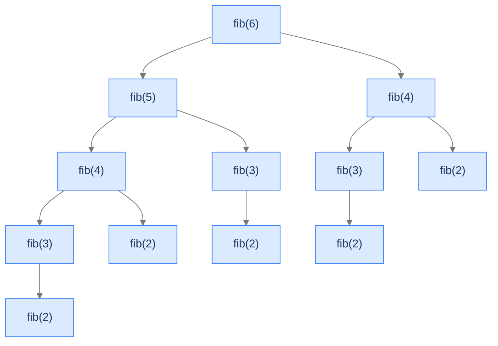

## Why It Exists

Recursive Fibonacci is three lines, mathematically perfect, and computationally radioactive: `fib(6)` computes `fib(2)` *five* times, `fib(3)` three times, and the work doubles roughly every level — about `2ⁿ/√5` calls, so `fib(50)` makes a *trillion*. You met this disaster as the exponential blow-up in [multiple recursion](/cortex/data-structures-and-algorithms/algorithms-by-strategy-recursion-pattern-multiple-recursion); **dynamic programming is the cure.**

The fix is one sentence: *solve every subproblem once, store the answer, look it up next time.* That single move collapses the exponential recursion tree into a linear chain. DP applies whenever a problem has **optimal substructure** (its answer is built from answers to smaller versions) and **overlapping subproblems** (those smaller versions repeat). **Linear DP** — this lesson — is the simplest shape: the state is one integer `i`, and `dp[i]` depends on a constant number of earlier entries.



<p align="center"><strong>Five separate <code>fib(2)</code> nodes, three <code>fib(3)</code>, two <code>fib(4)</code> — all duplicate work. DP solves each once.</strong></p>

## See It Work

Bottom-up Fibonacci: allocate a table, seed the base cases, fill it left-to-right with the recurrence. Every subproblem computed exactly once.

```python run viz=array
def fib_tab(n):
    if n < 2: return n
    dp = [0] * (n + 1); dp[1] = 1                 # base cases
    for i in range(2, n + 1):
        dp[i] = dp[i - 1] + dp[i - 2]             # recurrence, in dependency order
    return dp[n]

print("fib_tab(10):", fib_tab(10))
```

```java run viz=array
public class Main {
    static long fibTab(int n) {
        if (n < 2) return n;
        long[] dp = new long[n + 1]; dp[1] = 1;       // base cases
        for (int i = 2; i <= n; i++) dp[i] = dp[i - 1] + dp[i - 2];   // recurrence
        return dp[n];
    }
    public static void main(String[] args) {
        System.out.println("fib_tab(10): " + fibTab(10));
    }
}
```

Both print `55`. The table fills `0, 1, 1, 2, 3, 5, 8, 13, 21, 34, 55` — linear time, no recomputation.

## How It Works

DP needs two properties: **optimal substructure** (the answer at `n` composes from answers at smaller sizes — `fib(n) = fib(n-1) + fib(n-2)`) and **overlapping subproblems** (those smaller answers repeat — `fib(2)` five times). When both hold, the recipe is four steps:

```d2
recipe: "The DP recipe" {
  grid-rows: 4
  grid-columns: 1
  grid-gap: 0
  s1: "1. Define the subproblem — what does dp[i] MEAN?"
  s2: "2. Write the recurrence — how does dp[i] depend on dp[i-1], dp[i-2], ...?"
  s3: "3. Initialise the base cases — dp[0], dp[1], the directly-known answers."
  s4: "4. Fill in dependency order — smallest to largest, each from computed predecessors."
}
```

<p align="center"><strong>Identify the subproblem and the recurrence, and the code writes itself. <strong>Linear DP</strong> is the shape where the state is a single index and the recurrence looks back a constant number of cells.</strong></p>

Every DP has two equivalent implementations:

- **Top-down (memoisation)** — write the recurrence as a recursive function with a cache; computes only the subproblems actually needed.
- **Bottom-up (tabulation)** — fill a table iteratively from the base cases up; no recursion, no stack-overflow risk, cache-friendly. (Used above and as the section default.)

And when the recurrence only looks back a fixed `k` cells (Fibonacci: 2), you can throw the table away and keep a **rolling window** of `k` scalars — `O(1)` space instead of `O(n)`.

> **Key takeaway.** DP = optimal substructure + overlapping subproblems → solve each subproblem once and reuse it, collapsing exponential recursion to linear/polynomial work. Four steps: define `dp[i]`, write the recurrence, set base cases, fill in dependency order. Top-down memoises a recursion; bottom-up fills a table; both are equivalent. If the window is bounded, space-optimise to a rolling buffer.

## Trace It

The whole reason DP exists is the cost gap between recomputing and caching. You've seen the naive tree; now measure the cure precisely.

**Predict before you run:** how many calls does naive `fib(35)` make — thousands? millions? — and how many does the *memoised* version make?

```python run viz=array
def count_naive(n):
    c = [0]
    def f(n):
        c[0] += 1
        if n < 2: return n
        return f(n - 1) + f(n - 2)
    f(n); return c[0]

def count_memo(n):
    c = [0]; memo = {}
    def f(n):
        c[0] += 1
        if n < 2: return n
        if n in memo: return memo[n]            # cache hit — no recompute
        memo[n] = f(n - 1) + f(n - 2); return memo[n]
    f(n); return c[0]

print("naive    fib(35) calls:", count_naive(35))
print("memoised fib(35) calls:", count_memo(35))
```

<details>
<summary><strong>Reveal</strong></summary>

Naive `fib(35)` makes **29,860,703** calls; the memoised version makes **69**. Same answer (`9227465`), a ~430,000× difference in work. The naive count is `2·fib(36) − 1` — itself a Fibonacci number, which is why it's exponential. Memoisation stores each of the `n` distinct subproblems the first time and returns the cache on every later request, so the total calls are `2n − 1` (each `fib(k)` computed once, plus one cache-hit return per node). That collapse from `O(2ⁿ)` to `O(n)` is dynamic programming in one experiment — the exact payoff promised back in [multiple recursion](/cortex/data-structures-and-algorithms/algorithms-by-strategy-recursion-pattern-multiple-recursion). A dictionary keyed on the subproblem is the entire idea; everything else in this part is choosing *what* the subproblems are.

</details>

## Your Turn

**House Robber** ([LeetCode 198](https://leetcode.com/problems/house-robber/)) — rob a street of houses without hitting two adjacent ones; maximise the loot. Linear DP: at each house, either *skip* it (keep `dp[i-1]`) or *take* it (`dp[i-2] + value`). Recurrence `dp[i] = max(dp[i-1], dp[i-2] + nums[i])`, space-optimised to two scalars.

```python run viz=array
def rob(nums):
    prev2, prev1 = 0, 0                          # dp[i-2], dp[i-1]
    for x in nums:
        prev2, prev1 = prev1, max(prev1, prev2 + x)   # skip vs take
    return prev1

print("rob([2,7,9,3,1]):", rob([2, 7, 9, 3, 1]))   # 12  (2 + 9 + 1)
print("rob([1,2,3,1]):", rob([1, 2, 3, 1]))        # 4   (1 + 3)
```

```java run viz=array
public class Main {
    static int rob(int[] nums) {
        int prev2 = 0, prev1 = 0;                       // dp[i-2], dp[i-1]
        for (int x : nums) {
            int take = Math.max(prev1, prev2 + x);      // skip vs take
            prev2 = prev1; prev1 = take;
        }
        return prev1;
    }
    public static void main(String[] args) {
        System.out.println("rob([2,7,9,3,1]): " + rob(new int[]{2,7,9,3,1}));   // 12
        System.out.println("rob([1,2,3,1]): " + rob(new int[]{1,2,3,1}));       // 4
    }
}
```

Both print `12` then `4`. The recurrence looks back exactly two cells, so the rolling-window space-optimisation applies — `O(1)` space. The 14 lessons in this section climb from here: LIS, LCS, edit distance, knapsack — each a richer subproblem and recurrence on the same scaffold.

## Reflect & Connect

- **DP is recursion + memory.** Top-down is the recursive relation plus a cache (the [multiple-recursion](/cortex/data-structures-and-algorithms/algorithms-by-strategy-recursion-pattern-multiple-recursion) fib memo *was* DP); bottom-up is the same recurrence filled into a table. The leap from naive recursion is just "store and reuse."
- **2D DP is next, and it's [multidimensional recursion](/cortex/data-structures-and-algorithms/algorithms-by-strategy-recursion-pattern-multidimensional-recursion) + a cache.** When the state needs two indices (LCS, edit distance, knapsack, grid paths), the table becomes a grid — exactly the `O(2^{x+y}) → O(x·y)` collapse you predicted there.
- **Spot overlap to know DP wins.** Optimal substructure alone (factorial: `fact(n)=n·fact(n-1)`) gives no speedup from memoising — no subproblem repeats. Overlap (Fibonacci) is what turns DP from a tidy reformulation into an exponential win.
- **Top-down vs bottom-up is a readability choice, not a complexity one.** Same Big-O. Bottom-up dodges recursion-depth limits and is the section default; top-down shines when only a sparse fraction of subproblems is needed.

## Recall

<details>
<summary><strong>Q:</strong> What two properties must a problem have for DP to apply?</summary>

**A:** Optimal substructure (the answer composes from answers to smaller subproblems) and overlapping subproblems (those smaller answers recur). Overlap is what makes DP a speedup rather than just a reformulation.

</details>
<details>
<summary><strong>Q:</strong> The four-step DP recipe?</summary>

**A:** (1) define what `dp[i]` means, (2) write the recurrence relating it to smaller entries, (3) initialise the base cases, (4) fill the table in dependency order. The answer ends up in `dp[n]`.

</details>
<details>
<summary><strong>Q:</strong> Top-down vs bottom-up?</summary>

**A:** Top-down memoises a recursive function (computes only needed subproblems); bottom-up fills a table iteratively from the base cases (no recursion, no stack overflow). Same time complexity — a readability choice.

</details>
<details>
<summary><strong>Q:</strong> When can you space-optimise a linear DP?</summary>

**A:** When the recurrence looks back only a fixed `k` cells (Fibonacci: 2). Keep a rolling window of `k` scalars instead of the full array — `O(1)` space, same time. If it references arbitrarily-old entries, you need the full table.

</details>
<details>
<summary><strong>Q:</strong> Why does memoising factorial give no speedup, but memoising Fibonacci gives a huge one?</summary>

**A:** Factorial has no overlapping subproblems — each `fact(k)` is computed once even naively. Fibonacci recomputes the same `fib(k)` exponentially many times; caching collapses `O(2ⁿ)` to `O(n)`.

</details>

## Sources & Verify

- **CLRS** (Cormen, Leiserson, Rivest, Stein), *Introduction to Algorithms*, 3rd ed., Ch. 15 — dynamic programming, optimal substructure, overlapping subproblems, memoisation vs tabulation.
- **Bellman, R.** (1957), *Dynamic Programming* — the original; the principle of optimality (optimal substructure) and the (admittedly misleading) name.
- **Kleinberg & Tardos**, *Algorithm Design*, Ch. 6 — DP from weighted interval scheduling through sequence and knapsack problems, top-down and bottom-up.
- The `55`, the `29,860,703`-vs-`69` call counts, and the House Robber `12`/`4` above come from the runnable blocks — re-run to verify.
