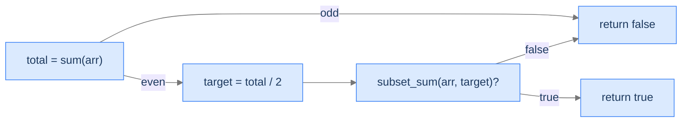

# Partition with Equal Sum

## The Problem

Given an array of non-negative integers, return `true` if it can be partitioned into two subsets with equal sums.

```
Input:  arr = [1, 5, 4, 10]
Output: true                       Subsets [1, 5, 4] (sum 10) and [10] (sum 10)

Input:  arr = [1, 2, 3, 4, 6]
Output: true                       Subsets [1, 3, 4] (sum 8) and [2, 6] (sum 8)

Input:  arr = [1, 2]
Output: false                      Total = 3 — odd; no equal split possible
```

---

## Examples

**Example 1**
```
Input:  arr = [1, 5, 4, 10]
Output: true
Explanation: [1, 5, 4] sums to 10 and [10] sums to 10.
```

**Example 2**
```
Input:  arr = [1, 2]
Output: false
Explanation: Total = 3, which is odd — no equal partition is possible.
```

**Example 3**
```
Input:  arr = [2, 2]
Output: true
Explanation: Each subset gets one element summing to 2.
```

```quiz
{
  "prompt": "What is the fast-fail condition before running the DP?",
  "options": [
    "If total sum is odd, return false immediately",
    "If any element equals total/2, return true immediately",
    "If the array has odd length, return false",
    "If the maximum element exceeds total/2, return true"
  ],
  "answer": "If total sum is odd, return false immediately"
}
```

## Constraints

- `1 ≤ arr.length ≤ 200`
- `1 ≤ arr[i] ≤ 100`

```python run viz=grid viz-root=dp
import ast
from typing import List

class Solution:
    def partition_with_equal_sum(self, arr: List[int]) -> bool:
        # Your code goes here
        return False

arr = ast.literal_eval(input())
print("true" if Solution().partition_with_equal_sum(arr) else "false")
```

```java run viz=grid viz-root=dp
import java.util.*;

public class Main {
    static class Solution {
        public boolean partitionWithEqualSum(int[] arr) {
            // Your code goes here
            return false;
        }
    }

    public static void main(String[] args) {
        Scanner sc = new Scanner(System.in);
        int[] arr = parseIntArray(sc.nextLine());
        System.out.println(new Solution().partitionWithEqualSum(arr));
    }

    static int[] parseIntArray(String line) {
        String inner = line.replaceAll("[\\[\\]\\s]", "");
        if (inner.isEmpty()) return new int[0];
        String[] parts = inner.split(",");
        int[] out = new int[parts.length];
        for (int i = 0; i < parts.length; i++) out[i] = Integer.parseInt(parts[i]);
        return out;
    }
}
```

```testcases
{
  "args": [
    { "id": "arr", "label": "arr", "type": "int[]", "placeholder": "[1, 5, 4, 10]" }
  ],
  "cases": [
    { "args": { "arr": "[1, 5, 4, 10]" }, "expected": "true" },
    { "args": { "arr": "[1, 2, 3, 4, 6]" }, "expected": "true" },
    { "args": { "arr": "[1, 2]" }, "expected": "false" },
    { "args": { "arr": "[2, 2]" }, "expected": "true" },
    { "args": { "arr": "[1, 1, 1, 1]" }, "expected": "true" },
    { "args": { "arr": "[3, 1, 1, 2, 2, 1]" }, "expected": "true" },
    { "args": { "arr": "[1, 3, 5]" }, "expected": "false" }
  ]
}
```

<details>
<summary><h2>The Reduction</h2></summary>


If the array can be partitioned into two equal-sum subsets, each subset sums to `total / 2`. So the problem reduces to: "is there a subset summing to exactly `total / 2`?" — pure subset sum.

Two quick filters before the DP:
- If `total` is odd, return `false` immediately. Two equal integer sums can't add to an odd number.
- If any single element exceeds `total / 2`, the partition is impossible (that element can't be balanced).



<p align="center"><strong>Reduction in three steps: parity check, then the subset-sum DP on <code>total / 2</code>. The boolean answer flows straight through.</strong></p>

> *Predict before reading on — for `arr = [3, 3, 3, 4, 5]`, `total = 18`, `target = 9`, is there a subset summing to 9?*

Yes — `{4, 5}` sums to 9, leaving `{3, 3, 3}` summing to 9. So partition is possible. (Also `{3, 3, 3} ∪ {4, 5}` are the two subsets.)

</details>
<details>
<summary><h2>Solution &amp; Analysis</h2></summary>

### The Solution

```python solution time=O(n×total) space=O(n×total)
import ast
from typing import List

class Solution:
    def partition_with_equal_sum(self, arr: List[int]) -> bool:
        total_sum: int = sum(arr)

        # If total sum is odd, it can't be divided into two equal subsets
        if total_sum % 2 != 0:
            return False

        target: int = total_sum // 2
        n: int = len(arr)

        # Create a 2D DP array to store the subset sum results
        dp: List[List[bool]] = [
            [False] * (target + 1) for _ in range(n + 1)
        ]

        # Base cases
        for i in range(n + 1):

            # An empty subset can always have a sum of 0
            dp[i][0] = True

        for i in range(1, n + 1):
            for j in range(1, target + 1):
                if j >= arr[i - 1]:

                    # If the current element can be included, check if
                    # there is a subset in the previous elements that has
                    # a sum equal to j or j minus the current element's
                    # value
                    dp[i][j] = dp[i - 1][j] or dp[i - 1][j - arr[i - 1]]
                else:

                    # If the current element is too large to be included,
                    # inherit the value from the previous elements
                    # without including it
                    dp[i][j] = dp[i - 1][j]

        return dp[n][target]


arr = ast.literal_eval(input())
print("true" if Solution().partition_with_equal_sum(arr) else "false")
```

```java solution
import java.util.*;

public class Main {
    static class Solution {
        public boolean partitionWithEqualSum(int[] arr) {
            int totalSum = 0;
            for (int num : arr) {
                totalSum += num;
            }

            // If total sum is odd, it can't be divided into two equal
            // subsets
            if (totalSum % 2 != 0) {
                return false;
            }

            int target = totalSum / 2;
            int n = arr.length;

            // Create a 2D DP array to store the subset sum results
            boolean[][] dp = new boolean[n + 1][target + 1];

            // Base cases
            for (int i = 0; i <= n; i++) {

                // An empty subset can always have a sum of 0
                dp[i][0] = true;
            }

            for (int i = 1; i <= n; i++) {
                for (int j = 1; j <= target; j++) {
                    if (j >= arr[i - 1]) {

                        // If the current element can be included, check if
                        // there is a subset in the previous elements that
                        // has a sum equal to j or j minus the current
                        // element's value
                        dp[i][j] = dp[i - 1][j] || dp[i - 1][j - arr[i - 1]];
                    } else {

                        // If the current element is too large to be
                        // included, inherit the value from the previous
                        // elements without including it
                        dp[i][j] = dp[i - 1][j];
                    }
                }
            }

            return dp[n][target];
        }
    }

    public static void main(String[] args) {
        Scanner sc = new Scanner(System.in);
        int[] arr = parseIntArray(sc.nextLine());
        System.out.println(new Solution().partitionWithEqualSum(arr));
    }

    static int[] parseIntArray(String line) {
        String inner = line.replaceAll("[\\[\\]\\s]", "");
        if (inner.isEmpty()) return new int[0];
        String[] parts = inner.split(",");
        int[] out = new int[parts.length];
        for (int i = 0; i < parts.length; i++) out[i] = Integer.parseInt(parts[i]);
        return out;
    }
}
```

### Complexity

| Aspect | Cost |
|---|---|
| Time | `O(n × total)` |
| Space | `O(n × total)` (reducible to `O(total)` with downward 1D iteration) |

</details>
