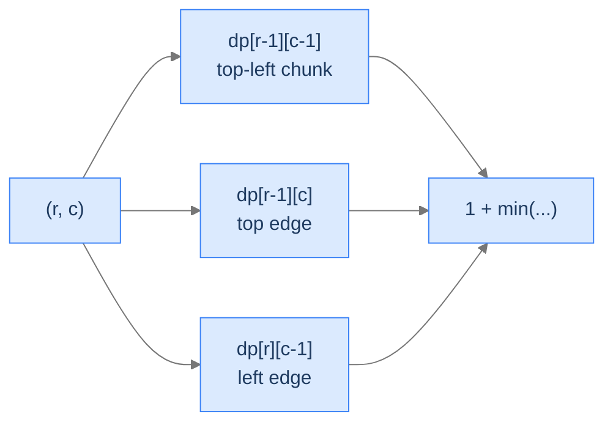

# Largest Square Area of 1s

## The Problem

Given a binary matrix of 0s and 1s, find the area of the largest *axis-aligned square* of 1s.

```
Input:  grid = [[1, 1, 0, 0],
                [0, 0, 1, 1],
                [1, 0, 1, 1],
                [1, 0, 0, 0]]
Output: 4                       2 × 2 square at rows 1-2, cols 2-3

Input:  grid = [[1, 1, 0, 0],
                [0, 1, 1, 1],
                [1, 1, 1, 1],
                [1, 0, 0, 0]]
Output: 4                       Multiple 2 × 2 squares
```

<details>
<summary><h2>The Recurrence — Three-Neighbour Min Plus One</h2></summary>


`dp[r][c]` = side length of the largest square *whose bottom-right corner is* `(r, c)`. If `grid[r][c] = 0`, it can't be a corner: `dp[r][c] = 0`. If `grid[r][c] = 1`:
```
dp[r][c] = 1 + min(dp[r-1][c-1], dp[r-1][c], dp[r][c-1])
```

Why three neighbours? A `k × k` square at `(r, c)` requires:
- A `(k-1) × (k-1)` square at `(r-1, c-1)` (the top-left chunk).
- A `(k-1) × (k-1)` square at `(r-1, c)` (covering the top edge).
- A `(k-1) × (k-1)` square at `(r, c-1)` (covering the left edge).

The smallest of these three caps the size of the square that can grow from `(r, c)`. Plus one for the cell itself.



<p align="center"><strong>The square ending at <code>(r, c)</code> can only be as large as the smallest of three predecessor squares — the top-left, top, and left neighbours. Plus one for the current cell.</strong></p>

> *Pause. Why is min the right aggregator here? Predict the consequence of using max.*

Min ensures the square is *fully* filled with 1s. If any of the three neighbours has a smaller largest-square, that's the binding constraint — extending beyond would require 1s in cells that aren't 1. Using max would let one good corner override missing cells elsewhere — wrong.

</details>
<details>
<summary><h2>Solution &amp; Analysis</h2></summary>

### The Solution

```python run viz=grid viz-root=matrix
from typing import List

class Solution:
    def largest_square_area(self, matrix: List[List[int]]) -> int:
        rows: int = len(matrix)
        cols: int = len(matrix[0])
        max_size: int = 0

        # Create a 2D dynamic programming table
        dp: List[List[int]] = [[0] * cols for _ in range(rows)]

        # Fill the first row and column of the dp table
        for row in range(rows):
            dp[row][0] = matrix[row][0]
            max_size = max(max_size, dp[row][0])

        for col in range(cols):
            dp[0][col] = matrix[0][col]
            max_size = max(max_size, dp[0][col])

        # Fill the remaining dp table using the recurrence relation
        for row in range(1, rows):
            for col in range(1, cols):
                if matrix[row][col] == 1:

                    # Calculate the size of the square submatrix ending
                    # at (row, col) based on the sizes of the submatrices
                    # ending at (row-1, col-1), (row-1, col), and (row,
                    # col-1)
                    dp[row][col] = (
                        min(
                            dp[row - 1][col - 1],
                            min(dp[row - 1][col], dp[row][col - 1]),
                        )
                        + 1
                    )
                    max_size = max(max_size, dp[row][col])

        return max_size * max_size


# Examples from the problem statement
print(Solution().largest_square_area([[1,1,0,0],[0,0,1,1],[1,0,1,1],[1,0,0,0]]))  # 4
print(Solution().largest_square_area([[1,1,0,0],[0,1,1,1],[1,1,1,1],[1,0,0,0]]))  # 4

# Edge cases
print(Solution().largest_square_area([[1]]))                                       # 1  — 1x1 with 1
print(Solution().largest_square_area([[0]]))                                       # 0  — 1x1 with 0
print(Solution().largest_square_area([[0, 0], [0, 0]]))                            # 0  — all zeros
print(Solution().largest_square_area([[1, 1], [1, 1]]))                            # 4  — all ones 2x2
print(Solution().largest_square_area([[1, 0, 1], [0, 1, 0], [1, 0, 1]]))          # 1  — checkerboard
```

```java run viz=grid viz-root=matrix
import java.util.*;

public class Main {
    static class Solution {
        public int largestSquareArea(int[][] matrix) {
            int rows = matrix.length;
            int cols = matrix[0].length;
            int maxSize = 0;

            // Create a 2D dynamic programming table
            int[][] dp = new int[rows][cols];

            // Fill the first row and column of the dp table
            for (int row = 0; row < rows; row++) {
                dp[row][0] = matrix[row][0];
                maxSize = Math.max(maxSize, dp[row][0]);
            }

            for (int col = 0; col < cols; col++) {
                dp[0][col] = matrix[0][col];
                maxSize = Math.max(maxSize, dp[0][col]);
            }

            // Fill the remaining dp table using the recurrence relation
            for (int row = 1; row < rows; row++) {
                for (int col = 1; col < cols; col++) {
                    if (matrix[row][col] == 1) {

                        // Calculate the size of the square submatrix ending
                        // at (row, col) based on the sizes of the
                        // submatrices ending at (row-1, col-1), (row-1,
                        // col), and (row, col-1)
                        dp[row][col] =
                            Math.min(
                                dp[row - 1][col - 1],
                                Math.min(dp[row - 1][col], dp[row][col - 1])
                            ) +
                            1;
                        maxSize = Math.max(maxSize, dp[row][col]);
                    }
                }
            }

            return maxSize * maxSize;
        }
    }

    public static void main(String[] args) {
        // Examples from the problem statement
        System.out.println(new Solution().largestSquareArea(new int[][]{{1,1,0,0},{0,0,1,1},{1,0,1,1},{1,0,0,0}}));  // 4
        System.out.println(new Solution().largestSquareArea(new int[][]{{1,1,0,0},{0,1,1,1},{1,1,1,1},{1,0,0,0}}));  // 4

        // Edge cases
        System.out.println(new Solution().largestSquareArea(new int[][]{{1}}));                                      // 1
        System.out.println(new Solution().largestSquareArea(new int[][]{{0}}));                                      // 0
        System.out.println(new Solution().largestSquareArea(new int[][]{{0,0},{0,0}}));                              // 0
        System.out.println(new Solution().largestSquareArea(new int[][]{{1,1},{1,1}}));                              // 4
        System.out.println(new Solution().largestSquareArea(new int[][]{{1,0,1},{0,1,0},{1,0,1}}));                  // 1
    }
}
```

### Complexity

| Aspect | Cost |
|---|---|
| Time | `O(rows × cols)` |
| Space | `O(rows × cols)` (reducible to `O(cols)` with rolling rows) |

</details>
