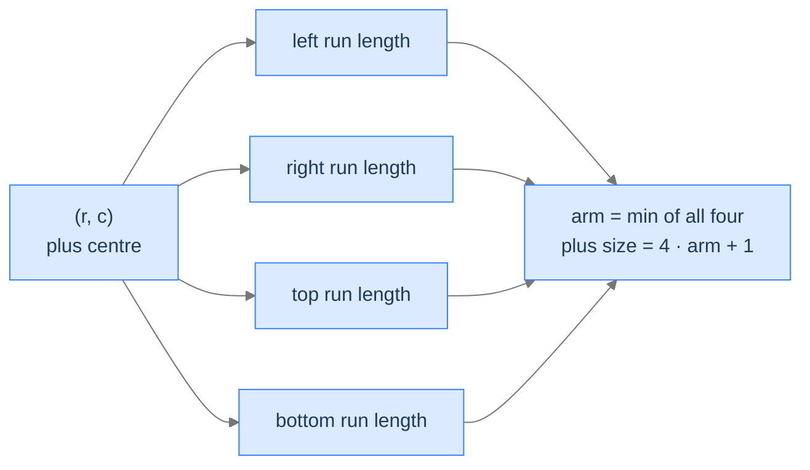

# Largest Plus of 1s

## The Problem

Given a binary matrix, find the size (number of cells) of the largest plus-shape made entirely of 1s. A plus has a centre and four arms of equal length extending up/down/left/right.

```
Input:  grid = [[1, 1, 1, 0],
                [0, 1, 1, 1],
                [1, 1, 1, 1],
                [1, 0, 1, 0]]
Output: 5                       Plus of arm length 1: centre + 4 arm cells

Input:  grid = [[1, 1, 1, 1, 1],
                [1, 1, 1, 1, 1],
                [1, 1, 1, 1, 1],
                [1, 1, 1, 1, 1],
                [1, 1, 1, 1, 1]]
Output: 9                       Plus of arm length 2: centre + 8 arm cells
```

<details>
<summary><h2>The Recurrence — Four Direction Arrays</h2></summary>


Build four 2D arrays, one per direction, each measuring how long a contiguous run of 1s reaches `(r, c)` from that direction *excluding* `(r, c)` itself — the run that ends at the neighbouring cell:
- `left[r][c]` = consecutive 1s immediately to the left of `(r, c)`.
- `right[r][c]` = consecutive 1s immediately to the right of `(r, c)`.
- `top[r][c]` = consecutive 1s immediately above `(r, c)`.
- `bottom[r][c]` = consecutive 1s immediately below `(r, c)`.

For a plus centred at `(r, c)`, each arm needs a contiguous run of 1s on that side. The arm length (not counting the centre) is `min(left, right, top, bottom)`. The plus has the centre plus four arms of that length: `4 × arm + 1` cells total.



<p align="center"><strong>Four direction arrays, each computed in one pass over the grid. The plus centred at any cell is bounded by the shortest arm.</strong></p>

> *Pause. Why is `4 × arm + 1` the cell count?*

Here `arm` counts only the run on each side, *not* the centre cell. Four arms contribute `4 × arm` cells, and the centre adds one more: `4 × arm + 1`. (If you used arm length *including* the centre, the formula would be `4 × arm − 3` — same answer, different convention. The code uses the excluding-centre convention.)

</details>
<details>
<summary><h2>Solution &amp; Analysis</h2></summary>

### The Solution

```python run viz=graph viz-root=grid
from typing import List

class Solution:
    def largest_plus_of1s(self, grid: List[List[int]]) -> int:
        rows: int = len(grid)
        if rows == 0:
            return 0
        cols: int = len(grid[0])
        if cols == 0:
            return 0

        # Create matrices to store the lengths of continuous 1's in each
        # direction
        left: List[List[int]] = [[0] * cols for _ in range(rows)]
        right: List[List[int]] = [[0] * cols for _ in range(rows)]
        top: List[List[int]] = [[0] * cols for _ in range(rows)]
        bottom: List[List[int]] = [[0] * cols for _ in range(rows)]

        # Calculate the lengths of continuous 1's in the left and right
        # directions for each row
        for row in range(rows):
            top[row][0] = grid[row][0]
            bottom[row][cols - 1] = grid[row][cols - 1]
            for col in range(1, cols):
                if grid[row][col] == 1:

                    # Increment the length of continuous 1's from the
                    # left
                    left[row][col] = left[row][col - 1] + 1
                if grid[row][cols - 1 - col] == 1:

                    # Increment the length of continuous 1's from the
                    # right
                    right[row][cols - 1 - col] = right[row][cols - col] + 1

        # Calculate the lengths of continuous 1's in the top and bottom
        # directions for each column
        for col in range(cols):
            left[0][col] = grid[0][col]
            right[rows - 1][col] = grid[rows - 1][col]
            for row in range(1, rows):
                if grid[row][col] == 1:

                    # Increment the length of continuous 1's from the top
                    top[row][col] = top[row - 1][col] + 1
                if grid[rows - 1 - row][col] == 1:

                    # Increment the length of continuous 1's from the
                    # bottom
                    bottom[rows - 1 - row][col] = bottom[rows - row][col] + 1

        max_size: int = 0

        # Find the maximum size of the plus-shaped region
        for row in range(rows):
            for col in range(cols):

                # Calculate the size of the plus-shaped region at each
                # position as the minimum length of continuous 1's in all
                # directions
                size = min(
                    min(left[row][col], right[row][col]),
                    min(top[row][col], bottom[row][col]),
                )

                # Update the maximum size if a larger size is found
                max_size = max(max_size, size)

        # Return the area of the largest plus-shaped region
        return max_size * 4 + 1


# Examples from the problem statement
print(Solution().largest_plus_of1s([[1,1,1,0],[0,1,1,1],[1,1,1,1],[1,0,1,0]]))           # 5
print(Solution().largest_plus_of1s([[1,1,1,1,1],[1,1,1,1,1],[1,1,1,1,1],[1,1,1,1,1],[1,1,1,1,1]]))  # 9
print(Solution().largest_plus_of1s([[1,1,1,0],[0,1,0,1],[1,1,1,1],[1,0,1,0]]))           # 5

# Edge cases
print(Solution().largest_plus_of1s([[1]]))                                                # 1  — 1x1
print(Solution().largest_plus_of1s([[0]]))                                                # 1  — 0x0 plus (0*4+1=1 is output for size=0)
print(Solution().largest_plus_of1s([[0,0],[0,0]]))                                        # 1
print(Solution().largest_plus_of1s([[0,1,0],[1,1,1],[0,1,0]]))                            # 5  — classic plus
```

```java run viz=graph viz-root=grid
import java.util.*;

public class Main {
    static class Solution {
        public int largestPlusOf1s(int[][] matrix) {
            int rows = matrix.length;
            if (rows == 0) {
                return 0;
            }
            int cols = matrix[0].length;
            if (cols == 0) {
                return 0;
            }

            // Create matrices to store the lengths of continuous 1's in each
            // direction
            int[][] left = new int[rows][cols];
            int[][] right = new int[rows][cols];
            int[][] top = new int[rows][cols];
            int[][] bottom = new int[rows][cols];

            // Calculate the lengths of continuous 1's in the left and right
            // directions for each row
            for (int row = 0; row < rows; row++) {
                top[row][0] = matrix[row][0];
                bottom[row][cols - 1] = matrix[row][cols - 1];
                for (int col = 1; col < cols; col++) {
                    if (matrix[row][col] == 1) {

                        // Increment the length of continuous 1's from the
                        // left
                        left[row][col] = left[row][col - 1] + 1;
                    }
                    if (matrix[row][cols - 1 - col] == 1) {

                        // Increment the length of continuous 1's from the
                        // right
                        right[row][cols - 1 - col] = right[row][cols - col] + 1;
                    }
                }
            }

            // Calculate the lengths of continuous 1's in the top and bottom
            // directions for each column
            for (int col = 0; col < cols; col++) {
                left[0][col] = matrix[0][col];
                right[rows - 1][col] = matrix[rows - 1][col];
                for (int row = 1; row < rows; row++) {
                    if (matrix[row][col] == 1) {

                        // Increment the length of continuous 1's from the
                        // top
                        top[row][col] = top[row - 1][col] + 1;
                    }
                    if (matrix[rows - 1 - row][col] == 1) {

                        // Increment the length of continuous 1's from the
                        // bottom
                        bottom[rows - 1 - row][col] = bottom[rows - row][col] + 1;
                    }
                }
            }

            int maxSize = 0;

            // Find the maximum size of the plus-shaped region
            for (int row = 0; row < rows; row++) {
                for (int col = 0; col < cols; col++) {

                    // Calculate the size of the plus-shaped region at each
                    // position as the minimum length of continuous 1's in
                    // all directions
                    int size = Math.min(
                        Math.min(left[row][col], right[row][col]),
                        Math.min(top[row][col], bottom[row][col])
                    );

                    // Update the maximum size if a larger size is found
                    maxSize = Math.max(maxSize, size);
                }
            }

            // Return the area of the largest plus-shaped region
            return maxSize * 4 + 1;
        }
    }

    public static void main(String[] args) {
        // Examples from the problem statement
        System.out.println(new Solution().largestPlusOf1s(new int[][]{{1,1,1,0},{0,1,1,1},{1,1,1,1},{1,0,1,0}}));           // 5
        System.out.println(new Solution().largestPlusOf1s(new int[][]{{1,1,1,1,1},{1,1,1,1,1},{1,1,1,1,1},{1,1,1,1,1},{1,1,1,1,1}}));  // 9
        System.out.println(new Solution().largestPlusOf1s(new int[][]{{1,1,1,0},{0,1,0,1},{1,1,1,1},{1,0,1,0}}));           // 5

        // Edge cases
        System.out.println(new Solution().largestPlusOf1s(new int[][]{{1}}));                                                // 1
        System.out.println(new Solution().largestPlusOf1s(new int[][]{{0}}));                                                // 1
        System.out.println(new Solution().largestPlusOf1s(new int[][]{{0,0},{0,0}}));                                        // 1
        System.out.println(new Solution().largestPlusOf1s(new int[][]{{0,1,0},{1,1,1},{0,1,0}}));                            // 5
    }
}
```

### Complexity

| Aspect | Cost |
|---|---|
| Time | `O(rows × cols)` — two passes for the four direction arrays plus one for the answer |
| Space | `O(rows × cols)` for the four arrays |

</details>
