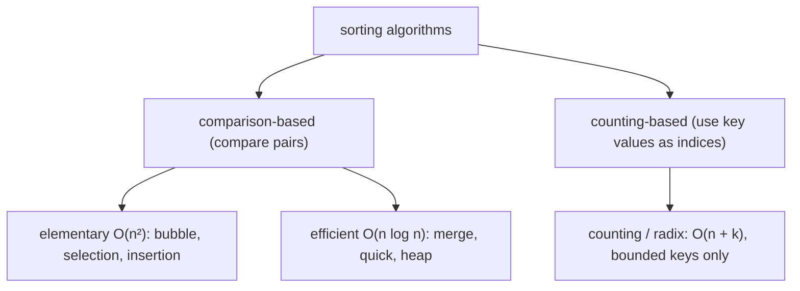

# Introduction to Sorting

## Why It Exists

Disorder gets more expensive as data grows. Finding one value in an *unsorted* array means checking every element — `O(n)`. In a *sorted* array, binary search finds it in `O(log n)`: a million items go from a million comparisons to twenty.

That's why sorting is the most common preprocessing step in computing. You pay `O(n log n)` *once* to order the data, and a whole class of operations becomes cheap forever after: membership and predecessor/successor queries (binary search), removing duplicates (equal items sit adjacent), range queries ("all values in [a, b]"), finding the median or `k`-th smallest, and merging two datasets. Sorting doesn't solve those problems — it makes them *easy*. This section builds the sorting toolkit; this lesson is the map.

## See It Work

The payoff in one snippet: sort once, then answer membership queries in `O(log n)` with binary search (which only works *because* the data is ordered). Run it.

```python run viz=array
import bisect

data = [37, 12, 95, 4, 60, 23]
data.sort()                          # O(n log n) — paid once
print(data)                          # [4, 12, 23, 37, 60, 95]

def contains(sorted_data, x):        # O(log n) per query — only valid on sorted data
    i = bisect.bisect_left(sorted_data, x)
    return i < len(sorted_data) and sorted_data[i] == x

print(contains(data, 60), contains(data, 50))   # True False
```

## How They Differ — the Classification Axes

Every sort in this section is described by a few properties. Knowing the vocabulary is how you pick one:



<p align="center"><strong>the sorts split into comparison-based (bounded below by <code>Ω(n log n)</code>) and counting-based (linear for bounded keys); the elementary comparison sorts are <code>O(n²)</code>, the efficient ones <code>O(n log n)</code>.</strong></p>

- **Comparison vs counting** — comparison sorts only ask "is `a < b`?"; counting sorts use the keys themselves as array indices. This matters because of a hard limit (below).
- **Stable vs unstable** — a *stable* sort keeps equal elements in their original order. Essential when sorting by a secondary key (sort by date, then *stably* by name).
- **In-place vs out-of-place** — in-place uses `O(1)` extra space (heapsort, quicksort); out-of-place needs `O(n)` scratch (merge sort).
- **Adaptive vs not** — adaptive sorts run faster on nearly-sorted input (insertion sort, adaptive bubble → `O(n)`).

The deepest fact: **comparison sorts cannot beat `O(n log n)`**. Counting/radix sorts can — but only because they *don't* compare; they exploit bounded key ranges.

### Key Takeaway

Sorting is an `O(n log n)` one-time investment that makes search (`O(log n)`), dedup, range queries, and median cheap. Classify every sort by comparison-vs-counting, stable, in-place, and adaptive — and remember comparison sorts are bounded below by `Ω(n log n)`.

## Trace It

The `Ω(n log n)` bound is worth understanding, not just memorizing.

Before you read on: there are sorts that run in `O(n)` (counting sort). So why is it *proven* that no **comparison-based** sort — bubble, merge, quick, heap, any of them — can do better than `O(n log n)` in the worst case?

A comparison sort learns about the order *only* through yes/no comparisons. Model its execution as a **decision tree**: each internal node is one comparison, each branch a yes/no outcome, each leaf one possible final ordering. To sort correctly, the tree must have a distinct leaf for every one of the `n!` possible input permutations — otherwise two different inputs would reach the same leaf and get the same output, and one would be wrong. A binary tree with `n!` leaves has height at least `log₂(n!)`, and by Stirling's approximation `log₂(n!) ≈ n log n`. The height *is* the worst-case number of comparisons, so any comparison sort needs `Ω(n log n)` comparisons. Counting sort escapes this only because it never compares elements — it uses key *values* as indices, sidestepping the decision-tree model entirely (at the cost of needing bounded keys).

## Your Turn

See **stability** for yourself — sort records by one key and watch equal keys keep their input order. Pass an array of `[name, number]` pairs; the sort is stable, so equal numbers preserve the input name order.

```python run viz=array
import ast

records = ast.literal_eval(input())         # e.g. [["alice",2],["bob",1],["carol",2],["dave",1]]
records.sort(key=lambda r: r[1])            # stable sort by number only
print(records)
```

```java run viz=array
import java.util.*;

public class Main {
  public static void main(String[] args) {
    Scanner sc = new Scanner(System.in);
    int[][] records = parseIntMatrix(sc.nextLine());
    // sort stably by column 1 (the number)
    List<int[]> list = new ArrayList<>();
    for (int[] r : records) list.add(r);
    list.sort(Comparator.comparingInt(r -> r[1]));
    int[][] out = list.toArray(new int[0][]);
    System.out.println(Arrays.deepToString(out));
  }

  static int[][] parseIntMatrix(String line) {
    String inner = line.replaceAll("^\\[|\\]$", "").trim();
    if (inner.isEmpty()) return new int[0][0];
    List<int[]> rows = new ArrayList<>();
    int depth = 0, start = 0;
    for (int i = 0; i < inner.length(); i++) {
      char c = inner.charAt(i);
      if (c == '[') { if (depth++ == 0) start = i; }
      else if (c == ']') {
        if (--depth == 0) {
          String row = inner.substring(start + 1, i).replaceAll("\\s", "");
          String[] parts = row.split(",");
          int[] r = new int[parts.length];
          for (int k = 0; k < parts.length; k++) r[k] = Integer.parseInt(parts[k]);
          rows.add(r);
        }
      }
    }
    return rows.toArray(new int[0][]);
  }
}
```

```testcases
{
  "args": [
    { "id": "records", "label": "records", "type": "int[][]", "placeholder": "[[0,2],[1,1],[2,2],[3,1]]" }
  ],
  "cases": [
    { "args": { "records": "[[0,2],[1,1],[2,2],[3,1]]" }, "expected": "[[1, 1], [3, 1], [0, 2], [2, 2]]" },
    { "args": { "records": "[[5,3],[6,1],[7,3]]" }, "expected": "[[6, 1], [5, 3], [7, 3]]" },
    { "args": { "records": "[[1,1]]" }, "expected": "[[1, 1]]" }
  ]
}
```

## Reflect & Connect

This section's lessons map onto the classification above:

- **Elementary `O(n²)`** — [bubble](/cortex/data-structures-and-algorithms/sorting-and-searching/sorting/bubble-sort), selection, insertion: simple, stable/in-place, good for tiny or nearly-sorted inputs.
- **Efficient `O(n log n)`** — merge (stable, out-of-place), quick (in-place, fast in practice), heap (in-place, worst-case `O(n log n)`).
- **Non-comparison** — counting sort: `O(n + k)` for bounded integer keys, beating the comparison lower bound.
- **Partition family** — Dutch-national-flag, three-way quicksort, and quickselect all build on quicksort's partition step.

A practical note: real-world libraries don't pick one — they *combine*. Python's Timsort and Java's `Arrays.sort` use insertion sort for small runs and merge/quick for the bulk, getting adaptivity *and* `O(n log n)`. The lessons ahead are the building blocks those hybrids assemble.

**Prerequisites:** [What Is an Array?](/cortex/data-structures-and-algorithms/linear-structures/arrays/what-is-an-array).
**What's next:** the simplest sort, swapping adjacent pairs — [Bubble Sort](/cortex/data-structures-and-algorithms/sorting-and-searching/sorting/bubble-sort).

## Recall

> **Mnemonic:** *Sort once (`O(n log n)`), search forever (`O(log n)`). Classify by comparison/counting, stable, in-place, adaptive. Comparison sorts can't beat `Ω(n log n)`.*

| | |
|---|---|
| Why sort | enables `O(log n)` search, dedup, range queries, median, merge |
| Comparison sorts | only ask `a < b`; bounded below by `Ω(n log n)` |
| Counting sorts | key-as-index; `O(n + k)`, bounded keys only |
| Key properties | stable · in-place · adaptive |
| Lower bound | decision tree with `n!` leaves → height `≈ n log n` |

<details>
<summary><strong>Q:</strong> Why is sorting worth an `O(n log n)` upfront cost?</summary>

**A:** It makes search `O(log n)` and unlocks dedup, range queries, and median — paid once, cheap forever.

</details>
<details>
<summary><strong>Q:</strong> What does it mean for a sort to be stable, and why care?</summary>

**A:** Equal elements keep their input order — essential when sorting by a secondary key.

</details>
<details>
<summary><strong>Q:</strong> Why can't any comparison sort beat `O(n log n)`?</summary>

**A:** It must distinguish `n!` orderings via yes/no comparisons; a decision tree with `n!` leaves has height `≈ n log n`.

</details>
<details>
<summary><strong>Q:</strong> How does counting sort achieve `O(n)`?</summary>

**A:** It uses key values as indices instead of comparing, sidestepping the decision-tree bound — but needs bounded keys.

</details>

## Sources & Verify

- **CLRS**, *Introduction to Algorithms*, 4th ed., §8.1 — the `Ω(n log n)` decision-tree lower bound for comparison sorts.
- **Sedgewick & Wayne**, *Algorithms*, 4th ed., §2.1 — sorting overview, stability, and in-place definitions.
- The lower bound and stability behavior are standard; both runnable blocks are verified by running (sorted binary-search membership; stable sort preserves equal-key input order in Python and Java).
