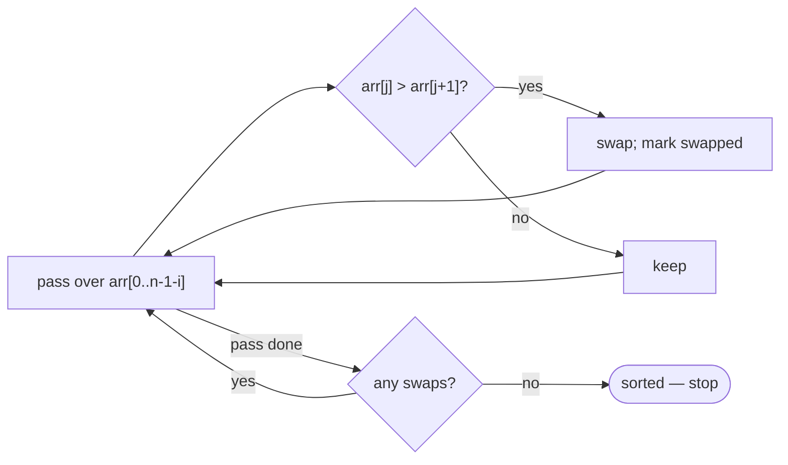

# Bubble Sort

## Why It Exists

Sorting is the canonical "put things in order" task, and bubble sort is the simplest possible approach — the one you'd invent by hand. Walk the array comparing each element to its neighbour; whenever a pair is out of order, swap them. Do that across the whole array and the single largest element "bubbles" all the way to the end. Repeat, and the second-largest settles into the second-to-last slot, and so on.

It's not fast — `O(n²)` — and you won't reach for it in production. But it earns its place as the *first* sort because every idea it introduces recurs: comparing and swapping adjacent elements, sorting **in place** (no extra array), **stability** (equal elements keep their order), and **adaptivity** (detecting an already-sorted input and stopping early). Understand bubble sort and the faster sorts become variations on a theme.

## See It Work

Sort `[5, 2, 8, 1, 9, 3]` by repeatedly swapping adjacent out-of-order pairs. Run it, then **Visualise** the largest values bubble rightward.

> ▶ Run it, then click **Visualise** — each pass walks left to right swapping neighbours; watch the biggest unsorted value reach the end every pass.

```python run viz=array viz-root=arr
import ast

arr = ast.literal_eval(input())         # the test case's array
n = len(arr)
for i in range(n - 1):                  # n-1 passes
    swapped = False
    for j in range(n - 1 - i):          # the last i elements are already in place
        if arr[j] > arr[j + 1]:         # adjacent pair out of order?
            arr[j], arr[j + 1] = arr[j + 1], arr[j]   # swap
            swapped = True
    if not swapped:                     # a clean pass ⇒ already sorted, stop early
        break
print(arr)                              # [1, 2, 3, 5, 8, 9]
```

```java run viz=array viz-root=arr
import java.util.*;

public class Main {
  public static void main(String[] args) {
    Scanner sc = new Scanner(System.in);
    int[] arr = parseIntArray(sc.nextLine());   // the test case's array
    int n = arr.length;
    for (int i = 0; i < n - 1; i++) {           // n-1 passes
      boolean swapped = false;
      for (int j = 0; j < n - 1 - i; j++) {     // the last i elements are already in place
        if (arr[j] > arr[j + 1]) {              // adjacent pair out of order?
          int t = arr[j]; arr[j] = arr[j + 1]; arr[j + 1] = t;   // swap
          swapped = true;
        }
      }
      if (!swapped) break;                       // a clean pass ⇒ already sorted, stop early
    }
    System.out.println(Arrays.toString(arr));   // [1, 2, 3, 5, 8, 9]
  }

  // "[1, 2, 3]" → {1, 2, 3} — reads the test case's array
  static int[] parseIntArray(String line) {
    String inner = line.replaceAll("[\\[\\]\\s]", "");
    if (inner.isEmpty()) return new int[0];
    String[] parts = inner.split(",");
    int[] out = new int[parts.length];
    for (int i = 0; i < parts.length; i++) out[i] = Integer.parseInt(parts[i]);
    return out;
  }
}
```

```testcases
{
  "args": [
    { "id": "arr", "label": "arr", "type": "int[]", "placeholder": "[5, 2, 8, 1, 9, 3]" }
  ],
  "cases": [
    { "args": { "arr": "[5, 2, 8, 1, 9, 3]" }, "expected": "[1, 2, 3, 5, 8, 9]" },
    { "args": { "arr": "[1, 2, 3, 4]" }, "expected": "[1, 2, 3, 4]" },
    { "args": { "arr": "[3, 3, 1, 2, 3]" }, "expected": "[1, 2, 3, 3, 3]" },
    { "args": { "arr": "[1]" }, "expected": "[1]" }
  ]
}
```

## How It Works

Two nested loops:

- **Inner loop** — scan adjacent pairs `(arr[j], arr[j+1])` and swap any that are out of order. By the end of one full inner pass, the largest unsorted element has bubbled to the rightmost unsorted slot.
- **Outer loop** — repeat the inner pass. After `i` passes the last `i` elements are sorted and fixed, so the inner loop can stop `i` slots earlier: `j < n - 1 - i`.
- **Early exit** — if an inner pass makes *no* swaps, everything is already in order; break.



<p align="center"><strong>each pass walks adjacent pairs left→right, swapping the larger one rightward, so the maximum of the unsorted region lands at its end; the sorted tail grows by one each pass.</strong></p>

The cost: each pass is `O(n)` and there are up to `n−1` passes → **`O(n²)` time** worst and average, `O(n)` best (already sorted, one clean pass with early-exit), **`O(1)` extra space**. It's **stable** — equal elements never swap past each other, so their original order is preserved — which matters when sorting records by one field while keeping another field's order.

### Key Takeaway

Bubble sort repeatedly swaps adjacent out-of-order pairs, bubbling each pass's largest element to the end. `O(n²)` time, `O(1)` space, stable, and `O(n)` on sorted input with an early-exit flag. It's the teaching sort — the faster ones improve on its quadratic cost.

## Trace It

First pass over `[5, 2, 8, 1, 9, 3]`:

| compare | action | array |
|---|---|---|
| `5,2` | swap | `[2,5,8,1,9,3]` |
| `5,8` | keep | `[2,5,8,1,9,3]` |
| `8,1` | swap | `[2,5,1,8,9,3]` |
| `8,9` | keep | `[2,5,1,8,9,3]` |
| `9,3` | swap | `[2,5,1,8,3,9]` |

After one pass, `9` (the max) is at the end.

Before you read on: after each pass the inner loop runs one step *shorter* (`j < n - 1 - i`). Why is it safe — and worthwhile — to skip the tail that earlier passes already touched?

Because each pass guarantees the largest element of the still-unsorted region reaches its final slot at the end of that region. After pass 0, the last element is the global max and is permanently correct; after pass 1, the last *two* are; and so on. So re-scanning that growing sorted tail would only re-compare elements already in place — wasted work that can never swap. Shrinking the inner bound by `i` each pass turns `n` full scans into the triangular sum `n + (n−1) + … + 1 ≈ n²/2` comparisons. It doesn't change the `O(n²)` class, but it halves the constant — and recognizing "this region is already done, don't revisit it" is the same instinct that makes the faster sorts faster.

## Your Turn

Implement the adaptive bubble sort: walk adjacent pairs swapping any out of order so the largest unsorted value bubbles to the end each pass, shrink the inner bound by `i`, and stop early on a clean (no-swap) pass. Return the sorted array.

```python run viz=array
import ast

def bubble_sort(arr):
    # Your code goes here — nested passes swapping adjacent out-of-order pairs;
    # shrink the inner bound by i each pass; break early on a no-swap pass.
    return arr

arr = ast.literal_eval(input())      # the test case's array
print(bubble_sort(arr))
```

```java run viz=array
import java.util.*;

public class Main {
  static int[] bubbleSort(int[] arr) {
    // Your code goes here — nested passes swapping adjacent out-of-order pairs;
    // shrink the inner bound by i each pass; break early on a no-swap pass.
    return arr;
  }

  public static void main(String[] args) {
    Scanner sc = new Scanner(System.in);
    int[] arr = parseIntArray(sc.nextLine());
    System.out.println(Arrays.toString(bubbleSort(arr)));
  }

  static int[] parseIntArray(String line) {
    String inner = line.replaceAll("[\\[\\]\\s]", "");
    if (inner.isEmpty()) return new int[0];
    String[] parts = inner.split(",");
    int[] out = new int[parts.length];
    for (int i = 0; i < parts.length; i++) out[i] = Integer.parseInt(parts[i]);
    return out;
  }
}
```

```testcases
{
  "args": [
    { "id": "arr", "label": "arr", "type": "int[]", "placeholder": "[5, 2, 8, 1, 9, 3]" }
  ],
  "cases": [
    { "args": { "arr": "[5, 2, 8, 1, 9, 3]" }, "expected": "[1, 2, 3, 5, 8, 9]" },
    { "args": { "arr": "[1, 2, 3, 4]" }, "expected": "[1, 2, 3, 4]" },
    { "args": { "arr": "[9, 7, 5, 3, 1]" }, "expected": "[1, 3, 5, 7, 9]" },
    { "args": { "arr": "[2, 1]" }, "expected": "[1, 2]" }
  ]
}
```

<details>
<summary>Editorial</summary>

Two nested loops with an early-exit flag. The inner loop walks adjacent pairs and swaps any out of order, bubbling the largest unsorted value to the end; the outer loop repeats, shrinking the inner bound by `i` since the last `i` elements are already in place. A pass with no swaps proves the array is sorted, so break. `O(n²)` time, `O(1)` space, stable, and `O(n)` on already-sorted input.

```python solution time=O(n^2) space=O(1)
import ast

def bubble_sort(arr):
    n = len(arr)
    for i in range(n - 1):
        swapped = False
        for j in range(n - 1 - i):
            if arr[j] > arr[j + 1]:
                arr[j], arr[j + 1] = arr[j + 1], arr[j]
                swapped = True
        if not swapped:
            break
    return arr

arr = ast.literal_eval(input())      # the test case's array
print(bubble_sort(arr))
```

```java solution
import java.util.*;

public class Main {
  static int[] bubbleSort(int[] arr) {
    int n = arr.length;
    for (int i = 0; i < n - 1; i++) {
      boolean swapped = false;
      for (int j = 0; j < n - 1 - i; j++) {
        if (arr[j] > arr[j + 1]) {
          int t = arr[j]; arr[j] = arr[j + 1]; arr[j + 1] = t;
          swapped = true;
        }
      }
      if (!swapped) break;
    }
    return arr;
  }

  public static void main(String[] args) {
    Scanner sc = new Scanner(System.in);
    int[] arr = parseIntArray(sc.nextLine());
    System.out.println(Arrays.toString(bubbleSort(arr)));
  }

  static int[] parseIntArray(String line) {
    String inner = line.replaceAll("[\\[\\]\\s]", "");
    if (inner.isEmpty()) return new int[0];
    String[] parts = inner.split(",");
    int[] out = new int[parts.length];
    for (int i = 0; i < parts.length; i++) out[i] = Integer.parseInt(parts[i]);
    return out;
  }
}
```

</details>

## Reflect & Connect

Bubble sort is a teaching tool, but the properties it introduces are the vocabulary for *every* sort:

- **Stable, in-place, adaptive** — bubble sort is all three. You'll classify every later sort by these axes: merge sort is stable but not in-place; heapsort is in-place but not stable; quicksort is in-place but not stable and not adaptive. Knowing which guarantees a sort gives is how you pick one.
- **Why it's slow** — it moves elements only *one position per swap*, so an element far from its home needs many swaps. Insertion and selection sort share the `O(n²)` ceiling for the same reason; the `O(n log n)` sorts (merge, quick, heap) move elements *across* the array in bigger jumps.
- **The early-exit is the one practical idea** — on nearly-sorted data, adaptive bubble sort is `O(n)`. That "detect sorted-ness and stop" instinct carries into adaptive variants of better sorts (e.g. Timsort exploits existing runs).

**Prerequisites:** [What Is an Array?](/cortex/data-structures-and-algorithms/linear-structures/arrays/what-is-an-array).
**What's next:** select the minimum each pass instead of bubbling the max — [Selection Sort](/cortex/data-structures-and-algorithms/sorting-and-searching/sorting/selection-sort).

## Recall

> **Mnemonic:** *Swap adjacent out-of-order pairs; each pass bubbles the max to the end. Shrink the inner bound by `i`. No swaps ⇒ sorted, stop. `O(n²)`, stable, in-place.*

| | |
|---|---|
| Mechanism | swap adjacent pairs; largest bubbles to the end each pass |
| Inner bound | `j < n - 1 - i` (skip the sorted tail) |
| Early exit | a pass with no swaps ⇒ array sorted |
| Cost | `O(n²)` avg/worst, `O(n)` best (adaptive), `O(1)` space |
| Properties | stable, in-place, adaptive |

<details>
<summary><strong>Q:</strong> What does one full pass of bubble sort guarantee?</summary>

**A:** The largest element of the unsorted region reaches its final position at that region's end.

</details>
<details>
<summary><strong>Q:</strong> Why does the inner loop shrink by `i` each pass?</summary>

**A:** After `i` passes the last `i` elements are already sorted, so re-scanning them is wasted work.

</details>
<details>
<summary><strong>Q:</strong> What makes bubble sort `O(n)` on already-sorted input?</summary>

**A:** The early-exit flag — a pass with no swaps proves the array is sorted, so it stops after one pass.

</details>
<details>
<summary><strong>Q:</strong> Which three properties does bubble sort have?</summary>

**A:** Stable, in-place, and adaptive.

</details>

## Sources & Verify

- **CLRS**, *Introduction to Algorithms*, 4th ed. — bubble sort (problem 2-2) and the stability/in-place definitions.
- **Sedgewick & Wayne**, *Algorithms*, 4th ed., §2.1 — elementary sorts and their properties.
- Bubble sort's `O(n²)`/`O(n)`-adaptive bounds and stability are standard; both runnable blocks are verified by running (`[5,2,8,1,9,3] ⇒ [1,2,3,5,8,9]`; sorted input exits in one pass).
