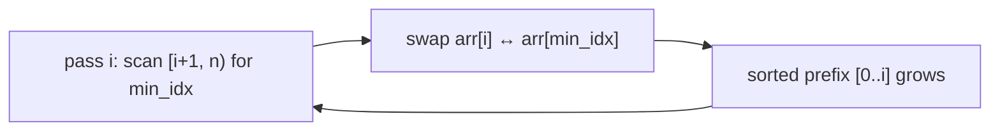

# Selection Sort

## Why It Exists

Bubble sort swapped over and over — up to `O(n²)` swaps. Selection sort asks: what if we did the *fewest possible* swaps? Its answer is to make exactly **one swap per pass**, `n−1` total.

Each pass scans the entire unsorted region to find its smallest element, then swaps that minimum into the next slot of the sorted region. The first pass puts the global minimum at index 0, the second puts the next-smallest at index 1, and so on. It still does `O(n²)` *comparisons* (every pass scans the rest of the array), but only `O(n)` *swaps* — and that's the niche: when writing to memory is dramatically more expensive than reading it (flash/EEPROM wear, or moving large records), minimizing writes wins.

## See It Work

Sort an array by selecting the minimum each pass. Run it, then **Visualise** the minimum jump to the front of the unsorted region.

> ▶ Run it, then click **Visualise** — each pass finds the smallest remaining value and swaps it into the next sorted slot.

```python run viz=array viz-root=arr
import ast

arr = ast.literal_eval(input())         # the test case's array
n = len(arr)
for i in range(n - 1):
    min_idx = i
    for j in range(i + 1, n):          # scan the unsorted region [i+1 .. n) for its minimum
        if arr[j] < arr[min_idx]:
            min_idx = j
    arr[i], arr[min_idx] = arr[min_idx], arr[i]   # one swap: minimum into slot i
print(arr)                              # [1, 2, 3, 5, 8, 9]
```

```java run viz=array viz-root=arr
import java.util.*;

public class Main {
  public static void main(String[] args) {
    Scanner sc = new Scanner(System.in);
    int[] arr = parseIntArray(sc.nextLine());   // the test case's array
    int n = arr.length;
    for (int i = 0; i < n - 1; i++) {
      int minIdx = i;
      for (int j = i + 1; j < n; j++)          // scan unsorted region for minimum
        if (arr[j] < arr[minIdx]) minIdx = j;
      int t = arr[i]; arr[i] = arr[minIdx]; arr[minIdx] = t;   // one swap: minimum into slot i
    }
    System.out.println(Arrays.toString(arr));   // [1, 2, 3, 5, 8, 9]
  }

  // "[1, 2, 3]" → {1, 2, 3} — reads the test case's array
  static int[] parseIntArray(String line) {
    String inner = line.replaceAll("[\\[\\]\\s]", "");
    if (inner.isEmpty()) return new int[0];
    String[] parts = inner.split(",");
    int[] out = new int[parts.length];
    for (int i = 0; i < parts.length; i++) out[i] = Integer.parseInt(parts[i]);
    return out;
  }
}
```

```testcases
{
  "args": [
    { "id": "arr", "label": "arr", "type": "int[]", "placeholder": "[5, 2, 8, 1, 9, 3]" }
  ],
  "cases": [
    { "args": { "arr": "[5, 2, 8, 1, 9, 3]" }, "expected": "[1, 2, 3, 5, 8, 9]" },
    { "args": { "arr": "[1, 2, 3, 4]" }, "expected": "[1, 2, 3, 4]" },
    { "args": { "arr": "[3, 1, 2]" }, "expected": "[1, 2, 3]" },
    { "args": { "arr": "[1]" }, "expected": "[1]" }
  ]
}
```

## How It Works

Two nested loops, but the swap is outside the inner one:

- **Inner loop** — scan `[i+1, n)` tracking the index of the smallest element (`min_idx`). No swapping here; just *find* the minimum.
- **Outer loop** — after the scan, do a single swap of `arr[i]` with `arr[min_idx]`, placing the minimum at index `i`. The sorted region `[0, i]` grows by one.



<p align="center"><strong>each pass scans the unsorted region for its minimum, then swaps it into the boundary slot; the sorted prefix grows one element per pass.</strong></p>

The cost is **`O(n²)` comparisons** in *every* case — selection sort always scans the full unsorted region, so it's **not adaptive** (a sorted input takes just as long as a shuffled one). It does only **`O(n)` swaps** and **`O(1)` extra space**. And it is **not stable**: swapping a far-away minimum into place can leapfrog it over an equal element, changing their relative order.

### Key Takeaway

Selection sort scans for the minimum and swaps it into place once per pass — `n−1` swaps, the fewest of any simple sort. `O(n²)` comparisons always (not adaptive), `O(1)` space, not stable. Choose it when writes cost far more than reads.

## Trace It

Passes over `[5, 2, 8, 1, 9, 3]` (min of the unsorted region in **bold**):

| pass | unsorted region | min | swap | array |
|---|---|---|---|---|
| 0 | `[5,2,8,1,9,3]` | **1** | `5↔1` | `[1,2,8,5,9,3]` |
| 1 | `[2,8,5,9,3]` | **2** | `2↔2` (no move) | `[1,2,8,5,9,3]` |
| 2 | `[8,5,9,3]` | **3** | `8↔3` | `[1,2,3,5,9,8]` |
| 3 | `[5,9,8]` | **5** | `5↔5` | `[1,2,3,5,9,8]` |
| 4 | `[9,8]` | **8** | `9↔8` | `[1,2,3,5,8,9]` |

Before you read on: bubble sort's early-exit made it `O(n)` on an already-sorted array. Selection sort has no such shortcut — even on sorted input it does the full `O(n²)` work. Why can't selection sort detect that it's already done and stop early?

Because selection sort never learns whether the array is sorted — it only ever finds *the minimum of the remaining region*. On a sorted input, each pass's minimum is simply the element already at index `i`, so the swaps are no-ops — but the algorithm still has to *scan* the whole unsorted region every pass to *confirm* that element is the smallest. There's no cheap signal, like bubble sort's "a pass with zero swaps," that proves order; selection sort's inner loop must run to completion to know its answer. That's the structural reason it's non-adaptive: the comparison work is fixed at `n + (n−1) + … + 1 ≈ n²/2` regardless of input, even though the swap work collapses to nothing.

## Your Turn

Implement selection sort: each pass find the minimum of the unsorted region and swap it into the next sorted slot. Return the sorted array.

```python run viz=array
import ast

def selection_sort(arr):
    # Your code goes here — each pass: find min of arr[i..n-1], swap into slot i.
    return arr

arr = ast.literal_eval(input())      # the test case's array
print(selection_sort(arr))
```

```java run viz=array
import java.util.*;

public class Main {
  static int[] selectionSort(int[] arr) {
    // Your code goes here — each pass: find min of arr[i..n-1], swap into slot i.
    return arr;
  }

  public static void main(String[] args) {
    Scanner sc = new Scanner(System.in);
    int[] arr = parseIntArray(sc.nextLine());
    System.out.println(Arrays.toString(selectionSort(arr)));
  }

  static int[] parseIntArray(String line) {
    String inner = line.replaceAll("[\\[\\]\\s]", "");
    if (inner.isEmpty()) return new int[0];
    String[] parts = inner.split(",");
    int[] out = new int[parts.length];
    for (int i = 0; i < parts.length; i++) out[i] = Integer.parseInt(parts[i]);
    return out;
  }
}
```

```testcases
{
  "args": [
    { "id": "arr", "label": "arr", "type": "int[]", "placeholder": "[5, 2, 8, 1, 9, 3]" }
  ],
  "cases": [
    { "args": { "arr": "[5, 2, 8, 1, 9, 3]" }, "expected": "[1, 2, 3, 5, 8, 9]" },
    { "args": { "arr": "[1, 2, 3, 4]" }, "expected": "[1, 2, 3, 4]" },
    { "args": { "arr": "[9, 7, 5, 3, 1]" }, "expected": "[1, 3, 5, 7, 9]" },
    { "args": { "arr": "[2, 1]" }, "expected": "[1, 2]" }
  ]
}
```

<details>
<summary>Editorial</summary>

Two nested loops with no early-exit. The inner loop scans `arr[i..n-1]` tracking the index of the minimum; after the scan, a single swap places the minimum at index `i`. The sorted prefix grows by one per pass, making `n−1` passes and `n−1` swaps total. `O(n²)` comparisons always (not adaptive), `O(1)` space, not stable.

```python solution time=O(n^2) space=O(1)
import ast

def selection_sort(arr):
    n = len(arr)
    for i in range(n - 1):
        min_idx = i
        for j in range(i + 1, n):
            if arr[j] < arr[min_idx]:
                min_idx = j
        arr[i], arr[min_idx] = arr[min_idx], arr[i]
    return arr

arr = ast.literal_eval(input())      # the test case's array
print(selection_sort(arr))
```

```java solution
import java.util.*;

public class Main {
  static int[] selectionSort(int[] arr) {
    int n = arr.length;
    for (int i = 0; i < n - 1; i++) {
      int minIdx = i;
      for (int j = i + 1; j < n; j++)
        if (arr[j] < arr[minIdx]) minIdx = j;
      int t = arr[i]; arr[i] = arr[minIdx]; arr[minIdx] = t;
    }
    return arr;
  }

  public static void main(String[] args) {
    Scanner sc = new Scanner(System.in);
    int[] arr = parseIntArray(sc.nextLine());
    System.out.println(Arrays.toString(selectionSort(arr)));
  }

  static int[] parseIntArray(String line) {
    String inner = line.replaceAll("[\\[\\]\\s]", "");
    if (inner.isEmpty()) return new int[0];
    String[] parts = inner.split(",");
    int[] out = new int[parts.length];
    for (int i = 0; i < parts.length; i++) out[i] = Integer.parseInt(parts[i]);
    return out;
  }
}
```

</details>

## Reflect & Connect

Selection sort is the "minimize writes" elementary sort, and it sets up something bigger:

- **Selection vs bubble** — both are `O(n²)` comparisons, but they trade differently: bubble sort is *adaptive and stable* but does many swaps; selection sort does the *fewest swaps* (`O(n)`) but is *neither adaptive nor stable*. Pick by whether writes or order-preservation matter more.
- **The min-extraction idea scales up** — selection sort repeatedly extracts the minimum via a *linear scan* (`O(n)` each). Replace that linear scan with a **heap**, which extracts the minimum in `O(log n)`, and selection sort becomes **[heapsort](/cortex/data-structures-and-algorithms/sorting-and-searching/sorting/heapsort)** — the same "select the next-smallest" strategy, made `O(n log n)`.
- **Not stable is a real gotcha** — if you're sorting records and need a stable result, selection sort silently reorders equal keys; reach for insertion or merge sort instead.

**Prerequisites:** [What Is an Array?](/cortex/data-structures-and-algorithms/linear-structures/arrays/what-is-an-array).
**What's next:** build the sorted region by inserting each element into place — [Insertion Sort](/cortex/data-structures-and-algorithms/sorting-and-searching/sorting/insertion-sort).

## Recall

> **Mnemonic:** *Each pass: find the min of the unsorted region, swap it to the front. `n−1` swaps total. `O(n²)` compares always (not adaptive), not stable.*

| | |
|---|---|
| Mechanism | scan unsorted region for min, swap into slot `i` |
| Swaps | exactly `n − 1` (fewest of the simple sorts) |
| Comparisons | `O(n²)` always — not adaptive |
| Space / stability | `O(1)`, **not** stable |
| Best use | when writes/swaps are far costlier than reads |

<details>
<summary><strong>Q:</strong> How many swaps does selection sort do, and why does that matter?</summary>

**A:** Exactly `n−1` — the fewest of any simple sort; ideal when writes are expensive.

</details>
<details>
<summary><strong>Q:</strong> Why is selection sort not adaptive?</summary>

**A:** It must scan the whole unsorted region each pass to find the minimum, so comparison work is fixed regardless of input order.

</details>
<details>
<summary><strong>Q:</strong> Why is selection sort not stable?</summary>

**A:** Swapping a distant minimum into place can move it past an equal element, changing their relative order.

</details>
<details>
<summary><strong>Q:</strong> How does selection sort relate to heapsort?</summary>

**A:** Heapsort is selection sort with a heap replacing the linear min-scan, dropping each extraction from `O(n)` to `O(log n)`.

</details>

## Sources & Verify

- **CLRS**, *Introduction to Algorithms*, 4th ed. — selection sort (problem 2-2) and elementary-sort analysis.
- **Sedgewick & Wayne**, *Algorithms*, 4th ed., §2.1 — selection sort, its `O(n²)`/`O(n)`-swaps profile, and non-stability.
- Selection sort's bounds, non-adaptivity, and non-stability are standard; both runnable blocks are verified by running (`[5,2,8,1,9,3] ⇒ [1,2,3,5,8,9]`; `[3,1,2] ⇒ [1,2,3]`).
