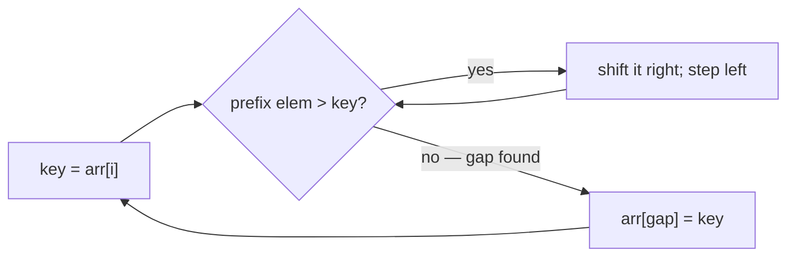

# Insertion Sort

## Why It Exists

It's how you sort a hand of playing cards. The cards in your left hand stay sorted; you pick up each new card and slide it leftward past the bigger ones until it sits in the right spot. Insertion sort does exactly that to an array: keep a **sorted prefix** at the front, and for each new element, insert it into its correct place within that prefix by shifting the larger elements one slot to the right.

Its worst case is `O(n²)` like the other elementary sorts, but it has two properties that make it genuinely useful: it's **adaptive** — on already-sorted or nearly-sorted input it runs in `O(n)`, because each new element is already in place — and it's **stable** and **in-place** with very low overhead. That combination is why production sorts (Timsort, introsort) switch to insertion sort for small subarrays: on the small, nearly-ordered runs that big sorts produce, nothing beats it.

## See It Work

Sort `[5, 2, 8, 1, 9, 3]` by inserting each element into the growing sorted prefix. Run it, then **Visualise** the prefix grow as each element slides into place.

> ▶ Run it, then click **Visualise** — each new element shifts the larger prefix values right, then drops into the gap.

```python run viz=array viz-root=arr
arr = [5, 2, 8, 1, 9, 3]
for i in range(1, len(arr)):
    key = arr[i]                      # the element to insert
    j = i - 1
    while j >= 0 and arr[j] > key:    # shift larger prefix elements right
        arr[j + 1] = arr[j]
        j -= 1
    arr[j + 1] = key                  # drop key into the opened gap
print(arr)                            # [1, 2, 3, 5, 8, 9]
```

## How It Works

The prefix `arr[0..i-1]` is always sorted. To extend it to include `arr[i]`:

1. **Save** `key = arr[i]` (the slot is about to be overwritten by shifts).
2. **Shift** — walk left from `i-1`; while the prefix element is greater than `key`, copy it one slot right. This opens a gap exactly where `key` belongs.
3. **Drop** `key` into the gap.

Note it **shifts** rather than swaps — one assignment per moved element, not three. That's a constant-factor win over swap-based moves.



<p align="center"><strong>hold the next element as <code>key</code>, shift the larger sorted-prefix elements rightward to open a gap, then drop <code>key</code> in; the sorted prefix grows by one.</strong></p>

The adaptivity is the whole story: if `arr[i]` is already `≥` everything in the prefix, the `while` condition is false immediately and that element costs `O(1)`. On a fully sorted array, *every* element is already in place → `O(n)` total. On a reverse-sorted array, every element shifts past the entire prefix → `O(n²)`. Average is `O(n²)`, space `O(1)`, and it's **stable** (the `> key` test, strict, never shifts an equal element past `key`).

### Key Takeaway

Insertion sort grows a sorted prefix by shifting larger elements right to insert each new one. `O(n²)` worst but `O(n)` adaptive on nearly-sorted input, stable, in-place, low overhead — the elementary sort production libraries actually use, for small runs.

## Trace It

Inserting `1` (at `i = 3`) into the sorted prefix `[2, 5, 8]` of `[2, 5, 8, 1, 9, 3]`:

| step | compare | array (gap shown) |
|---|---|---|
| save `key = 1` | — | `[2, 5, 8, _, 9, 3]` |
| `8 > 1` | shift `8` right | `[2, 5, _, 8, 9, 3]` |
| `5 > 1` | shift `5` right | `[2, _, 5, 8, 9, 3]` |
| `2 > 1` | shift `2` right | `[_, 2, 5, 8, 9, 3]` |
| `j < 0` | drop `key` | `[1, 2, 5, 8, 9, 3]` |

Before you read on: inserting `1` shifted *three* elements because `1` was smaller than the whole prefix. But on a sorted array, how much work does each insertion do — and why does that make insertion sort `O(n)` on sorted input while bubble and selection stay `O(n²)`?

On a sorted array, `arr[i]` is always `≥ arr[i-1]`, so the `while` condition (`arr[j] > key`) is false on the *very first* check — zero shifts, `O(1)` per element, `O(n)` total. The inner loop does work *proportional to how far each element must move*, which on nearly-sorted data is tiny. Selection sort can't exploit this (it always scans the full unsorted region for the min), and while adaptive *bubble* sort also hits `O(n)` on sorted input, it does so with more total element moves on partially-sorted data. Insertion sort's "work ∝ disorder" is the sharpest adaptivity of the three — which is precisely why it's the small-run workhorse inside Timsort.

## Your Turn

The reusable insertion sort:

```python run viz=array
def insertion_sort(arr):
    for i in range(1, len(arr)):
        key = arr[i]
        j = i - 1
        while j >= 0 and arr[j] > key:
            arr[j + 1] = arr[j]
            j -= 1
        arr[j + 1] = key
    return arr

print(insertion_sort([5, 2, 8, 1, 9, 3]))   # [1, 2, 3, 5, 8, 9]
print(insertion_sort([1, 2, 3, 4]))         # [1, 2, 3, 4]  (O(n), no shifts)
```

```java run viz=array
import java.util.*;

public class Main {
  static int[] insertionSort(int[] arr) {
    for (int i = 1; i < arr.length; i++) {
      int key = arr[i], j = i - 1;
      while (j >= 0 && arr[j] > key) { arr[j + 1] = arr[j]; j--; }
      arr[j + 1] = key;
    }
    return arr;
  }

  public static void main(String[] args) {
    System.out.println(Arrays.toString(insertionSort(new int[]{5, 2, 8, 1, 9, 3})));   // [1, 2, 3, 5, 8, 9]
  }
}
```

This is a structural lesson — drill sorting in the pattern sets.

## Reflect & Connect

Insertion sort is the best of the elementary sorts and a real production building block:

- **The elementary trio, compared** — all `O(n²)` worst case, but: insertion is adaptive + stable + low-overhead (best all-rounder); bubble is adaptive + stable but moves more; selection minimizes swaps but is neither adaptive nor stable. For small or nearly-sorted data, insertion wins.
- **It's inside the big sorts** — Timsort (Python, Java objects) and introsort (C++) fall back to insertion sort below a size threshold (~16–32 elements), because its low constant factor beats the recursion overhead of `O(n log n)` sorts on tiny inputs.
- **Variants** — *binary* insertion sort uses binary search to find the gap in `O(log n)` comparisons (though still `O(n)` shifts); shell sort generalizes it with gapped passes to move elements farther per step. The "shift, don't swap" idea also recurs in array-insertion and the merge step of merge sort.

**Prerequisites:** [What Is an Array?](/cortex/data-structures-and-algorithms/linear-structures/arrays/what-is-an-array).
**What's next:** drop comparisons entirely and sort by counting — [Counting Sort](/cortex/data-structures-and-algorithms/sorting-and-searching/sorting/counting-sort).

## Recall

> **Mnemonic:** *Sorted prefix; take each element as `key`, shift larger ones right, drop `key` in the gap. `O(n)` on sorted (adaptive), stable, in-place. Shift, don't swap.*

| | |
|---|---|
| Mechanism | insert each element into a growing sorted prefix by shifting |
| Best / worst | `O(n)` nearly-sorted · `O(n²)` reverse-sorted · `O(n²)` avg |
| Space / stability | `O(1)`, stable |
| Adaptive | yes — work ∝ disorder |
| Real use | small-run fallback inside Timsort / introsort |

<details>
<summary><strong>Q:</strong> How does insertion sort place each element?</summary>

**A:** It shifts the larger elements of the sorted prefix one slot right to open a gap, then drops the element in.

</details>
<details>
<summary><strong>Q:</strong> Why is it `O(n)` on already-sorted input?</summary>

**A:** Each element is already `≥` the prefix, so the shift loop never runs — `O(1)` per element.

</details>
<details>
<summary><strong>Q:</strong> Why is it stable?</summary>

**A:** The strict `> key` shift test never moves an equal element past `key`, preserving relative order.

</details>
<details>
<summary><strong>Q:</strong> Why do real-world sorts use it for small subarrays?</summary>

**A:** Its low constant factor and adaptivity beat the recursion overhead of `O(n log n)` sorts on tiny, nearly-ordered runs.

</details>

## Sources & Verify

- **CLRS**, *Introduction to Algorithms*, 4th ed., §2.1 — insertion sort, its analysis, and the loop invariant.
- **Sedgewick & Wayne**, *Algorithms*, 4th ed., §2.1 — insertion sort, adaptivity, and stability; Timsort/introsort cutoffs are documented in the CPython/JDK sources.
- Insertion sort's adaptive `O(n)`/`O(n²)` bounds and stability are standard; both runnable blocks are verified by running (`[5,2,8,1,9,3] ⇒ [1,2,3,5,8,9]`; sorted input does zero shifts).
