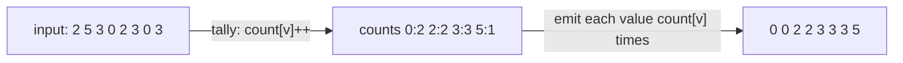

# Counting Sort

## Why It Exists

Every comparison sort is stuck at `Ω(n log n)` — that's a *proven* floor (see the [intro](/cortex/data-structures-and-algorithms/sorting-and-searching/sorting/introduction-to-sorting)). But that floor only applies to sorts that learn the order by *comparing* elements. If your keys are integers in a small, known range, you can skip comparison entirely.

Counting sort does. Instead of asking "is `a < b`?", it uses each value **as an index**: tally how many times every value appears, then walk the tallies from smallest to largest, emitting each value as many times as it occurred. No element is ever compared to another. The cost is `O(n + k)` for `n` elements spanning a range of `k` — and when `k` is `O(n)` (say, exam scores 0–100 for a million students), that's linear, comfortably beating `n log n`.

## See It Work

Sort `[2, 5, 3, 0, 2, 3, 0, 3]` (values in `0..5`) by counting. Run it — notice there's not a single comparison between elements.

> ▶ Run it, then click **Visualise** — tallying fills each bucket by index; reading the buckets left-to-right emits values in sorted order, no comparisons ever made.

```python run viz=array viz-root=arr
import ast

arr = ast.literal_eval(input())         # the test case's array
if not arr:
    print(arr)
else:
    lo, hi = min(arr), max(arr)
    count = [0] * (hi - lo + 1)        # one bucket per possible value
    for x in arr:
        count[x - lo] += 1             # tally — value used as an index, no comparisons
    out = []
    for i, c in enumerate(count):
        out.extend([i + lo] * c)       # read buckets back in ascending order
    print(out)                          # [0, 0, 2, 2, 3, 3, 3, 5]
```

```java run viz=array viz-root=arr
import java.util.*;

public class Main {
  public static void main(String[] args) {
    Scanner sc = new Scanner(System.in);
    int[] arr = parseIntArray(sc.nextLine());   // the test case's array
    if (arr.length == 0) { System.out.println("[]"); return; }
    int lo = Arrays.stream(arr).min().getAsInt(), hi = Arrays.stream(arr).max().getAsInt();
    int[] count = new int[hi - lo + 1];         // one bucket per possible value
    for (int x : arr) count[x - lo]++;          // tally — value used as an index, no comparisons
    int[] out = new int[arr.length];
    int idx = 0;
    for (int v = 0; v < count.length; v++)
      for (int c = 0; c < count[v]; c++) out[idx++] = v + lo;   // read buckets back in order
    System.out.println(Arrays.toString(out));   // [0, 0, 2, 2, 3, 3, 3, 5]
  }

  // "[1, 2, 3]" → {1, 2, 3} — reads the test case's array
  static int[] parseIntArray(String line) {
    String inner = line.replaceAll("[\\[\\]\\s]", "");
    if (inner.isEmpty()) return new int[0];
    String[] parts = inner.split(",");
    int[] out = new int[parts.length];
    for (int i = 0; i < parts.length; i++) out[i] = Integer.parseInt(parts[i]);
    return out;
  }
}
```

```testcases
{
  "args": [
    { "id": "arr", "label": "arr", "type": "int[]", "placeholder": "[2, 5, 3, 0, 2, 3, 0, 3]" }
  ],
  "cases": [
    { "args": { "arr": "[2, 5, 3, 0, 2, 3, 0, 3]" }, "expected": "[0, 0, 2, 2, 3, 3, 3, 5]" },
    { "args": { "arr": "[5, 2, 8, 1, 9, 3]" }, "expected": "[1, 2, 3, 5, 8, 9]" },
    { "args": { "arr": "[3, 3, 1, 2, 3]" }, "expected": "[1, 2, 3, 3, 3]" },
    { "args": { "arr": "[1]" }, "expected": "[1]" }
  ]
}
```

## How It Works

Three steps:

1. **Find the range** `[lo, hi]` and allocate a `count` array of size `k = hi − lo + 1`, one bucket per possible value.
2. **Tally** — for each element `x`, increment `count[x − lo]`. The value itself selects the bucket; this is the move that sidesteps comparison.
3. **Emit** — walk `count` from low to high, outputting each value `i + lo` exactly `count[i]` times.



<p align="center"><strong>each element increments its value's bucket (no comparisons); then the buckets are read low-to-high, emitting each value as many times as it was counted.</strong></p>

Time is **`O(n + k)`** — `O(n)` to tally, `O(k)` to walk the buckets — and space is `O(k)`. The trade-off is the **range `k`**: counting sort shines when `k = O(n)` but becomes wasteful when the range dwarfs the count (sorting three values that happen to be `0`, `5`, and `1{,}000{,}000` allocates a million buckets). It also only works for keys that map to array indices — integers, or things reducible to bounded integers.

For sorting *records* by an integer key (where you must keep satellite data and preserve order), the production form uses **prefix sums**: turn the counts into ending positions, then place elements from right to left into an output array. That variant is **stable**, which is the property [radix sort](#reflect--connect) relies on.

### Key Takeaway

Counting sort tallies each value into a bucket (value-as-index, no comparisons) and reads the buckets back in order: `O(n + k)`, beating `Ω(n log n)` when `k = O(n)`. Best for bounded integer keys; the prefix-sum variant is stable and underpins radix sort.

## Trace It

Tallying `[2, 5, 3, 0, 2, 3, 0, 3]` over the range `0..5`:

| value | count |
|---|---|
| 0 | 2 |
| 1 | 0 |
| 2 | 2 |
| 3 | 3 |
| 4 | 0 |
| 5 | 1 |

Emit low→high: `0 0`, (skip 1), `2 2`, `3 3 3`, (skip 4), `5` → `[0, 0, 2, 2, 3, 3, 3, 5]`.

Before you read on: this sorted 8 values in range `0..5` beautifully. Now suppose the same 8 values were `[0, 5, 3, 0, 2, 3, 1{,}000{,}000, 3]`. What goes wrong, and what does it tell you about *when* counting sort is the right tool?

The single outlier `1{,}000{,}000` forces the `count` array to span `0..1{,}000{,}000` — a **million buckets** to sort eight numbers, almost all of them empty. Time and space both blow up to `O(k)` = `O(10⁶)`, far worse than an `O(n log n)` comparison sort on 8 elements. The lesson: counting sort's cost is governed by the *range* `k`, not just the count `n`. It's the right tool only when `k` is comparable to `n` (bounded, dense keys — ages, scores, byte values, small enum codes). When keys are sparse or unbounded, either the comparison sorts win, or you decompose the keys digit-by-digit — which is exactly what radix sort does to extend counting sort to large numbers.

## Your Turn

Implement the counting sort: find the value range, tally occurrences into a count array (value used as index), then emit each value in order as many times as it was counted. Return the sorted array.

```python run viz=array
import ast

def counting_sort(arr):
    # Your code goes here — find lo/hi, build a count array,
    # tally each value, then emit values in order.
    return arr

arr = ast.literal_eval(input())      # the test case's array
print(counting_sort(arr))
```

```java run viz=array
import java.util.*;

public class Main {
  static int[] countingSort(int[] arr) {
    // Your code goes here — find lo/hi, build a count array,
    // tally each value, then emit values in order.
    return arr;
  }

  public static void main(String[] args) {
    Scanner sc = new Scanner(System.in);
    int[] arr = parseIntArray(sc.nextLine());
    System.out.println(Arrays.toString(countingSort(arr)));
  }

  static int[] parseIntArray(String line) {
    String inner = line.replaceAll("[\\[\\]\\s]", "");
    if (inner.isEmpty()) return new int[0];
    String[] parts = inner.split(",");
    int[] out = new int[parts.length];
    for (int i = 0; i < parts.length; i++) out[i] = Integer.parseInt(parts[i]);
    return out;
  }
}
```

```testcases
{
  "args": [
    { "id": "arr", "label": "arr", "type": "int[]", "placeholder": "[2, 5, 3, 0, 2, 3, 0, 3]" }
  ],
  "cases": [
    { "args": { "arr": "[2, 5, 3, 0, 2, 3, 0, 3]" }, "expected": "[0, 0, 2, 2, 3, 3, 3, 5]" },
    { "args": { "arr": "[5, 2, 8, 1, 9, 3]" }, "expected": "[1, 2, 3, 5, 8, 9]" },
    { "args": { "arr": "[9, 7, 5, 3, 1]" }, "expected": "[1, 3, 5, 7, 9]" },
    { "args": { "arr": "[2, 1]" }, "expected": "[1, 2]" }
  ]
}
```

<details>
<summary>Editorial</summary>

Find the value range `[lo, hi]`, allocate a count array of size `hi - lo + 1`, tally each element into its bucket (`count[x - lo]++`), then emit values in order — each value `v + lo` repeated `count[v]` times. `O(n + k)` time and space (`k` = value range), no comparisons.

```python solution time=O(n+k) space=O(k)
import ast

def counting_sort(arr):
    if not arr:
        return arr
    lo, hi = min(arr), max(arr)
    count = [0] * (hi - lo + 1)
    for x in arr:
        count[x - lo] += 1
    out = []
    for i, c in enumerate(count):
        out.extend([i + lo] * c)
    return out

arr = ast.literal_eval(input())      # the test case's array
print(counting_sort(arr))
```

```java solution
import java.util.*;

public class Main {
  static int[] countingSort(int[] arr) {
    if (arr.length == 0) return arr;
    int lo = Arrays.stream(arr).min().getAsInt(), hi = Arrays.stream(arr).max().getAsInt();
    int[] count = new int[hi - lo + 1];
    for (int x : arr) count[x - lo]++;
    int[] out = new int[arr.length];
    int idx = 0;
    for (int v = 0; v < count.length; v++)
      for (int c = 0; c < count[v]; c++) out[idx++] = v + lo;
    return out;
  }

  public static void main(String[] args) {
    Scanner sc = new Scanner(System.in);
    int[] arr = parseIntArray(sc.nextLine());
    System.out.println(Arrays.toString(countingSort(arr)));
  }

  static int[] parseIntArray(String line) {
    String inner = line.replaceAll("[\\[\\]\\s]", "");
    if (inner.isEmpty()) return new int[0];
    String[] parts = inner.split(",");
    int[] out = new int[parts.length];
    for (int i = 0; i < parts.length; i++) out[i] = Integer.parseInt(parts[i]);
    return out;
  }
}
```

</details>

## Reflect & Connect

Counting sort is the gateway to the non-comparison sorts:

- **Its niche is bounded, dense integer keys** — ages, exam scores, byte values, small category codes. When `k = O(n)` it's linear; when keys are sparse or huge it's the wrong tool. Always reason about `k` vs `n` before reaching for it.
- **Stability + prefix sums = radix sort** — apply *stable* counting sort to one digit at a time, least-significant first, and you sort arbitrarily large integers (or fixed-length strings) in `O(d·(n + b))` for `d` digits in base `b`. Radix sort is just counting sort run `d` times — and it *needs* the stable variant so earlier-digit order survives later passes.
- **It escapes the comparison lower bound by construction** — by using values as indices rather than comparing them, it isn't a "comparison sort" at all, so `Ω(n log n)` simply doesn't apply. Its cousin **bucket sort** generalizes the idea to real-valued keys by distributing into ranges and sorting each bucket.

**Prerequisites:** [What Is an Array?](/cortex/data-structures-and-algorithms/linear-structures/arrays/what-is-an-array).
**What's next:** back to comparison sorts, but `O(n log n)` — partition around a pivot in [Quicksort](/cortex/data-structures-and-algorithms/sorting-and-searching/sorting/quicksort).

## Recall

> **Mnemonic:** *Tally each value into a bucket (value = index, no compares), read buckets low→high. `O(n + k)`. Great when `k = O(n)`; disastrous when the range is huge. Prefix-sum variant is stable → radix sort.*

| | |
|---|---|
| Mechanism | bucket per value; tally, then emit in order |
| Cost | `O(n + k)` time, `O(k)` space (`k` = value range) |
| Sweet spot | bounded, dense integer keys (`k = O(n)`) |
| Pitfall | sparse/huge range → `O(k)` blowup |
| Stable variant | prefix sums + right-to-left placement → enables radix sort |

<details>
<summary><strong>Q:</strong> How does counting sort beat the `Ω(n log n)` comparison bound?</summary>

**A:** It never compares elements — it uses values as array indices to tally, so the lower bound (which assumes comparisons) doesn't apply.

</details>
<details>
<summary><strong>Q:</strong> What governs counting sort's cost?</summary>

**A:** The value range `k`: it's `O(n + k)`, so it's only efficient when `k` is comparable to `n`.

</details>
<details>
<summary><strong>Q:</strong> When is counting sort the wrong choice?</summary>

**A:** When keys are sparse or unbounded — a huge range allocates mostly-empty buckets and blows up time and space.

</details>
<details>
<summary><strong>Q:</strong> How does counting sort lead to radix sort?</summary>

**A:** Radix sort applies *stable* counting sort digit-by-digit (LSD first), extending linear-time sorting to large integers; it relies on counting sort's stability.

</details>

## Sources & Verify

- **CLRS**, *Introduction to Algorithms*, 4th ed., §8.2–8.3 — counting sort (with the stable prefix-sum version) and radix sort.
- **Sedgewick & Wayne**, *Algorithms*, 4th ed., §5.1 — key-indexed counting and LSD radix sort.
- Counting sort's `O(n + k)` bound, range sensitivity, and role in radix sort are standard; both runnable blocks are verified by running (`[2,5,3,0,2,3,0,3] ⇒ [0,0,2,2,3,3,3,5]`; `[5,2,8,1,9,3] ⇒ [1,2,3,5,8,9]`).
