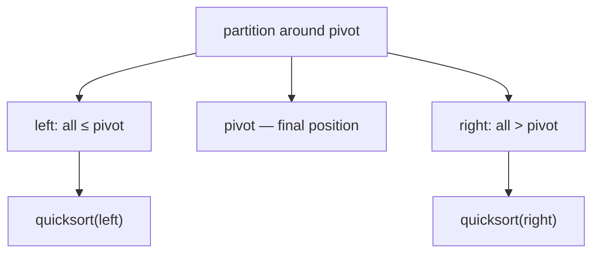

# Quicksort

## Why It Exists

The elementary sorts are `O(n²)` because they move elements only short distances — one swap or shift at a time. To break the quadratic barrier you need to rearrange the array in *big* strokes. Quicksort's stroke is **partitioning**: choose one element as the **pivot**, then rearrange so everything `≤` the pivot is to its left and everything `>` it is to its right. After one `O(n)` partition pass, the pivot sits in its *final* sorted position, and the problem splits into two independent smaller subarrays.

Recurse on each side and the whole array sorts. When the pivot splits the array roughly in half each time, you get `log n` levels of `O(n)` work — `O(n log n)`. And because partitioning is a tight in-place scan with excellent cache behavior and a small constant factor, quicksort is usually the **fastest comparison sort in practice**, which is why it (or a hybrid built on it) backs many standard libraries.

## See It Work

Sort `[5, 2, 8, 1, 9, 3]` by partitioning around a pivot and recursing. Run it, then **Visualise** the partition swaps.

> ▶ Run it, then click **Visualise** — each partition drags elements `≤` pivot to the left, then drops the pivot into its final slot before recursing on both halves.

```python run viz=array viz-root=arr
def partition(arr, lo, hi):
    pivot = arr[hi]                       # last element as pivot
    i = lo - 1                            # boundary of the "≤ pivot" region
    for j in range(lo, hi):
        if arr[j] <= pivot:
            i += 1
            arr[i], arr[j] = arr[j], arr[i]
    arr[i + 1], arr[hi] = arr[hi], arr[i + 1]   # pivot into its final slot
    return i + 1

def quicksort(arr, lo=0, hi=None):
    if hi is None:
        hi = len(arr) - 1
    if lo < hi:
        p = partition(arr, lo, hi)        # pivot now permanently placed at p
        quicksort(arr, lo, p - 1)         # sort the left side
        quicksort(arr, p + 1, hi)         # sort the right side
    return arr

print(quicksort([5, 2, 8, 1, 9, 3]))      # [1, 2, 3, 5, 8, 9]
```

## How It Works

**Partition** (Lomuto scheme) is the engine. With the pivot at `arr[hi]`, keep a boundary index `i` marking the end of the "`≤` pivot" region. Scan `j` across the rest; whenever `arr[j] ≤ pivot`, extend the region (`i++`) and swap `arr[j]` into it. Finally swap the pivot just past the boundary — now everything left of it is `≤` and everything right is `>`, and the pivot is in its final place. Return its index `p`.

**Quicksort** then recurses on `[lo, p−1]` and `[p+1, hi]`. The pivot itself is done forever, so it's excluded from both recursions.



<p align="center"><strong>partition around the pivot (smaller left, larger right, pivot fixed), then recurse independently on each side.</strong></p>

The cost depends entirely on **how evenly the pivot splits**:

- **Balanced** (pivot near the median): `log n` levels × `O(n)` partition work = **`O(n log n)` average**.
- **Unbalanced** (pivot is the min or max every time): one side is empty, giving `n` levels × `O(n)` = **`O(n²)` worst case**. With the last-element pivot, an *already-sorted* array triggers exactly this.

The fix is the pivot choice: pick a **random** element or the **median of three** (first, middle, last) as the pivot. That makes the `O(n²)` case astronomically unlikely on real input. Quicksort is **in-place** (`O(log n)` recursion stack) but **not stable** — partition swaps can reorder equal elements.

### Key Takeaway

Quicksort partitions around a pivot (smaller left, larger right, pivot fixed) and recurses on each side: `O(n log n)` average, `O(n²)` worst when pivots split badly. Use random or median-of-three pivots to dodge the worst case. In-place, not stable, and the fastest comparison sort in practice.

## Trace It

One partition of `[5, 2, 8, 1, 9, 3]` with pivot `3` (last element), boundary `i` starting at `-1`:

| `j` | `arr[j]` | `≤ 3`? | action | array |
|---|---|---|---|---|
| 0 | `5` | no | — | `[5,2,8,1,9,3]` |
| 1 | `2` | yes | `i=0`, swap 5↔2 | `[2,5,8,1,9,3]` |
| 2 | `8` | no | — | `[2,5,8,1,9,3]` |
| 3 | `1` | yes | `i=1`, swap 5↔1 | `[2,1,8,5,9,3]` |
| 4 | `9` | no | — | `[2,1,8,5,9,3]` |
| end | — | — | place pivot at `i+1=2` | `[2,1,3,5,9,8]` |

Pivot `3` is now at index 2, with `{2,1} ≤ 3` left and `{5,9,8} > 3` right.

Before you read on: this partition put `3` at its final index `2` in a single `O(n)` pass. The elementary sorts also place one element per pass — bubble fixes the max, selection fixes the min. So what makes quicksort `O(n log n)` while they're `O(n²)`, if all three "finalize one element per pass"?

Because quicksort's pass does far more than finalize the pivot — it *also splits the remaining work in two*. After partitioning, the left and right subarrays are independent and each is (on average) half the size, so the recursion depth is `log n`. Bubble and selection finalize one element but leave the *entire rest* as one undivided `n−1`-sized problem, giving `n` levels. Same "one element placed per pass," but quicksort's partition simultaneously *halves the problem*, turning `n` levels into `log n`. That divide-and-conquer split — not the placing — is where the speedup lives, which is also why a *bad* pivot (no split) collapses quicksort back to `O(n²)`.

## Your Turn

The reusable in-place quicksort:

```python run viz=array
def partition(arr, lo, hi):
    pivot = arr[hi]
    i = lo - 1
    for j in range(lo, hi):
        if arr[j] <= pivot:
            i += 1
            arr[i], arr[j] = arr[j], arr[i]
    arr[i + 1], arr[hi] = arr[hi], arr[i + 1]
    return i + 1

def quicksort(arr, lo=0, hi=None):
    if hi is None:
        hi = len(arr) - 1
    if lo < hi:
        p = partition(arr, lo, hi)
        quicksort(arr, lo, p - 1)
        quicksort(arr, p + 1, hi)
    return arr

print(quicksort([5, 2, 8, 1, 9, 3]))   # [1, 2, 3, 5, 8, 9]
print(quicksort([3, 3, 1, 2, 3]))      # [1, 2, 3, 3, 3]
```

```java run viz=array
import java.util.*;

public class Main {
  static int partition(int[] arr, int lo, int hi) {
    int pivot = arr[hi], i = lo - 1;
    for (int j = lo; j < hi; j++)
      if (arr[j] <= pivot) { i++; int t = arr[i]; arr[i] = arr[j]; arr[j] = t; }
    int t = arr[i + 1]; arr[i + 1] = arr[hi]; arr[hi] = t;
    return i + 1;
  }
  static void quicksort(int[] arr, int lo, int hi) {
    if (lo < hi) {
      int p = partition(arr, lo, hi);
      quicksort(arr, lo, p - 1);
      quicksort(arr, p + 1, hi);
    }
  }
  public static void main(String[] args) {
    int[] arr = {5, 2, 8, 1, 9, 3};
    quicksort(arr, 0, arr.length - 1);
    System.out.println(Arrays.toString(arr));   // [1, 2, 3, 5, 8, 9]
  }
}
```

This is a structural lesson — drill sorting in the pattern sets.

## Reflect & Connect

Quicksort is the workhorse comparison sort, and its partition step seeds a whole family:

- **Pivot choice is everything** — random or median-of-three pivots make the `O(n²)` worst case practically impossible; a fixed end-pivot makes sorted input the worst case. Production "introsort" even watches recursion depth and falls back to heapsort if a pathological input pushes it too deep — guaranteeing `O(n log n)`.
- **Partition is reused everywhere** — find the `k`-th smallest element in `O(n)` average by partitioning but recursing into only *one* side ([quickselect](/cortex/data-structures-and-algorithms/sorting-and-searching-sorting-pattern-quickselect)); sort arrays with many duplicates faster by partitioning into *three* regions ([Dutch national flag](/cortex/data-structures-and-algorithms/sorting-and-searching-sorting-dutch-national-flag-sort) and [three-way quicksort](/cortex/data-structures-and-algorithms/sorting-and-searching-sorting-three-way-quicksort)).
- **Quicksort vs merge sort** — quicksort is in-place and usually faster (better locality, smaller constant) but `O(n²)` worst case and unstable; [merge sort](/cortex/data-structures-and-algorithms/sorting-and-searching-sorting-merge-sort) guarantees `O(n log n)` and is stable but needs `O(n)` scratch. In-memory arrays → quicksort; linked lists or external/stable sorting → merge sort.

**Prerequisites:** [What Is an Array?](/cortex/data-structures-and-algorithms/linear-structures-arrays-what-is-an-array).
**What's next:** quicksort's partition specialized to three regions — [Dutch National Flag Sort](/cortex/data-structures-and-algorithms/sorting-and-searching-sorting-dutch-national-flag-sort).

## Recall

> **Mnemonic:** *Partition around a pivot (≤ left, > right, pivot fixed), recurse both sides. `O(n log n)` avg, `O(n²)` worst — random/median-of-three pivot dodges it. In-place, not stable.*

| | |
|---|---|
| Partition | pivot at `hi`; boundary `i`; swap `≤` pivot left; place pivot at `i+1` |
| Recurse | `[lo, p-1]` and `[p+1, hi]` (pivot excluded — already final) |
| Average / worst | `O(n log n)` / `O(n²)` (bad pivot, e.g. sorted input + end pivot) |
| Pivot fix | random or median-of-three |
| Space / stability | `O(log n)` stack, in-place; **not** stable |

<details>
<summary><strong>Q:</strong> What does one partition pass accomplish?</summary>

**A:** It places the pivot in its final position and splits the rest into `≤`-pivot (left) and `>`-pivot (right) regions.

</details>
<details>
<summary><strong>Q:</strong> Why is quicksort `O(n log n)` average but `O(n²)` worst?</summary>

**A:** Balanced pivots give `log n` levels; a pivot that's always the min/max gives `n` levels of `O(n)` work.

</details>
<details>
<summary><strong>Q:</strong> How do you avoid the worst case?</summary>

**A:** Choose the pivot randomly or as the median of three, so consistently bad splits become astronomically unlikely.

</details>
<details>
<summary><strong>Q:</strong> Quicksort vs merge sort — when each?</summary>

**A:** Quicksort for in-memory arrays (in-place, fast, but `O(n²)` worst and unstable); merge sort for stability or guaranteed `O(n log n)` (needs `O(n)` space).

</details>

## Sources & Verify

- **CLRS**, *Introduction to Algorithms*, 4th ed., §7 — quicksort, Lomuto/Hoare partition, randomization, and the average-case analysis.
- **Sedgewick & Wayne**, *Algorithms*, 4th ed., §2.3 — quicksort, pivot selection, and the comparison with merge sort.
- Quicksort's `O(n log n)`-average / `O(n²)`-worst bounds and the partition mechanics are standard; both runnable blocks are verified by running (`[5,2,8,1,9,3] ⇒ [1,2,3,5,8,9]`; duplicates `⇒ [1,2,3,3,3]`).
