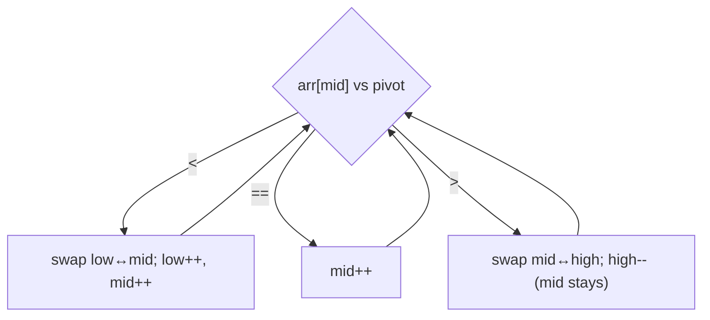

# Dutch National Flag Sort

## Why It Exists

Some arrays have only a *few distinct values* — `0`/`1`/`2`, red/white/blue (Dijkstra's "Dutch national flag"), low/medium/high priorities. Quicksort's two-way partition only splits into `≤` and `>`, so to group all three categories it would partition, then partition again — and on arrays full of duplicate pivots it does lots of redundant work.

The Dutch national flag algorithm sorts these in **one pass**. Using three pointers it carves the array into three regions at once — everything `<` the pivot, everything `==` the pivot, everything `>` the pivot — sweeping left to right, `O(n)` time and `O(1)` space. It's the canonical answer to "sort an array of three values," and it's the partition step that makes three-way quicksort fast.

## See It Work

Sort `[2, 0, 2, 1, 1, 0]` (values `0`/`1`/`2`, pivot `1`) into the three regions in a single sweep. Run it, then **Visualise** the three regions grow.

> ▶ Run it, then click **Visualise** — `<pivot` collects on the left, `>pivot` on the right, `==pivot` in the middle, all in one pass.

```python run viz=array viz-root=arr
arr = [2, 0, 2, 1, 1, 0]
pivot = 1
low, mid, high = 0, 0, len(arr) - 1
while mid <= high:
    if arr[mid] < pivot:                      # belongs in the left region
        arr[low], arr[mid] = arr[mid], arr[low]
        low += 1; mid += 1
    elif arr[mid] > pivot:                     # belongs in the right region
        arr[mid], arr[high] = arr[high], arr[mid]
        high -= 1                              # do NOT advance mid (see below)
    else:                                      # equals pivot — already in the middle
        mid += 1
print(arr)                                     # [0, 0, 1, 1, 2, 2]
```

## How It Works

Three pointers maintain four regions with this invariant:

- `[0, low)` — values `< pivot`
- `[low, mid)` — values `== pivot`
- `[mid, high]` — **unexamined**
- `(high, end)` — values `> pivot`

Examine `arr[mid]`:

1. **`< pivot`** → swap into the `<` region (`arr[low] ↔ arr[mid]`), advance *both* `low` and `mid` (the swapped-in element came from the `==` region, already examined).
2. **`> pivot`** → swap to the `>` region (`arr[mid] ↔ arr[high]`), shrink `high`. **Do not advance `mid`** — the element just swapped *in* from `high` is unexamined.
3. **`== pivot`** → it's already in the middle region; advance `mid`.

Stop when `mid > high` (the unexamined region is empty).



<p align="center"><strong>one sweep with low/mid/high: smaller values swap left, larger swap right, equal stay; the unexamined middle shrinks to nothing.</strong></p>

Each element is examined at most once (every branch either advances `mid` or shrinks `high`), so it's **`O(n)` time, `O(1)` space** — a single in-place sweep, no recursion.

### Key Takeaway

The Dutch national flag partitions into `<` / `==` / `>` a pivot in one `O(n)` pass with three pointers. The one subtlety: on a `> pivot` swap, *don't* advance `mid`, because the element pulled in from `high` hasn't been examined yet.

## Trace It

`[2, 0, 2, 1, 1, 0]`, pivot `1`, starting `low=0, mid=0, high=5`:

| `arr[mid]` | vs 1 | action | array | low,mid,high |
|---|---|---|---|---|
| `2` | `>` | swap mid↔high, `high--` | `[0,0,2,1,1,2]` | 0,0,4 |
| `0` | `<` | swap low↔mid, both++ | `[0,0,2,1,1,2]` | 1,1,4 |
| `0` | `<` | swap low↔mid, both++ | `[0,0,2,1,1,2]` | 2,2,4 |
| `2` | `>` | swap mid↔high, `high--` | `[0,0,1,1,2,2]` | 2,2,3 |
| `1` | `==` | `mid++` | `[0,0,1,1,2,2]` | 2,3,3 |
| `1` | `==` | `mid++` | `[0,0,1,1,2,2]` | 2,4,3 → stop |

Before you read on: in the `< pivot` case we advance *both* `low` and `mid`, but in the `> pivot` case we advance *neither* the way you'd expect — `mid` stays put. Why the asymmetry?

Because of *where the swapped-in element comes from*. On a `< pivot` swap, `arr[mid]` exchanges with `arr[low]` — and everything in `[low, mid)` is the `==` region, *already examined*, so the value landing at `mid` is known-good (it's a pivot-equal) and `mid` can safely move on. On a `> pivot` swap, `arr[mid]` exchanges with `arr[high]` — but `[mid, high]` is the *unexamined* region, so the value now sitting at `mid` has never been looked at. Advancing `mid` would skip it. Keeping `mid` fixed forces the next iteration to classify that fresh element. The rule "advance `mid` only when the incoming element is already classified" is the entire correctness argument.

## Your Turn

The reusable three-way partition:

```python run viz=array
def dutch_flag(arr, pivot=1):
    low, mid, high = 0, 0, len(arr) - 1
    while mid <= high:
        if arr[mid] < pivot:
            arr[low], arr[mid] = arr[mid], arr[low]
            low += 1; mid += 1
        elif arr[mid] > pivot:
            arr[mid], arr[high] = arr[high], arr[mid]
            high -= 1
        else:
            mid += 1
    return arr

print(dutch_flag([2, 0, 2, 1, 1, 0]))        # [0, 0, 1, 1, 2, 2]
print(dutch_flag([2, 2, 0, 0, 1, 1, 2, 0]))  # [0, 0, 0, 1, 1, 2, 2, 2]
```

```java run viz=array
import java.util.*;

public class Main {
  static int[] dutchFlag(int[] arr, int pivot) {
    int low = 0, mid = 0, high = arr.length - 1;
    while (mid <= high) {
      if (arr[mid] < pivot) { int t = arr[low]; arr[low] = arr[mid]; arr[mid] = t; low++; mid++; }
      else if (arr[mid] > pivot) { int t = arr[mid]; arr[mid] = arr[high]; arr[high] = t; high--; }
      else mid++;
    }
    return arr;
  }

  public static void main(String[] args) {
    System.out.println(Arrays.toString(dutchFlag(new int[]{2, 0, 2, 1, 1, 0}, 1)));   // [0, 0, 1, 1, 2, 2]
  }
}
```

This is a structural lesson — drill sorting in the pattern sets.

## Reflect & Connect

The three-way partition is a small algorithm with outsized reach:

- **The family** — "sort colors" / sort 0s-1s-2s, partition around a value into `<`/`==`/`>`, and segregating any three categories in one pass.
- **It powers three-way quicksort** — replacing quicksort's two-way partition with this three-way one means all elements *equal* to the pivot are grouped and finalized in a single pass, so duplicate-heavy arrays sort in `O(n)` on the equal keys instead of re-partitioning them. That's the [next lesson](/cortex/data-structures-and-algorithms/sorting-and-searching-sorting-three-way-quicksort).
- **The "don't advance on the high swap" rule generalizes** — any two-pointer sweep that pulls an unexamined element toward the cursor must re-examine it. The same care appears in in-place array compaction and partition-style problems.

**Prerequisites:** [Quicksort](/cortex/data-structures-and-algorithms/sorting-and-searching-sorting-quicksort) (this generalizes its partition step).
**What's next:** fold the three-way partition into recursion — [Three-Way Quicksort](/cortex/data-structures-and-algorithms/sorting-and-searching-sorting-three-way-quicksort).

## Recall

> **Mnemonic:** *Three pointers low/mid/high. `<pivot`→swap low, both++; `>pivot`→swap high, high-- (mid stays!); `==`→mid++. One `O(n)` pass.*

| | |
|---|---|
| Regions | `[0,low) <` · `[low,mid) ==` · `[mid,high]` unexamined · `(high,end) >` |
| `< pivot` | swap `low↔mid`, `low++`, `mid++` |
| `> pivot` | swap `mid↔high`, `high--` (**mid unchanged**) |
| `== pivot` | `mid++` |
| Cost | `O(n)` time, `O(1)` space, one pass |

<details>
<summary><strong>Q:</strong> What three regions does the algorithm build, and in how many passes?</summary>

**A:** `< pivot`, `== pivot`, `> pivot` — in a single `O(n)` pass.

</details>
<details>
<summary><strong>Q:</strong> Why advance `mid` on a `< pivot` swap but not on a `> pivot` swap?</summary>

**A:** The `< ` swap pulls in an already-examined `==`-region element; the `> ` swap pulls in an unexamined element from `high`, which must still be classified.

</details>
<details>
<summary><strong>Q:</strong> When does the loop stop?</summary>

**A:** When `mid > high` — the unexamined middle region is empty.

</details>
<details>
<summary><strong>Q:</strong> What larger algorithm does it enable?</summary>

**A:** Three-way quicksort, which finalizes all pivot-equal elements per partition, sorting duplicate-heavy arrays much faster.

</details>

## Sources & Verify

- **Dijkstra**, *A Discipline of Programming* — the original Dutch national flag problem and its invariant.
- **Sedgewick & Wayne**, *Algorithms*, 4th ed., §2.3 — three-way partitioning and its use in quicksort.
- The three-pointer one-pass three-way partition is standard; both runnable blocks are verified by running (`[2,0,2,1,1,0] ⇒ [0,0,1,1,2,2]`; `[2,2,0,0,1,1,2,0] ⇒ [0,0,0,1,1,2,2,2]`).
