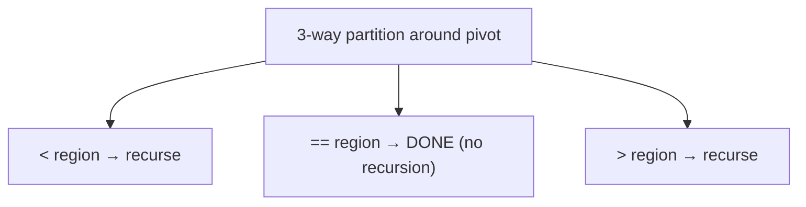

# Three-Way Quicksort

## Why It Exists

Plain quicksort has a blind spot: **duplicates**. Its two-way partition sorts elements into `≤ pivot` and `> pivot`, so elements *equal* to the pivot get scattered across both sides and re-partitioned at every level of recursion. An array of a million items with only three distinct values still does `O(n log n)` work — re-examining the same equal keys over and over — when it could be nearly linear.

Three-way quicksort fixes this by partitioning into **three** regions with the [Dutch national flag](/cortex/data-structures-and-algorithms/sorting-and-searching/sorting/dutch-national-flag-sort) scheme: `< pivot`, `== pivot`, `> pivot`. Every element equal to the pivot lands in the middle region and is **finalized in that one pass** — the recursion only descends into the `<` and `>` sides. When there are few distinct keys, whole swaths of the array are placed at once, and the sort runs in `O(n log k)` for `k` distinct values (linear when `k` is tiny).

## See It Work

Sort `[3, 3, 1, 2, 3, 1, 2]` — only three distinct values, lots of repeats. Watch the pivot-equal elements settle in one pass. Run it, then **Visualise**.

> ▶ Run it, then click **Visualise** — each partition splits into `<`/`==`/`>`; the equal-to-pivot middle is done and never recursed into.

```python run viz=array viz-root=arr
def quicksort3(arr, lo=0, hi=None):
    if hi is None:
        hi = len(arr) - 1
    if lo >= hi:
        return arr
    pivot = arr[lo]
    lt, i, gt = lo, lo, hi                 # < region ends at lt; > region starts at gt
    while i <= gt:
        if arr[i] < pivot:
            arr[lt], arr[i] = arr[i], arr[lt]; lt += 1; i += 1
        elif arr[i] > pivot:
            arr[i], arr[gt] = arr[gt], arr[i]; gt -= 1   # mid stays — unexamined swap-in
        else:
            i += 1
    quicksort3(arr, lo, lt - 1)            # recurse only on < ...
    quicksort3(arr, gt + 1, hi)            # ... and > ; the == middle is finalized
    return arr

print(quicksort3([3, 3, 1, 2, 3, 1, 2]))   # [1, 1, 2, 2, 3, 3, 3]
```

## How It Works

Each call does a three-way partition around `pivot = arr[lo]`, exactly the Dutch-flag sweep, leaving:

- `[lo, lt)` — `< pivot`
- `[lt, gt]` — `== pivot` (**finalized** — these are in their sorted home)
- `(gt, hi]` — `> pivot`

Then it recurses **only** on `[lo, lt−1]` and `[gt+1, hi]`. The equal-to-pivot block is never touched again.



<p align="center"><strong>three-way partition finalizes the pivot-equal middle and recurses only on the two outer regions.</strong></p>

The payoff scales with duplication. With `k` distinct keys, each level of recursion shrinks the *distinct-value* span, giving **`O(n log k)`** — and when `k` is a small constant (sort 0s/1s/2s, sort by a low-cardinality field), that's effectively **`O(n)`**. On all-distinct input it matches plain quicksort's `O(n log n)`. It stays **in-place** and **not stable**, and like quicksort needs a good pivot (random / median-of-three) to avoid the `O(n²)` worst case on adversarial *distinct* input.

### Key Takeaway

Three-way quicksort partitions into `<`/`==`/`>` and recurses only on the outer two regions, finalizing all pivot-equal elements per pass. Duplicate-heavy arrays sort in `O(n log k)` (linear for few distinct keys); all-distinct input is the usual `O(n log n)`.

## Trace It

First partition of `[3, 3, 1, 2, 3, 1, 2]`, pivot `3` (`arr[lo]`):

After the Dutch-flag sweep, the array becomes `[1, 2, 1, 2, 3, 3, 3]` with `lt = 4`, `gt = 6` — so `[0,4) = {1,2,1,2}` is `< 3`, `[4,6] = {3,3,3}` is `== 3`, and `(6,6]` is empty (`> 3`).

| region | contents | next step |
|---|---|---|
| `[lo, lt) = [0,4)` | `1, 2, 1, 2` | recurse |
| `[lt, gt] = [4,6]` | `3, 3, 3` | **done — no recursion** |
| `(gt, hi] = (6,6]` | (empty) | nothing |

Before you read on: there were *three* `3`s. Plain quicksort would have shoved them into the `≤` side and re-partitioned them at deeper levels. Here, all three were placed and finalized in this single partition. For an array of a million elements that are *all equal*, what's three-way quicksort's running time — and plain quicksort's?

Three-way quicksort sorts an all-equal array in **`O(n)`**: the very first partition puts *every* element into the `== ` region, both recursive calls get empty ranges, and it's done after one linear sweep. Plain quicksort (two-way) is catastrophic on all-equal input — depending on the partition scheme it either splits off one element per level (`O(n²)`) or, even with a balanced split, still recurses `log n` deep re-examining identical keys for `O(n log n)`. The difference is entirely the `==` region: by *finalizing* equal keys instead of redistributing them, three-way quicksort turns the duplicate-heavy worst case into its best case. This is why it's the partition of choice when keys may repeat.

## Your Turn

The reusable three-way quicksort:

```python run viz=array
def quicksort3(arr, lo=0, hi=None):
    if hi is None:
        hi = len(arr) - 1
    if lo >= hi:
        return arr
    pivot = arr[lo]
    lt, i, gt = lo, lo, hi
    while i <= gt:
        if arr[i] < pivot:
            arr[lt], arr[i] = arr[i], arr[lt]; lt += 1; i += 1
        elif arr[i] > pivot:
            arr[i], arr[gt] = arr[gt], arr[i]; gt -= 1
        else:
            i += 1
    quicksort3(arr, lo, lt - 1)
    quicksort3(arr, gt + 1, hi)
    return arr

print(quicksort3([5, 2, 8, 1, 9, 3]))   # [1, 2, 3, 5, 8, 9]
print(quicksort3([7, 7, 7, 7]))         # [7, 7, 7, 7]  (one O(n) pass)
```

```java run viz=array
import java.util.*;

public class Main {
  static void quicksort3(int[] arr, int lo, int hi) {
    if (lo >= hi) return;
    int pivot = arr[lo], lt = lo, i = lo, gt = hi;
    while (i <= gt) {
      if (arr[i] < pivot) { int t = arr[lt]; arr[lt] = arr[i]; arr[i] = t; lt++; i++; }
      else if (arr[i] > pivot) { int t = arr[i]; arr[i] = arr[gt]; arr[gt] = t; gt--; }
      else i++;
    }
    quicksort3(arr, lo, lt - 1);
    quicksort3(arr, gt + 1, hi);
  }
  public static void main(String[] args) {
    int[] arr = {3, 3, 1, 2, 3, 1, 2};
    quicksort3(arr, 0, arr.length - 1);
    System.out.println(Arrays.toString(arr));   // [1, 1, 2, 2, 3, 3, 3]
  }
}
```

This is a structural lesson — drill sorting in the pattern sets.

## Reflect & Connect

Three-way quicksort is quicksort made duplicate-aware:

- **It's quicksort + Dutch flag** — the only change from [quicksort](/cortex/data-structures-and-algorithms/sorting-and-searching/sorting/quicksort) is the three-region partition and recursing on two ranges instead of one. That single change makes low-cardinality data fast.
- **The win is `O(n log k)`** — for `k` distinct keys; the more repetition, the bigger the speedup, down to `O(n)` for a constant number of distinct values. This is *entropy-optimal* sorting: work proportional to the actual information content of the keys.
- **It's production-relevant** — Sedgewick & Bentley's three-way quicksort and Java's dual-pivot quicksort both grew from the observation that real data is full of duplicate keys, where two-way partitioning wastes effort. When you know a column has few distinct values, three-way is the right partition.

**Prerequisites:** [Dutch National Flag Sort](/cortex/data-structures-and-algorithms/sorting-and-searching/sorting/dutch-national-flag-sort).
**What's next:** the other `O(n log n)` workhorse — stable, guaranteed, divide-and-merge — [Merge Sort](/cortex/data-structures-and-algorithms/sorting-and-searching/sorting/merge-sort).

## Recall

> **Mnemonic:** *Quicksort with a `<`/`==`/`>` partition; recurse only on `<` and `>`, the `==` middle is finalized. `O(n log k)` for k distinct keys; `O(n)` when all equal.*

| | |
|---|---|
| Partition | Dutch-flag three-way around `arr[lo]` |
| Recurse | only `[lo, lt-1]` and `[gt+1, hi]` (skip the `==` middle) |
| Duplicate-heavy | `O(n log k)` for `k` distinct keys; `O(n)` all-equal |
| All-distinct | `O(n log n)` (same as plain quicksort) |
| Space / stability | `O(log n)` stack, in-place; **not** stable |

<details>
<summary><strong>Q:</strong> How does three-way quicksort differ from plain quicksort?</summary>

**A:** It partitions into `<`/`==`/`>` and recurses only on the outer two regions, finalizing all pivot-equal elements per pass.

</details>
<details>
<summary><strong>Q:</strong> Why is it faster on duplicate-heavy input?</summary>

**A:** Equal keys are grouped and finished in one partition instead of being redistributed and re-partitioned at every level.

</details>
<details>
<summary><strong>Q:</strong> What's its complexity for `k` distinct keys, and for all-equal input?</summary>

**A:** `O(n log k)`; `O(n)` when all elements are equal.

</details>
<details>
<summary><strong>Q:</strong> Does it still need a good pivot?</summary>

**A:** Yes — on adversarial *distinct* input it can hit `O(n²)`, so random/median-of-three pivots still apply.

</details>

## Sources & Verify

- **Sedgewick & Wayne**, *Algorithms*, 4th ed., §2.3 — three-way quicksort and entropy-optimal sorting.
- **Bentley & McIlroy**, "Engineering a Sort Function" — three-way partitioning for duplicate keys in production sorts.
- The `O(n log k)` duplicate-key bound and the partition mechanics are standard; both runnable blocks are verified by running (`[3,3,1,2,3,1,2] ⇒ [1,1,2,2,3,3,3]`; all-equal `⇒` unchanged in one pass).
