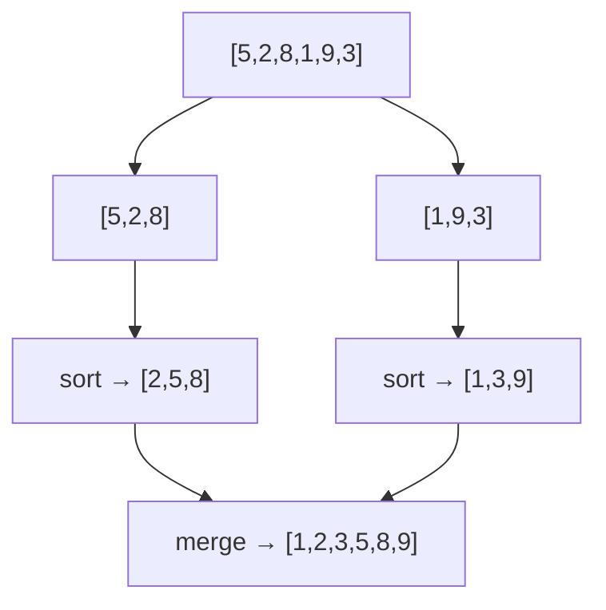

# Merge Sort

## Why It Exists

Quicksort is fast on average but has an `O(n²)` worst case and isn't stable. When you need a *guarantee* — `O(n log n)` no matter the input, and equal elements kept in order — merge sort is the dependable choice.

Its idea is the purest divide-and-conquer: a single element is already sorted, and two *sorted* halves can be combined into one sorted whole by **merging** — repeatedly taking the smaller of the two fronts (the [merge pattern](/cortex/data-structures-and-algorithms/linear-structures/singly-linked-list/pattern-merge/pattern) you've seen on linked lists). So split the array in half, recursively sort each half, then merge. The split is *always* even (you choose the midpoint, unlike quicksort's input-dependent pivot), so the recursion is always `log n` deep with `O(n)` merge work per level — `O(n log n)`, guaranteed, every time.

## See It Work

Sort `[5, 2, 8, 1, 9, 3]` by splitting, sorting halves, and merging. Run it.

```python run viz=array
def merge(a, b):
    out, i, j = [], 0, 0
    while i < len(a) and j < len(b):
        if a[i] <= b[j]:               # <= keeps the sort stable
            out.append(a[i]); i += 1
        else:
            out.append(b[j]); j += 1
    out.extend(a[i:]); out.extend(b[j:])   # one side empty → attach the other's tail
    return out

def merge_sort(arr):
    if len(arr) <= 1:                  # a 0- or 1-element array is already sorted
        return arr
    mid = len(arr) // 2
    left = merge_sort(arr[:mid])       # divide + conquer (left half)
    right = merge_sort(arr[mid:])      # divide + conquer (right half)
    return merge(left, right)          # combine

print(merge_sort([5, 2, 8, 1, 9, 3]))  # [1, 2, 3, 5, 8, 9]
```

## How It Works

Three phases per call:

1. **Divide** — split the array at its midpoint into two halves.
2. **Conquer** — recursively merge-sort each half. The base case is a length-`≤ 1` array (trivially sorted).
3. **Combine** — *merge* the two sorted halves: walk both with two indices, repeatedly appending the smaller front; when one runs out, append the rest of the other (it's already sorted and larger).



<p align="center"><strong>recursively split to single elements, then merge sorted runs back up, doubling the sorted-run length at each level.</strong></p>

Because the split is exactly in half regardless of the data, the recursion tree is *always* `log n` levels deep, and merging all the runs at each level is `O(n)` — so the cost is **`O(n log n)` in the best, average, *and* worst case**. That guarantee is merge sort's defining virtue. It is **stable** (the `<=` test takes from the left half on ties, preserving order) but **not in-place**: merging needs an `O(n)` scratch array. The `O(n)` space is the price of the worst-case guarantee.

### Key Takeaway

Merge sort splits in half, sorts each half, and merges — `O(n log n)` guaranteed in every case and stable, because the midpoint split is always balanced. The cost is `O(n)` scratch space, which makes it the go-to for linked lists and external sorting rather than in-place array sorting.

## Trace It

The merge step combining `[2, 5, 8]` and `[1, 3, 9]`:

| compare | take | output |
|---|---|---|
| `2` vs `1` | `1` (right) | `[1]` |
| `2` vs `3` | `2` (left) | `[1, 2]` |
| `5` vs `3` | `3` (right) | `[1, 2, 3]` |
| `5` vs `9` | `5` (left) | `[1, 2, 3, 5]` |
| `8` vs `9` | `8` (left) | `[1, 2, 3, 5, 8]` |
| left empty | attach `9` | `[1, 2, 3, 5, 8, 9]` |

Before you read on: quicksort and merge sort are both `O(n log n)` divide-and-conquer, yet quicksort can degrade to `O(n²)` and merge sort *never* does. What structural difference makes merge sort's `O(n log n)` an ironclad guarantee?

It's *where the work lives* and *who controls the split*. Quicksort splits via a **pivot** whose position depends on the data — a bad pivot makes one side empty, so the depth can be `n` instead of `log n`. Merge sort splits at the **midpoint**, a choice independent of the values, so the two halves are *always* equal and the depth is *always* `⌈log n⌉`. Quicksort does its real work *before* recursing (partition) and hopes for a balanced split; merge sort does its real work *after* recursing (merge) on a split it guarantees is balanced. By moving the hard part to a combine step on a structurally even division, merge sort removes the input's ability to unbalance it — at the cost of the `O(n)` merge buffer that an in-place partition avoids. That's the fundamental quicksort-vs-merge trade: speed-and-space vs guarantee-and-stability.

## Your Turn

The reusable merge sort:

```python run viz=array
def merge(a, b):
    out, i, j = [], 0, 0
    while i < len(a) and j < len(b):
        if a[i] <= b[j]:
            out.append(a[i]); i += 1
        else:
            out.append(b[j]); j += 1
    out.extend(a[i:]); out.extend(b[j:])
    return out

def merge_sort(arr):
    if len(arr) <= 1:
        return arr
    mid = len(arr) // 2
    return merge(merge_sort(arr[:mid]), merge_sort(arr[mid:]))

print(merge_sort([5, 2, 8, 1, 9, 3]))   # [1, 2, 3, 5, 8, 9]
print(merge_sort([3, 1, 2]))            # [1, 2, 3]
```

```java run viz=array
import java.util.*;

public class Main {
  static int[] merge(int[] a, int[] b) {
    int[] out = new int[a.length + b.length];
    int i = 0, j = 0, k = 0;
    while (i < a.length && j < b.length) out[k++] = (a[i] <= b[j]) ? a[i++] : b[j++];
    while (i < a.length) out[k++] = a[i++];
    while (j < b.length) out[k++] = b[j++];
    return out;
  }
  static int[] mergeSort(int[] arr) {
    if (arr.length <= 1) return arr;
    int mid = arr.length / 2;
    return merge(mergeSort(Arrays.copyOfRange(arr, 0, mid)),
                 mergeSort(Arrays.copyOfRange(arr, mid, arr.length)));
  }
  public static void main(String[] args) {
    System.out.println(Arrays.toString(mergeSort(new int[]{5, 2, 8, 1, 9, 3})));   // [1, 2, 3, 5, 8, 9]
  }
}
```

This is a structural lesson — drill sorting in the pattern sets.

## Reflect & Connect

Merge sort is the guaranteed, stable `O(n log n)` sort, and its niches are exactly where quicksort struggles:

- **Linked lists** — merge sort needs no random access and merges with `O(1)` extra space on lists (just relink nodes — the [linked-list merge pattern](/cortex/data-structures-and-algorithms/linear-structures/singly-linked-list/pattern-merge/pattern)), so it's *the* sort for linked structures, where quicksort's array-style partition is awkward.
- **External sorting** — when data is too large for RAM, merge sort streams sorted runs from disk and merges them with sequential reads — the basis of database and big-data sort. Quicksort's random access thrashes external storage.
- **Stability + guarantee** — Python's Timsort and Java's `Arrays.sort` for objects are merge-sort hybrids precisely because users need *stable* sorting with a worst-case guarantee. The trade vs [quicksort](/cortex/data-structures-and-algorithms/sorting-and-searching/sorting/quicksort): merge sort pays `O(n)` space for an ironclad `O(n log n)` and stability; quicksort is in-place and faster in practice but neither.

**Prerequisites:** [What Is an Array?](/cortex/data-structures-and-algorithms/linear-structures/arrays/what-is-an-array).
**What's next:** sort in place with `O(n log n)` *worst-case* using a heap — [Heapsort](/cortex/data-structures-and-algorithms/sorting-and-searching/sorting/heapsort).

## Recall

> **Mnemonic:** *Split at the midpoint, sort each half, merge the two sorted halves. Midpoint split ⇒ `O(n log n)` guaranteed + stable. Costs `O(n)` scratch.*

| | |
|---|---|
| Divide | split at the midpoint (balanced, data-independent) |
| Combine | merge two sorted halves (take smaller front; `<=` = stable) |
| Cost | `O(n log n)` best/avg/worst (guaranteed); `O(n)` space |
| Stability | stable |
| Best for | linked lists, external sorting, stable + guaranteed needs |

<details>
<summary><strong>Q:</strong> Why is merge sort's `O(n log n)` guaranteed where quicksort's isn't?</summary>

**A:** It splits at the midpoint (always balanced, data-independent), so the recursion is always `log n` deep — no pivot can unbalance it.

</details>
<details>
<summary><strong>Q:</strong> Why isn't merge sort in-place?</summary>

**A:** Merging two sorted halves needs an `O(n)` scratch array to hold the combined result.

</details>
<details>
<summary><strong>Q:</strong> Why is it stable?</summary>

**A:** On ties the merge takes from the left half first, preserving the original relative order.

</details>
<details>
<summary><strong>Q:</strong> Where does merge sort beat quicksort?</summary>

**A:** Linked lists (`O(1)` extra, no random access), external/too-big-for-RAM sorting (sequential I/O), and any stable + worst-case-guaranteed requirement.

</details>

## Sources & Verify

- **CLRS**, *Introduction to Algorithms*, 4th ed., §2.3 — merge sort, the merge procedure, and the `O(n log n)` recurrence.
- **Sedgewick & Wayne**, *Algorithms*, 4th ed., §2.2 — merge sort, stability, and external/linked-list applications; Timsort is documented in the CPython source.
- Merge sort's guaranteed `O(n log n)`, stability, and `O(n)` space are standard; both runnable blocks are verified by running (`[5,2,8,1,9,3] ⇒ [1,2,3,5,8,9]`; `[3,1,2] ⇒ [1,2,3]`).
