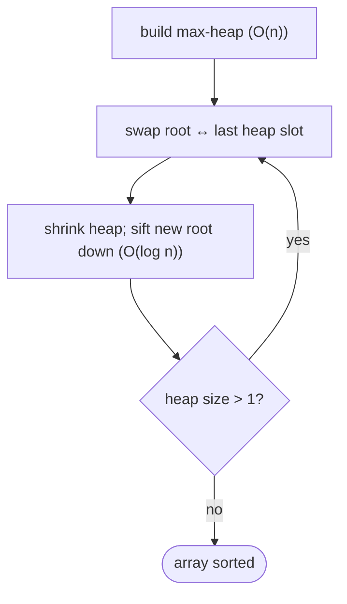

# Heapsort

## Why It Exists

Quicksort is fast but `O(n²)` in the worst case; merge sort guarantees `O(n log n)` but needs `O(n)` scratch space. Heapsort is the sort that gives you **both** guarantees at once: `O(n log n)` worst-case *and* fully in-place (`O(1)` extra space). No other common comparison sort offers that combination.

The idea is **selection sort, made fast**. Selection sort repeatedly finds the maximum of the unsorted region — by a linear `O(n)` scan, which is what makes it `O(n²)`. Heapsort stores the unsorted region as a [binary heap](/cortex/data-structures-and-algorithms/trees-heap-what-is-a-heap), so the maximum is *always at the root* and removing it costs only `O(log n)`. Build the heap once, then repeatedly extract the max to the end of the array. `n` extractions at `O(log n)` each → `O(n log n)`, guaranteed.

## See It Work

Sort `[5, 2, 8, 1, 9, 3]`: build a max-heap, then repeatedly move the root to the end. Run it, then **Visualise** the array as the heap shrinks and the sorted tail grows.

> ▶ Run it, then click **Visualise** — after the heap is built, each step swaps the max (root) to the end and sifts the new root down.

```python run viz=array viz-root=arr
def heapify(arr, n, i):                 # sift-down at i within a heap of size n
    largest, l, r = i, 2 * i + 1, 2 * i + 2
    if l < n and arr[l] > arr[largest]: largest = l
    if r < n and arr[r] > arr[largest]: largest = r
    if largest != i:
        arr[i], arr[largest] = arr[largest], arr[i]
        heapify(arr, n, largest)        # the demoted element keeps sinking

arr = [5, 2, 8, 1, 9, 3]
n = len(arr)
for i in range(n // 2 - 1, -1, -1):     # build a max-heap, bottom-up — O(n)
    heapify(arr, n, i)
for end in range(n - 1, 0, -1):         # repeatedly extract the max
    arr[0], arr[end] = arr[end], arr[0] # max (root) → its final slot at the end
    heapify(arr, end, 0)                # restore the heap over the shrunken prefix
print(arr)                              # [1, 2, 3, 5, 8, 9]
```

## How It Works

The array does double duty: a prefix holds the heap, a growing suffix holds the sorted (largest) elements. Two phases:

1. **Build the max-heap** — call `heapify` (sift-down) on every internal node from `n/2 − 1` down to `0`. Bottom-up building is `O(n)` (not `O(n log n)` — most nodes are near the leaves and sift down only a little).
2. **Sort** — repeatedly: swap the root (the current max) with the last heap element, shrink the heap by one (that slot is now final), and `heapify` the new root back down. After `n − 1` extractions the array is sorted ascending.



<p align="center"><strong>build the max-heap, then peel the max off the root into the sorted tail and re-heapify, shrinking the heap each step.</strong></p>

Build is `O(n)`; each of the `n − 1` extractions costs `O(log n)` for the sift-down, so the total is **`O(n log n)` in every case** — best, average, and worst. It uses **`O(1)` extra space** (the heap lives in the array). It is **not stable** (heap operations move equal elements around arbitrarily).

### Key Takeaway

Heapsort builds a max-heap, then repeatedly swaps the root to the end and re-heapifies the shrinking heap. `O(n log n)` worst-case *and* in-place — the only common sort with both — at the cost of being unstable and slower than quicksort in practice (worse cache locality).

## Trace It

Building a max-heap from `[5, 2, 8, 1, 9, 3]` (heapify internal nodes `i = 2, 1, 0`):

| heapify `i` | subtree root vs children | swap | array |
|---|---|---|---|
| `2` (val 8) | `8` vs `3` | none | `[5,2,8,1,9,3]` |
| `1` (val 2) | `2` vs `1, 9` | `2↔9` | `[5,9,8,1,2,3]` |
| `0` (val 5) | `5` vs `9, 8` | `5↔9`, then `5↔2` | `[9,5,8,1,2,3]` |

Now `9` (the max) is at the root, ready to be swapped to the end.

Before you read on: building the heap calls `heapify` on `n/2` nodes, each of which can sift down up to `O(log n)` levels — so a quick estimate says build is `O(n log n)`. Yet the real bound is `O(n)`. Why is bottom-up heap construction *linear*?

Because **most nodes are near the bottom and barely sift at all**. Half the nodes are leaves (sift distance 0), a quarter are one level up (sift ≤ 1), an eighth sift ≤ 2, and so on. Summing the work gives `Σ (nodes at height h) × h = Σ (n/2^(h+1)) × h`, and that series converges to `O(n)`, not `O(n log n)`. The naive bound multiplies *every* node by the *maximum* height, but only the lone root actually sifts the full `log n`. (Note this `O(n)` build doesn't speed up heapsort overall — the `n` extractions are still `O(n log n)` each-summed — but it's why *building* a heap from scratch beats `n` individual inserts.)

## Your Turn

The reusable in-place heapsort:

```python run viz=array
def heapify(arr, n, i):
    largest, l, r = i, 2 * i + 1, 2 * i + 2
    if l < n and arr[l] > arr[largest]: largest = l
    if r < n and arr[r] > arr[largest]: largest = r
    if largest != i:
        arr[i], arr[largest] = arr[largest], arr[i]
        heapify(arr, n, largest)

def heapsort(arr):
    n = len(arr)
    for i in range(n // 2 - 1, -1, -1):
        heapify(arr, n, i)
    for end in range(n - 1, 0, -1):
        arr[0], arr[end] = arr[end], arr[0]
        heapify(arr, end, 0)
    return arr

print(heapsort([5, 2, 8, 1, 9, 3]))   # [1, 2, 3, 5, 8, 9]
print(heapsort([3, 1, 2, 1]))         # [1, 1, 2, 3]
```

```java run viz=array
import java.util.*;

public class Main {
  static void heapify(int[] arr, int n, int i) {
    int largest = i, l = 2 * i + 1, r = 2 * i + 2;
    if (l < n && arr[l] > arr[largest]) largest = l;
    if (r < n && arr[r] > arr[largest]) largest = r;
    if (largest != i) {
      int t = arr[i]; arr[i] = arr[largest]; arr[largest] = t;
      heapify(arr, n, largest);
    }
  }
  static int[] heapsort(int[] arr) {
    int n = arr.length;
    for (int i = n / 2 - 1; i >= 0; i--) heapify(arr, n, i);
    for (int end = n - 1; end > 0; end--) {
      int t = arr[0]; arr[0] = arr[end]; arr[end] = t;
      heapify(arr, end, 0);
    }
    return arr;
  }
  public static void main(String[] args) {
    System.out.println(Arrays.toString(heapsort(new int[]{5, 2, 8, 1, 9, 3})));   // [1, 2, 3, 5, 8, 9]
  }
}
```

This is a structural lesson — drill sorting in the pattern sets.

## Reflect & Connect

Heapsort is the guarantee-everything sort — and a lesson in why big-O isn't the whole story:

- **It's selection sort with a heap** — both repeatedly extract the maximum; selection sort scans `O(n)` to find it, heapsort pops the root in `O(log n)`. Swapping the data structure under "find the max" is the entire upgrade from `O(n²)` to `O(n log n)` (cross-reference [selection sort](/cortex/data-structures-and-algorithms/sorting-and-searching-sorting-selection-sort)).
- **Why it's not used more, despite great guarantees** — heapsort jumps all over the array (parent-to-child index `2i+1`), so it has poor **cache locality**; quicksort's local scans are faster in practice even though both are `O(n log n)`. Heapsort's real production role is as **introsort's safety net**: start with quicksort, and if recursion goes too deep (a pathological input), switch to heapsort to *guarantee* `O(n log n)`.
- **The `O(n)` build is a reusable fact** — bottom-up heapify is linear, which is why constructing a heap (or a priority queue) from a known array beats inserting elements one at a time.

**Prerequisites:** [What Is a Heap?](/cortex/data-structures-and-algorithms/trees-heap-what-is-a-heap).
**What's next:** reuse quicksort's partition to find the k-th element without fully sorting — [Quickselect](/cortex/data-structures-and-algorithms/sorting-and-searching-sorting-pattern-quickselect).

## Recall

> **Mnemonic:** *Build a max-heap (`O(n)`), then `n−1` times: swap root→end, shrink, sift down. `O(n log n)` worst-case AND in-place. Not stable.*

| | |
|---|---|
| Build | bottom-up `heapify` from `n/2−1` to `0` — `O(n)` |
| Extract | swap root↔last, shrink heap, sift new root down (`O(log n)`) |
| Cost | `O(n log n)` every case; `O(1)` extra space |
| Stability | **not** stable |
| Niche | only sort that's both worst-case `O(n log n)` and in-place; introsort fallback |

<details>
<summary><strong>Q:</strong> What makes heapsort `O(n log n)` worst-case *and* in-place?</summary>

**A:** The heap lives in the array (in-place), and each of the `n` max-extractions is `O(log n)` regardless of input (worst-case guaranteed).

</details>
<details>
<summary><strong>Q:</strong> How is heapsort related to selection sort?</summary>

**A:** Both repeatedly extract the max; heapsort uses a heap (`O(log n)` per extract) instead of a linear scan (`O(n)`).

</details>
<details>
<summary><strong>Q:</strong> Why is bottom-up heap construction `O(n)`, not `O(n log n)`?</summary>

**A:** Most nodes are near the leaves and sift only a little; the summed work converges to `O(n)`.

</details>
<details>
<summary><strong>Q:</strong> If its big-O is great, why isn't heapsort the default?</summary>

**A:** Poor cache locality (it jumps across the array) makes it slower than quicksort in practice; it's mainly used as introsort's worst-case fallback.

</details>

## Sources & Verify

- **CLRS**, *Introduction to Algorithms*, 4th ed., §6 — heaps, `heapify`, the `O(n)` build, and heapsort.
- **Sedgewick & Wayne**, *Algorithms*, 4th ed., §2.4 — heapsort and its practical comparison with quicksort.
- Heapsort's `O(n log n)`-worst / in-place / not-stable profile and the linear build are standard; both runnable blocks are verified by running (`[5,2,8,1,9,3] ⇒ [1,2,3,5,8,9]`; `[3,1,2,1] ⇒ [1,1,2,3]`).
