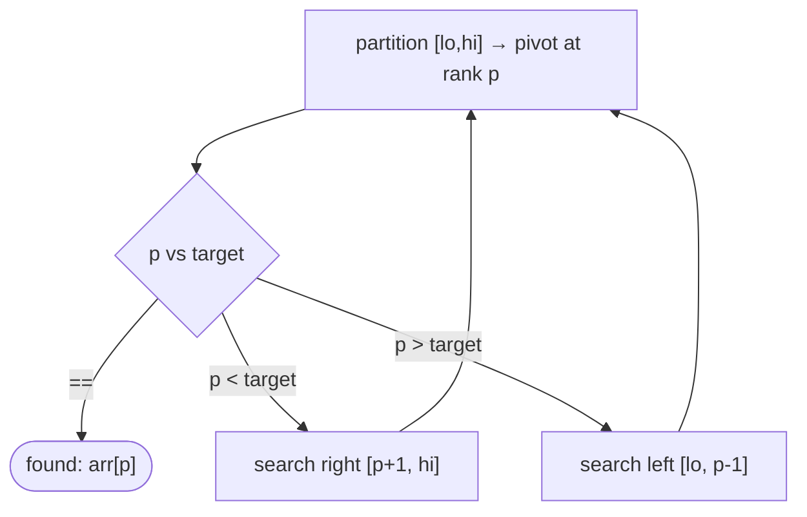

# Pattern: Quickselect

## Why It Exists

You need the `k`-th smallest element — the median, the 90th percentile, the 3rd-largest. The obvious route sorts the whole array (`O(n log n)`) and indexes position `k`. But that computes the *entire* order when you only want *one* element's place.

Quickselect reuses quicksort's **partition**, with one insight: after partitioning, the pivot sits at its *final sorted rank* `p`. If `p` is the rank you want, you're done. If not, the answer lies entirely on *one* side — so recurse into only that side and ignore the other. Quicksort recurses into *both* halves (`O(n log n)`); quickselect recurses into *one* (`n + n/2 + n/4 + … = 2n`), giving **`O(n)` average**. You partition repeatedly but throw away half the work each time.

## See It Work

Find the 4th smallest of `[7, 2, 1, 6, 8, 5, 3, 4]` (the answer is `4`) without sorting. Run it.

```python run viz=array
def partition(arr, lo, hi):
    pivot = arr[hi]; i = lo - 1
    for j in range(lo, hi):
        if arr[j] <= pivot:
            i += 1; arr[i], arr[j] = arr[j], arr[i]
    arr[i + 1], arr[hi] = arr[hi], arr[i + 1]
    return i + 1                           # pivot's final sorted rank

def quickselect(arr, k):                   # k-th smallest, 1-indexed
    arr = list(arr)
    lo, hi, target = 0, len(arr) - 1, k - 1
    while lo <= hi:
        p = partition(arr, lo, hi)
        if p == target:
            return arr[p]                  # pivot is exactly the rank we want
        elif p < target:
            lo = p + 1                     # answer is to the RIGHT — recurse there only
        else:
            hi = p - 1                     # answer is to the LEFT — recurse there only

print(quickselect([7, 2, 1, 6, 8, 5, 3, 4], 4))   # 4
```

## How It Works

Partition the active range `[lo, hi]`; the pivot lands at rank `p`. Compare `p` to `target = k − 1`:

- `p == target` → the pivot *is* the `k`-th element; return it.
- `p < target` → everything `≤` rank `p` is too small; the answer is in `[p+1, hi]`. Set `lo = p + 1`.
- `p > target` → the answer is in `[lo, p−1]`. Set `hi = p − 1`.

Loop (or recurse) on the single surviving range until the pivot lands on `target`.



<p align="center"><strong>partition, then keep only the side containing rank k; the discarded side is never touched again.</strong></p>

Discarding one side each step is the whole speedup. With balanced pivots the work is `n + n/2 + n/4 + … = O(n)` **average** — strictly better than sorting. Like quicksort it has an `O(n²)` **worst case** (consistently bad pivots), fixed in practice with a **random pivot**. For a *guaranteed* `O(n)` worst case there's the median-of-medians pivot, but it has a large constant and is rarely needed. Space is `O(1)` with the iterative loop above.

### Key Takeaway

Quickselect partitions like quicksort but recurses into only the side holding rank `k`, finding the `k`-th smallest in `O(n)` average without fully sorting. `O(n²)` worst case → use a random pivot. The "recurse into one side" move is what turns `O(n log n)` into `O(n)`.

## Trace It

Selecting the 4th smallest (`target = 3`) of `[7, 2, 1, 6, 8, 5, 3, 4]`, pivot = last element:

| range `[lo,hi]` | pivot | rank `p` | vs target 3 | next |
|---|---|---|---|---|
| `[0,7]` | `4` | `3` | `==` | **return `4`** |

The very first partition placed pivot `4` at rank `3` — exactly the target — so quickselect finished in *one* partition pass, never sorting the rest.

Before you read on: quicksort and quickselect run the *same* partition. Quicksort is `O(n log n)`; quickselect is `O(n)` average. The only code difference is that quicksort recurses into *both* sides and quickselect into *one*. Why does dropping one recursive call change the complexity *class*, not just halve the constant?

Because the two recursive calls aren't equal-cost — they *compound*. Quicksort's recurrence is `T(n) = 2·T(n/2) + O(n)`, which unrolls to `log n` levels each doing `O(n)` work → `O(n log n)`. Quickselect's is `T(n) = 1·T(n/2) + O(n)`, a *geometric* series `n + n/2 + n/4 + … = 2n` → `O(n)`. With two calls the per-level work stays `O(n)` across all `log n` levels (every element is touched at every level); with one call the per-level work *halves* each level, so it sums to a constant times `n`. Recursing into one side means you stop revisiting the discarded half entirely — that's a fundamentally different recurrence, not a 2× saving.

## Your Turn

The reusable quickselect:

```python run viz=array
def partition(arr, lo, hi):
    pivot = arr[hi]; i = lo - 1
    for j in range(lo, hi):
        if arr[j] <= pivot:
            i += 1; arr[i], arr[j] = arr[j], arr[i]
    arr[i + 1], arr[hi] = arr[hi], arr[i + 1]
    return i + 1

def quickselect(arr, k):
    arr = list(arr)
    lo, hi, target = 0, len(arr) - 1, k - 1
    while lo <= hi:
        p = partition(arr, lo, hi)
        if p == target:
            return arr[p]
        elif p < target:
            lo = p + 1
        else:
            hi = p - 1

vals = [7, 2, 1, 6, 8, 5, 3, 4]
print(quickselect(vals, 1), quickselect(vals, 4), quickselect(vals, 8))   # 1 4 8
```

```java run viz=array
public class Main {
  static int partition(int[] arr, int lo, int hi) {
    int pivot = arr[hi], i = lo - 1;
    for (int j = lo; j < hi; j++)
      if (arr[j] <= pivot) { i++; int t = arr[i]; arr[i] = arr[j]; arr[j] = t; }
    int t = arr[i + 1]; arr[i + 1] = arr[hi]; arr[hi] = t;
    return i + 1;
  }
  static int quickselect(int[] arr, int k) {
    int lo = 0, hi = arr.length - 1, target = k - 1;
    while (lo <= hi) {
      int p = partition(arr, lo, hi);
      if (p == target) return arr[p];
      else if (p < target) lo = p + 1;
      else hi = p - 1;
    }
    return -1;
  }
  public static void main(String[] args) {
    int[] vals = {7, 2, 1, 6, 8, 5, 3, 4};
    System.out.println(quickselect(vals.clone(), 4));   // 4
  }
}
```

Drill the family in **Practice** — [Kth Smallest Element](/cortex/data-structures-and-algorithms/sorting-and-searching-sorting-pattern-quickselect-problems-kth-smallest-element), [Median Finder](/cortex/data-structures-and-algorithms/sorting-and-searching-sorting-pattern-quickselect-problems-median-finder), [K Closest Elements](/cortex/data-structures-and-algorithms/sorting-and-searching-sorting-pattern-quickselect-problems-k-closest-elements), and [K Most Frequent Elements](/cortex/data-structures-and-algorithms/sorting-and-searching-sorting-pattern-quickselect-problems-k-most-frequent-elements).

## Reflect & Connect

Quickselect is the "I need one order statistic, not the whole order" tool:

- **The family** — `k`-th smallest/largest, the **median** (`k = n/2`), the `k` closest values to a target, and top-`k` (partition at `k`, then the first `k` are the answer — unordered).
- **Quickselect vs heap vs sort** — for the `k`-th element: quickselect is `O(n)` average (best when you want it *once*, in memory); a [size-k heap](/cortex/data-structures-and-algorithms/trees-heap-pattern-top-k-elements) is `O(n log k)` and works on *streams*; a full sort is `O(n log n)` but gives you *everything*. Pick by whether data streams and whether you need the rest sorted.
- **It's "binary search on an unsorted array"** — both discard half the search space each step based on a comparison. Quickselect's `O(n)` (vs binary search's `O(log n)`) is because each partition step costs `O(n)`, not `O(1)`. The median-of-medians variant guarantees `O(n)` worst-case, a classic theory result.

**Prerequisites:** [Quicksort](/cortex/data-structures-and-algorithms/sorting-and-searching-sorting-quicksort).
**What's next:** sort by a custom ordering rather than natural order — [Custom Compare](/cortex/data-structures-and-algorithms/sorting-and-searching-sorting-pattern-custom-compare-pattern).

## Recall

> **Mnemonic:** *Partition, look at the pivot's rank `p`. `p==target` done; else recurse into the ONE side holding rank `k`. `O(n)` average — random pivot to dodge `O(n²)`.*

| | |
|---|---|
| Reuses | quicksort's partition (pivot → final rank `p`) |
| Decision | `p==target` return; `p<target` go right; `p>target` go left |
| Recursion | one side only → `O(n)` average (vs quicksort's two → `O(n log n)`) |
| Worst case | `O(n²)` — random pivot; median-of-medians for guaranteed `O(n)` |
| Space | `O(1)` iterative |

<details>
<summary><strong>Q:</strong> How does quickselect avoid sorting the whole array?</summary>

**A:** After partitioning, the pivot's rank `p` tells which side holds rank `k`; it recurses into only that side and discards the other.

</details>
<details>
<summary><strong>Q:</strong> Why is it `O(n)` average while quicksort is `O(n log n)`?</summary>

**A:** Recursing into one side gives the geometric recurrence `T(n)=T(n/2)+O(n)=O(n)`, not quicksort's `T(n)=2T(n/2)+O(n)=O(n log n)`.

</details>
<details>
<summary><strong>Q:</strong> What's the worst case and the fix?</summary>

**A:** `O(n²)` with consistently bad pivots; a random pivot (or median-of-medians for a guarantee) fixes it.

</details>
<details>
<summary><strong>Q:</strong> Quickselect vs a size-k heap for the k-th element?</summary>

**A:** Quickselect is `O(n)` average in memory; a heap is `O(n log k)` and works on streams.

</details>

## Sources & Verify

- **CLRS**, *Introduction to Algorithms*, 4th ed., §9 — selection in expected linear time and the median-of-medians worst-case `O(n)`.
- **Sedgewick & Wayne**, *Algorithms*, 4th ed., §2.5 — quickselect and order statistics.
- Quickselect's `O(n)`-average / `O(n²)`-worst bounds and the one-sided recursion are standard; both runnable blocks are verified by running (`k=1,4,8 ⇒ 1, 4, 8`).
