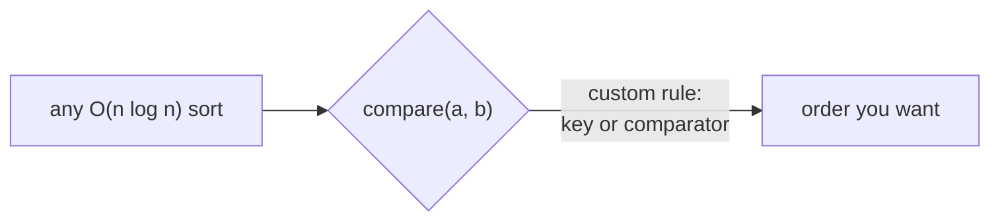

# Pattern: Custom Compare

## Why It Exists

Default sorting uses *natural* order — ascending numbers, alphabetical strings. But the order you actually need is often custom: sort tasks by priority *then* deadline, characters by frequency, or numbers so their concatenation is largest. You don't write a new sort for each — you keep the same `O(n log n)` algorithm and just hand it a **comparator** (or a **key function**) that defines "which element comes first."

The power is that *any* ordering reduces to "given two elements, which is smaller?" The catch — and the reason this is a pattern worth studying — is that the comparator must define a **consistent total order**: it has to be *transitive* (if `a < b` and `b < c`, then `a < c`) and self-consistent. A comparator that contradicts itself doesn't just sort wrong; in Java it throws `IllegalArgumentException: Comparison method violates its general contract`. Designing a *valid* ordering is the real skill.

## See It Work

Arrange numbers to form the **largest** possible concatenation. `[3, 30, 34, 5, 9]` → `"9534330"`. Naive descending sort fails (it puts `3` before `30`, giving `…3030…`); the right comparator asks "does `a+b` or `b+a` read larger?". Run it.

```python run viz=array
import functools

def largest_number(nums):
    strs = list(map(str, nums))
    def cmp(a, b):                       # a before b iff a+b concatenates larger
        if a + b > b + a: return -1
        if a + b < b + a: return 1
        return 0
    strs.sort(key=functools.cmp_to_key(cmp))
    result = "".join(strs)
    return "0" if result[0] == "0" else result   # e.g. [0,0] → "0", not "00"

print(largest_number([3, 30, 34, 5, 9]))   # 9534330
print(largest_number([10, 2]))             # 210
```

## How It Works

Two ways to specify the order:

- **Key function** — map each element to a sortable key, sort by that. Simplest when the order is "by some attribute": `sort(key=len)`, `sort(key=lambda p: (p.priority, p.deadline))`. A tuple key gives multi-level ordering for free (sort by the first field, ties broken by the second).
- **Comparator** — a function `cmp(a, b)` returning negative / 0 / positive for "a before / equal / after b". Needed when the order is a *pairwise* relationship that isn't a simple attribute — like "which concatenation is larger," where there's no single key for one element in isolation.



<p align="center"><strong>the sort algorithm is unchanged; only the comparison swaps from natural order to your custom rule.</strong></p>

For the largest-number problem the comparator is "`a` before `b` iff `a+b > b+a`" (compare the two concatenations as strings). This *is* a valid total order — it's provably transitive — which is why the sort produces a coherent result. The cost is the underlying sort's: **`O(n log n)`** comparisons, each now costing whatever the comparator costs (here `O(len)` for string concatenation).

### Key Takeaway

Custom-compare keeps the sort algorithm and swaps the comparison: a key function for "order by an attribute" (tuples for multi-level), a comparator for pairwise rules. The comparator must be a consistent, transitive total order — an inconsistent one yields garbage or, in Java, throws.

## Trace It

Sorting `[3, 30, 34, 5, 9]` by the `a+b vs b+a` rule, focus on the tricky pair `3` vs `30`:

| pair | `a+b` | `b+a` | larger | order |
|---|---|---|---|---|
| `3`, `30` | `"330"` | `"303"` | `330` | `3` before `30` |
| `9`, `5` | `"95"` | `"59"` | `95` | `9` before `5` |
| `34`, `3` | `"343"` | `"334"` | `343` | `34` before `3` |

Sorted: `9, 5, 34, 3, 30` → `"9534330"`.

Before you read on: a naive "sort the numbers in descending order" would place `34` then `30` then `9`… and even on the pair `3` vs `30`, plain descending sees `30 > 3` and puts `30` first — giving `"30330…"` somewhere. Why does descending-by-value get this wrong, and what does the `a+b vs b+a` comparator capture that value-comparison can't?

Because the goal isn't "biggest number first" — it's "biggest *concatenation*," and a longer number isn't necessarily a better prefix. `30` is numerically larger than `3`, but placing `3` first gives `"330…"` which beats `"303…"`; the extra digit of `30` (`0`) drags the concatenation down. Value-comparison judges each number in isolation; the concatenation goal depends on *how two numbers read when glued together*, which is inherently a **pairwise** property. The `a+b vs b+a` test compares exactly the two gluings, so it captures "which ordering of this pair contributes more to the final string" — something no per-element key can express, which is precisely when you need a comparator rather than a key.

## Your Turn

The reusable largest-number (a comparator) plus a multi-key sort (a key):

```python run viz=array
import functools

def largest_number(nums):
    strs = list(map(str, nums))
    strs.sort(key=functools.cmp_to_key(lambda a, b: -1 if a + b > b + a else (1 if a + b < b + a else 0)))
    out = "".join(strs)
    return "0" if out[0] == "0" else out

# multi-level key: sort people by height descending, ties by name ascending
people = [("bob", 175), ("amy", 180), ("cy", 175)]
people.sort(key=lambda p: (-p[1], p[0]))

print(largest_number([3, 30, 34, 5, 9]))   # 9534330
print(people)                               # [('amy', 180), ('bob', 175), ('cy', 175)]
```

```java run viz=array
import java.util.*;

public class Main {
  static String largestNumber(int[] nums) {
    String[] s = new String[nums.length];
    for (int i = 0; i < nums.length; i++) s[i] = String.valueOf(nums[i]);
    Arrays.sort(s, (a, b) -> (b + a).compareTo(a + b));   // descending by concatenation
    return s[0].equals("0") ? "0" : String.join("", s);
  }
  public static void main(String[] args) {
    System.out.println(largestNumber(new int[]{3, 30, 34, 5, 9}));   // 9534330
    System.out.println(largestNumber(new int[]{10, 2}));             // 210
  }
}
```

Drill the family in **Practice** — [Bitwise Sort](/cortex/data-structures-and-algorithms/sorting-and-searching-sorting-pattern-custom-compare-problems-bitwise-sort), [Sort Characters by Frequency](/cortex/data-structures-and-algorithms/sorting-and-searching-sorting-pattern-custom-compare-problems-sort-characters-by-frequency), [Largest Number](/cortex/data-structures-and-algorithms/sorting-and-searching-sorting-pattern-custom-compare-problems-largest-number), and [Sort People by Height](/cortex/data-structures-and-algorithms/sorting-and-searching-sorting-pattern-custom-compare-problems-sort-people-by-height).

## Reflect & Connect

Custom-compare is "the sort stays, the order changes":

- **The family** — sort by a derived attribute (length, bit-count, frequency), multi-level (tuple key: primary then tiebreak), reverse, and pairwise rules like largest-number concatenation.
- **Key vs comparator** — prefer a **key** when each element has a self-contained sort value (`-p.height, p.name`); it's simpler and Python evaluates it once per element (decorate-sort-undecorate). Use a **comparator** when the order is a relationship *between* two elements with no per-element key — largest-number is the canonical case.
- **Validity is non-negotiable** — the comparator must be a transitive, consistent total order. A broken one (e.g. `a - b` that overflows, or `return a.x > b.x ? 1 : -1` with no equal case) gives nondeterministic results and Java throws "comparison contract violated." This same comparator idea orders a [heap](/cortex/data-structures-and-algorithms/trees-heap-pattern-comparator) — the rule travels with the data structure.

**Prerequisites:** [Introduction to Sorting](/cortex/data-structures-and-algorithms/sorting-and-searching-sorting-introduction-to-sorting).

## Recall

> **Mnemonic:** *Same sort, custom comparison. Key for "order by an attribute" (tuple = multi-level); comparator for pairwise rules. The comparator MUST be a transitive total order.*

| | |
|---|---|
| Key function | element → sort value; tuple key = multi-level order |
| Comparator | `cmp(a,b)` → `−/0/+`; for pairwise rules (largest-number) |
| Validity | must be transitive & consistent — else garbage / Java throws |
| Cost | `O(n log n)` comparisons × comparator cost |
| Travels | same idea orders heaps / priority queues |

<details>
<summary><strong>Q:</strong> Key function vs comparator — when each?</summary>

**A:** Key when each element has a self-contained sort value (simpler, evaluated once); comparator when the order is a pairwise relationship with no per-element key.

</details>
<details>
<summary><strong>Q:</strong> Why does descending-by-value fail for the largest-number problem?</summary>

**A:** The goal is largest *concatenation*, a pairwise property (`a+b` vs `b+a`), not a per-element value — value order can't express it.

</details>
<details>
<summary><strong>Q:</strong> What must a comparator satisfy, and what happens otherwise?</summary>

**A:** A consistent, transitive total order; otherwise the sort is nondeterministic and Java throws "comparison contract violated."

</details>
<details>
<summary><strong>Q:</strong> How do you sort by primary key with a tiebreak?</summary>

**A:** Use a tuple key, e.g. `(-height, name)` — sorts by the first field, ties broken by the second.

</details>

## Sources & Verify

- **CLRS**, *Introduction to Algorithms*, 4th ed., §2 — sorting with arbitrary comparison; total-order requirements.
- **Sedgewick & Wayne**, *Algorithms*, 4th ed., §2.5 — comparators, the `Comparable`/`Comparator` interfaces, and ordering contracts.
- The comparator/key technique and the largest-number total-order argument are standard; both runnable blocks are verified by running (`[3,30,34,5,9] ⇒ 9534330`, `[10,2] ⇒ 210`; multi-key people sort).
