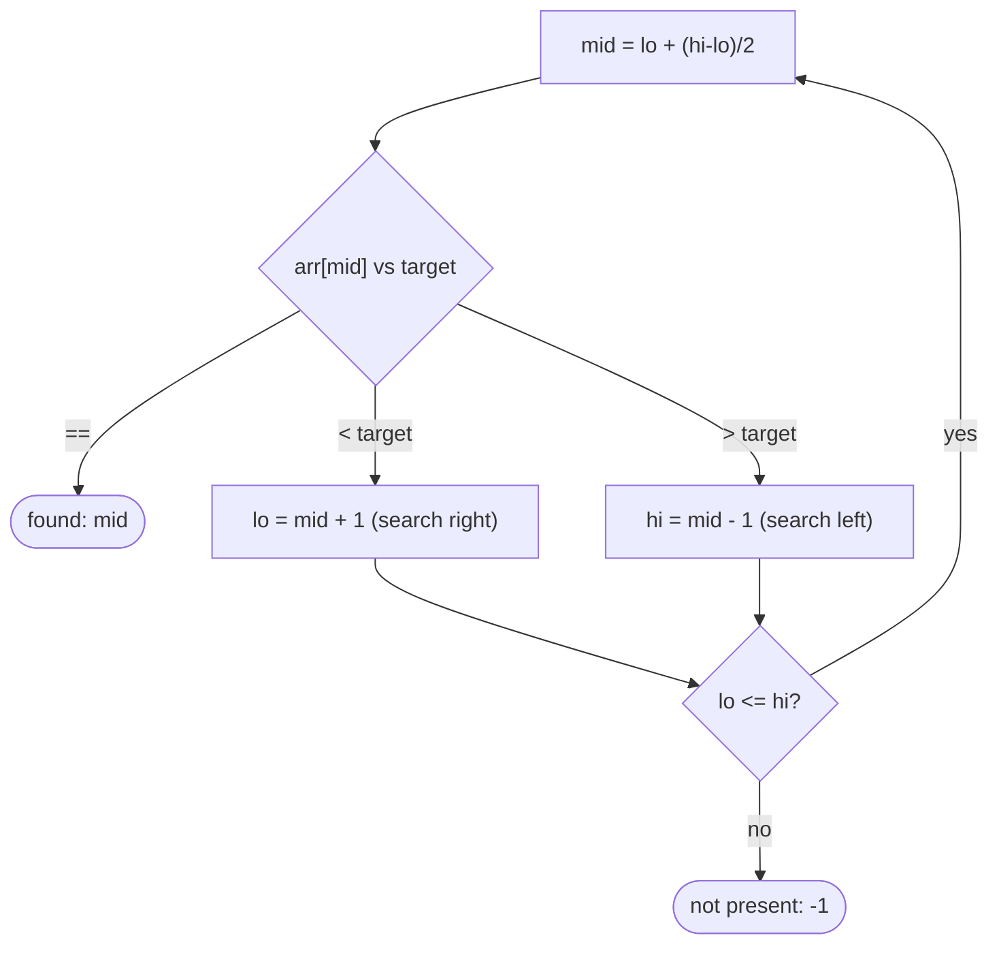

# Binary Search

## Why It Exists

Finding a value in an *unsorted* array means checking every element — `O(n)`. But if the array is **sorted**, a single comparison against the middle element tells you something powerful: if the target is smaller, it can only be in the left half; if larger, only the right. Either way you **discard half the array** and repeat.

Halving the search space each step gives `O(log n)`: a million elements take about 20 comparisons, a billion about 30. This is the headline payoff of sorting — the reason an `O(n log n)` sort pays for itself the moment you do more than a couple of lookups. It's also famously easy to get *subtly* wrong: Jon Bentley reported that most programmers, given the description, write a binary search with an off-by-one or overflow bug. The discipline is in the loop bounds.

## See It Work

Find `7` in the sorted array `[1, 3, 5, 7, 9, 11]`. Each step checks the middle and throws away half. Run it.

```python run viz=array
def binary_search(arr, target):
    lo, hi = 0, len(arr) - 1
    while lo <= hi:
        mid = lo + (hi - lo) // 2        # midpoint (overflow-safe form)
        if arr[mid] == target:
            return mid                   # found
        elif arr[mid] < target:
            lo = mid + 1                 # target is in the right half
        else:
            hi = mid - 1                 # target is in the left half
    return -1                            # not present

print(binary_search([1, 3, 5, 7, 9, 11], 7))   # 3
print(binary_search([1, 3, 5, 7, 9, 11], 4))   # -1
```

## How It Works

`lo` and `hi` bound the range that might still contain the target (the **invariant**: if the target exists, it's in `[lo, hi]`). Each iteration:

1. **Probe the middle** — `mid = lo + (hi − lo)//2`.
2. **Compare** `arr[mid]` to the target:
   - equal → found, return `mid`;
   - `arr[mid] < target` → the target is bigger, so it's in `[mid+1, hi]` → `lo = mid + 1`;
   - `arr[mid] > target` → it's in `[lo, mid−1]` → `hi = mid - 1`.
3. **Stop** when `lo > hi` — the range is empty, the target isn't present.



<p align="center"><strong>probe the middle, then keep only the half that can still contain the target; the range halves each step.</strong></p>

Two details are where the bugs live. **Overflow**: `(lo + hi) // 2` can overflow fixed-width integers when both are large; `lo + (hi − lo) // 2` is equivalent and safe (a real bug in Java's library binary search, fixed in 2006). **Off-by-one**: with an *inclusive* `hi` (the last valid index), the loop must be `lo <= hi` and the updates `mid ± 1` — mixing inclusive/exclusive bounds is the classic infinite-loop or missed-element error. Cost: **`O(log n)` time, `O(1)` space**.

### Key Takeaway

Binary search halves a sorted range each step via a midpoint comparison — `O(log n)`, `O(1)` space. Use the overflow-safe `lo + (hi-lo)//2`, and keep the bounds consistent (`lo <= hi` with `mid ± 1` for inclusive `hi`) — that consistency is the whole correctness battle.

## Trace It

Searching for `7` in `[1, 3, 5, 7, 9, 11]` (indices 0–5):

| `lo` | `hi` | `mid` | `arr[mid]` | vs 7 | action |
|---|---|---|---|---|---|
| 0 | 5 | 2 | `5` | `<` | `lo = 3` |
| 3 | 5 | 4 | `9` | `>` | `hi = 3` |
| 3 | 3 | 3 | `7` | `==` | **return 3** |

Three comparisons for six elements.

Before you read on: this took 3 comparisons for 6 elements. For an array of **one billion** sorted elements, roughly how many comparisons does binary search need — and what does that number reveal about why sorting is worth its `O(n log n)` cost?

About **30** (`log₂(10⁹) ≈ 30`). Each comparison halves the range, so the count is the number of times you can halve a billion down to one — roughly 30. Compare that to a linear scan's *up to a billion* comparisons: binary search is ~30 million times faster *per lookup*. That's the economics of sorting: paying `O(n log n)` once (≈30 billion operations for a billion items) is a terrible deal for a *single* lookup, but the instant you do many lookups, each dropping from `~10⁹` to `~30`, the sort pays for itself almost immediately — and every subsequent query is essentially free. Sorting trades a one-time bulk cost for permanently cheap search, which is why sorted data (and `O(log n)` search) underlies databases indexes, dictionaries, and version control.

## Your Turn

The reusable binary search:

```python run viz=array
def binary_search(arr, target):
    lo, hi = 0, len(arr) - 1
    while lo <= hi:
        mid = lo + (hi - lo) // 2
        if arr[mid] == target:
            return mid
        elif arr[mid] < target:
            lo = mid + 1
        else:
            hi = mid - 1
    return -1

vals = [1, 3, 5, 7, 9, 11]
print(binary_search(vals, 1), binary_search(vals, 11), binary_search(vals, 8))   # 0 5 -1
```

```java run viz=array
public class Main {
  static int binarySearch(int[] arr, int target) {
    int lo = 0, hi = arr.length - 1;
    while (lo <= hi) {
      int mid = lo + (hi - lo) / 2;           // overflow-safe
      if (arr[mid] == target) return mid;
      else if (arr[mid] < target) lo = mid + 1;
      else hi = mid - 1;
    }
    return -1;
  }
  public static void main(String[] args) {
    int[] vals = {1, 3, 5, 7, 9, 11};
    System.out.println(binarySearch(vals, 7) + " " + binarySearch(vals, 4));   // 3 -1
  }
}
```

This is a structural lesson — drill searching in the pattern sets.

## Reflect & Connect

Binary search is one idea — *halve a monotonic search space* — with a huge reach:

- **The family** — exact match (above), the *first* index `≥` a target ([lower bound](/cortex/data-structures-and-algorithms/sorting-and-searching-searching-lower-bound)) and *first* `>` ([upper bound](/cortex/data-structures-and-algorithms/sorting-and-searching-searching-upper-bound)), first/last occurrence of a duplicate, and search in a [rotated sorted array](/cortex/data-structures-and-algorithms/sorting-and-searching-searching-sorted-rotated-array).
- **It generalizes beyond arrays** — "binary search on the answer": if a yes/no predicate is monotonic over a numeric range (false… false, true… true), binary-search the boundary. That solves "minimum capacity to ship in D days," "smallest feasible X" — without any array at all. That's the [predicate-search](/cortex/data-structures-and-algorithms/sorting-and-searching-searching-pattern-minimum-predicate-search) patterns, the senior-level payoff.
- **The prerequisite is monotonicity** — binary search needs the data (or the predicate) to be ordered so that one comparison rules out a whole half. No sorted/monotonic structure, no binary search. And mind the invariant: be explicit about whether your range is `[lo, hi]` inclusive or `[lo, hi)` half-open, and keep `mid`, the loop test, and the updates consistent with that choice.

**Prerequisites:** [Introduction to Sorting](/cortex/data-structures-and-algorithms/sorting-and-searching-sorting-introduction-to-sorting).
**What's next:** find the *first* element not less than a target — [Lower Bound](/cortex/data-structures-and-algorithms/sorting-and-searching-searching-lower-bound).

## Recall

> **Mnemonic:** *Sorted array, `lo`/`hi` bound the candidate range. Probe `mid`, discard the half that can't contain the target. `O(log n)`. `lo + (hi-lo)//2`; `lo <= hi` with `mid ± 1`.*

| | |
|---|---|
| Requires | sorted (monotonic) data |
| Probe | `mid = lo + (hi - lo) // 2` (overflow-safe) |
| Decide | `<` → `lo = mid+1` · `>` → `hi = mid-1` · `==` → found |
| Stop | `lo > hi` → not present |
| Cost | `O(log n)` time, `O(1)` space |

<details>
<summary><strong>Q:</strong> Why is binary search `O(log n)`?</summary>

**A:** Each comparison discards half the remaining range, so the number of steps is how many times `n` halves to 1 — `log₂ n`.

</details>
<details>
<summary><strong>Q:</strong> Why write `lo + (hi - lo) // 2` instead of `(lo + hi) // 2`?</summary>

**A:** They're equal, but the latter can overflow fixed-width integers for large `lo + hi`; the former can't.

</details>
<details>
<summary><strong>Q:</strong> What invariant must the loop maintain?</summary>

**A:** If the target exists, it's within `[lo, hi]` — and the bounds (`lo <= hi`, `mid ± 1`) must stay consistent with inclusive vs half-open ranges.

</details>
<details>
<summary><strong>Q:</strong> What does binary search require of its input?</summary>

**A:** Monotonicity — a sorted array, or a predicate that's false-then-true — so one comparison rules out an entire half.

</details>

## Sources & Verify

- **CLRS**, *Introduction to Algorithms*, 4th ed. — binary search and the `O(log n)` analysis; **Bentley**, *Programming Pearls*, ch. 4 — the correctness pitfalls.
- **Sedgewick & Wayne**, *Algorithms*, 4th ed., §1.4 / §3.1 — binary search and ordered symbol tables; the Java overflow fix is documented in the JDK history.
- Binary search's `O(log n)` bound and the overflow/off-by-one pitfalls are standard; both runnable blocks are verified by running (`7 ⇒ 3`, `4 ⇒ -1`, ends `⇒ 0, 5`).
