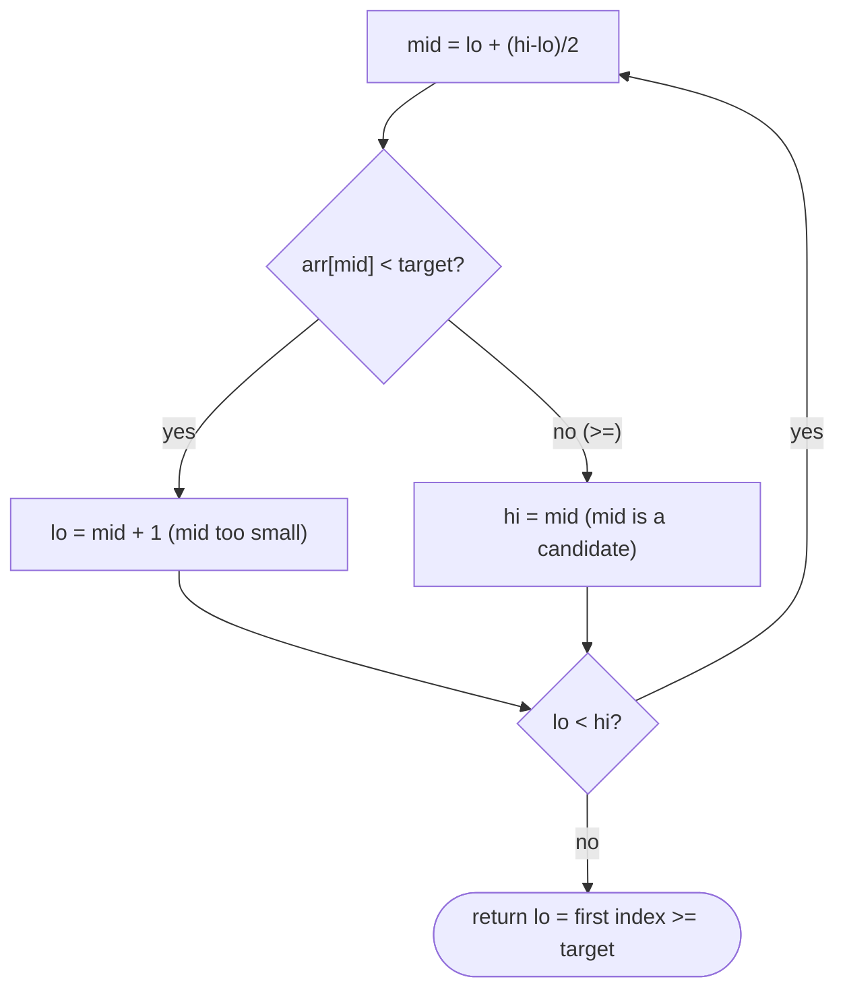

# Lower Bound

## Why It Exists

Plain binary search answers "is `x` present, and where?" — but it returns *some* matching index and fails outright on a miss. Often you want a **boundary** instead: the first position where `x` could be inserted to keep the array sorted, i.e. the **first index whose value is `≥ x`**.

That single reframing solves a cluster of problems exact-match search can't: the *leftmost* occurrence when there are duplicates, "the smallest element `≥ x`", and counting ("how many elements are `< x`?" — exactly the lower-bound index). Lower bound keeps binary search's `O(log n)` but drops the equality test, converging on a *position* rather than a *value*. It's `bisect_left` in Python and `lower_bound` in C++.

## See It Work

In `[1, 3, 3, 5, 7]`, find the first index `≥ 3` (it's `1`, the leftmost `3`) and the first index `≥ 4` (it's `3`, where `5` sits). Run it.

```python run viz=array
def lower_bound(arr, target):
    lo, hi = 0, len(arr)              # half-open range [lo, hi)
    while lo < hi:
        mid = lo + (hi - lo) // 2
        if arr[mid] < target:
            lo = mid + 1              # mid is too small → answer is strictly right
        else:
            hi = mid                  # arr[mid] >= target → mid is a candidate, look left
    return lo                         # first index with arr[index] >= target

a = [1, 3, 3, 5, 7]
print(lower_bound(a, 3))   # 1  (leftmost 3)
print(lower_bound(a, 4))   # 3  (first value >= 4 is 5)
print(lower_bound(a, 8))   # 5  (none >= 8 → insertion point at the end)
```

## How It Works

The key change from exact-match binary search is a **half-open range** `[lo, hi)` with `hi = len(arr)` (one past the end, so "not found" returns `len` — the end insertion point). The invariant: every value in `[0, lo)` is `< target`, and every value in `[hi, end)` is `≥ target`; the answer is the boundary, somewhere in `[lo, hi]`.

Each step:

- `arr[mid] < target` → `mid` and everything left is too small → `lo = mid + 1`.
- `arr[mid] ≥ target` → `mid` *might* be the answer (it's `≥`), so keep it → `hi = mid` (**not** `mid − 1`).

When `lo == hi`, that's the first index `≥ target`.



<p align="center"><strong>narrow a half-open range: <code>< target</code> discards the left (including mid); <code>≥ target</code> keeps mid as a candidate and looks left. The range collapses to the boundary.</strong></p>

Two things distinguish it from exact-match search: there's **no `== target` early return** (you want the boundary even when the target *is* present, to land on its *leftmost* copy), and the `≥` branch uses **`hi = mid`, not `hi = mid − 1`** (because `mid` itself is a valid candidate). It's `O(log n)` time, `O(1)` space, and returns a value in `[0, len]` — `len` meaning "everything is smaller."

### Key Takeaway

Lower bound is binary search for the *first index `≥ target`*: half-open `[lo, hi)` with `hi = len`, no equality branch, and `hi = mid` (keep the candidate) on the `≥` side. It gives the leftmost occurrence, the insertion point, and (as its index) the count of elements `< target` — all in `O(log n)`.

## Trace It

`lower_bound([1, 3, 3, 5, 7], 3)` — note there are *two* 3s:

| `lo` | `hi` | `mid` | `arr[mid]` | `< 3`? | action |
|---|---|---|---|---|---|
| 0 | 5 | 2 | `3` | no | `hi = 2` |
| 0 | 2 | 1 | `3` | no | `hi = 1` |
| 0 | 1 | 0 | `1` | yes | `lo = 1` |
| 1 | 1 | — | — | — | `lo == hi` → return **1** |

Before you read on: at the first step `arr[mid] = 3` *equals* the target, yet the code did `hi = mid` and kept searching left instead of returning. Why does lower bound deliberately *not* stop on an exact match — and how does that give the *leftmost* 3?

Because lower bound wants the *boundary*, not just *a* match. When `arr[mid] == target`, that index is a valid answer (it's `≥ target`), but there might be *more equal elements to its left* — so it can't be sure `mid` is the *first* one. Setting `hi = mid` keeps `mid` in the candidate range while continuing to look left for an even-earlier match; the search only stops when the range collapses, which is exactly the leftmost position. An exact-match search would happily return the *middle* `3` at index 1 or 2 depending on the probes — nondeterministic among duplicates. Lower bound's "never stop early, always shrink toward the left" is what pins it to the first occurrence, and it's why counting (`how many < target` = the returned index) works.

## Your Turn

The reusable lower bound:

```python run viz=array
def lower_bound(arr, target):
    lo, hi = 0, len(arr)
    while lo < hi:
        mid = lo + (hi - lo) // 2
        if arr[mid] < target:
            lo = mid + 1
        else:
            hi = mid
    return lo

a = [1, 3, 3, 5, 7]
print(lower_bound(a, 0), lower_bound(a, 3), lower_bound(a, 6), lower_bound(a, 8))   # 0 1 4 5
```

```java run viz=array
public class Main {
  static int lowerBound(int[] arr, int target) {
    int lo = 0, hi = arr.length;          // half-open [lo, hi)
    while (lo < hi) {
      int mid = lo + (hi - lo) / 2;
      if (arr[mid] < target) lo = mid + 1;
      else hi = mid;                      // keep mid as a candidate
    }
    return lo;
  }
  public static void main(String[] args) {
    int[] a = {1, 3, 3, 5, 7};
    System.out.println(lowerBound(a, 3) + " " + lowerBound(a, 4) + " " + lowerBound(a, 8));   // 1 3 5
  }
}
```

This is a structural lesson — drill searching in the pattern sets.

## Reflect & Connect

Lower bound is the boundary-finding half of binary search:

- **The family** — first index `≥ x` (this lesson), first index `> x` ([upper bound](/cortex/data-structures-and-algorithms/sorting-and-searching-searching-upper-bound)), the leftmost occurrence of a duplicate, and the insertion point for keeping an array sorted.
- **Counting falls out for free** — the lower-bound index *is* the number of elements `< target`; `upper_bound − lower_bound` is the count of elements *equal* to the target; lower/upper bounds of `a` and `b` give the count in a range `[a, b)`. One `O(log n)` primitive answers a whole class of range-count queries.
- **The half-open discipline is the transferable skill** — `[lo, hi)` with `hi = mid` (not `mid−1`) and no early return is a cleaner, less bug-prone binary-search template than the inclusive `[lo, hi]` form, precisely because there's only one boundary to reason about. Many practitioners write *all* their binary searches as lower-bound-style predicate searches — which is exactly what the [predicate-search patterns](/cortex/data-structures-and-algorithms/sorting-and-searching-searching-pattern-minimum-predicate-search) generalize.

**Prerequisites:** [Binary Search](/cortex/data-structures-and-algorithms/sorting-and-searching-searching-binary-search).
**What's next:** the sibling boundary — first index *strictly greater* than the target — [Upper Bound](/cortex/data-structures-and-algorithms/sorting-and-searching-searching-upper-bound).

## Recall

> **Mnemonic:** *First index `≥ target`. Half-open `[lo, hi)`, `hi = len`. `arr[mid] < target` → `lo = mid+1`; else `hi = mid` (keep candidate). No `==` branch. Returns `len` if none.*

| | |
|---|---|
| Finds | first index with `arr[index] >= target` |
| Range | half-open `[lo, hi)`, `hi = len(arr)` |
| Update | `< target` → `lo = mid+1` · `>=` → `hi = mid` |
| No early return | keeps shrinking to the *leftmost* match |
| Uses | leftmost occurrence, insertion point, count of `< target` |

<details>
<summary><strong>Q:</strong> What does lower bound return?</summary>

**A:** The first index whose value is `≥ target` (or `len` if every element is smaller).

</details>
<details>
<summary><strong>Q:</strong> Why no `== target` early return?</summary>

**A:** It wants the *leftmost* match; stopping early could land on a middle duplicate, so it keeps shrinking left.

</details>
<details>
<summary><strong>Q:</strong> Why `hi = mid` rather than `hi = mid − 1` on the `≥` branch?</summary>

**A:** `mid` itself satisfies `≥ target`, so it's a valid candidate and must stay in the range.

</details>
<details>
<summary><strong>Q:</strong> How does lower bound count elements?</summary>

**A:** Its returned index equals the number of elements `< target`; `upper_bound − lower_bound` gives the count equal to the target.

</details>

## Sources & Verify

- **Sedgewick & Wayne**, *Algorithms*, 4th ed., §3.1 — rank/floor/ceiling queries in ordered symbol tables (lower-bound semantics).
- **C++ STL / Python `bisect`** — `lower_bound` / `bisect_left` define this exact "first index ≥ target" contract.
- The half-open lower-bound template and its counting corollary are standard; both runnable blocks are verified by running (`3 ⇒ 1`, `4 ⇒ 3`, `8 ⇒ 5`; `0,3,6,8 ⇒ 0,1,4,5`).
