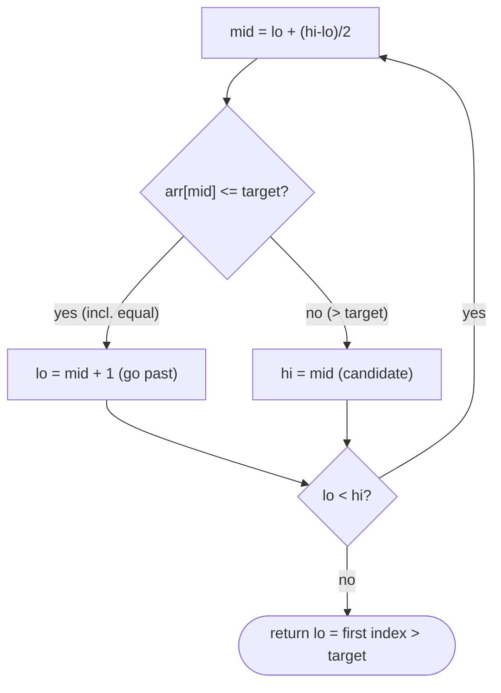

# Upper Bound

## Why It Exists

[Lower bound](/cortex/data-structures-and-algorithms/sorting-and-searching/searching/lower-bound) found the first index `≥ target` — the *leftmost* occurrence. Upper bound is its mirror: the first index whose value is **strictly greater** than the target — i.e. *one past the last* occurrence.

On its own that's the answer to "first element `> x`." But the real power is the **pair**: `[lower_bound(x), upper_bound(x))` is exactly the range of elements *equal* to `x`. So `upper_bound(x) − lower_bound(x)` is the count of `x`, and lower/upper bounds of two values give the count in any range — all in `O(log n)`. Remarkably, upper bound is the *same* binary search as lower bound with **one operator changed**.

## See It Work

In `[1, 3, 3, 5, 7]`, find the first index `> 3` (it's `3`, where `5` sits — just past the two 3s), and use the pair to count the 3s. Run it.

```python run viz=array
def lower_bound(arr, t):
    lo, hi = 0, len(arr)
    while lo < hi:
        mid = lo + (hi - lo) // 2
        if arr[mid] < t: lo = mid + 1
        else: hi = mid
    return lo

def upper_bound(arr, target):
    lo, hi = 0, len(arr)
    while lo < hi:
        mid = lo + (hi - lo) // 2
        if arr[mid] <= target:           # <= : skip elements EQUAL to target too
            lo = mid + 1
        else:
            hi = mid
    return lo                            # first index with arr[index] > target

a = [1, 3, 3, 5, 7]
print(upper_bound(a, 3))                 # 3  (first index > 3)
print(upper_bound(a, 3) - lower_bound(a, 3))   # 2  (count of 3s)
```

## How It Works

Identical half-open template to lower bound — `[lo, hi)` with `hi = len`, `hi = mid` on the "look left" branch, no early return. The **only** difference is the comparison:

- Lower bound: `arr[mid] < target` → go right. (Stops at the first `≥ target`.)
- Upper bound: `arr[mid] ≤ target` → go right. (The `≤` also pushes *past* elements equal to the target, stopping at the first `> target`.)



<p align="center"><strong>same as lower bound, but <code>≤ target</code> (not <code><</code>) sends mid to the left side, so equal elements are skipped and the search lands just past the last one.</strong></p>

That one character (`<` vs `≤`) is the whole difference: lower bound treats "equal" as "stop and look left" (landing on the first equal element), upper bound treats "equal" as "keep going right" (landing just past the last). Both are `O(log n)`, `O(1)` space, and return a value in `[0, len]`.

### Key Takeaway

Upper bound = lower bound with `≤` instead of `<`: it returns the first index *strictly greater* than the target, one past the last occurrence. Paired with lower bound it brackets all copies of a value, so `upper − lower` is the count — the basis of `O(log n)` range-count queries.

## Trace It

The **equal-range** for value `3` in `[1, 3, 3, 5, 7]`:

| | result | meaning |
|---|---|---|
| `lower_bound(a, 3)` | `1` | first index `≥ 3` (the first 3) |
| `upper_bound(a, 3)` | `3` | first index `> 3` (just past the last 3) |
| difference | `3 − 1 = 2` | count of 3s |

Before you read on: lower and upper bound differ by a single character — `<` becomes `≤`. Yet that one change moves the result from the *first* 3 (index 1) to *just past the last* 3 (index 3). Why does flipping the comparison on *equal* elements flip which end of the duplicate run you land on?

Because the comparison decides what happens when `arr[mid] == target`. In lower bound, equal triggers the *else* (`hi = mid`) — "this is a candidate, but look left for an earlier one" — so the search is pulled toward the *start* of the equal run. In upper bound, `≤` makes equal trigger `lo = mid + 1` — "go past this one" — pushing the search toward the *end* of the run and one step beyond. The duplicates form a contiguous block (the array is sorted), and the two functions deliberately fall off *opposite ends* of that block: lower bound to the left edge, upper bound just past the right edge. That's why their difference is exactly the block's length — the count. One operator, two boundaries, and counting for free.

## Your Turn

The reusable upper bound (with a count helper):

```python run viz=array
def lower_bound(arr, t):
    lo, hi = 0, len(arr)
    while lo < hi:
        mid = lo + (hi - lo) // 2
        if arr[mid] < t: lo = mid + 1
        else: hi = mid
    return lo

def upper_bound(arr, t):
    lo, hi = 0, len(arr)
    while lo < hi:
        mid = lo + (hi - lo) // 2
        if arr[mid] <= t: lo = mid + 1
        else: hi = mid
    return lo

def count(arr, t):
    return upper_bound(arr, t) - lower_bound(arr, t)

a = [1, 2, 2, 2, 5, 7]
print(upper_bound(a, 2), count(a, 2), count(a, 4))   # 4 3 0
```

```java run viz=array
public class Main {
  static int lowerBound(int[] a, int t) {
    int lo = 0, hi = a.length;
    while (lo < hi) { int m = lo + (hi - lo) / 2; if (a[m] < t) lo = m + 1; else hi = m; }
    return lo;
  }
  static int upperBound(int[] a, int t) {
    int lo = 0, hi = a.length;
    while (lo < hi) { int m = lo + (hi - lo) / 2; if (a[m] <= t) lo = m + 1; else hi = m; }
    return lo;
  }
  public static void main(String[] args) {
    int[] a = {1, 2, 2, 2, 5, 7};
    System.out.println(upperBound(a, 2) + " " + (upperBound(a, 2) - lowerBound(a, 2)));   // 4 3
  }
}
```

This is a structural lesson — drill searching in the pattern sets.

## Reflect & Connect

Upper bound completes the boundary pair:

- **The pair brackets a value** — `[lower_bound(x), upper_bound(x))` is the equal-range of `x`; the difference is its count, and `lower_bound(b) − lower_bound(a)` counts elements in `[a, b)`. This is C++'s `equal_range`, and it's how you answer "how many values between 100 and 200?" on sorted data in `O(log n)`.
- **One operator, two functions** — internalize that lower bound uses `<` and upper bound uses `≤`; everything else is identical. Many bugs come from picking the wrong one (off-by-one in counts), so tie the choice to "do I want the first equal element, or just past the last?"
- **Both are the half-open template** — and that template generalizes to the [predicate-search patterns](/cortex/data-structures-and-algorithms/sorting-and-searching-searching-pattern-minimum-predicate-search): lower/upper bound are just predicate searches where the predicate is `value ≥ target` / `value > target`. Master the template here and "binary search on the answer" is the same code with a different predicate.

**Prerequisites:** [Lower Bound](/cortex/data-structures-and-algorithms/sorting-and-searching/searching/lower-bound).
**What's next:** binary search lifted into two dimensions — [2D Binary Search](/cortex/data-structures-and-algorithms/sorting-and-searching/searching/2d-binary-search).

## Recall

> **Mnemonic:** *Upper bound = lower bound with `≤`. First index `> target` (one past the last copy). `upper − lower` = count. Same half-open template.*

| | |
|---|---|
| Finds | first index with `arr[index] > target` |
| Difference from lower bound | `arr[mid] <= target` (not `<`) → go right |
| Lands | just past the last occurrence |
| `upper − lower` | count of elements equal to target |
| Cost | `O(log n)` time, `O(1)` space |

<details>
<summary><strong>Q:</strong> What does upper bound return?</summary>

**A:** The first index whose value is strictly greater than the target — one past the last occurrence.

</details>
<details>
<summary><strong>Q:</strong> What's the only code difference from lower bound?</summary>

**A:** The comparison is `arr[mid] <= target` (instead of `<`), so equal elements are skipped to the right.

</details>
<details>
<summary><strong>Q:</strong> How do you count occurrences of `x`?</summary>

**A:** `upper_bound(x) − lower_bound(x)`.

</details>
<details>
<summary><strong>Q:</strong> Why do lower and upper bound land on opposite ends of a duplicate run?</summary>

**A:** On equal elements, lower bound looks left (toward the first), upper bound goes right (past the last).

</details>

## Sources & Verify

- **Sedgewick & Wayne**, *Algorithms*, 4th ed., §3.1 — ordered symbol-table rank/range queries.
- **C++ STL / Python `bisect`** — `upper_bound` / `bisect_right` define the "first index > target" contract; `equal_range` is the lower/upper pair.
- The `< ` vs `≤` distinction and the counting corollary are standard; both runnable blocks are verified by running (`upper_bound(·,3)=3`, count of 3s `=2`; `[1,2,2,2,5,7]` ⇒ `4, 3, 0`).
