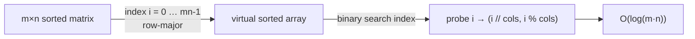

# 2D Binary Search

## Why It Exists

Binary search needs a 1D sorted sequence. A matrix where **each row is sorted *and* every row's first element exceeds the previous row's last** is, conceptually, exactly that — a single sorted list that happens to be wrapped into rows for storage. Reading it left-to-right, top-to-bottom gives a fully ascending sequence.

So you don't need a 2D algorithm at all: binary-search the matrix as if it were that flat array. The trick is purely in the **indexing** — treat a flat index `i` from `0` to `m·n − 1` as the cell `(i // cols, i % cols)`. No flattening of the *data* (that would cost `O(m·n)` space); just arithmetic on the index. The result is `O(log(m·n))` — and since `log(m·n) = log m + log n`, that's better than searching one dimension then the other.

## See It Work

Search a 3×3 fully-sorted matrix for `9`. Run it — note the matrix is never copied; only the index is mapped to a cell.

```python run viz=array
def search_matrix(matrix, target):
    if not matrix or not matrix[0]:
        return False
    rows, cols = len(matrix), len(matrix[0])
    lo, hi = 0, rows * cols - 1               # binary-search the VIRTUAL flat array
    while lo <= hi:
        mid = lo + (hi - lo) // 2
        val = matrix[mid // cols][mid % cols]  # map flat index → (row, col)
        if val == target:
            return True
        elif val < target:
            lo = mid + 1
        else:
            hi = mid - 1
    return False

m = [[1, 3, 5], [7, 9, 11], [13, 15, 17]]
print(search_matrix(m, 9))    # True
print(search_matrix(m, 8))    # False
```

## How It Works

The matrix has `rows × cols` cells, numbered `0 … rows·cols − 1` in row-major (left-to-right, top-to-bottom) order. Because the matrix is fully sorted, those numbered cells form an ascending sequence — so run an ordinary binary search over the **index range** `[0, rows·cols − 1]`. The only new step is converting a flat index `mid` to a cell:

- **row** = `mid // cols` (how many full rows fit before `mid`)
- **column** = `mid % cols` (the offset within that row)



<p align="center"><strong>number the cells row-major; the sorted matrix is a sorted 1D array in disguise, so binary-search the index and decode each probe to (row, col).</strong></p>

Every step is `O(1)` index arithmetic plus one comparison, and the range halves each step, so it's **`O(log(m·n))` time, `O(1)` space**. The crucial precondition is that the matrix is *fully* sorted (row-major ascending). If instead the matrix is only **row-sorted and column-sorted** — where a row's first element is *not* guaranteed larger than the previous row's last — this flattening breaks, and you need the [staircase search](/cortex/data-structures-and-algorithms/sorting-and-searching-searching-staircase-search) instead.

### Key Takeaway

A fully row-major-sorted matrix is a 1D sorted array in disguise: binary-search the flat index range `[0, m·n−1]` and decode each index with `(i // cols, i % cols)`. `O(log(m·n))`, `O(1)` space — no data copied. Only valid when each row's start exceeds the previous row's end.

## Trace It

Searching `9` in `[[1,3,5],[7,9,11],[13,15,17]]` (`cols = 3`, indices `0–8`):

| `lo` | `hi` | `mid` | cell `(mid//3, mid%3)` | value | vs 9 |
|---|---|---|---|---|---|
| 0 | 8 | 4 | `(1, 1)` | `9` | `==` → **True** |

One probe found it: index `4` maps to row `4//3 = 1`, column `4%3 = 1` — the center cell `9`.

Before you read on: this treats `log(m·n)` as the cost. But you could *also* binary-search to find the right *row* (`O(log m)`) and then binary-search *within* that row (`O(log n)`). Are those two approaches different in cost — and why is "flatten the index" usually the cleaner choice?

They're the **same** asymptotic cost: `log(m·n) = log m + log n`, so one binary search over `m·n` indices equals one over `m` rows plus one over `n` columns. The difference is *code complexity and edge cases*. The two-step version needs care to pick the candidate row (the row whose range could contain the target — itself a lower-bound-style search), then a second search with its own bounds; two binary searches means two chances for off-by-one bugs. The flatten-the-index version is a *single* textbook binary search with one extra line of index arithmetic — fewer moving parts, fewer bugs. When the matrix is fully sorted, collapsing both dimensions into one index space is the simplest correct thing. (When it's only row/column-sorted, neither works and you switch to the staircase.)

## Your Turn

The reusable 2D binary search:

```python run viz=array
def search_matrix(matrix, target):
    if not matrix or not matrix[0]:
        return False
    rows, cols = len(matrix), len(matrix[0])
    lo, hi = 0, rows * cols - 1
    while lo <= hi:
        mid = lo + (hi - lo) // 2
        val = matrix[mid // cols][mid % cols]
        if val == target:
            return True
        elif val < target:
            lo = mid + 1
        else:
            hi = mid - 1
    return False

m = [[1, 4, 7, 11], [12, 15, 20, 23], [30, 34, 50, 60]]
print(search_matrix(m, 20), search_matrix(m, 13))   # True False
```

```java run viz=array
public class Main {
  static boolean searchMatrix(int[][] m, int target) {
    if (m.length == 0 || m[0].length == 0) return false;
    int rows = m.length, cols = m[0].length, lo = 0, hi = rows * cols - 1;
    while (lo <= hi) {
      int mid = lo + (hi - lo) / 2;
      int val = m[mid / cols][mid % cols];
      if (val == target) return true;
      else if (val < target) lo = mid + 1;
      else hi = mid - 1;
    }
    return false;
  }
  public static void main(String[] args) {
    int[][] m = {{1, 4, 7, 11}, {12, 15, 20, 23}, {30, 34, 50, 60}};
    System.out.println(searchMatrix(m, 20) + " " + searchMatrix(m, 13));   // true false
  }
}
```

This is a structural lesson — drill searching in the pattern sets.

## Reflect & Connect

2D binary search is "recognize the 1D structure hiding in 2D":

- **The two matrix flavors** — *fully sorted* (row-major ascending) → flatten the index, `O(log(m·n))` (this lesson); *row- and column-sorted only* → can't flatten, use the [staircase search](/cortex/data-structures-and-algorithms/sorting-and-searching-searching-staircase-search) at `O(m + n)`. Always check which precondition the matrix actually satisfies — applying flatten-search to a merely row/col-sorted matrix gives wrong answers.
- **Virtual flattening is a reusable trick** — index arithmetic (`i // cols`, `i % cols`) lets you treat any row-major buffer as 1D without copying. The same idea underlies image/grid storage, flattened tensors, and addressing a 2D array as a contiguous block.
- **`log(m·n) = log m + log n`** — collapsing dimensions doesn't change the asymptotics, but a single search is simpler than nested searches. Prefer the form with fewer boundary conditions.

**Prerequisites:** [Binary Search](/cortex/data-structures-and-algorithms/sorting-and-searching-searching-binary-search).
**What's next:** the row-and-column-sorted matrix that *can't* be flattened — [Staircase Search](/cortex/data-structures-and-algorithms/sorting-and-searching-searching-staircase-search).

## Recall

> **Mnemonic:** *Fully-sorted matrix = 1D sorted array. Binary-search index `[0, m·n−1]`; decode `mid → (mid//cols, mid%cols)`. `O(log(m·n))`, no copy. Needs row-major-ascending.*

| | |
|---|---|
| Precondition | fully sorted (each row's start > previous row's end) |
| Search space | flat index `[0, rows·cols − 1]` |
| Index → cell | `(mid // cols, mid % cols)` |
| Cost | `O(log(m·n)) = O(log m + log n)`, `O(1)` space |
| If only row/col-sorted | use staircase search instead |

<details>
<summary><strong>Q:</strong> How does 2D binary search avoid a 2D algorithm?</summary>

**A:** A fully-sorted matrix is a 1D sorted array in row-major order, so it binary-searches the flat index and decodes each index to a cell.

</details>
<details>
<summary><strong>Q:</strong> How do you map a flat index to a cell?</summary>

**A:** `row = i // cols`, `col = i % cols`.

</details>
<details>
<summary><strong>Q:</strong> Why is flatten-search the same cost as row-then-column search?</summary>

**A:** `log(m·n) = log m + log n`; the difference is simplicity and fewer off-by-one bugs, not asymptotics.

</details>
<details>
<summary><strong>Q:</strong> When does this approach fail?</summary>

**A:** When the matrix is only row- and column-sorted (rows don't chain), so it isn't globally sorted — use the staircase search.

</details>

## Sources & Verify

- **CLRS**, *Introduction to Algorithms*, 4th ed. — binary search; row-major addressing of multidimensional arrays.
- The "search a 2D matrix" problem (fully-sorted variant) is a standard interview question with this flatten-the-index solution.
- The `O(log(m·n))` bound and index mapping are standard; both runnable blocks are verified by running (`9 ⇒ True`, `8 ⇒ False`; `20 ⇒ True`, `13 ⇒ False`).
