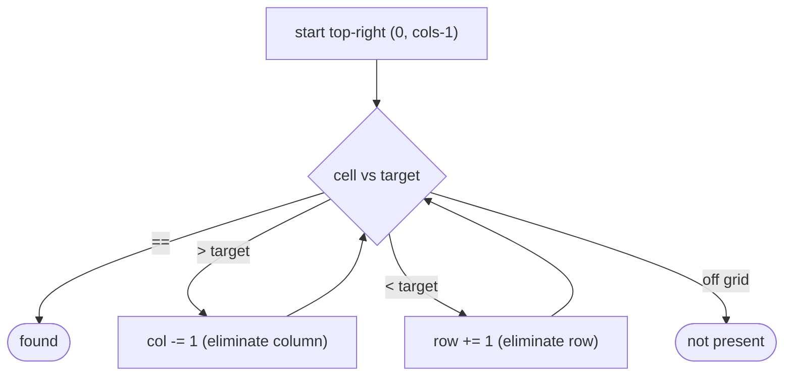

# Staircase Search

## Why It Exists

[2D binary search](/cortex/data-structures-and-algorithms/sorting-and-searching-searching-2d-binary-search) needed a *fully* sorted matrix — one you could flatten into a single ascending array. But a very common matrix is only **row-sorted and column-sorted**: each row ascends left-to-right and each column ascends top-to-bottom, yet a row's first element is *not* guaranteed larger than the previous row's last. Such a matrix can't be flattened, so binary search doesn't apply.

The staircase search exploits a special vantage point: the **top-right corner**. That cell is the *largest* in its row and the *smallest* in its column. So a single comparison is decisive — if it's bigger than the target, the whole column beneath it is bigger too (eliminate the column); if it's smaller, the whole row to its left is smaller (eliminate the row). Each step removes an entire row or column, so the walk visits at most `m + n` cells — `O(m + n)`, `O(1)` space.

## See It Work

Search a row/column-sorted matrix for `5`, starting from the top-right corner. Run it.

```python run viz=array
def search_matrix(matrix, target):
    if not matrix or not matrix[0]:
        return False
    row, col = 0, len(matrix[0]) - 1        # start at the TOP-RIGHT corner
    while row < len(matrix) and col >= 0:
        val = matrix[row][col]
        if val == target:
            return True
        elif val > target:
            col -= 1                         # too big → drop this entire column
        else:
            row += 1                         # too small → drop this entire row
    return False

m = [[1, 4, 7, 11],
     [2, 5, 8, 12],
     [3, 6, 9, 16],
     [10, 13, 14, 17]]
print(search_matrix(m, 5))     # True
print(search_matrix(m, 15))    # False
```

## How It Works

Start at `(row=0, col=cols−1)` — the top-right. At each step, compare the current cell to the target:

- `val == target` → found.
- `val > target` → the target is smaller. Every cell *below* in this column is even larger (column sorted ascending), so the column can't contain it → `col −= 1` (move left).
- `val < target` → the target is larger. Every cell *left* in this row is even smaller (row sorted ascending), so the row can't contain it → `row += 1` (move down).

Stop when you walk off the grid (`col < 0` or `row == rows`).



<p align="center"><strong>from the top-right: too big → step left (drop the column), too small → step down (drop the row). The path is a staircase toward the target.</strong></p>

Each comparison eliminates one row or one column, and there are `m` rows and `n` columns, so the loop runs at most `m + n` times: **`O(m + n)` time, `O(1)` space**. (The bottom-left corner works symmetrically — `> target` → up, `< target` → right.)

### Key Takeaway

In a row- and column-sorted matrix, start at the top-right corner (row's max, column's min): `> target` step left to drop a column, `< target` step down to drop a row. Each step eliminates a whole line → `O(m + n)`. The corner choice is what makes one comparison decisive.

## Trace It

Searching `5` in the matrix above, starting at top-right `(0, 3) = 11`:

| `(row, col)` | value | vs 5 | move |
|---|---|---|---|
| `(0, 3)` | `11` | `>` | left → col 2 |
| `(0, 2)` | `7` | `>` | left → col 1 |
| `(0, 1)` | `4` | `<` | down → row 1 |
| `(1, 1)` | `5` | `==` | **found** |

Before you read on: the walk started at the *top-right*. What goes wrong if you start at the **top-left** corner instead — and what property must a starting corner have for the staircase to work?

The top-left cell is the *minimum* of the entire matrix — it's the smallest in *both* its row and its column. So if it's less than the target, the target could be either down *or* right (both directions increase), and a single comparison can't eliminate anything — you'd have to branch into both, losing the linear bound. The same is true of the bottom-right (the global maximum). The staircase needs a corner where the two axes move in **opposite** senses relative to a comparison — top-right (row increases as you go *back*, column increases as you go *down*) or bottom-left. At such a corner, "too big" rules out exactly one direction and "too small" the other, so every comparison deletes a full row or column. Picking a corner where both directions agree destroys that decisiveness — which is precisely why corner choice is the crux of the algorithm.

## Your Turn

The reusable staircase search:

```python run viz=array
def search_matrix(matrix, target):
    if not matrix or not matrix[0]:
        return False
    row, col = 0, len(matrix[0]) - 1
    while row < len(matrix) and col >= 0:
        val = matrix[row][col]
        if val == target:
            return True
        elif val > target:
            col -= 1
        else:
            row += 1
    return False

m = [[1, 4, 7, 11], [2, 5, 8, 12], [3, 6, 9, 16], [10, 13, 14, 17]]
print(search_matrix(m, 9), search_matrix(m, 13), search_matrix(m, 0))   # True True False
```

```java run viz=array
public class Main {
  static boolean searchMatrix(int[][] m, int target) {
    if (m.length == 0 || m[0].length == 0) return false;
    int row = 0, col = m[0].length - 1;            // top-right
    while (row < m.length && col >= 0) {
      int val = m[row][col];
      if (val == target) return true;
      else if (val > target) col--;                // drop column
      else row++;                                  // drop row
    }
    return false;
  }
  public static void main(String[] args) {
    int[][] m = {{1, 4, 7, 11}, {2, 5, 8, 12}, {3, 6, 9, 16}, {10, 13, 14, 17}};
    System.out.println(searchMatrix(m, 5) + " " + searchMatrix(m, 15));   // true false
  }
}
```

This is a structural lesson — drill searching in the pattern sets.

## Reflect & Connect

The staircase is the matrix search for when you *can't* flatten:

- **Match the algorithm to the matrix** — *fully* sorted (rows chain) → [2D binary search](/cortex/data-structures-and-algorithms/sorting-and-searching-searching-2d-binary-search), `O(log(m·n))`; *row- and column-sorted only* → staircase, `O(m + n)`. Reading the precondition correctly is half the problem.
- **The "monotone corner" idea generalizes** — any time two sorted axes meet at a corner where they oppose, one comparison prunes a whole line. The same staircase counts elements `< x` in such a matrix, and a similar two-pointer-from-opposite-ends move appears in "find a pair summing to k" on a sorted array.
- **It's a two-pointer in 2D** — `row` only increases, `col` only decreases, each at most `m` and `n` times — the same "pointers move monotonically, so the total work is linear" reasoning as the array two-pointer and sliding-window patterns.

**Prerequisites:** [2D Binary Search](/cortex/data-structures-and-algorithms/sorting-and-searching-searching-2d-binary-search).
**What's next:** binary search on an array that's been rotated — [Sorted Rotated Array](/cortex/data-structures-and-algorithms/sorting-and-searching-searching-sorted-rotated-array).

## Recall

> **Mnemonic:** *Row/col-sorted matrix: start top-right. `> target` → left (drop column); `< target` → down (drop row). `O(m + n)`. The corner must let one comparison rule out a whole line.*

| | |
|---|---|
| Matrix type | row-sorted AND column-sorted (not globally sorted) |
| Start | top-right `(0, cols−1)` — row max, column min |
| `> target` | `col −= 1` (eliminate the column) |
| `< target` | `row += 1` (eliminate the row) |
| Cost | `O(m + n)` time, `O(1)` space |

<details>
<summary><strong>Q:</strong> When do you use staircase search instead of 2D binary search?</summary>

**A:** When the matrix is only row- and column-sorted (rows don't chain), so it can't be flattened into one sorted array.

</details>
<details>
<summary><strong>Q:</strong> Why start at the top-right corner?</summary>

**A:** It's the max of its row and min of its column, so one comparison decisively eliminates either a whole row or a whole column.

</details>
<details>
<summary><strong>Q:</strong> Why does top-left fail?</summary>

**A:** It's the global minimum — both directions increase, so a comparison can't rule out a single direction, breaking the linear bound.

</details>
<details>
<summary><strong>Q:</strong> What's the cost and why?</summary>

**A:** `O(m + n)` — each step removes one of the `m` rows or `n` columns, so at most `m + n` steps.

</details>

## Sources & Verify

- **Sedgewick / standard interview canon** — "Search a 2D Matrix II" (Young tableau search) is the classic staircase problem.
- **CLRS**, *Introduction to Algorithms*, 4th ed. — Young tableaux (problem 6-3) use the same row/column-sorted monotone structure.
- The top-right staircase and its `O(m + n)` bound are standard; both runnable blocks are verified by running (`5 ⇒ True`, `15 ⇒ False`; `9,13,0 ⇒ True, True, False`).
