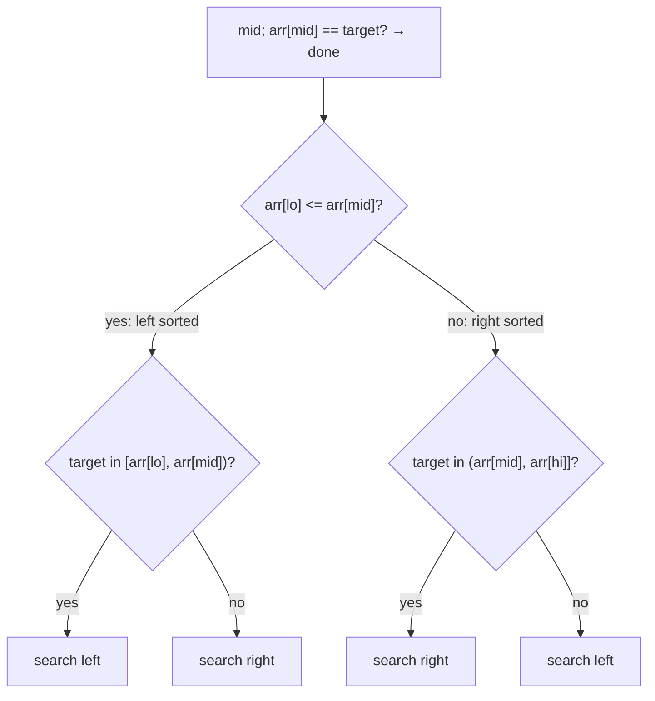

# Sorted Rotated Array

## Why It Exists

A *sorted rotated array* is a sorted array that's been cut at some pivot and the two pieces swapped — `[0,1,2,4,5,6,7]` rotated becomes `[4,5,6,7,0,1,2]`. It's no longer globally sorted, so plain binary search fails. You *could* find the pivot and un-rotate, but there's a slicker way that searches directly in `O(log n)`.

The key observation: split at the midpoint and **at least one half is always fully sorted**. (The rotation point lies in one half; the other half is a clean ascending run.) So at each step, figure out which half is sorted, check whether the target lies within that sorted half's value range, and discard the half that can't contain it — the same "throw away half" discipline as binary search, just with one extra decision.

## See It Work

Find `0` in the rotated array `[4, 5, 6, 7, 0, 1, 2]`. Run it.

```python run viz=array
def search(arr, target):
    lo, hi = 0, len(arr) - 1
    while lo <= hi:
        mid = lo + (hi - lo) // 2
        if arr[mid] == target:
            return mid
        if arr[lo] <= arr[mid]:                  # LEFT half [lo..mid] is sorted
            if arr[lo] <= target < arr[mid]:
                hi = mid - 1                     # target is inside the sorted left
            else:
                lo = mid + 1                     # else it's in the right
        else:                                     # RIGHT half [mid..hi] is sorted
            if arr[mid] < target <= arr[hi]:
                lo = mid + 1                     # target is inside the sorted right
            else:
                hi = mid - 1
    return -1

print(search([4, 5, 6, 7, 0, 1, 2], 0))   # 4
print(search([4, 5, 6, 7, 0, 1, 2], 3))   # -1
```

## How It Works

Standard binary-search frame (`lo`, `hi`, `mid`), with the comparison replaced by a two-level decision. After checking `arr[mid] == target`:

1. **Which half is sorted?** If `arr[lo] ≤ arr[mid]`, the **left** half `[lo, mid]` is a clean ascending run; otherwise the **right** half `[mid, hi]` is.
2. **Is the target in the sorted half's range?** 
   - Left sorted: if `arr[lo] ≤ target < arr[mid]`, the target must be in the left → `hi = mid − 1`; else go right.
   - Right sorted: if `arr[mid] < target ≤ arr[hi]`, the target must be in the right → `lo = mid + 1`; else go left.

Because you always know one half's exact range, you can definitively say whether the target is in it — and discard the other half.



<p align="center"><strong>identify the sorted half, check if the target lies in its range; if so search it, otherwise search the other (which holds the rotation point).</strong></p>

Each step halves the range, so it's **`O(log n)` time, `O(1)` space** — same as binary search. One caveat: with **duplicate** values, `arr[lo] == arr[mid]` becomes ambiguous (you can't tell which half is sorted), and the worst case degrades to `O(n)` — you must scan past the duplicates.

### Key Takeaway

In a rotated sorted array, one half is always sorted. Decide which (`arr[lo] ≤ arr[mid]` → left), test if the target lies in that half's known range, and discard the other half. `O(log n)` without un-rotating — though duplicates can force `O(n)`.

## Trace It

Searching `0` in `[4, 5, 6, 7, 0, 1, 2]` (indices 0–6):

| `lo` | `hi` | `mid` | `arr[mid]` | sorted half | target `0` there? | action |
|---|---|---|---|---|---|---|
| 0 | 6 | 3 | `7` | left `[4..7]` | `0` in `[4,7)`? no | `lo = 4` |
| 4 | 6 | 5 | `1` | left `[0..1]` | `0` in `[0,1)`? yes | `hi = 4` |
| 4 | 4 | 4 | `0` | — | `arr[mid]==0` | **return 4** |

Before you read on: the algorithm's first move is to ask "is `arr[lo] ≤ arr[mid]`?" to decide which half is sorted. Why is it *guaranteed* that at least one half is sorted — and why does identifying the sorted half let you make a definitive discard, when the array as a whole isn't sorted?

The rotation introduces exactly *one* "drop" point (where the larger pre-rotation tail meets the smaller head — e.g. `7→0`). That single discontinuity falls into *one* of the two halves around `mid`; the *other* half has no drop, so it's a clean ascending run — hence at least one half is always sorted. And a *sorted* half is exactly where binary search's logic works: you know its endpoints, so `arr[lo] ≤ target < arr[mid]` decides membership with certainty. The unsorted half is the one hiding the rotation — but you never need to reason about its internal order; you only need to know the target *isn't* in the sorted half, which forces it into the other. Reducing a non-sorted problem to "find the one sorted half and use it as the oracle" is the whole trick — and the broader lesson that binary search applies whenever you can *decide which half to discard*, even without global order.

## Your Turn

The reusable rotated-array search:

```python run viz=array
def search(arr, target):
    lo, hi = 0, len(arr) - 1
    while lo <= hi:
        mid = lo + (hi - lo) // 2
        if arr[mid] == target:
            return mid
        if arr[lo] <= arr[mid]:
            if arr[lo] <= target < arr[mid]:
                hi = mid - 1
            else:
                lo = mid + 1
        else:
            if arr[mid] < target <= arr[hi]:
                lo = mid + 1
            else:
                hi = mid - 1
    return -1

a = [4, 5, 6, 7, 0, 1, 2]
print(search(a, 4), search(a, 2), search(a, 8))   # 0 6 -1
```

```java run viz=array
public class Main {
  static int search(int[] arr, int target) {
    int lo = 0, hi = arr.length - 1;
    while (lo <= hi) {
      int mid = lo + (hi - lo) / 2;
      if (arr[mid] == target) return mid;
      if (arr[lo] <= arr[mid]) {                                   // left sorted
        if (arr[lo] <= target && target < arr[mid]) hi = mid - 1;
        else lo = mid + 1;
      } else {                                                      // right sorted
        if (arr[mid] < target && target <= arr[hi]) lo = mid + 1;
        else hi = mid - 1;
      }
    }
    return -1;
  }
  public static void main(String[] args) {
    int[] a = {4, 5, 6, 7, 0, 1, 2};
    System.out.println(search(a, 0) + " " + search(a, 3));   // 4 -1
  }
}
```

This is a structural lesson — drill searching in the pattern sets.

## Reflect & Connect

Rotated-array search shows binary search applies beyond strictly sorted data:

- **The family** — search a rotated array (this lesson), find the **rotation point / minimum** (binary-search for the one place `arr[mid] > arr[hi]`), find how many times it was rotated (= the min's index), and the bitonic/peak-finding searches.
- **Duplicates are the gotcha** — `arr[lo] == arr[mid]` makes "which half is sorted" ambiguous, so you fall back to shrinking `lo`/`hi` past the duplicate, degrading to `O(n)` worst case. Always ask whether the input can contain duplicates.
- **The deep idea: binary search needs a decision, not sortedness** — any structure where you can rule out half the search space with one `O(1)` test admits a `O(log n)` search. Rotated arrays, bitonic arrays, and "find a peak" all qualify, as does the general [predicate search](/cortex/data-structures-and-algorithms/sorting-and-searching-searching-pattern-minimum-predicate-search) — binary search on the *answer* rather than the data.

**Prerequisites:** [Binary Search](/cortex/data-structures-and-algorithms/sorting-and-searching-searching-binary-search).

## Recall

> **Mnemonic:** *Rotated = one half always sorted. `arr[lo] ≤ arr[mid]`? left sorted, else right. If target in the sorted half's range, search it; else the other. `O(log n)` (O(n) with dups).*

| | |
|---|---|
| Which half sorted | `arr[lo] <= arr[mid]` → left, else right |
| Left sorted | target in `[arr[lo], arr[mid])` → go left, else right |
| Right sorted | target in `(arr[mid], arr[hi]]` → go right, else left |
| Cost | `O(log n)`; `O(n)` worst case with duplicates |
| Related | find the minimum / rotation count via the same frame |

<details>
<summary><strong>Q:</strong> Why is at least one half always sorted in a rotated array?</summary>

**A:** Rotation creates a single discontinuity, which falls into one half; the other half is a clean ascending run.

</details>
<details>
<summary><strong>Q:</strong> How do you decide which way to recurse?</summary>

**A:** Identify the sorted half, check if the target lies in its known value range; if yes search it, otherwise search the other half.

</details>
<details>
<summary><strong>Q:</strong> What breaks the `O(log n)` bound?</summary>

**A:** Duplicates make `arr[lo] == arr[mid]` ambiguous, forcing a linear scan past them — `O(n)` worst case.

</details>
<details>
<summary><strong>Q:</strong> What's the general principle beyond rotated arrays?</summary>

**A:** Binary search needs only a way to discard half the space with one test — not full sortedness — so it applies to rotated, bitonic, peak, and predicate searches.

</details>

## Sources & Verify

- **Sedgewick / interview canon** — "Search in Rotated Sorted Array" is the standard problem; the "one half is sorted" invariant is the textbook approach.
- **CLRS**, *Introduction to Algorithms*, 4th ed. — binary search and divide-and-conquer decision arguments.
- The `O(log n)` rotated search and the duplicate `O(n)` caveat are standard; both runnable blocks are verified by running (`0 ⇒ 4`, `3 ⇒ -1`; `4,2,8 ⇒ 0, 6, -1`).
