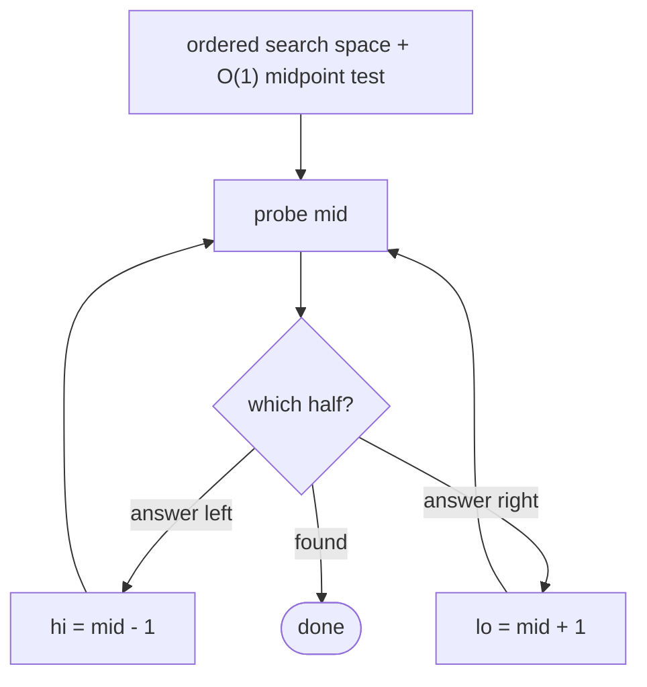

# Pattern: Binary Search

## Why It Exists

You learned the [mechanics of binary search](/cortex/data-structures-and-algorithms/sorting-and-searching/searching/binary-search) — `lo`/`hi`/`mid`, halve each step. This lesson is about **recognition**: when does a problem call for it, and what's the one template you reuse?

The trigger is simple. If the data is **sorted** (or you can decide, in `O(1)`, which half of the search space to discard), binary search turns an `O(n)` scan into `O(log n)`. That covers far more than "find `x` in a sorted array": validating membership, finding a shared/intersecting element of two sorted arrays, locating a position — and, with the variants, boundaries, rotations, and "binary search on the answer." Learn to *see* the sorted/monotone structure, and the template does the rest.

## See It Work

The classic template, finding a target's index in a sorted array. Run it.

```python run viz=array
def binary_search(arr, target):
    lo, hi = 0, len(arr) - 1
    while lo <= hi:
        mid = lo + (hi - lo) // 2        # overflow-safe midpoint
        if arr[mid] == target:
            return mid
        elif arr[mid] < target:
            lo = mid + 1                 # discard the left half
        else:
            hi = mid - 1                 # discard the right half
    return -1

print(binary_search([2, 4, 6, 8, 10, 12], 8))   # 3
print(binary_search([2, 4, 6, 8, 10, 12], 7))   # -1
```

## How It Works

The recognition checklist — reach for binary search when **all** of these hold:

1. There's a **search space** that's ordered or monotone (a sorted array, a range of candidate answers, a `false…true` predicate).
2. One **`O(1)` (or cheap) test** at the midpoint tells you which half to keep.
3. You want a single element / boundary / decision, not the whole structure.

The reusable template is always the same three moves — probe the middle, test, discard a half:



<p align="center"><strong>recognize the ordered search space, probe the middle, and discard the half that can't contain the answer; one template, many variants.</strong></p>

Every member of the family is this template with a different midpoint test: exact match (`== target`), first `≥`/`>` ([lower](/cortex/data-structures-and-algorithms/sorting-and-searching/searching/lower-bound)/[upper bound](/cortex/data-structures-and-algorithms/sorting-and-searching/searching/upper-bound)), which-half-is-sorted ([rotated array](/cortex/data-structures-and-algorithms/sorting-and-searching/searching/sorted-rotated-array)), or `feasible(mid)` ([predicate search](/cortex/data-structures-and-algorithms/sorting-and-searching-searching-pattern-minimum-predicate-search)). All are `O(log n)` (or `O(log(range) × cost(test))`).

### Key Takeaway

Recognize binary search by its trigger: an ordered/monotone search space plus a cheap midpoint test that discards half. Then apply the one template (probe `mid`, test, shrink). The variants differ only in the test — exact, boundary, rotated, or predicate.

## Trace It

Searching `8` in `[2, 4, 6, 8, 10, 12]`:

| `lo` | `hi` | `mid` | `arr[mid]` | vs 8 | action |
|---|---|---|---|---|---|
| 0 | 5 | 2 | `6` | `<` | `lo = 3` |
| 3 | 5 | 4 | `10` | `>` | `hi = 3` |
| 3 | 3 | 3 | `8` | `==` | **return 3** |

Before you read on: a problem says "two sorted arrays — find their smallest common element." There's no single sorted array to search. Why is this *still* a binary-search problem, and what's the search space?

Because binary search doesn't require *one array* — it requires an ordered search space and a cheap "which half" test. Here you can walk the smaller array and, for each candidate, **binary-search the other array** for it (the search space is the second sorted array, the test is the comparison) — or two-pointer both. The recognition is: "the inputs are *sorted*, and I need to *locate/decide*" → binary search is on the table, even when you have to construct the search space (one array, a range, a predicate) yourself. Spotting that the *structure* — not the literal data layout — is what binary search needs is the whole pattern; the mechanics never change.

## Your Turn

The reusable binary-search template:

```python run viz=array
def binary_search(arr, target):
    lo, hi = 0, len(arr) - 1
    while lo <= hi:
        mid = lo + (hi - lo) // 2
        if arr[mid] == target:
            return mid
        elif arr[mid] < target:
            lo = mid + 1
        else:
            hi = mid - 1
    return -1

a = [2, 4, 6, 8, 10, 12]
print(binary_search(a, 2), binary_search(a, 12), binary_search(a, 5))   # 0 5 -1
```

```java run viz=array
public class Main {
  static int binarySearch(int[] arr, int target) {
    int lo = 0, hi = arr.length - 1;
    while (lo <= hi) {
      int mid = lo + (hi - lo) / 2;
      if (arr[mid] == target) return mid;
      else if (arr[mid] < target) lo = mid + 1;
      else hi = mid - 1;
    }
    return -1;
  }
  public static void main(String[] args) {
    int[] a = {2, 4, 6, 8, 10, 12};
    System.out.println(binarySearch(a, 8) + " " + binarySearch(a, 7));   // 3 -1
  }
}
```

Drill the family in **Practice** — [Recovery Validation](/cortex/data-structures-and-algorithms/sorting-and-searching/searching/pattern-binary-search/problems/recovery-validation), [Reverse Binary Search](/cortex/data-structures-and-algorithms/sorting-and-searching/searching/pattern-binary-search/problems/reverse-binary-search), [Minimum Shared Element](/cortex/data-structures-and-algorithms/sorting-and-searching/searching/pattern-binary-search/problems/minimum-shared-element), and [Intersecting Elements](/cortex/data-structures-and-algorithms/sorting-and-searching/searching/pattern-binary-search/problems/intersecting-elements).

## Reflect & Connect

This pattern is the umbrella; the rest of the section is its variants:

- **The family, by midpoint test** — exact match (this lesson), first `≥`/`>` ([lower](/cortex/data-structures-and-algorithms/sorting-and-searching/searching/lower-bound) / [upper bound](/cortex/data-structures-and-algorithms/sorting-and-searching/searching/upper-bound)), which-half-is-sorted ([rotated array](/cortex/data-structures-and-algorithms/sorting-and-searching/searching/sorted-rotated-array)), and `feasible(mid)` ([min](/cortex/data-structures-and-algorithms/sorting-and-searching-searching-pattern-minimum-predicate-search) / [max predicate](/cortex/data-structures-and-algorithms/sorting-and-searching-searching-pattern-maximum-predicate-search)).
- **Recognition beats memorization** — you don't memorize five algorithms; you learn one template and the trigger ("ordered space + cheap halving test"), then swap the midpoint test. Most "I didn't see it was binary search" misses are failures to spot a *constructible* monotone search space.
- **Invariant discipline carries across all variants** — choose inclusive `[lo, hi]` or half-open `[lo, hi)` and keep `mid`, the loop test, and the updates consistent; that single habit prevents the off-by-one bugs binary search is infamous for.

**Prerequisites:** [Binary Search](/cortex/data-structures-and-algorithms/sorting-and-searching/searching/binary-search).
**What's next:** the boundary variant — first position where a condition becomes true — [Lower Bound](/cortex/data-structures-and-algorithms/sorting-and-searching/searching/pattern-lower-bound/pattern).

## Recall

> **Mnemonic:** *Trigger = ordered space + cheap midpoint test that discards half. One template (probe/test/shrink); variants only change the test. `O(log n)`.*

| | |
|---|---|
| Recognize | sorted/monotone search space + `O(1)` "which half" test |
| Template | probe `mid`, test, discard a half |
| Variants | exact · lower/upper bound · rotated · predicate |
| Cost | `O(log n)` (or `O(log(range) × test)`) |
| Habit | fix the invariant (inclusive vs half-open) and stay consistent |

<details>
<summary><strong>Q:</strong> When should you reach for binary search?</summary>

**A:** When the search space is ordered/monotone and a cheap midpoint test can discard half of it.

</details>
<details>
<summary><strong>Q:</strong> What's common to every variant?</summary>

**A:** The probe/test/shrink template — only the midpoint test changes (exact, boundary, rotated, predicate).

</details>
<details>
<summary><strong>Q:</strong> Why is "two sorted arrays, find a common element" still binary search?</summary>

**A:** Binary search needs an ordered search space, not one literal array — search one array for each element of the other.

</details>
<details>
<summary><strong>Q:</strong> What prevents the classic off-by-one bugs?</summary>

**A:** Picking one invariant (inclusive `[lo,hi]` or half-open `[lo,hi)`) and keeping `mid`, the loop test, and updates consistent with it.

</details>

## Sources & Verify

- **Bentley**, *Programming Pearls*, ch. 4 — binary search, its variants, and the discipline that prevents bugs.
- **Sedgewick & Wayne**, *Algorithms*, 4th ed., §1.4 / §3.1 — binary search and ordered symbol tables.
- The recognition trigger and one-template-many-variants framing are standard; both runnable blocks are verified by running (`8 ⇒ 3`, `7 ⇒ -1`; ends `⇒ 0, 5, -1`).
