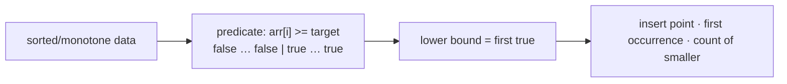

# Pattern: Lower Bound

## Why It Exists

You learned [lower bound's mechanics](/cortex/data-structures-and-algorithms/sorting-and-searching/searching/lower-bound) — half-open range, `hi = mid`, no equality branch. This lesson is about **recognizing** when a problem is secretly a lower-bound search.

The trigger is any of these phrasings: "the **first** index where…", "the **leftmost** occurrence", "the **insert position**", "how many elements are **less than** `x`", or "the **smallest** element `≥ x`". All reduce to the same thing: a monotone `false → true` predicate over a sorted range, where you want the **first `true`**. Once you spot that shape, the half-open template solves it in `O(log n)` — and the returned index doubles as a *count* of everything before it.

## See It Work

"Search insert position": where would `5` go in `[1, 3, 6, 8]` to keep it sorted? That's the first index whose value is `≥ 5`. Run it.

```python run viz=array
def lower_bound(arr, target):
    lo, hi = 0, len(arr)                 # half-open [lo, hi)
    while lo < hi:
        mid = lo + (hi - lo) // 2
        if arr[mid] < target:            # predicate "arr[mid] >= target" is still false
            lo = mid + 1
        else:
            hi = mid                     # candidate — look further left
    return lo                            # first index with arr[index] >= target

print(lower_bound([1, 3, 6, 8], 5))      # 2  (insert 5 before the 6)
print(lower_bound([1, 3, 6, 8], 3))      # 1  (first occurrence of 3)
```

## How It Works

The recognition checklist for lower bound:

1. The data (or a derived value) is **sorted / monotone**.
2. You want the **first** position where some condition turns true — equivalently, the *boundary* of a `false…true` region.
3. The condition is **monotone**: once true, it stays true as you move right.

Then apply the half-open template: `[lo, hi)` with `hi = len`, move `lo = mid + 1` while the predicate is false, else `hi = mid`; the result is the first `true`.



<p align="center"><strong>a monotone false→true predicate; lower bound returns the boundary (first true), which is the insert point and the count of <code>false</code> (smaller) elements.</strong></p>

The same code answers a cluster of questions because the boundary index *is* multiple things at once: the **insert position** (keeps the array sorted), the **first occurrence** of `target` (if present), and the **count of elements `< target`** (everything before the boundary). It's `O(log n)`, `O(1)` space. Generalize the predicate from `arr[mid] ≥ target` to any monotone test and you've got the [minimum-predicate search](/cortex/data-structures-and-algorithms/sorting-and-searching-searching-pattern-minimum-predicate-search) — binary search on the answer.

### Key Takeaway

Recognize lower bound by "first / leftmost / insert / count-of-smaller / smallest ≥ x" over sorted or monotone data. It finds the first `true` of a `false…true` predicate; the boundary index is simultaneously the insert point, first occurrence, and count of smaller elements. `O(log n)`.

## Trace It

`lower_bound([1, 3, 6, 8], 5)` (half-open, `hi` starts at `4`):

| `lo` | `hi` | `mid` | `arr[mid]` | `< 5`? | action |
|---|---|---|---|---|---|
| 0 | 4 | 2 | `6` | no | `hi = 2` |
| 0 | 2 | 1 | `3` | yes | `lo = 2` |
| 2 | 2 | — | — | — | return **2** |

Before you read on: this returned `2` — and `2` is *both* "insert `5` here" *and* "there are 2 elements smaller than 5." Why does one lower-bound call answer both questions at once?

Because the boundary index *partitions* the array: everything at indices `[0, lower_bound)` is `< target`, and everything at `[lower_bound, end)` is `≥ target`. So the index *counts* the left partition (elements `< target` = the index value), and it's also exactly where `target` belongs to keep that partition intact (the insert point). "First index `≥ target`," "count of elements `< target`," and "insert position" are three names for the *same boundary*. Recognizing that one lower-bound call yields all three — plus, paired with [upper bound](/cortex/data-structures-and-algorithms/sorting-and-searching/searching/pattern-upper-bound/pattern), range counts — is why this is a pattern and not just a function.

## Your Turn

The reusable lower bound (recognition: first-true / insert / count):

```python run viz=array
def lower_bound(arr, target):
    lo, hi = 0, len(arr)
    while lo < hi:
        mid = lo + (hi - lo) // 2
        if arr[mid] < target:
            lo = mid + 1
        else:
            hi = mid
    return lo

a = [1, 3, 6, 8, 8, 10]
print(lower_bound(a, 8), lower_bound(a, 7), lower_bound(a, 0), lower_bound(a, 99))   # 3 3 0 6
```

```java run viz=array
public class Main {
  static int lowerBound(int[] arr, int target) {
    int lo = 0, hi = arr.length;
    while (lo < hi) {
      int mid = lo + (hi - lo) / 2;
      if (arr[mid] < target) lo = mid + 1;
      else hi = mid;
    }
    return lo;
  }
  public static void main(String[] args) {
    int[] a = {1, 3, 6, 8, 8, 10};
    System.out.println(lowerBound(a, 5) + " " + lowerBound(a, 8));   // 3 3
  }
}
```

Drill the family in **Practice** — [Search Insert Position](/cortex/data-structures-and-algorithms/sorting-and-searching/searching/pattern-lower-bound/problems/search-insert-position), [First and Last Position](/cortex/data-structures-and-algorithms/sorting-and-searching/searching/pattern-lower-bound/problems/first-and-last-position), [Closest Element](/cortex/data-structures-and-algorithms/sorting-and-searching/searching/pattern-lower-bound/problems/closest-element), and [K Closest Elements](/cortex/data-structures-and-algorithms/sorting-and-searching/searching/pattern-lower-bound/problems/k-closest-elements).

## Reflect & Connect

Lower bound is the "first true" half of boundary search:

- **The family** — insert position, first occurrence (with [upper bound](/cortex/data-structures-and-algorithms/sorting-and-searching/searching/pattern-upper-bound/pattern), the full first-and-last range), closest element (the answer is at `lower_bound` or just before it), and K-closest (lower bound + expand outward).
- **The boundary is three things** — insert point, first occurrence, count of smaller. Internalize that and many "count / position" problems collapse to a single `O(log n)` call.
- **It generalizes to predicate search** — `arr[mid] ≥ target` is just one monotone predicate; replace it with `feasible(mid)` and lower bound becomes [binary search on the answer](/cortex/data-structures-and-algorithms/sorting-and-searching-searching-pattern-minimum-predicate-search). The recognition skill — "is there a monotone false→true boundary?" — is the same.

**Prerequisites:** [Lower Bound](/cortex/data-structures-and-algorithms/sorting-and-searching/searching/lower-bound).
**What's next:** the rightmost-boundary mirror — [Upper Bound](/cortex/data-structures-and-algorithms/sorting-and-searching/searching/pattern-upper-bound/pattern).

## Recall

> **Mnemonic:** *"First / leftmost / insert / count-of-smaller" → lower bound. First true of a `false…true` predicate. Boundary index = insert point = first occurrence = count of smaller. `O(log n)`.*

| | |
|---|---|
| Recognize | "first / leftmost / insert position / count `< x` / smallest `≥ x`" |
| Predicate | `arr[mid] >= target` (monotone false→true) |
| Returns | first `true` index = insert point = count of smaller |
| Template | half-open `[lo, hi)`, `lo=mid+1` if false, else `hi=mid` |
| Generalizes to | minimum-predicate search (swap in any monotone `feasible`) |

<details>
<summary><strong>Q:</strong> What phrasings signal a lower-bound problem?</summary>

**A:** "first / leftmost occurrence," "insert position," "count of elements `< x`," or "smallest element `≥ x`."

</details>
<details>
<summary><strong>Q:</strong> Why does one call give insert point, first occurrence, and count?</summary>

**A:** The boundary partitions the array into `< target` and `≥ target`; its index counts the left part and is exactly where the target belongs.

</details>
<details>
<summary><strong>Q:</strong> How does lower bound become predicate search?</summary>

**A:** Replace the fixed `arr[mid] ≥ target` test with any monotone `feasible(mid)` — then you're binary-searching the answer.

</details>
<details>
<summary><strong>Q:</strong> What's the template in one line?</summary>

**A:** Half-open `[lo, hi)`; `false` → `lo = mid+1`, else `hi = mid`; return `lo`.

</details>

## Sources & Verify

- **Sedgewick & Wayne**, *Algorithms*, 4th ed., §3.1 — rank / ceiling queries (lower-bound semantics).
- **C++ STL / Python `bisect`** — `lower_bound` / `bisect_left` define the "first index ≥ target" contract.
- The recognition triggers and boundary-as-count corollary are standard; both runnable blocks are verified by running (`5 ⇒ 2`, `3 ⇒ 1`; `[1,3,6,8,8,10]` ⇒ `8→3, 7→3, 0→0, 99→6`).
